[**&#x20;JSD2404-智慧车辆运营系统**](https://d1ibml5ydvp.feishu.cn/docx/MbqVdIwXAo6yJrxluDNc5KG1nTd?from=from_copylink)

# DAY01笔记 前言与HTML

## 1. 前言

### 1.1 Java 课程体系交付安排：

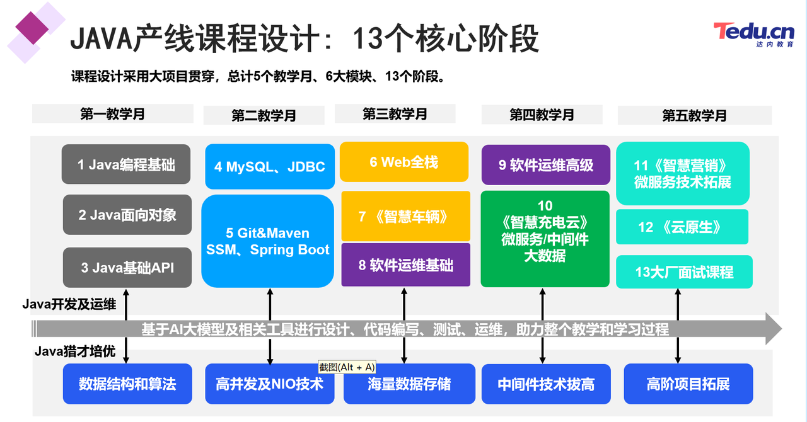

### 1.2 第三教学月课程目标(19天+1天)：

1. 学习原生的HTML/CSS/JS 5天

2. 学习Element-Plus 组件库 1天

3. 学习前端框架 VUE 2天

4. 进入到项目阶段 11天

5. 简历指导课 1天

### 1.3 网站组成

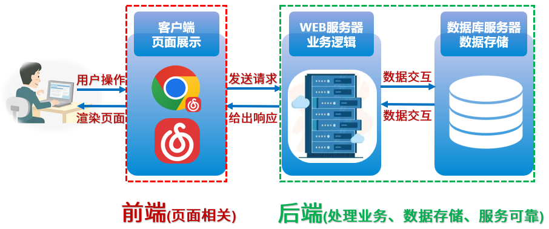

1. 用户通常使用浏览器（Browser）或客户端（Client）访问网站服务

2. 用户在展示出来的页面上做操作，一旦操作就会给对应的 WEB 服务器发送请求

3. WEB 服务器在接收到请求后，会按照预设的业务逻辑对请求进行处理

4. 期间涉及到数据的增删改查，还需要访问数据库服务器

5. 最后，WEB 服务器会将处理好的结果响应给用户端

6. 用户端将拿到的结果渲染出页面展示给用户看

注意：目前我们的 WEB 服务器（Tomcat）与数据库服务器（MySQL）在同一台 PC 上

## 2. 网页基础

**什么是前端和后端**

* 前端和后端是软件开发中的两个重要组成部分，它们会涉及到不同的技术和任务

* 前端主要关注用户**页面**和用户交互（页面相关）

* 后端主要关注服务器端的业务逻辑和服务可靠性，包括**处理业务请求、存储数据、保证服务稳定可靠**等等

### 2.1 什么是 WEB 前端

指使用 HTML、CSS、JavaScript 等技术，根据设计师提供的网页标注图进行代码编写，并将其转换为浏览器可以识别的网页界面，俗称网页。

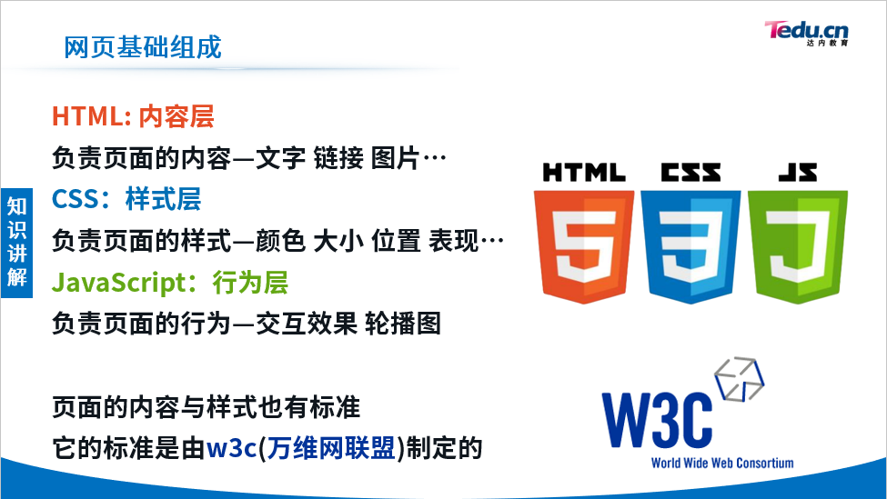

后面我们还会学习其他的高级内容：

* VUE 框架

* ElementPlus 组件库

* 项目页面实战

### 2.2 基本概念

HTML（Hyper Text Markup Language）超文本标记语言，**<span style="color: inherit; background-color: rgba(255,246,122,0.8)">负责网页的内容</span>**

超文本： 除了文本以外，我们还可以向网页中插入图片、超链接、表格、表单、音频、视频等等

目前我们学习的版本是最新的 HTML5，简称 H5

1. HTML 由大量的标记/标签构成，分为：

2. 双标记标签：`<head></head>`

3. 单标记标签：`<br/>`或 `<br>`，两种写法都可以

4. 完整的网页结构：

```html
<!-- 表示当前文档是html5版本 让浏览器使用h5的规范解析 -->
<!DOCTYPE html>
<!--表示网页的开始与结束 lang="en"表示网页是一个英文网站 zh表示中文-->
<html lang="en">
<!--网页头部,存放一些配置信息-->
<head>
    <meta charset="UTF-8"> <!--配置编码,为了认识中文-->
    <title>我是网页标题</title> <!-- 配置网页的标题 -->
</head>
<body> <!--网页展示的内容-->
第一个网页的内容
</body>
</html>
```

* HTML 文件的后缀名是 <span style="color: rgb(36,91,219); background-color: inherit">.html</span> 或 <span style="color: rgb(36,91,219); background-color: inherit">.htm</span>，会按顺序从上往下、从左往右依次解析执行

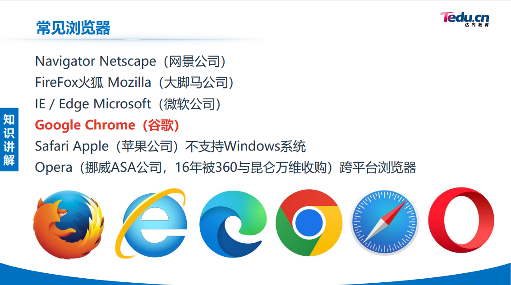

* HTML 属性

<span style="color: rgb(216,57,49); background-color: inherit">属性：</span>也称为特征，描述标签某一方面的特点

html 有很多的属性和值，用来修改元素的样式和状态

<span style="color: rgb(216,57,49); background-color: inherit">写法：</span><标签 属性名 1="属性值 1" 属性名 2="属性值 2">\</标签>

<span style="color: rgb(216,57,49); background-color: inherit">要求：</span>

1. 属性的声明必须在开始标记里

2. 一个元素可能不只有一个属性，多个属性之间使用空格隔开

3. 多个属性之间不区分先后顺序

4. 属性名与属性值之间使用等号连接

5. 属性值要包裹在引号中

6. 单值属性：只有一个与属性名同名值，值可以省略不写，比如 readonly 只读

### 2.3 注释

1. 用来解释代码且不会执行的文本

2. 注释格式： `<!-- 被注释掉的内容 -->`

3. 快捷键： Ctrl+/ 添加注释，再按一次取消注释

4. 注释不能嵌套注释，也不可以写在标签里！

## 3. HTML常用标签

### 3.1 文本相关标签

* \<b>加粗文字\</b>   &#x20;

* \<i>斜体文字\</i>

* \<u>下划线文字\</u>   &#x20;

* \<s>删除线文字\</s>

* \<hn>n级标题\</hn>n为1到 6 独占一行，字体加粗，有垂直行间距

* \<p>段落\</p> 独占一行，有垂直行间距

* \<hr>独占一行的灰色水平分割线&#x20;

**<span style="color: rgb(46,161,33); background-color: inherit">空格折叠现象：</span>**&#x8FDE;续的多个空格或换行会折叠成一个空格显示，使用\<br>换行

**<span style="color: rgb(46,161,33); background-color: inherit">转义字符: </span>**\&lt;小于号  \&gt;大于号  \&nbsp;空格

**<span style="color: rgb(46,161,33); background-color: inherit">生成假文：</span>**&#x8F93;入 lorem 按 Tab 补全即可

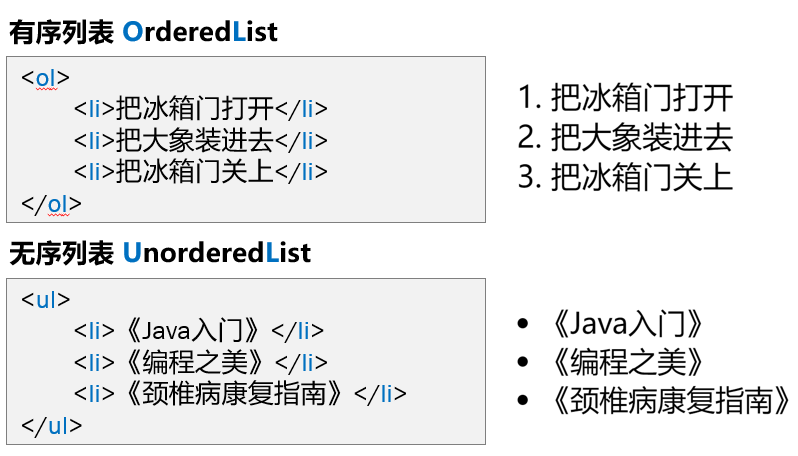

```html
<!DOCTYPE html>
<html lang="en">
<head>
    <meta charset="UTF-8">
    <title>文本处理</title>
</head>
<body>
<!-- 1.文本标签 -->
普通文字
<b>加粗文字</b>
<s>删除线文字</s>
<i>斜体文字</i>
<u>下划线文字</u>
<mark>高亮&nbsp;&nbsp;&nbsp;标记文字</mark>

<!--换行标签-->
<br>
<!--&lt;转义符号,在页面显示一个小于号 less than
&gt;转义符号,在页面显示一个大于号greater than-->
我最喜欢&lt;tom&gt;写的静夜思

<!--2.标题字-->
<!--h1~h6 h4的字号和普通文字一样大-->
<h1>一级标题</h1>
<h2>二级标题</h2>
<h3>三级标题</h3>
<h4>四级标题</h4>
<h5>五级标题</h5>
<h6>六级标题</h6>
<h7>七级</h7>

<!-- 3.段落标签 -->
<p>吃葡萄不吐葡萄皮</p>
<p>吃葡萄不吐葡萄皮</p>
<p>吃葡萄不吐葡萄皮</p>
<!--生成假文 先写lorem 再按Tab补全-->
<p>Lorem ipsum dolor sit amet, consectetur adipisicing elit. Ad assumenda at corporis dolore eum in inventore nobis numquam, obcaecati quaerat quis quo ratione saepe sint tempora unde, velit voluptate voluptates?</p>

<!-- 生成一条水平的灰色分割线   -->
<hr>

<!-- 4.有序列表 ordered list 里面每一条数据称作:列表项 list item-->
<!--type属性默认1阿拉伯数字 A大写字母 a小写字母 I大写罗马数字 i小写罗马数字-->
<ol type="i">
    <li>把冰箱门打开</li>
    <li>把大象塞进去</li>
    <li>把冰箱门关上</li>
</ol>
<!-- 5.无序列表ul(unordered list) 列表项还是li(list item)-->
<!-- type="none"去掉无序列表项前的标识符(黑色实心圆) -->
<ul type="none">
    <li>《Think in Java》</li>
    <li>《Java从入门到精通》</li>
    <li>《颈椎康复指南》</li>
</ul>
<hr>
</body>
</html>
```

**巩固练习**

```html
写在上面的文件里就行
<ul type="none">
    <li>
        凉菜
        <ol>
            <li>拍黄瓜</li>
            <li>皮蛋豆腐</li>
            <li>凉拌三丝</li>
        </ol>
    </li>
    <li>
        热菜
        <ol>
            <li>西红柿牛腩</li>
            <li>水煮肉片</li>
            <li>宫保鸡丁</li>
            <li>溜肉段</li>
        </ol>
    </li>
    <li>
        主食
        <ol>
            <li>米饭</li>
            <li>面条</li>
        </ol>
    </li>
</ul>
<hr>
<h1>个人简历</h1>
<hr>
<h2>基本信息</h2>
<p>姓名: <b>传奇哥</b></p>
<p>性别: 男</p>
<p>爱好: <s>摄影</s></p>
<h2>个人经历</h2>
<ul>
    <li>小学9年</li>
    <li>中学9年</li>
    <li>高中12年</li>
</ul>
<h2>获得荣誉</h2>
<ol>
    <li>机甲收集达人</li>
    <li>玩偶收集达人</li>
</ol>
```

### 3.2 分区元素

分区标签：可以理解为一个区域，对多个具有相同或相似结构的标签进行统一管理

* `<div></div>`块级分区

* `<span></span>`行内分区

```html
<!DOCTYPE html>
<html lang="en">
<head>
    <meta charset="UTF-8">
    <title>分区元素</title>
</head>
<body>
<!--行内分区元素 span不会换行 用来选中一行中的一部分 -->
我是JSD240328班级的<span style="color:red;">小可爱</span>
<hr>
<!--块级分区元素 独占一行 默认宽度为父级宽度的100% 高度为0-->
<div></div>
我是文字
<div>我是文字</div>
我是文字
</body>
</html>
```

**HTML5 新增了一些带有语义的分区标签**

* `<header></header>`定义网页或一个区域的头部

* `<nav></nav>`定义网页的导航部分

* `<main></main>`定义网页的主要内容

* `<section></section>`定义网页的一个区块或章节

* `<article></article>`定义网页中独立完整的内容，比如博客文章或新闻报道

* `<aside></aside>`定义网页的侧边栏或者附属信息

* `<footer></footer>`定义网页或一个区域的页脚部分

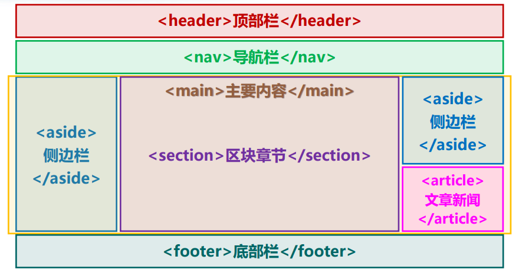

```html
<hr>
<!-- 目前div的使用频率较高   -->
<div class="header">顶部条</div>
<div class="nav">导航栏</div>
<div class="aside">侧边栏</div>
<div class="main">主体</div>
<div class="article">文章</div>
<div class="footer">尾部</div>
<hr>
<!-- h5新增的一些带有语义的分区标签 -->
<header>头部</header>
<nav>导航栏</nav>
<main>主体</main>
<article>文章</article>
<section>区域</section>
<aside>侧边栏</aside>
<footer>页脚</footer>
```

其实在用户看来是没有区别的，只不过这样会大大提高代码的可读性与模块复用性、也有利于检索

### 3.3 URL 路径

**<span style="color: rgb(216,57,49); background-color: inherit">URL</span>**（<span style="color: rgb(216,57,49); background-color: inherit">U</span>niform <span style="color: rgb(216,57,49); background-color: inherit">R</span>esource <span style="color: rgb(216,57,49); background-color: inherit">L</span>ocator）统一资源定位符，俗称路径，用来标识资源的位置

#### 3.3.1 **相对路径**

1. 从当前 html 文件的位置出发去找资源

2. 如果 html 与资源在同一个目录下，直接写资源的名字，如：1.png

3. 如果资源在 html 的下一级目录，先写目录名再写目录里的资源，如：img/2.png

4. 如果资源在 html 的上一级目录，先回到上一级再找资源，如： ../3.png

#### 3.3.2 **绝对路径**

从根目录处开始找资源，不需要当前文件的位置

1. 优点：节省本地服务器的存储空间&#x20;

2. 缺点：资源不稳定 如果远程服务器删除此资源，本地服务器就引用不到了,且并不安全

3. 网络资源：从协议开始，如： <https://cdn.tmooc.cn/bsfile//courseImg///f044221ee737404e91584a4d083764bd.png>

### 3.4 图片插入

*img 标签用来向页面插入图片&#x20;*

* *src 表示资源的路径&#x20;*

* *alt 表示图片无法显示时的替代文本&#x20;*

* *title 鼠标悬停时显示的描述文本*

* 图片本身有大小，修改图片宽高时要注意图片本身的宽高比 如果设置的宽高不符合图片本身的宽高比，图片会变形--图片比例失真&#x20;

* **<span style="color: rgb(46,161,33); background-color: inherit">解决方案：</span>**&#x5BBD;或者高只设置一个，另外一个会自动随之更改

```html
<!DOCTYPE html>
<html lang="en">
<head>
    <meta charset="UTF-8">
    <title>图片插入</title>
</head>
<body>
<!--
从当前文件出发去找资源:
1)图片与文件在同一个文件夹,直接写图片的全名
2)图片在文件的下一级文件夹,先写文件夹名,再写文件夹下的图片全名
3)图片在文件的上一级文件夹,先写../回到上一级,再写图片全名
-->
<!-- alt图片不能正常显示时替换的文字  -->
<!-- title表示鼠标悬停在图片上显示的描述文字   -->


<!-- 使用绝对路径 -->
<!-- 如果远程服务器的资源删除，绝对路径就引用不到图片资源了  -->

<!-- width设置图片宽度 height设置图片高度
   只要设置一个,另外一个会跟着改,如果两个一起设置,注意图片的原始比例防止图片失真-->

</body>
</html>
```

### 3.5 超链接练习

a 标签用于向页面插入超链接

* href 表示要链接的资源路径

* 超链接可以链接网络与内部资源，还可以链接图片

* 通过 a 标签包裹 img 标签可以实现图片超链接

* 锚点：先给对应的 html 内容添加 id，再通过<span style="color: inherit; background-color: rgba(255,246,122,0.8)">#id 值</span>选中，即可跳转到锚点位置，#表示直接跳转到页面顶部

```html
<!DOCTYPE html>
<html lang="en">
<head>
  <meta charset="UTF-8">
  <title>超链接</title>
</head>
<body>
<!-- 跳转到本地资源 -->
<a href="p2_文本处理.html">跳转到今日的第2个页面</a>
<a href="p4_图片插入.html">跳转到今日的第4个页面</a>
<!-- 跳转到外部资源 -->
<a href="https://www.baidu.com/">百度首页</a>
<a href="https://www.tmooc.cn/">TMOOC首页</a>
<!-- 跳转至本地的图片资源 -->
<a href="2.png">即将打开一张图片</a>
<!-- 图片链接   -->
<a href="https://www.baidu.com/">
  
</a>
<hr>
<!-- _blank打开一个空白页 _self刷新当前页面  -->
<a href="https://www.baidu.com/" target="_blank">百度1</a>
<a href="https://www.baidu.com/" target="_self">百度2</a>
<hr>
<!-- 锚点 -->
<!--p*20>lorem Tab补全-->
<h1>第一序列</h1>
<a href="#c1">快速跳转至第1章</a>
<a href="#c2">快速跳转至第2章</a>
<a href="#c3">快速跳转至第3章</a>

<h3 id="c1">第一章</h3>
第一章内容:从黑暗的混沌中醒来，少年任小粟擦了擦自己额头上的汗，然后看向门口的那个十三、四岁小男孩。

“六元，有没有什么事情？”任小粟问道。

被称呼为六元的小孩其实全名叫颜六元。

颜六元长得一副人畜无害的模样，看起来就很无辜，然而他手里却握着一柄骨刀守在门口，此时深夜，他看起来已经很困了但始终不曾闭眼，因为他要守夜。

颜六元摇摇头说道：“没事，你脑袋里面这病到底怎么回事，集镇上的医生也看不出是什么病吗？”

“你不用操心这种事情，我这不是病，”任小粟语气果决地说道：“天快亮了，我准备出去打猎，你睡一会儿按时去学堂上课。”

“哦，”颜六元低沉的点点头：“在这废土里，学习好有什么用……”

“我说有用就有用，”任小粟用不容置疑的语气说道。

“我也要去打猎，”颜六元瘪着嘴巴。

“你要出点什么意外谁来守夜？昏迷的我？”任小粟站起身来准备去集镇中心打水，天亮的时候集镇上就没有那么危险了。

这里的夜晚，是法外之地。

……

阴霾的天空有乌云在不断翻滚，云层中一滴酸雨终于坠落，它在狂风中不断飘摇，最终啪嗒一声，落在了任小粟的面前。

少年任小粟趴在荒野的地面上，他皱了皱眉头心说今天运气有点不好，猎物还没等来竟然先等来了酸雨。

有人说，在这废土之上行走必须要小心野兽。

<h3 id="c2">第二章</h3>
第二章内容:从黑暗的混沌中醒来，少年任小粟擦了擦自己额头上的汗，然后看向门口的那个十三、四岁小男孩。

“六元，有没有什么事情？”任小粟问道。

被称呼为六元的小孩其实全名叫颜六元。

颜六元长得一副人畜无害的模样，看起来就很无辜，然而他手里却握着一柄骨刀守在门口，此时深夜，他看起来已经很困了但始终不曾闭眼，因为他要守夜。

颜六元摇摇头说道：“没事，你脑袋里面这病到底怎么回事，集镇上的医生也看不出是什么病吗？”

“你不用操心这种事情，我这不是病，”任小粟语气果决地说道：“天快亮了，我准备出去打猎，你睡一会儿按时去学堂上课。”

“哦，”颜六元低沉的点点头：“在这废土里，学习好有什么用……”

“我说有用就有用，”任小粟用不容置疑的语气说道。

“我也要去打猎，”颜六元瘪着嘴巴。

“你要出点什么意外谁来守夜？昏迷的我？”任小粟站起身来准备去集镇中心打水，天亮的时候集镇上就没有那么危险了。

这里的夜晚，是法外之地。

……

阴霾的天空有乌云在不断翻滚，云层中一滴酸雨终于坠落，它在狂风中不断飘摇，最终啪嗒一声，落在了任小粟的面前。

少年任小粟趴在荒野的地面上，他皱了皱眉头心说今天运气有点不好，猎物还没等来竟然先等来了酸雨。

有人说，在这废土之上行走必须要小心野兽。

<h3 id="c3">第三章</h3>
第三章内容:
从黑暗的混沌中醒来，少年任小粟擦了擦自己额头上的汗，然后看向门口的那个十三、四岁小男孩。

“六元，有没有什么事情？”任小粟问道。

被称呼为六元的小孩其实全名叫颜六元。

颜六元长得一副人畜无害的模样，看起来就很无辜，然而他手里却握着一柄骨刀守在门口，此时深夜，他看起来已经很困了但始终不曾闭眼，因为他要守夜。

颜六元摇摇头说道：“没事，你脑袋里面这病到底怎么回事，集镇上的医生也看不出是什么病吗？”

“你不用操心这种事情，我这不是病，”任小粟语气果决地说道：“天快亮了，我准备出去打猎，你睡一会儿按时去学堂上课。”

“哦，”颜六元低沉的点点头：“在这废土里，学习好有什么用……”

“我说有用就有用，”任小粟用不容置疑的语气说道。

“我也要去打猎，”颜六元瘪着嘴巴。

“你要出点什么意外谁来守夜？昏迷的我？”任小粟站起身来准备去集镇中心打水，天亮的时候集镇上就没有那么危险了。

这里的夜晚，是法外之地。

……

阴霾的天空有乌云在不断翻滚，云层中一滴酸雨终于坠落，它在狂风中不断飘摇，最终啪嗒一声，落在了任小粟的面前。

少年任小粟趴在荒野的地面上，他皱了皱眉头心说今天运气有点不好，猎物还没等来竟然先等来了酸雨。

有人说，在这废土之上行走必须要小心野兽。

<a href="#">快速跳转至顶部</a>
</body>
</html>
```

### 3.6 表格练习

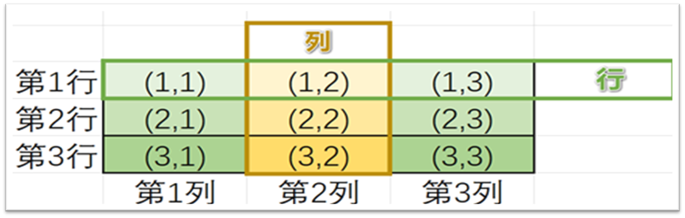

**<span style="color: rgb(216,57,49); background-color: inherit">&lt;table&gt;&lt;/table&gt; </span>**&#x8868;示整个表格 包含表格的全部内容

**<span style="color: rgb(216,57,49); background-color: inherit">&lt;tr&gt;&lt;/tr&gt; </span>**&#x8868;示表格中的一行<span style="color: rgb(216,57,49); background-color: inherit"> </span>**<span style="color: rgb(216,57,49); background-color: inherit">t</span>**&#x61;ble **<span style="color: rgb(216,57,49); background-color: inherit">r</span>**&#x6F;w

**<span style="color: rgb(216,57,49); background-color: inherit">&lt;td&gt;&lt;/td&gt; </span>**&#x8868;示表格中的一个单元格 **<span style="color: rgb(216,57,49); background-color: inherit">t</span>**&#x61;ble **<span style="color: rgb(216,57,49); background-color: inherit">d</span>**&#x61;tacell

单元格是真正存放数据的地方，一行有几个单元格，表示一行有几列

**<span style="color: rgb(216,57,49); background-color: inherit">&lt;caption&gt;&lt;/caption&gt; </span>**&#x8868;格的标题

**<span style="color: rgb(216,57,49); background-color: inherit">&lt;th&gt;&lt;/th&gt; </span>**&#x884C;/列的标题 文字加粗居中显示

**<span style="color: rgb(46,161,33); background-color: inherit">表格属性：</span>**

**border=**“1px” 给表格添加边框

**style="border-collapse: collapse;"** 表格默认的边框是带有间距的，想去掉可以加这句代码

**<span style="color: rgb(46,161,33); background-color: inherit">合并单元格：</span>写在 td 里，被合并的单元格一定得删掉！**

**<span style="color: rgb(216,57,49); background-color: inherit">colspan=&quot;n&quot; </span>**&#x8DE8;列

从当前单元格开始，**<span style="color: rgb(216,57,49); background-color: inherit">向右</span>**&#x5408;并 n 个单元格（n 也包含当前单元格）

**<span style="color: rgb(216,57,49); background-color: inherit">rowspan=&quot;n&quot;</span>**&#x8DE8;行

从当前单元格开始，**<span style="color: rgb(216,57,49); background-color: inherit">向下</span>**&#x5408;并 n 个单元格（n 也包含当前单元格）

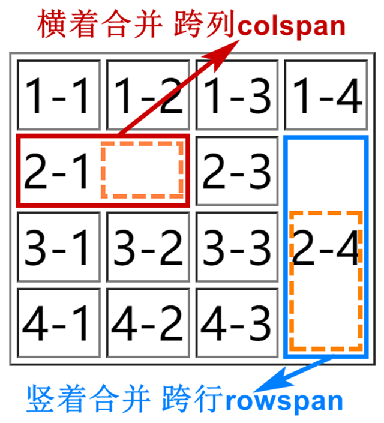

```html
<!DOCTYPE html>
<html lang="en">
<head>
  <meta charset="UTF-8">
  <title>网页表格</title>
</head>
<body>
<!--table表格的开始与结束 border表格边框-->
<table border="1px" style="border-collapse: collapse;">
  <caption>爱好表</caption>
  <!--tr表格行 table row-->
  <tr>
    <!--th表格标题 文字加粗居中-->
    <th>序号</th>
    <th>姓名</th>
    <th>爱好</th>
  </tr>
  <tr>
    <!--单元格 table datacell 真正存放数据的地方 一行有几个单元格就有几列-->
    <td>1</td>
    <td>传奇</td>
    <td>玩偶</td>
  </tr>
  <tr>
    <td>2</td>
    <td>伟超</td>
    <td>丽颖啊赵丽颖</td>
  </tr>
  <tr>
    <td>3</td>
    <td>硕博</td>
    <td>伟超</td>
  </tr>
</table>
<table border="1px">
  <tr>
    <td>1-1</td>
    <td>1-2</td>
    <td>1-3</td>
    <td>1-4</td>
  </tr>
  <tr>
    <!-- colspan横着合并,跨列 从当前单元格开始向右合并n个单元格-->
    <!-- rowspan竖着合并,跨行 从当前单元格开始向下合并n个单元格-->
    <!-- 注意:被合并的单元格一定得删掉!-->
    <td colspan="2">2-1</td>
    <!-- <td>2-2</td>-->
    <td>2-3</td>
    <td rowspan="3">2-4</td>
  </tr>
  <tr>
    <td>3-1</td>
    <td>3-2</td>
    <td>3-3</td>
    <!--        <td>3-4</td>-->
  </tr>
  <tr>
    <td>4-1</td>
    <td>4-2</td>
    <td>4-3</td>
    <!--        <td>4-4</td>-->
  </tr>
</table>

<table border="1ox" style="border-collapse: collapse;">
  <caption>购物车</caption>
  <tr>
    <th>商品编号</th>
    <th>商品名称</th>
    <th>商品价格</th>
  </tr>
  <tr>
    <td>1</td>
    <td>小米Air</td>
    <td>5877</td>
  </tr>
  <tr>
    <td>2</td>
    <td>华为遥遥领先</td>
    <td>8877</td>
  </tr>
  <tr>
    <td>总价:</td>
    <td colspan="2">10000</td>
  </tr>
</table>
</body>
</html>
```

### 3.7 表单

表单提供了一些可视化的输入控件，会自动收集整理用户输入的内容，并提交给服务器

\<form>\</form> 表示表单的开始与结束

**<span style="color: rgb(36,91,219); background-color: inherit">属性：</span>**

* <span style="color: rgb(36,91,219); background-color: inherit">action</span>="url" 向哪个地址提交数据，如果不写会提交给当前页面，也可以写一个#号占位

* <span style="color: rgb(36,91,219); background-color: inherit">type</span> <span style="color: rgb(216,57,49); background-color: inherit"> </span>控件类型

* <span style="color: rgb(36,91,219); background-color: inherit">name</span> <span style="color: rgb(216,57,49); background-color: inherit"> </span>控件名

* <span style="color: rgb(36,91,219); background-color: inherit">value</span> <span style="color: rgb(216,57,49); background-color: inherit"> </span>可以设置输入框的默认值，如果是按钮，则设置的是按钮上显示的文本

* <span style="color: rgb(36,91,219); background-color: inherit">placeholder</span> <span style="color: rgb(216,57,49); background-color: inherit"> </span>提示占位文本

* <span style="color: rgb(36,91,219); background-color: inherit">maxlength</span> <span style="color: rgb(216,57,49); background-color: inherit"> </span>设置输入的最大长度

* <span style="color: rgb(36,91,219); background-color: inherit">readonly</span> <span style="color: rgb(216,57,49); background-color: inherit"> </span>设置文本控件只读，能看不能改，数据可以提交

* <span style="color: rgb(36,91,219); background-color: inherit">checked</span> <span style="color: rgb(216,57,49); background-color: inherit"> </span>单/多选框使用此属性可以设置指定选项被默认选中

```python
<input type="text"> 文本输入框
<input type="password"> 密码框
<input type="radio"> 单选框 注意设置name与value属性！
<input type="checkbox">多选框 注意设置name与value属性！
<input type="date">日期
<input type="file">文件
<input type="color">颜色
<input type="submit" value="提交按钮">    
<input type="reset" value="重置按钮">    
<input type="button" value="普通按钮">
<button>h5新增的按钮</button>
```

<span style="color: rgb(216,57,49); background-color: inherit">按钮的另外一种写法：</span>

```html
<button type="submit">提交</button>    
<button type="reset">重置</button>    
<button type="button">按钮</button>
```

<span style="color: rgb(216,57,49); background-color: inherit">下拉选框： </span>selected 可以设置默认选中

```javascript
<select name="city">       
  <option value="1" selected>北京</option>        
  <option value="2">上海</option>        
</select>
```

<span style="color: rgb(216,57,49); background-color: inherit">label 关联控件：</span>用于 form 中文本和控件的关联，单击文本如同单击控件

```javascript
<input type="checkbox" id="agree">    
<label for="agree">我同意相关的服务协议</label>
```

```html
<!DOCTYPE html>
<html lang="en">
<head>
    <meta charset="UTF-8">
    <title>表单</title>
</head>
<body>
<!--form表单 表单的所有控件都需要写到form中
action提交到哪,点提交按钮会自动触发提交
# 占位符号 表示默认提交到本页 -->
<form action="#">
    <!--input控件
    type设置控件类型=>text普通文本输入框 password密码输入框-->
    <!--name控件名称 placeholder提示占位文本 value控件的值或按钮上的显示文字
        maxlength最大输入长度 readonly只读-->
    用户名:<input type="text" name="username" placeholder="请输入用户名"> <br>
    昵称:<input type="text" name="nickname" value="达拉崩吧" readonly> <br>
    密码:<input type="password" name="pwd" value="123" maxlength="6"> <br>
    <!-- radio单选 checkbox多选
    多个选项必须设置成同一个name属性分到同一个组里!
    还必须给每个选项设置value,也就是这个选项的值,否则提交的值是on
    checked 设置当前选项默认选中 -->
    性别:
    <input type="radio" name="gender" value="1" checked>男
    <input type="radio" name="gender" value="0">女
    <br>
    爱好:
    <input type="checkbox" name="like" value="ks">看书
    <input type="checkbox" name="like" value="dy">电影
    <input type="checkbox" name="like" value="yy" checked>游泳
    <input type="checkbox" name="like" value="yx">游戏
    <br>
    喜欢的颜色:<input type="color" name="color"> <br>
    文件:<input type="file" name="file"> <br>
    生日:<input type="date" name="birthday">
    <br>
    <input type="checkbox" id="agree">
    <label for="agree">我同意以上协议</label>
    <hr>
    <!-- select下拉选择框 option选项  -->
    喜欢的城市:<select name="city">
        <option value="cd">成都</option>
        <option value="heb">哈尔滨</option>
        <option value="nj">南京</option>
        <option value="zz" selected>郑州</option>
    </select>
    <hr>
    <!-- submit提交按钮 reset重置按钮,注意不是清空! button普通按钮,后期结合JS使用 -->
    <input type="submit" value="点我提交">
    <input type="reset" value="点我重置">
    <input type="button" value="普通按钮">
    <button>我是按钮</button>
</form>
</body>
</html>
```

> **<span style="color: rgb(36,91,219); background-color: rgba(255,246,122,0.8)">必须掌握!</span>**
>
> **<span style="color: rgb(36,91,219); background-color: inherit">value加在输入框上,是设置什么?</span> <span style="color: rgb(222,120,2); background-color: inherit">设置显示的默认值,用户输入的值也保存在value属性中</span>**
>
> **<span style="color: rgb(36,91,219); background-color: inherit">value加在按钮上,是设置什么?</span> <span style="color: rgb(222,120,2); background-color: inherit">设置按钮上显示的文字</span>**
>
> **<span style="color: rgb(36,91,219); background-color: inherit">value加在单选/多选/下拉选框选项上,是设置什么? </span> <span style="color: rgb(222,120,2); background-color: inherit">设置选中当前选项时提交的值</span>**
>
> **<span style="color: rgb(36,91,219); background-color: inherit">只读属性是什么?</span> <span style="color: rgb(222,120,2); background-color: inherit">readonly单值属性 只允许看,不允许编辑</span>**
>
> **<span style="color: rgb(36,91,219); background-color: inherit">怎么设置单选/多选选项的默认选中? </span> <span style="color: rgb(222,120,2); background-color: inherit">checked单值属性</span>**
>
> **<span style="color: rgb(36,91,219); background-color: inherit">怎么设置下拉选框选项的默认选中? </span> <span style="color: rgb(222,120,2); background-color: inherit">selected单值属性</span>**
>
> **<span style="color: rgb(36,91,219); background-color: inherit">写单选时,必须要写的两个属性是什么? </span> <span style="color: rgb(222,120,2); background-color: inherit">name将所有选项分到同一组 value不然提交的是on</span>**

### 3.8 视频插入

* <span style="color: rgb(36,91,219); background-color: inherit">src</span>= "插入资源的路径"&#x20;

* <span style="color: rgb(36,91,219); background-color: inherit">controls</span> 显示播放控件 单值属性

* <span style="color: rgb(36,91,219); background-color: inherit">muted</span> 设置静音，必须设置静音才能自动播放 单值属性

* <span style="color: rgb(36,91,219); background-color: inherit">autoplay</span> 自动播放 单值属性

* <span style="color: rgb(36,91,219); background-color: inherit">loop</span> 循环播放 单值属性

* <span style="color: rgb(36,91,219); background-color: inherit">poster</span>= "../2.png"设置封面，未播放时显示，有自动播放可不设置封面

```html
<!DOCTYPE html>
<html lang="en">
<head>
    <meta charset="UTF-8">
    <title>视频插入</title>
</head>
<body>
<video src="img/wdsj.mp4" controls muted autoplay loop style="width:500px;">
</video>
</body>
</html>
```

### 3.9 今日拓展

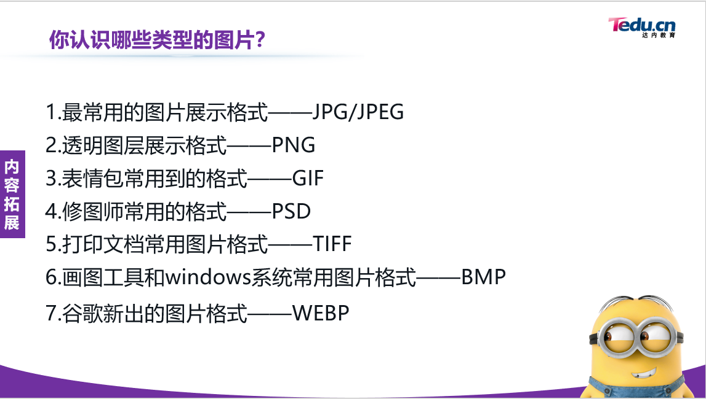

> color=%23000000 这个值采用了URL编码格式。其中 %23 是 URL 编码中表示字符 # 的方式，而后面的 000000 是颜色的十六进制表示法，未经过编码时应为 #000000。这种格式常用于网页URL参数中传递颜色值，以确保特殊字符（如 #）能够被正确解析。

# DAY02笔记 CSS基础&#x20;

## 1. 基本概念

CSS（Cascading Style Sheet）级联样式表，用来控制页面布局与页面样式

比如可以修改颜色、大小、位置、层级、动画等等

## 2. CSS 的三种位置

### 2.1 **CSS 行内样式**

写在 HTML 元素的开始标签里，只对当前行生效

特点：复用性差

```html
<h4 style="color:red;">我是标题</h4>
```

### 2.2 **CSS 内部样式**

写在 head 标签中的 style 标签里，对当前页面所有元素生效

特点：加载速度快，首页常用

```html
<head>
  <style>
     /* 标签名选择器 */
     h1 {
          color:red;
        }
  </style>
</head>
```

### 2.3 **CSS 外部样式**

写在独立的.css 文件中，在html 文件中引入外部的.css 文件

* rel：必写属性，表示引入文件是什么类型 stylesheet 样式表

* href：要引入 CSS 文件的路径

特点：可以被多个页面共享，复用性强，常用于二三级页面

```html
<html>
        <head>
                <link rel="stylesheet" href="Demo.css">
        </head>
</html>

```

### 2.4 关于优先级

* *渲染同一个元素，样式不同会叠加生效,比如背景色和文字颜色会同时生效*

* 如果渲染的样式相同，按照如下优先级排序：

* **<span style="color: rgb(216,57,49); background-color: inherit">!important&gt;行内样式&gt;（内部样式=外部样式）</span>**

* 内部样式与外部样式优先级一样，后写的样式会把之前的样式覆盖掉

  ```html
  <!DOCTYPE html>
  <html lang="en">
  <head>
      <meta charset="UTF-8">
      <title>CSS的三种位置</title>
      <!-- 3.外部样式,可以被多个页面引入
      rel必写属性,表明当前引入的文件是什么类型  href是被引入的CSS文件路径 -->
      <link rel="stylesheet" href="Demo.css">
      <!-- 2.内部样式,对当前页面所有元素生效   -->
      <style>
         /* 标签名选择器 */
         p {
             color: blue;
         }
         h4 {
             color: green !important;
         }
      </style>
  </head>
  <body>
      <h4>我是标题</h4>
      <!-- 1.行内样式,加在当前元素上,只对当前元素生效   -->
      <h4 style="color:red;background-color:yellow;">我是标题</h4>
      <h4>我是标题</h4>

      <p>我是段落</p>
      <p>我是段落</p>
      <p>我是段落</p>
      <p>我是段落</p>

      <div>我是div</div>
      <div>我是div</div>
      <div>我是div</div>
  </body>
  </html>
  ```

  Demo.css

  ```css
  div {
      width: 100px;
      height: 100px;
      background-color: cyan;
      /* 边框:粗细 线型(单实线) 颜色 */
      border: 5px solid black;
  }
  h4 {
      color: blue;
  }
  ```

## 3. 常用选择器速查

* 标签名选择器：选中指定标签的所有元素，写法： **<span style="color: rgb(216,57,49); background-color: inherit">标签名</span> <span style="color: rgb(46,161,33); background-color: inherit"> </span>**<span style="color: rgb(46,161,33); background-color: inherit"> { CSS 样式 }</span>

* 类选择器：选中指定的一类元素，写法：  **<span style="color: rgb(216,57,49); background-color: inherit">.class 值</span> <span style="color: rgb(46,161,33); background-color: inherit"> </span>**<span style="color: rgb(46,161,33); background-color: inherit">{ CSS 样式 }</span>

* id 选择器：选中指定的一个元素，写法： **<span style="color: rgb(216,57,49); background-color: inherit">#id 值</span> <span style="color: rgb(46,161,33); background-color: inherit"> </span>**<span style="color: rgb(46,161,33); background-color: inherit">{ CSS 样式 }</span>

* 伪类选择器：

  * 选中超链接未被访问时时的状态，写法：<span style="color: rgb(46,161,33); background-color: inherit">a</span>**<span style="color: rgb(216,57,49); background-color: inherit">:link</span>**<span style="color: rgb(46,161,33); background-color: inherit">{ CSS 样式 }</span>

  * 选中超链接已被访问时的状态，写法：<span style="color: rgb(46,161,33); background-color: inherit">a</span>**<span style="color: rgb(216,57,49); background-color: inherit">:visited</span>**<span style="color: rgb(46,161,33); background-color: inherit">{ CSS 样式 }</span>

  * 选中元素的悬停状态（非超链接独有），写法： <span style="color: rgb(46,161,33); background-color: inherit">div</span>**<span style="color: rgb(216,57,49); background-color: inherit">:hover</span>**<span style="color: rgb(46,161,33); background-color: inherit">{ CSS 样式 }</span>

  * 选中超链接激活时的状态，写法：<span style="color: rgb(46,161,33); background-color: inherit">a</span>**<span style="color: rgb(216,57,49); background-color: inherit">:active</span>**<span style="color: rgb(46,161,33); background-color: inherit">{ CSS 样式 }</span>

  * 注意：a 标签伪类的顺序：**<span style="color: rgb(216,57,49); background-color: inherit"> :link :visited :hover :active</span>**

* 群组选择器：选中多种不同的元素，写法： <span style="color: rgb(46,161,33); background-color: inherit">#id 值</span>**<span style="color: rgb(216,57,49); background-color: inherit">，</span>**<span style="color: rgb(46,161,33); background-color: inherit">.class 值</span>**<span style="color: rgb(216,57,49); background-color: inherit">，</span>**<span style="color: rgb(46,161,33); background-color: inherit">标签名{ CSS 样式 }</span>

* 通用选择器：选中所有元素，写法： **<span style="color: rgb(216,57,49); background-color: inherit">*</span>**<span style="color: rgb(46,161,33); background-color: inherit">{ CSS 样式 }</span>

* 属性选择器：选中指定属性与属性值的元素，写法： **<span style="color: rgb(216,57,49); background-color: inherit">[</span>**<span style="color: rgb(46,161,33); background-color: inherit">type=&quot;text&quot;</span>**<span style="color: rgb(216,57,49); background-color: inherit">]</span>**<span style="color: rgb(46,161,33); background-color: inherit">{ CSS 样式 }</span>

* 后代选择器：选中祖先元素中包含的所有后代元素，写法： <span style="color: rgb(46,161,33); background-color: inherit">div</span> <span style="color: rgb(46,161,33); background-color: rgb(251,191,188)"> </span> <span style="color: rgb(46,161,33); background-color: inherit">span{ CSS 样式 }</span>

* 子代选择器：选中父元素中下的直接子元素，写法： <span style="color: rgb(46,161,33); background-color: inherit">div</span>**<span style="color: rgb(216,57,49); background-color: inherit">&gt;</span>**<span style="color: rgb(46,161,33); background-color: inherit">span{ CSS 样式 }</span>

```html
<!DOCTYPE html>
<html lang="en">
<head>
    <meta charset="UTF-8">
    <title>CSS选择器</title>
    <style>
        /* 标签名选择器 */
        h4 {
            color: red;
        }
        div {
            width: 120px;
            height: 120px;
            background-color: cyan;
        }
        /* id选择器 */
        #d2 {
            color: red;
        }
        /* 类选择器 */
        .error {
            background-color: red;
            color: white;
        }
        .success {
            background-color: green;
            color: white;
        }
        /* 伪类选择器 :hover选中元素的悬停状态*/
        /* 紧挨着写 #d2与:hover 是与的关系,只有同时满足才可以被选中 */
        #d2:hover {
            background-color: pink;
        }
        /*群组选择器 只要满足其中一个,就可以被选中*/
        #d2,h4,.error {
            text-decoration: underline;
        }
        /* 通配选择器 匹配所有元素*/
        * {
            font-style: italic;
        }
        a:link { /* 选中超链接未被访问过的状态 */
            color: gray;
        }
        a:visited { /* 选中超链接已经被访问过的状态 */
            color: green;
        }
        a:hover { /* 选中元素悬停时的状态(不是超链接独有的) */
            color: red;
        }
        a:active { /* 选中超链接激活时的状态 */
            color: orange;
        }
        /* 属性选择器 */
        input[type="text"] {
            background-color: yellow;
        }
        /* 后代选择器 选中包含在内的所有后代元素 子元素 孙元素...*/
        #d1 span {
            background-color: magenta;
        }
        /* 子代选择器 大于号,选中本元素的直接子元素 可以逐级向下写多层  */
        #d1>div>span {
            color: yellow;
        }
    </style>
</head>
<body>
    <h4>我是标题</h4>
    <p>我是段落</p>
    <a href="#">我是超链接</a>
    <h4>我是标题</h4>
    <div>我是div1</div>
    <div id="d2">我是div2</div>
    <div>我是div3</div>
    <hr>
    <span class="error">用户名已被占用</span>
    <span class="error">操作失败</span>
    <br>
    <span class="success">有效的手机号</span>
    <span class="success">新增成功</span>
    <hr>
    <a href="https://www.baidu.com">百度首页</a>
    <a href="abc">错误地址</a>
    <hr>
    <input type="text">
    <input type="password">
    <hr>
    <div id="d1">
        <span>1</span>
        <div>
            <span>2</span>
            <b>测试</b>
        </div>
        <span>3</span>
    </div>
</body>
</html>
```

## 4.  CSS 常用值

1. **<span style="color: rgb(36,91,219); background-color: inherit">px</span>**：像素，屏幕上最小的一个发光点

2. **<span style="color: rgb(36,91,219); background-color: inherit">颜色表示法：</span>**

   * 单词表示，如：**red**

   * 十六进制表示法，如：color：**#0000FF**；

     * 前两位表示红色，中间两位表示绿色，最后两位表示蓝色

   * 简写的十六进制表示法，如：color：**#00F**；

     * 三种颜色两位数字都相同，才可以简写

   * rgb（red，green,blue）表示法，如：color：**rgb（0,0,255）**；

     * 值的范围是 0～255

   * rgba（red，green, blue，alpha）表示法，如：color：**rgba（0，0,255，0.5）**；

     * 不透明度，0 表示完全透明，1 表示完全不透明

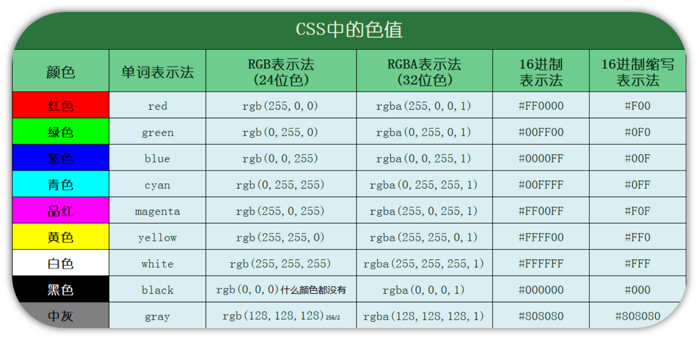

> <span style="color: rgb(36,91,219); background-color: inherit">自然界的颜色有几百万种，但描述颜色的单词只有几百个该怎么办呢？</span>
>
> <span style="color: rgb(36,91,219); background-color: inherit">自然界中太阳光的</span>**<span style="color: rgb(36,91,219); background-color: inherit">三原色</span>**<span style="color: rgb(36,91,219); background-color: inherit">：红色 绿色 蓝色 可以通过这三种颜色调配出任意的其他颜色</span>
>
> **<span style="color: rgb(36,91,219); background-color: inherit">RGB 24 位色表示法</span>**
>
> <span style="color: rgb(36,91,219); background-color: inherit">在计算机中，使用 8 个 bit 位存储红色，8 个 bit 位存储绿色，8 个 bit 位存储蓝色，8 个 bit 位能存 2^8=256 个值，也就是 0～255，也就是 256*256*256 1677 万种色彩，人眼最多识别 300～500 万种色彩，已经超过了人眼的极限，也称作 24 位真彩色，写法：</span>**<span style="color: rgb(36,91,219); background-color: inherit">rgb（255，0，0）</span>**
>
> **<span style="color: rgb(36,91,219); background-color: inherit">RGBA 32 位色表示法  最后一个 A 是（alpha）表示不透明度参数</span>**
>
> <span style="color: rgb(36,91,219); background-color: inherit">最后 8 个 bit 位存储不透明度 1 完全不透明  0 完全透明</span>
>
> <span style="color: rgb(36,91,219); background-color: inherit">rgba（255，0，0，0.85） 表示红色，透明度 0.85</span>
>
> <span style="color: rgb(36,91,219); background-color: inherit">注意这个小数的 0 可以省略，比如 rgba（255，0，0，0.85）；可以简写成 rgba（255 ， 0 ， 0 ， .85);</span>
>
> **<span style="color: rgb(36,91,219); background-color: inherit">十六进制哈希表示法 前/中/后 两位数值分别代表 红/绿/蓝 色的色谱范围。数值从 0-9 a-f</span>**
>
> <span style="color: rgb(36,91,219); background-color: inherit">#0000FF 这里的字母大小写均可 但注意此种表示法只能表示 24 位色，没有透明度</span>
>
> **<span style="color: rgb(36,91,219); background-color: inherit">十六进制缩写表示法</span>**
>
> <span style="color: rgb(36,91,219); background-color: inherit">#00F 这里的字母大小写均可 </span>
>
> <span style="color: rgb(36,91,219); background-color: inherit">当十六进制哈希表示法的表示结果为：#0000FF </span>
>
> <span style="color: rgb(36,91,219); background-color: inherit">当每种颜色的两个数字相同时：</span>
>
> <span style="color: rgb(36,91,219); background-color: inherit">可以使用十六进制缩写表示法简写成一个数字：#00F</span>
>
> <span style="color: rgb(36,91,219); background-color: inherit">注意：如果每种颜色的两个数字不同，则不能简写，比如#808080 就不可以简写</span>

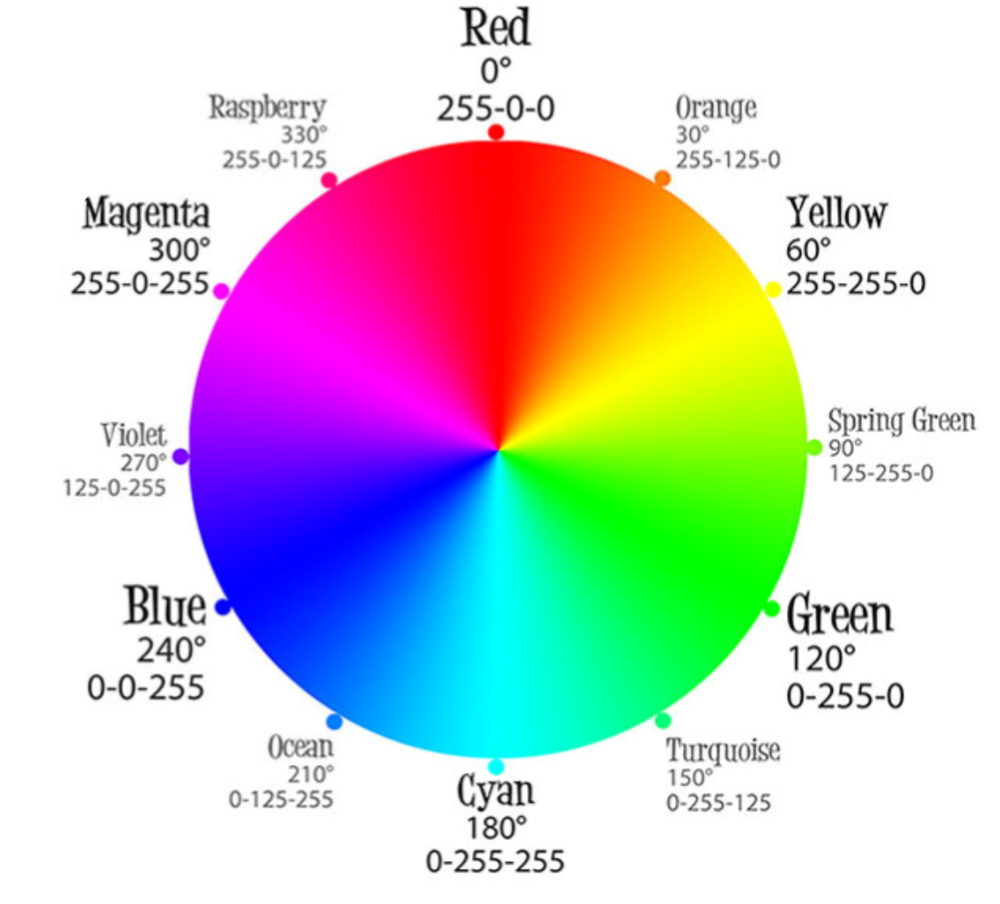

## 5. 背景图处理

**<span style="color: rgb(36,91,219); background-color: inherit">背景颜色：background-color</span>:#fff； &#x20;**

* 颜色可以使用任何的色值（十六进制 rgb rgba 单词等） 背景颜色会在元素的最底层

**<span style="color: rgb(36,91,219); background-color: inherit">背景图片插入：background-image</span>:url（路径）；**

* 注意：背景图和 img 标签的图片插入是有区别的！

* img 标签插入的图片在默认情况下直接就能显示图片

* 背景图必须给所在元素设置宽高才能显示出来

**<span style="color: rgb(36,91,219); background-color: inherit">图片重复问题：background-repeat</span>**

* **图片被平铺到元素中会出现两种情况：**

* 图片大于元素，图片显示不全

* 图片小于元素，会重复，哪个方向有空余空间，就向哪个方向重复

* **<span style="color: rgb(216,57,49); background-color: inherit">background-repeat: no-repeat; 背景图仅显示一次，不重复</span>**

* background-repeat: repeat;  默认值，X-Y 轴都重复

* background-repeat: repeat-x; 仅在 X 轴（水平方向）重复

* background-repeat: repeat-y; 仅在 Y 轴（垂直方向）重复

**<span style="color: rgb(36,91,219); background-color: inherit">背景图尺寸：background-size</span>**

* 没有设置任何尺寸时，默认使用图片本身的大小

* 设置尺寸时，<span style="color: rgb(36,91,219); background-color: inherit">值 1 </span>是背景图的<span style="color: rgb(36,91,219); background-color: inherit">宽度</span>，<span style="color: rgb(36,91,219); background-color: inherit">值 2 </span>是背景图的<span style="color: rgb(36,91,219); background-color: inherit">高度</span>

* background-size: 600px 300px;&#x20;

* background-size: 100% 100%;&#x20;

* 注意：图片比例要合适，否则会尺寸失真

**<span style="color: rgb(36,91,219); background-color: inherit">background-position</span>**<span style="color: rgb(36,91,219); background-color: inherit">:left top; </span>默认值（左上） &#x20;

* 第一个值表示水平方向 第二个值表示垂直方向

* X 轴（水平方向）的值：left 左 center 中 right 右

* Y 轴（竖直方向）的值：top 上 center 中 bottom 下

* center center 表示水平与竖直方向均居中，可以简写成一个 center

* 还可以写<span style="color: rgb(36,91,219); background-color: inherit">像素值</span>，<span style="color: rgb(216,57,49); background-color: inherit">原点（0px 0px）就是左上角</span>

* <span style="color: rgb(216,57,49); background-color: inherit">正值向右/向下移动；</span>负值向左/向上移动

**<span style="color: rgb(36,91,219); background-color: inherit">background-image: linear-gradient(270deg,red,blue);</span>**

* 线型渐变

* 可以设置多种渐变的颜色,使用逗号分隔

* 默认的角度是水平的,可以不加角度值

* 如果加了角度值,单位是deg,且角度值必须写在第一个位置

```html
<!DOCTYPE html>
<html lang="en">
<head>
    <meta charset="UTF-8">
    <title>CSS常用值</title>
    <style>
        h1 {
            color:red;
            color: rgb(255,0,0);
            color: rgb(0,255,255);
            color: rgb(0,255,0);
            color: rgb(255,0,255);
            color: rgb(0,0,255);
            color: rgb(255,255,0);
            color: #FFFFFF;
            color: #FFF;
            color: #000000;
            color: #000;
            color: #808080;/*不能简写!*/

            /* 带不透明度颜色 1完全不透明 0完全透明 0.x半透明 */
            color: rgba(255,0,0,0.8);
            color: rgba(255,0,0,0.6);
            color: rgba(255,0,0,.4);
            color: rgba(255,0,0,.2);
            color: rgba(255,0,0,0);
            color: rgba(255,0,0,1);
        }
        /* 块级元素的默认宽度为父级宽度的100%,高度为0靠内容撑起来 */
        .d1 {
            /*注意:插入背景图必须设置所在区域的大小!*/
            width: 50px;
            height: 100px;
            background-image: url(img/mr.png);
            /* 调整背景图大小 宽度 高度 */
            background-size: 50px 100px;
            /* 可以同时显示背景色 没图的地方显示背景色 */
            background-color: cyan;
        }
        /*  500*300 5像素的红色边框 插入鸣人背景图 */
        .d2 {
            width: 500px;
            height: 300px;
            border: 5px solid #f00;
            background-image: url(img/mr.png);
            /* 设置背景图不允许重复 */
            background-repeat: no-repeat;
            background-position: 0 0;/* 原点是左上角 */
            background-position: -50px 0;/*向左*/
            background-position: 0 50px;/*向下*/
            background-position: -50px -50px;/*左上*/
            background-position:center;
            background-position:50% 50%;
            background-position:100% 100%;/*右下角*/
        }
        .d3 {
            width: 500px;
            height: 300px;
            /* 线型渐变 角度值 颜色1 颜色2...*/
            background-image: linear-gradient(270deg,red,blue);
        }
    </style>
</head>
<body>
    <h1>测试颜色</h1>
    <!-- .d*3 Tab补全-->
    <div class="d1"></div>
    <div class="d2"></div>
    <div class="d3"></div>
</body>
</html>
```

## 6. 元素的显示模式(默认的文档流 position:static)

**<span style="color: rgb(36,91,219); background-color: inherit">块级元素：display:block；</span>**

排列方式：按照书写的顺序，从上往下依次排列

特点：独占一行，还可以设置宽高

常见标签：div h1～h6 p form table ul ol li...

**<span style="color: rgb(36,91,219); background-color: inherit">行内元素：display:inline；</span>**

排列方式：按照书写顺序从左往右依次排列

特点：共占一行，不能设置宽高

常见标签：span a i b s...

**<span style="color: rgb(36,91,219); background-color: inherit">行内块元素：display:inline-block；</span>**

排列方式：按照书写顺序从左往右依次排列

特点：共占一行，可以修改宽高

常见标签：input button

**<span style="color: rgb(36,91,219); background-color: inherit">元素消失：display:none；</span>**

```html
<!DOCTYPE html>
<html lang="en">
<head>
    <meta charset="UTF-8">
    <title>元素显示模式</title>
    <style>
        div {
            width: 200px;
            height: 100px;
            border: 5px solid #f00;
            /*块级元素 允许设置宽高 竖着排*/
            display: block;
        }
        span {
            width:200px;
            height: 200px;
            background-color: #ff0;
            /*行内元素 不允许设置宽高 横着排*/
            display: inline;
            display: block;/*可以修改元素的显示模式*/
        }
        /*输入框与按钮是行内块元素 既可以设置宽高,又横着排 */
        input,button {
            width: 200px;
            height: 200px;
            display: inline-block;
        }
        .d2 {
            /*让元素消失 不占据页面的布局空间*/
            display: none;
        }
    </style>
</head>
<body>
    <div class="d1"></div>
    <div class="d2"></div>
    <div class="d3"></div>
    <hr>
    <span>123456789</span>
    <span>12345678fdeoiwryofiewfiw9</span>
    <span>123456789</span>
    <hr>
    <input type="text">
    <input type="text">
    <input type="text">
    <button>按钮</button>
</body>
</html>
```

## 7. 字体处理

**<span style="color: rgb(36,91,219); background-color: inherit">color</span>**<span style="color: rgb(36,91,219); background-color: inherit">： </span>设置文字颜色

**<span style="color: rgb(36,91,219); background-color: inherit">font-size</span>**<span style="color: rgb(36,91,219); background-color: inherit"> ：</span>设置文字的大小

* 谷歌浏览器默认字体大小 16px，最小 12px，低于 12px 也以 12px 显示

**<span style="color: rgb(36,91,219); background-color: inherit">font-family</span>**<span style="color: rgb(36,91,219); background-color: inherit">: </span>“幼圆”； 设置文字字体

* 执行顺序是从前向后执行的

* 字体名称要使用引号包裹

* 商用字体要考虑到版权问题

* 尽量少用奇怪的字体，因为客户可能会没有

> <span style="color: rgb(36,91,219); background-color: inherit">字体文件在电脑 C 盘的“Fonts”文件夹中</span>
>
> <span style="color: rgb(36,91,219); background-color: inherit">打开“计算机”-&gt;C 盘-&gt; “Windows”-&gt; “Fonts”即可看到所有已安装的字体</span>

**<span style="color: rgb(36,91,219); background-color: inherit">font</span>**<span style="color: rgb(36,91,219); background-color: inherit">: </span>35px “微软雅黑”；字号和字体可以一起设置&#x20;

**<span style="color: rgb(36,91,219); background-color: inherit">text-decoration</span>**<span style="color: rgb(36,91,219); background-color: inherit"> ：</span>设置文本修饰线

* underline 下划线&#x20;

* <span style="color: rgb(216,57,49); background-color: inherit">none 去掉所有修饰线  </span>

* line-through 添加一条删除线

**<span style="color: rgb(36,91,219); background-color: inherit">line-height</span>**<span style="color: rgb(36,91,219); background-color: inherit">：</span>设置文本行高

* 称为行间距，指的是行与行文本之间的距离

* 如果需要单行文字在元素内<span style="color: rgb(36,91,219); background-color: inherit">垂直居中</span>，可以让<span style="color: rgb(36,91,219); background-color: inherit">行高为元素的高度</span>即可

**<span style="color: rgb(36,91,219); background-color: inherit">text-align</span>**<span style="color: rgb(36,91,219); background-color: inherit"> ：</span>设置块级元素内文本的水平对齐方式 &#x20;

* 对齐方式：left 左对齐 / center 居中对齐 / right 右对齐&#x20;

**<span style="color: rgb(36,91,219); background-color: inherit">text-shadow</span>**: 20px 20px 5px red;

* 文本阴影：X 轴偏移量 Y 轴偏移量 羽化值 阴影颜色

**<span style="color: rgb(36,91,219); background-color: inherit">font-weight</span>**<span style="color: rgb(36,91,219); background-color: inherit"> :</span>字重（字体粗细），可取值：

* normal 400 正常体

* lighter 300 细体

* bold 600 粗体

**<span style="color: rgb(36,91,219); background-color: inherit">text-indent</span>**<span style="color: rgb(36,91,219); background-color: inherit">: </span>2em;用于设置内容的首行缩进

* 一般用于中文段落最开始，首行需要缩进两个中文字符

**<span style="color: rgb(36,91,219); background-color: inherit">font-style</span>**<span style="color: rgb(36,91,219); background-color: inherit">: </span>italic; 文字倾斜效果

```html
<!DOCTYPE html>
<html lang="en">
<head>
    <meta charset="UTF-8">
    <title>文字处理</title>
    <style>
        p {
            /*文字大小 谷歌浏览器默认的字号是16px 最小字号12px*/
            font-size: 30px;
            /*字体 可以设置多个*/
            font-family: "幼圆uuuu","宋体";
        }
        a {
            /*文本修饰线*/
            text-decoration: none; /*去除修饰线*/
            text-decoration: line-through;/*删除线*/
            text-decoration: underline;/*下划线*/
            text-decoration: overline;/*顶部线*/
        }
        div {
            width: 200px;
            height: 200px;
            border: 5px solid #00f;
            /*文字水平对齐方式:居中*/
            text-align: center;
            /*行高:设置行与行之间的距离
            如果单行文字的行高与div一样高，可以设置文字垂直居中效果*/
            line-height: 200px;
        }
        h1 {
            /*字体字重*/
            font-weight: bold;/*加粗*/
            font-weight: normal;/*正常体*/
            font-weight: lighter;/*细体*/
            font-style: italic;/*字体样式:斜体*/
        }
        span {
            /*文本阴影:X轴偏移量 Y轴偏移量 羽化值 阴影颜色
            水平方向:正数向右 负数向左
            垂直方向:正数向下 负数向上
            羽化值:数值越大，阴影越模糊*/
            text-shadow: 20px -50px 2px red;
        }
    </style>
</head>
<body>
  <p>我是测试文字 123 ABC abc</p>
  <a href="#">超链接</a>
  <div>
      测试文字
  </div>
  <span>测试文字</span>
  <h1>标题字</h1>
</body>
</html>
```

## 8. 今日作业

1. **<span style="color: inherit; background-color: rgba(183,237,177,0.8)">创建 jsd-3-test项目,把day01与day02的代码复写一遍!要求加注释!</span>**

2. **<span style="color: inherit; background-color: rgba(183,237,177,0.8)">完成上午的表单作业</span>**

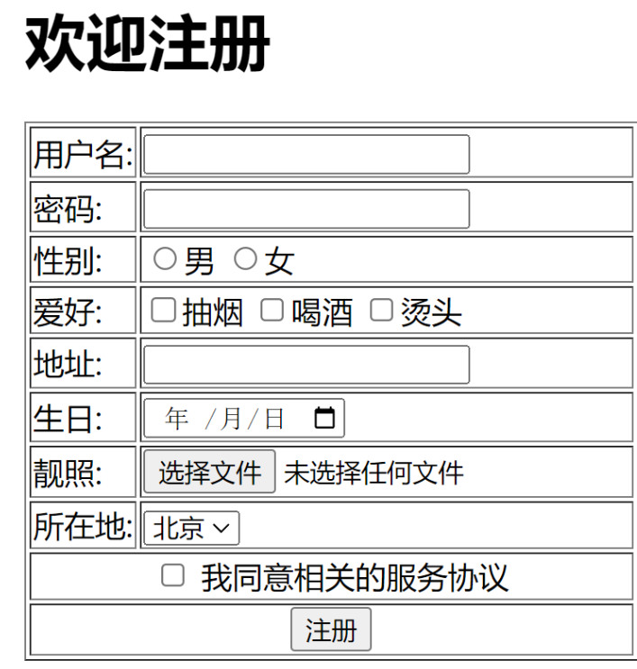

## 9. 拓展

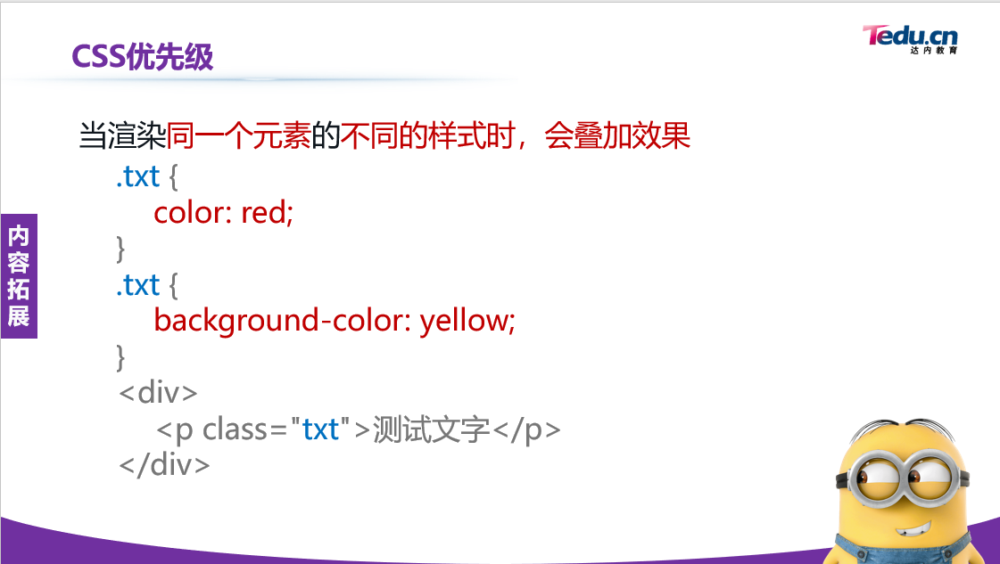

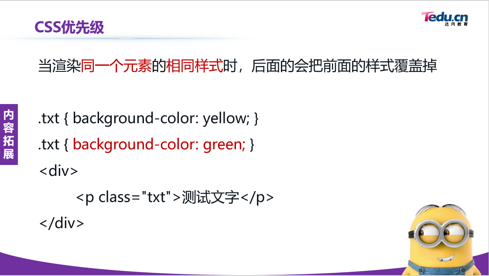

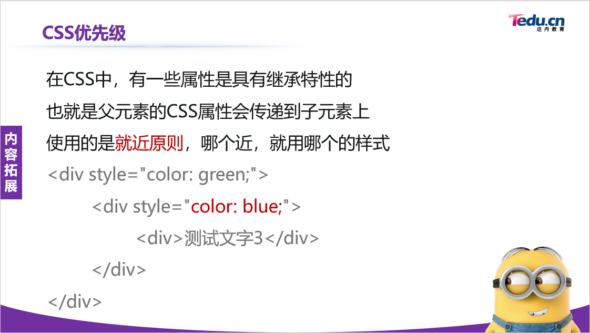

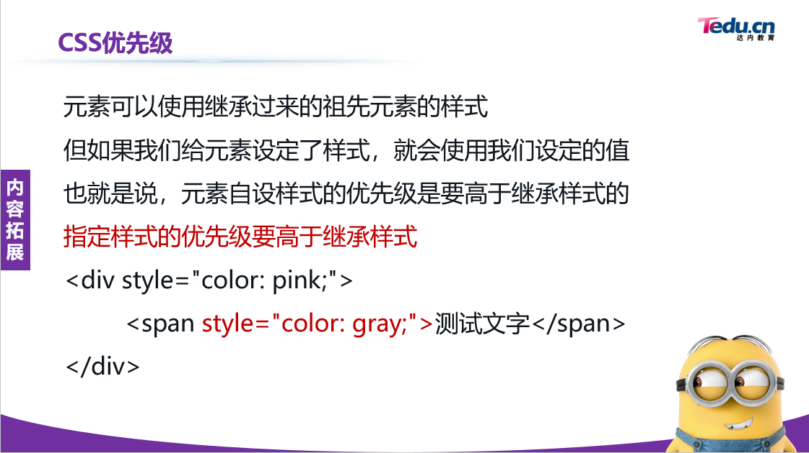

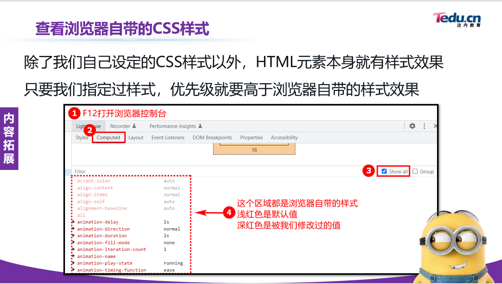

# DAY03笔记 CSS高级

## 1. 盒子模型

一个 HTML 元素，需要占用页面的布局空间，这个空间由以下几个部分组成：

* **<span style="color: rgb(36,91,219); background-color: inherit">content 内容区域 元素本身的大小</span>**

* **<span style="color: rgb(46,161,33); background-color: inherit">padding 内间距 元素内容与边框之间的距离</span>**

* **<span style="color: rgb(220,155,4); background-color: inherit">border 元素的边框</span>**

* **<span style="color: rgb(222,120,2); background-color: inherit">margin 外间距 元素与元素之间的距离</span>**

涉及到四个方向 left 左 right 右 top 上 bottom 下

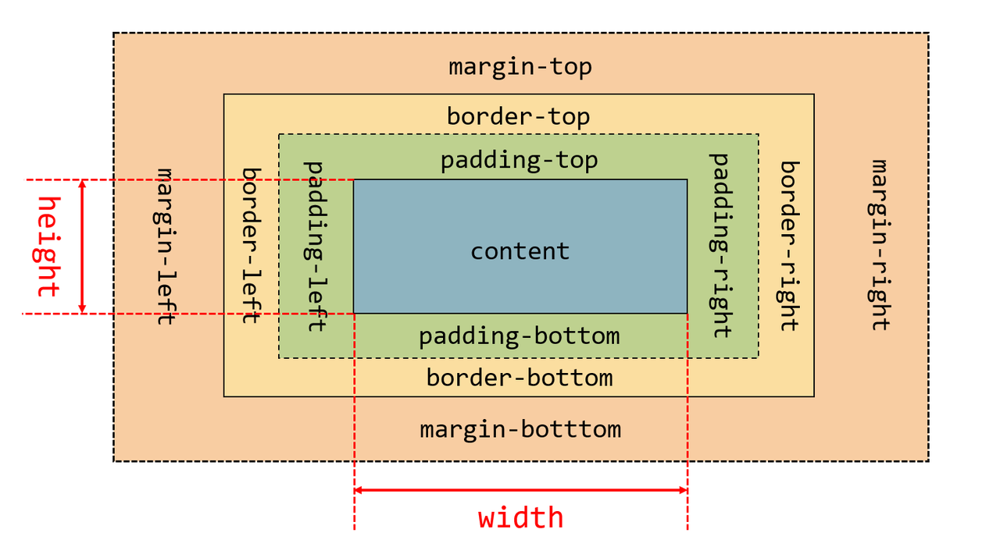

### 1.1 盒子模型练习

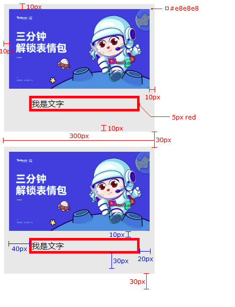

```html
<!DOCTYPE html>
<html lang="en">
<head>
    <meta charset="UTF-8">
    <title>盒子模型练习</title>
    <style>
        .card {
            width: 300px;
            background-color: #ff0;
            /*内间距:四个方向都是10px 内容与边框之间的距离*/
            padding: 10px;
            border: 2px solid #f00;
            /*单独设置下外间距 */
            margin-bottom:30px;
        }
        .card>img {
            /* 图片的宽度是父级卡片宽度的100% */
            width: 100%;
        }
        .card>p {
            border: 5px solid #f00;
            /*外间距:边框外的与其他元素的距离
            如果是4个值，从上外间距开始 按照顺时针 上 右 下 左 进行设置*/
            margin: 10px 20px 30px 40px;
        }
    </style>
</head>
<body>
  <div class="card">
      
      <p>我是文字</p>
  </div>
  <div class="card">
      
      <p>我是文字</p>
  </div>
</body>
</html>
```

### 1.2 外间距 （margin）

**<span style="color: inherit; background-color: rgba(255,246,122,0.8)">外间距的写法：</span>**

* margi&#x6E;**<span style="color: rgb(36,91,219); background-color: inherit">-</span> <span style="color: rgb(222,120,2); background-color: inherit">bottom</span>**: 50px; 设&#x7F6E;**<span style="color: rgb(222,120,2); background-color: inherit">单侧外间距</span>**（top上 / right右 / bottom下/ left左）

* margin:**<span style="color: rgb(216,57,49); background-color: inherit">10</span>**&#x70;x; **<span style="color: rgb(216,57,49); background-color: inherit">四个方向</span>**&#x90FD;是 10px

* margin:**<span style="color: rgb(216,57,49); background-color: inherit">10</span>**&#x70;x **<span style="color: rgb(46,161,33); background-color: inherit">20</span>**&#x70;x; **<span style="color: rgb(216,57,49); background-color: inherit">上下</span>** 10px **<span style="color: rgb(46,161,33); background-color: inherit">左右</span>** 20px

* margin:**<span style="color: rgb(216,57,49); background-color: inherit">10</span>**&#x70;&#x78;**<span style="color: rgb(46,161,33); background-color: inherit"> 20</span>**&#x70;x **<span style="color: rgb(36,91,219); background-color: inherit">30</span>**&#x70;x; **<span style="color: rgb(216,57,49); background-color: inherit">上</span>** 10px **<span style="color: rgb(46,161,33); background-color: inherit">左右</span>** 20px **<span style="color: rgb(36,91,219); background-color: inherit">下</span>** 30px

* margin:**<span style="color: rgb(216,57,49); background-color: inherit">10</span>**&#x70;x **<span style="color: rgb(46,161,33); background-color: inherit">20</span>**&#x70;&#x78;**<span style="color: rgb(36,91,219); background-color: inherit"> 30</span>**&#x70;x **<span style="color: rgb(100,37,208); background-color: inherit">40</span>**&#x70;x;**&#x20;<span style="color: rgb(216,57,49); background-color: inherit">上</span>** 10p&#x78;**<span style="color: rgb(46,161,33); background-color: inherit"> 右</span>** 20px **<span style="color: rgb(36,91,219); background-color: inherit">下</span>** 30px **<span style="color: rgb(100,37,208); background-color: inherit">左</span>** 40px

* **<span style="color: inherit; background-color: rgba(255,246,122,0.8)">margin: 0 auto; 上下 0 左右居中</span>**

  **<span style="color: rgb(216,57,49); background-color: rgba(255,246,122,0.8)">块级元素</span> <span style="color: inherit; background-color: rgba(255,246,122,0.8)">左右外间距计算成等值，能实现</span> <span style="color: rgb(216,57,49); background-color: rgba(255,246,122,0.8)">水平居中</span> <span style="color: inherit; background-color: rgba(255,246,122,0.8)">效果</span>**

***规律：按照 上右下左 顺时针 依次赋值 没有的找对门***

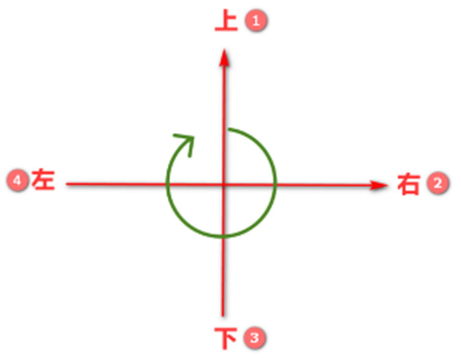

**<span style="color: inherit; background-color: rgba(255,246,122,0.8)">外间距指的元素外部与其它元素之间的距离</span>**

1. 块级与行内块元素四个方向的外间距均生效

2. **<span style="color: rgb(36,91,219); background-color: inherit">行内元素</span>**&#x7684;左右外间距可以用，**<span style="color: rgb(36,91,219); background-color: inherit">上下外间距不生效</span>**

3. 父子贴边问题：给父元素加 BFC 结界 **<span style="color: rgb(36,91,219); background-color: inherit">overflow:hidden；</span>**

   第 1 个子元素的上外间距与最后 1 个子元素的下外间距都会包裹在父元素范围之内

4. 相邻兄弟间在垂直方向上如果有重叠的外间距，**<span style="color: rgb(36,91,219); background-color: inherit">取最大值显示</span>**

```html
<!DOCTYPE html>
<html lang="en">
<head>
    <meta charset="UTF-8">
    <title>外间距测试</title>
    <style>
        body {
            /*可以去掉body默认四个方向的8px外间距*/
            margin: 0;
        }
        /* div默认宽度为其父级宽度的100% 默认高度为0 */
        .fu {
            background-color: rgba(255,255,0,.3); /*不透明度.3 0透明 1不透明*/
            /*给父元素设置BFC结界 把首尾元素超出的外间距包裹在内*/
            overflow: hidden;
        }
        .fu>div {
            width: 100px;
            height: 100px;
            background-color: rgba(0,0,255,.6);
            border: 2px solid #00f;
            color: #fff;
        }
        /* 相邻兄弟垂直方向的外间距取大值显示,不会叠加 */
        .z1 {
            margin-bottom: 30px;
            margin-top: 50px;/*第1个子元素的上外间距会超出父元素的范围*/
        }
        .z2 {
            margin-top: 50px;
        }
        .z4 {
            margin-bottom: 50px;/*最后1个子元素的下外间距会超出父元素的范围*/
        }
        .z3 {
            /* 上 右 下 左 顺时针依次赋值 没有值就找对门的值 */
            margin: 10px 20px 30px 40px;
            margin: 10px;
            margin: 10px 20px;
            margin: 10px 20px 30px;
            /*上下0 左右auto让浏览器自动计算为相等的值 实现块级元素的水平居中 */
            margin: 0 auto;
        }
        span {
            border: 2px solid #f00;
        }
        .s2 {
            /* 行内元素垂直方向的外间距不生效,不要使用! */
            margin: 30px 20px;
        }
    </style>
</head>
<body>
<span>span1</span><span class="s2">span2</span><span>span3</span>

<!-- .fu>.z*4 -->
<div class="fu">
    <div class="z1">子元素div1</div>
    <div class="z2">子元素div2</div>
    <div class="z3">子元素div3</div>
    <div class="z4">子元素div4</div>
</div>
</body>
</html>
```

### 1.3 **边框 （border）**

**设置边框：<span style="color: rgb(36,91,219); background-color: inherit">border:1px solid #000； </span>**&#x7C97;细 线型 颜色

**设置某一个方向的边框：**&#x62;orde&#x72;**<span style="color: rgb(36,91,219); background-color: inherit">-top</span>**: 1px solid #000； 设&#x7F6E;**<span style="color: rgb(36,91,219); background-color: inherit">上边框</span>**&#x7684;粗细 线型 颜色

**去掉边框：&#x20;**&#x62;order:none；  或者 **<span style="color: rgb(36,91,219); background-color: inherit">border:0；</span>**

**线型：<span style="color: rgb(36,91,219); background-color: inherit">solid 单实线</span>** dashed 虚线 dotted 点状线 double 双实线…

**边框圆角：** **<span style="color: rgb(36,91,219); background-color: inherit">border-radius</span>**: 100px；

* 数值越大，角越圆

* *边框圆角为正方形高度的一半，可以切圆形*

### 1.4 内间距 （padding）

**<span style="color: inherit; background-color: rgba(255,246,122,0.8)">内间距的写法：</span>**

* paddin&#x67;**<span style="color: rgb(36,91,219); background-color: inherit">-</span> <span style="color: rgb(222,120,2); background-color: inherit">top</span>**: 50px; 设&#x7F6E;**<span style="color: rgb(222,120,2); background-color: inherit">单侧内间距</span>**（top 上/right 右/bottom 下/left 左）

* padding:**<span style="color: rgb(216,57,49); background-color: inherit">10</span>**&#x70;x; **<span style="color: rgb(216,57,49); background-color: inherit">四个方向</span>**&#x90FD;是 10px

* padding:**<span style="color: rgb(216,57,49); background-color: inherit">10</span>**&#x70;x **<span style="color: rgb(46,161,33); background-color: inherit">20</span>**&#x70;x; **<span style="color: rgb(216,57,49); background-color: inherit">上下</span>** 10px **<span style="color: rgb(46,161,33); background-color: inherit">左右</span>** 20px

* padding:**<span style="color: rgb(216,57,49); background-color: inherit">10</span>**&#x70;&#x78;**<span style="color: rgb(46,161,33); background-color: inherit"> 20</span>**&#x70;x **<span style="color: rgb(36,91,219); background-color: inherit">30</span>**&#x70;x; **<span style="color: rgb(216,57,49); background-color: inherit">上</span>** 10px **<span style="color: rgb(46,161,33); background-color: inherit">左右</span>** 20px **<span style="color: rgb(36,91,219); background-color: inherit">下</span>** 30px

* padding:**<span style="color: rgb(216,57,49); background-color: inherit">10</span>**&#x70;x **<span style="color: rgb(46,161,33); background-color: inherit">20</span>**&#x70;&#x78;**<span style="color: rgb(36,91,219); background-color: inherit"> 30</span>**&#x70;x **<span style="color: rgb(100,37,208); background-color: inherit">40</span>**&#x70;x;**&#x20;<span style="color: rgb(216,57,49); background-color: inherit">上</span>** 10p&#x78;**<span style="color: rgb(46,161,33); background-color: inherit"> 右</span>** 20px **<span style="color: rgb(36,91,219); background-color: inherit">下</span>** 30px **<span style="color: rgb(100,37,208); background-color: inherit">左</span>** 40px

***规律：按照 上右下左 顺时针 依次赋值 没有的找对门***


**<span style="color: inherit; background-color: rgba(255,246,122,0.8)">内间距指的是元素内容与边框之间的距离</span>**

1. 块级与行内块元素的四个方向的内间距均生效

2. **<span style="color: rgb(36,91,219); background-color: inherit">行内元素的</span>**&#x5DE6;右内间距正常生效，&#x4F46;**<span style="color: rgb(36,91,219); background-color: inherit">上下内间距不生效</span>**

**<span style="color: inherit; background-color: rgba(255,246,122,0.8)">内间距使用场景</span>**

让元素内部距离外层父级元素的边有点距离，主要为了美化，如：

* 输入框的文字不要贴边显示

* 文本卡片内容不要贴边显示

**<span style="color: rgb(36,91,219); background-color: inherit">切换盒子模型计算方案：</span>**

* **<span style="color: rgb(36,91,219); background-color: inherit">box-sizing: border-box;</span>**&#x8FB9;框盒子

* **效果：**&#x52A0;内间距与边框都不会让元素变大，都算在元素设置的 width 与 height 中

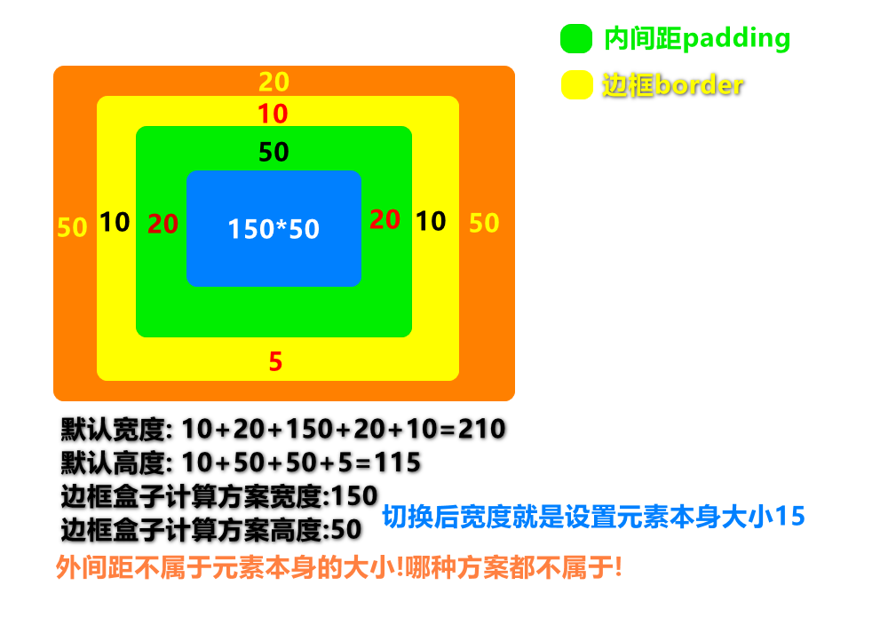

```html
<!DOCTYPE html>
<html lang="en">
<head>
    <meta charset="UTF-8">
    <title>边框与内间距</title>
    <style>
        .d1 {
            width: 200px;
            height: 200px;
            background-color: #0aa1ed;
            /* 设置四个方向的 粗细 线型 颜色*/
            border: 5px solid #f00;
            /* 设置单方向的边框 */
            border-top: 8px solid #ff0;
            /* 边框圆角 值越大 角越圆 值为正方形宽高的一半是圆形 */
            border-radius: 100px;
        }
        .d2 {
            width: 200px;
            height: 200px;
            border: 5px solid #f0f;
            padding-left: 50px;
            padding-top: 50px;
            /*默认的计算方案:加内间距与边框都会让元素变大*/
            /*切换成"边框盒子"计算方案后,内间距与边框都会算在预设的大小里,是固定大小*/
            box-sizing: border-box;
            margin: 50px; /*外间距不算在元素本身的大小里,但是会占据页面布局空间*/
        }
        span {
            border: 3px solid #f00;
        }
        .s2 {
            /* 行内元素垂直方向的内外间距都不能使用! 水平方向可以正常生效 */
            padding: 50px;
        }
    </style>
</head>
<body>
    <div class="d1"></div>
    <div class="d2">内间距测试</div>
    <hr>
    <span>我是span</span>
    <span class="s2">我是span</span>
    <span>我是span</span>
    <h1>我是标题</h1>
</body>
</html>
```

## 2. 流与文档流

流（Stream）：车流 水流 多个对象有序排列称为流

<span style="color: rgb(36,91,219); background-color: inherit">文档流：网页中多个元素按照自己的特性有序排列，形成了文档流</span>

如：块级从上到下排列，行内与行内块从左到右排列

<span style="color: rgb(36,91,219); background-color: inherit">文档流中元素的特点：</span>

* 依次紧密排列

* 多个 div/span 在竖直/水平方向紧挨着

* 流中的元素绝不可能出现一个元叠摞在另外一个元素上面的情况

* 如果项目中需要出现堆叠的效果，就只能"脱离文档流"

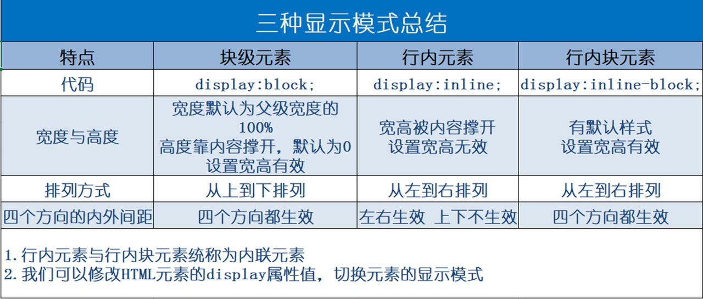

## 3. 浮动

浮动可以让块级元素横向排列

**float 属性：**

* float:left; 左浮动，向父级元素的左侧边界靠拢

* float:right; 右浮动，向父级元素右侧边界靠拢


**<span style="color: inherit; background-color: rgba(255,246,122,0.8)">浮动特点：</span>**

1. 浮动会破坏原有的文档流布局，变为浮动布局，元素可以横向排列

2. 浮动后的元素会脱离文档流，释放原有的布局空间

3. 浮动后的子元素不再支撑父元素的高度

4. 如果一个父元素中所有的子元素都浮动了，父元素会高度坍塌（失高）

**<span style="color: rgb(36,91,219); background-color: inherit">解决方案：给父元素设置 overflow:hidden；</span>**

会根据子元素浮动后的实际高度给父元素自动填充高度，解决失高问题


```html
<!DOCTYPE html>
<html lang="en">
<head>
    <meta charset="UTF-8">
    <title>浮动布局</title>
    <style>
        .fu {
            background-color: #ff0;
            /*子元素都浮动走,父元素会失高
            可以给父元素设置BFC结界,此时父元素会根据子元素浮动后的实际高度自动填充高度*/
            overflow: hidden;
        }
        .fu>div {
            width: 100px;
            height: 100px;
            border: 3px solid #f00;
        }
        .z1 {
            background-color: #f00;
            /* 浮动元素会脱离文档流 不再占用文档流的布局空间 也就是不再支撑父元素的高度 */
            float: left;
        }
        .z2 {
            background-color: #0f0;
            float: left;
        }
        .z3 {
            background-color: #00f;
            float: left;
        }
    </style>
</head>
<body>
<!-- .fu>.z*3 -->
<div class="fu">
    <div class="z1"></div>
    <div class="z2"></div>
    <div class="z3"></div>
</div>
</body>
</html>
```

## 4. CSS 定位

### 4.1 **静态定位（默认值）<span style="color: rgb(36,91,219); background-color: inherit"> position:static； </span>**

就是默认的文档流布局，元素处于文档流中,只能依次排列，不能随意改变自己的位置

> **<span style="color: rgb(36,91,219); background-color: inherit">使用其他定位属性后，可以让元素通过 top/bottom/left/right 四个属性移动</span>**

> **<span style="color: rgb(36,91,219); background-color: inherit">层级 z-index：</span>**&#x4F7F;用定位后，元素发生重叠时可以调整层级

> 1. z-index 的值越大，层级越高，值大的元素会覆盖值小的元素

> 2. 值为整数值，没有任何单位

> 3. 默认值是 auto，可以看作是层级 0，z-index 还可以取负值

### 4.2 相对定位<span style="color: rgb(36,91,219); background-color: inherit"> </span>**<span style="color: rgb(36,91,219); background-color: inherit">position:relative； </span>**

**<span style="color: rgb(36,91,219); background-color: inherit">移动参照物：元素自己原来的位置</span>**

1. 不会脱离文档流并保留原有位置，还可以支撑父元素，不影响父级

2. 与外间距 margin 的区别：margin 会影响其他元素，相对定位不会挤开兄弟元素，但可能会遮盖

3. 常用于需要微调元素位置时使用

```html
<!DOCTYPE html>
<html lang="en">
<head>
    <meta charset="UTF-8">
    <title>相对定位</title>
    <style>
        .fu {
            background-color: #ff0;
        }
        .fu>div {
            width: 100px;
            height: 100px;
        }
        .z1 {
            background-color: #f00;
            /* 注意!要先加position才能移动位置 调整层级 */
            position: relative;
            z-index: 10;/*整数 默认0 数值越大 层级越高 */
            left: 25px;
        }
        .z2 {
            background-color: #0f0;
            /*相对定位
            移动参照物:自己原来的位置
            不脱离文档流 不释放布局空间 也不会挤开其它元素*/
            position: relative;
            left: 50px;
            bottom: 50px;
            z-index: -1;
        }
        .z3 {
            background-color: #00f;
        }
    </style>
</head>
<body>
<div class="fu">
    <div class="z1"></div>
    <div class="z2"></div>
    <div class="z3"></div>
</div>
</body>
</html>
```

### 4.3 绝对定位<span style="color: rgb(36,91,219); background-color: inherit"> </span>**<span style="color: rgb(36,91,219); background-color: inherit">position:absolute； </span>**

**<span style="color: rgb(36,91,219); background-color: inherit">移动参照物：</span>*<span style="color: rgb(36,91,219); background-color: inherit">离自己最近的使用了非静态定位属性的上层元素</span>***

> <span style="color: rgb(216,57,49); background-color: inherit">会一路向上找，终点是 html 根元素</span>

1. 绝对定位的元素会脱离文档流，释放布局空间

2. 小技巧：**<span style="color: rgb(216,57,49); background-color: inherit">”子绝父相”</span>**&#x5B50;元素使用绝对定位，父级设置相对定位后就可以变成子元素移动的参照物

```html
<!DOCTYPE html>
<html lang="en">
<head>
    <meta charset="UTF-8">
    <title>绝对定位</title>
    <style>
        .fu {
            background-color: #ff0;
            position: relative;
            width: 500px;
        }
        .fu>div {
            width: 100px;
            height: 100px;
        }
        .z1 {
            background-color: #f00;
        }
        .z2 {
            background-color: #0f0;
            position: absolute;
            top: 0;
            right: 0;
        }
        .z3 {
            background-color: #00f;
        }
    </style>
</head>
<body>
<div class="fu">
    <div class="z1"></div>
    <div class="z2"></div>
    <div class="z3"></div>
</div>
</body>
</html>
```

### 4.4 固定定位 **<span style="color: rgb(36,91,219); background-color: inherit">position:fixed； </span>**

**<span style="color: rgb(36,91,219); background-color: inherit">移动参照物：html 根元素（浏览器窗口）</span>**

1. 固定定位也会脱离文档流

2. 我们可以利用固定定位实现页面固定广告与撑满全屏的效果

```html
<!DOCTYPE html>
<html lang="en">
<head>
    <meta charset="UTF-8">
    <title>固定定位</title>
    <style>
        .fu {
            background-color: #ff0;
        }
        .fu>div {
            width: 100px;
            height: 100px;
        }
        .z1 {
            background-color: #f00;
        }
        .z2 {
            background-color: #0f0;
            /* 固定定位 参照物为html元素 会脱离文档流 释放布局空间 */
            position: fixed;
            right: 0;
            bottom: 0;
        }
        .z3 {
            background-color: #00f;
        }
    </style>
</head>
<body>
<div class="fu">
    <div class="z1"></div>
    <div class="z2"></div>
    <div class="z3"></div>
</div>
</body>
</html>
```

### 4.5 布局方式总结

| **<span style="color: rgb(36,91,219); background-color: inherit">浮动布局</span>**<br />**<span style="color: rgb(36,91,219); background-color: inherit">float:left/right;</span>**         | **1）元素会脱离文档流，释放布局空间**                                                                                                    |
| --------------------------------------------------------------------------------------------------------------------------------------------------------------------------------------- | ------------------------------------------------------------------------------------------------------------------------ |
|                                                                                                                                                                                         | **2）如果所有子元素都浮动，父元素会<span style="color: rgb(216,57,49); background-color: inherit">高度坍塌</span>**                          |
|                                                                                                                                                                                         | **3）浮动元素可以使用 margin 微调自己的位置**                                                                                            |
|                                                                                                                                                                                         | **4）用途：可在页面中实现"两端对齐"或“<span style="color: rgb(216,57,49); background-color: inherit">横置</span>”的效果**                     |
| **<span style="color: rgb(36,91,219); background-color: inherit">静态定位（默认文档流布局）</span>**<br />**<span style="color: rgb(36,91,219); background-color: inherit">position:static;</span>** | **1） 块级元素从上往下依次排列**                                                                                                      |
|                                                                                                                                                                                         | **2）行内/行内块元素从左往右依次排列，一行放不下才换行**                                                                                          |
|                                                                                                                                                                                         | **3）文档流中的元素都是紧密排列的，没有大的空隙和元素堆叠的现象**                                                                                      |
| **<span style="color: rgb(36,91,219); background-color: inherit">相对定位</span>**<br />**<span style="color: rgb(36,91,219); background-color: inherit">position:relative;</span>**        | **<span style="color: rgb(216,57,49); background-color: inherit">1）移动参照物：自己作为静态定位元素时原来的位置</span>**                       |
|                                                                                                                                                                                         | **2）不会脱离文档流、不会释放布局空间**                                                                                                   |
|                                                                                                                                                                                         | **3）可以使用 top bottom left right 调整自己的位置**                                                                                 |
|                                                                                                                                                                                         | **4）可以使用 z-index 调整层级**                                                                                                  |
|                                                                                                                                                                                         | **5）用途：微调自己的位置，但不会挤开其它元素**                                                                                               |
|                                                                                                                                                                                         | **6）用途：为使用绝对定位的后代元素提供定位参照物**                                                                                             |
| **<span style="color: rgb(36,91,219); background-color: inherit">绝对定位</span>**<br />**<span style="color: rgb(36,91,219); background-color: inherit">position:absolute;</span>**        | **<span style="color: rgb(216,57,49); background-color: inherit">1）移动参照物：离自己最近的使用了非 static 定位的上级元素，终点是 html 根元素</span>** |
|                                                                                                                                                                                         | **2）会脱离文档流并且释放布局空间**                                                                                                     |
|                                                                                                                                                                                         | **3）可以使用 top bottom left right 调整自己的位置**                                                                                 |
|                                                                                                                                                                                         | **4）可以使用 z-index 调整层级**                                                                                                  |
|                                                                                                                                                                                         | **5）用途：在页面上覆盖到其它元素上方的指定位置**                                                                                              |
| **<span style="color: rgb(36,91,219); background-color: inherit">固定定位</span>**<br />**<span style="color: rgb(36,91,219); background-color: inherit">position:fixed;</span>**<br />     | **<span style="color: rgb(216,57,49); background-color: inherit">1）移动参照物：html 根元素</span>**                               |
|                                                                                                                                                                                         | **2）会脱离文档流并且释放布局空间**                                                                                                     |
|                                                                                                                                                                                         | **3）可以使用 top bottom left right 调整自己的位置**                                                                                 |
|                                                                                                                                                                                         | **4）可以使用 z-index 调整层级**                                                                                                  |
|                                                                                                                                                                                         | **5）用途：制作覆盖整个窗口的遮罩层、或制作页面固定广告**                                                                                          |

## 5. 今日作业

1. **抄写上面的"布局方式总结",对不同布局方式的特点进行巩固**

2. **完成学子页面的F2,效果图如下:**

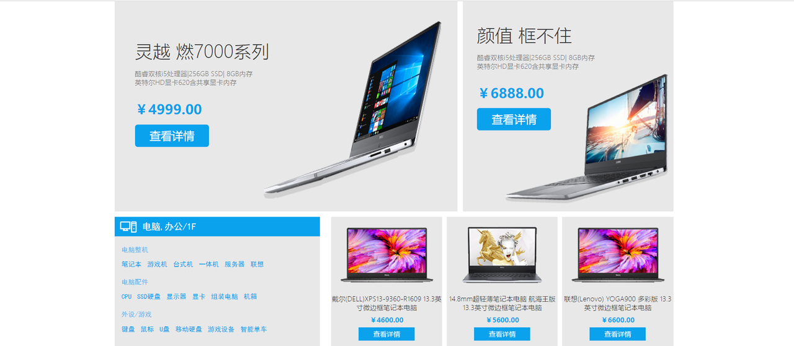

## 6. 页面版心

**<span style="color: rgb(36,91,219); background-color: inherit">版心</span>**&#x6307;的是一般在页面&#x4E2D;**<span style="color: rgb(36,91,219); background-color: inherit">定宽且居中</span>**，用&#x6765;**<span style="color: rgb(36,91,219); background-color: inherit">显示页面主要内容</span>**&#x7684;一块区域

```html
<!DOCTYPE html>
<html lang="en">
<head>
    <meta charset="UTF-8">
    <title>居中测试</title>
    <style>
        * {
            margin: 0;
            padding: 0;
        }
        .main {
            background-color: lightgreen;
        }
        .center {
            background-color: lightblue;
            width: 1000px;
            margin: 0 auto;
        }
        .card {
            width: 200px;
            height: 300px;
            background-color: pink;
            border: 3px solid #000;
            /*让块级元素自己水平居中,要加给块级元素自己上*/
            margin: 0 auto;
            /*让块级元素内的(文字/图片)水平居中,加在块级父元素上*/
            text-align: center;
            line-height: 300px;
        }
    </style>
</head>
<body>
<div class="main">
    <div class="center">
        <div class="card">我是内容</div>
        <div class="card">我是内容</div>
        <div class="card">我是内容</div>
        <div class="card">我是内容</div>
    </div>
</div>
</body>
</html>
```

## 7. 元素的放大与过渡

* **<span style="color: rgb(36,91,219); background-color: inherit">transform: scale(</span> <span style="color: rgb(222,120,2); background-color: inherit">n</span> <span style="color: rgb(36,91,219); background-color: inherit">); </span>**&#x53D8;换:放大(倍数) 放大至原来的n倍

  * n>1放大n倍  n=1 大小不变  0\<n<1缩小n倍 0缩小到看不见

* **<span style="color: rgb(36,91,219); background-color: inherit">transition: </span> <span style="color: rgb(222,120,2); background-color: inherit">2s</span> <span style="color: rgb(36,91,219); background-color: inherit">;</span>** 添加过渡 让变换有一点过渡时间，不要一瞬间完成 太突兀

* **注意:&#x20;**&#x8FC7;渡要加给div，而不是悬停,否则离开 div 时没有过渡,效果不好

```html
<!DOCTYPE html>
<html lang="en">
<head>
    <meta charset="UTF-8">
    <title>元素放大与过渡</title>
    <style>
        div {
            width: 100px;
            height: 100px;
            background-color: #f00;
            margin: 100px auto 0; /*外间距: 上 左右 下*/
            /*过渡时间 注意不要加在:hover中,否则不悬停时就没有过渡效果了*/
            transition: 2s;
        }
        div:hover {
            background-color: #0aa1ed;
            /*变换:缩放(n)
            n>1放大n倍  n=1 大小不变  0<n<1缩小n倍 0缩小到看不见*/
            transform: scale(2);
            border-radius: 50px;
        }
    </style>
</head>
<body>
    <div></div>
</body>
</html>
```

## 8. 完整的学子页面

```html
<!DOCTYPE html>
<html lang="en">
<head>
    <meta charset="UTF-8">
    <title>学子页面</title>
    <style>
        * {
            margin: 0;
            padding: 0;
        }
        /* 版心:固定宽度且居中 */
        .center {
            width: 1000px;
            margin: 0 auto;
        }
        .f1 {
            overflow: hidden;
        }
        .f1>.left {
            width: 611px;
            height: 376px;
            background-color: #e8e8e8;
            float: left;
            margin-right: 10px;
            position: relative;
        }
        /*一楼左侧文字区域*/
        .f1>.left>.text {
            width: 245px;
            height: 232px;
            /*background-color: pink;*/
            margin-top: 68px;
            margin-left: 36px;
        }
        .f1 .text>.p_title {
            font-size: 32px;
            color: #333;
            font-weight: lighter;
        }
        .f1 .text>.p_intro {
            font-size: 12px;
            color: #666;
            font-weight: lighter;
            margin-top: 12px;
            margin-bottom: 24px;
        }
        .f1 .text>.p_price {
            font-size: 24px;
            color: #0aa1ed;
            font-weight: bold;
        }
        .f1 .text>a {
            display: block;/*超链接默认是行内元素,变成块级才能设置宽高*/
            width: 132px;
            height: 40px;
            background-color: #0aa1ed;
            text-decoration: none;/*去掉超链接自带的下划线*/
            font-size: 20px;
            color: #fff;
            text-align: center;/*文字水平居中*/
            line-height: 40px;/*文字垂直居中*/
            border-radius: 5px;/*边框圆角*/
            margin-top: 12px;
        }
        /*一楼左侧图片*/
        .f1>.left>img {
            width: 318px;
            height: 319px;
            position: absolute;
            top: 35px;
            left: 265px;
        }

        .f1>.right {
            width: 375px;
            height: 376px;
            background-color: #e8e8e8;
            float: left;
            position:relative;
        }
        .f1>.right>img {
            width: 292px;
            height: 232px;
            position:absolute;
            top: 130px;
            left:75px;
        }
        .f1>.right>.text {
            width: 245px;
            height: 232px;
            /*background-color: magenta;*/
            margin-top: 39px;
            margin-left: 25px;
            position: relative;
            z-index: 10;
        }
        .f2 {
            overflow: hidden;
            margin-top: 10px;
        }
        .f2>.left {
            width: 366px;
            height: 233px;
            background-color: #e8e8e8;
            float: left;
            margin-right: 20px;
        }
        .f2>.left>.tit {
            height: 35px;
            background-color: #0aa1ed;
            position: relative;
        }
        .f2>.left>.tit>img {
            width: 29px;
            height: 20px;
            position: absolute;
            left: 10px;
            top: 8px;
        }
        .f2>.left>.tit>span {
            position: absolute;
            left: 49px;
            color: #fff;
            line-height: 35px;
        }
        .f2>.left>.item_all {
            padding-left: 12px;
        }
        .f2>.left>.item_all>.tit_p {
            font-size: 12px;
            color: #62B5EC;
            margin-top: 17px;
            margin-bottom: 9px;
        }
        .f2>.left>.item_all>ul {
            overflow: hidden;
            list-style: none;
        }
        .f2>.left>.item_all>ul>li {
            float: left;
            margin-right: 10px;
        }
        .f2>.left>.item_all>ul>li>a {
            text-decoration: none;
            font-size: 12px;
            color: #0aa1ed;
        }
        .f2>.card {
            width: 198px;
            height: 233px;
            background-color: #e8e8e8;
            float: left;
            margin-right: 8px;
            text-align: center;
            font-size: 12px;
        }
        .f2>.card>.p_intro {
            font-weight: lighter;
        }
        .f2>.card>.p_price {
            font-weight: bold;
            color: #0aa1ed;
            margin: 6px;
        }
        .f2>.card>a {
            background-color: #0aa1ed;
            display: block;
            width: 100px;
            height: 24px;
            text-decoration: none;
            color: #fff;
            line-height: 24px;
            margin: 0 auto;
        }
        .f2>.card3 {
            margin-right: 0;
        }
        .scale {
            transition: 2s;
        }
        .scale:hover {
            transform: scale(1.1);
        }
    </style>
</head>
<body>
<!--设置最外层功能块-->
<div class="main">
    <!-- 版心:固定宽度且居中的部分  -->
    <div class="center">
        <!-- 一楼 -->
        <div class="f1">
            <!-- 一楼左侧 -->
            <div class="left">
                <div class="text">
                    <p class="p_title">灵越 燃7000系列</p>
                    <p class="p_intro">酷睿双核i5处理器|256GB SSD| 8GB内存 <br>
                        英特尔HD显卡620含共享显卡内存</p>
                    <p class="p_price">￥4999.00</p>
                    <a href="#">查看详情</a>
                </div>
                
            </div>
            <!-- 一楼右侧 -->
            <div class="right">
                <div class="text">
                    <p class="p_title">颜值 框不住</p>
                    <p class="p_intro">
                        酷睿双核i5处理器|256GB SSD| 8GB内存 <br>
                        英特尔HD显卡620含共享显卡内存
                    </p>
                    <p class="p_price">￥6888.00</p>
                    <a href="#">查看详情</a>
                </div>
                
            </div>
        </div>
        <!-- 二楼 -->
        <div class="f2">
            <!-- 二楼左侧 -->
            <div class="left">
                <div class="tit">
                    
                    <span>电脑,办公/1F</span>
                </div>
                <div class="item_all">
                    <p class="tit_p">电脑整机</p>
                    <ul>
                        <li><a href="#">笔记本</a></li>
                        <li><a href="#">游戏机</a></li>
                        <li><a href="#">台式机</a></li>
                        <li><a href="#">一体机</a></li>
                        <li><a href="#">服务器</a></li>
                        <li><a href="#">联想</a></li>
                    </ul>
                    <p class="tit_p">电脑配件</p>
                    <ul>
                        <li><a href="#">CPU</a></li>
                        <li><a href="#">SSD硬盘</a></li>
                        <li><a href="#">显示器</a></li>
                        <li><a href="#">显卡</a></li>
                        <li><a href="#">组装电脑</a></li>
                        <li><a href="#">机箱</a></li>
                    </ul>
                    <p class="tit_p">外设/游戏</p>
                    <ul>
                        <li><a href="#">键盘</a></li>
                        <li><a href="#">鼠标</a></li>
                        <li><a href="#">U盘</a></li>
                        <li><a href="#">移动硬盘</a></li>
                        <li><a href="#">游戏设备</a></li>
                        <li><a href="#">智能单车</a></li>
                    </ul>
                </div>
            </div>
            <!-- 二楼卡片 -->
            <div class="card">
                
                <p class="p_intro">
                    戴尔(DELL)XPS13-9360-R1609 13.3英 <br>
                    寸微边框笔记本电脑
                </p>
                <p class="p_price">￥4600.00</p>
                <a href="#">查看详情</a>
            </div>
            <div class="card">
                
                <p class="p_intro">
                    14.8mm超轻薄笔记本电脑 航海王版 <br>
                    13.3英寸微边框笔记本电脑
                </p>
                <p class="p_price">￥5600.00</p>
                <a href="#">查看详情</a>
            </div>
            <div class="card card3">
                
                <p class="p_intro">
                    联想(Lenovo) YOGA900 多彩版 13.3 <br>
                    英寸微边框笔记本电脑
                </p>
                <p class="p_price">￥6600.00</p>
                <a href="#">查看详情</a>
            </div>
        </div>
        </div>
    </div>
</div>
</body>
</html>
```

## 9. 元素阴影效果

**<span style="color: rgb(36,91,219); background-color: inherit">box-shadow: </span> <span style="color: rgb(46,161,33); background-color: inherit">5px 5px</span> <span style="color: rgb(36,91,219); background-color: inherit"> </span> <span style="color: rgb(216,57,49); background-color: inherit">10px</span> <span style="color: rgb(36,91,219); background-color: inherit"> </span> <span style="color: rgb(222,120,2); background-color: inherit">5px</span> <span style="color: rgb(36,91,219); background-color: inherit"> </span> <span style="color: rgb(100,37,208); background-color: inherit">lightgreen</span> <span style="color: rgb(36,91,219); background-color: inherit">;</span>**

**<span style="color: rgb(46,161,33); background-color: inherit">值 1: 水平</span>方向偏移量 正数向右 负数向左**
**<span style="color: rgb(46,161,33); background-color: inherit">值 2: 垂直</span>方向偏移量 正数向下 负数向上**
**<span style="color: rgb(216,57,49); background-color: inherit">值 3: 羽化值</span> 数值越大 阴影越虚化 最小值 0 不允许有负数**
**<span style="color: rgb(222,120,2); background-color: inherit">值 4: 阴影范围</span> 数值越大 阴影的范围越大 0 与当前元素一样大**
**<span style="color: rgb(100,37,208); background-color: inherit">值 5: 阴影的颜色</span>**
**值 6: 阴影的位置，默认在元素外部，也可以写 inset 改在元素内部&#x20;**

```html
</html>
<!DOCTYPE html>
<html lang="en">
<head>
    <meta charset="UTF-8">
    <title>元素阴影</title>
    <style>
        div {
            width: 200px;
            height: 100px;
            background-color: yellow;
            /*边框圆角是长方形高度的一半可以切出来胶囊型*/
            border-radius: 50px;
            /*元素阴影
            X轴偏移量 正数向右
            Y轴偏移量 正数向下
            羽化值 数值越大 阴影越虚化 0不虚化
            阴影扩展半径 数值越大 阴影范围越大 阴影颜色*/
            box-shadow: 5px 5px 5px 5px gray;
        }
    </style>
</head>
<body>
<div></div>
</body>
</html>
```

## 10. 垂直方向的对齐方式

指的是元素自己在垂直方向上，与其左右两侧内容的对齐方式，有以下几种对齐方式：

* vertical-align: top;  顶线对齐

* vertical-align: bottom;  底线对齐

* vertical-align: middle;  中线对齐

* <span style="color: rgb(36,91,219); background-color: inherit">vertical-align: baseline;  </span>**<span style="color: rgb(36,91,219); background-color: inherit">基线对齐 默认值</span>**

```html
<!DOCTYPE html>
<html lang="en">
<head>
    <meta charset="UTF-8">
    <title>元素垂直对齐方式</title>
    <style>
      img {
          width: 200px;
          /*元素在垂直方向上,与左右两侧元素的对齐方式*/
          vertical-align: top; /*顶线对齐*/
          vertical-align: bottom; /*底线对齐*/
          vertical-align: middle; /*基线对齐 默认值*/
          vertical-align: baseline; /*中线对齐*/
      }
    </style>
</head>
<body>
  abyj国圈
</body>
</html>
```

## 11. 元素溢出

如果内容超出了预设的区域，我们称之为“溢出”，溢出一般有以下几种处理方式

* overflow: visible;  默认值 溢出可见

* **<span style="color: rgb(36,91,219); background-color: inherit">overflow: hidden; </span>** 溢出隐藏，超出部分裁掉 可解决父子贴边问题与父元素失高问题

* overflow: scroll;  两个方向都有滚动条

* **<span style="color: rgb(36,91,219); background-color: inherit">overflow: auto; </span>** 自动给溢出的方向设置滚动条

```html
<!DOCTYPE html>
<html lang="en">
<head>
    <meta charset="UTF-8">
    <title>元素溢出</title>
    <style>
        div {
            border: 5px solid #f00;
            width: 200px;
            height: 1500px;
            /* 溢出 */
            overflow: visible; /* 默认值 溢出可见 */
            overflow: hidden; /* 溢出隐藏 多余的部分直接裁掉 */
            overflow: scroll; /* 两个方向都显示滚动条 */
            overflow: auto; /* 溢出的方向才自动加滚动条 */
        }
    </style>
</head>
<body>
    <div>
        
        
        
    </div>
</body>
</html>
```

## 12. 单行文本溢出替换为省略号

文本在父级元素中是默认会换行的,也就是一行放不下的文字会换到下一行显示

所以我们需要强制文本不换行才能实现文本溢出的效果

我们还可以把溢出的文字替换成省略号

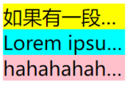

```html
<!DOCTYPE html>
<html lang="en">
<head>
    <meta charset="UTF-8">
    <title>单行文本溢出替换省略号</title>
    <style>
        div {
            background-color: yellow;
            /*限制父元素的宽度,否则文字写不下会换行,不会溢出*/
            /*且以下三句为组合代码,缺一不可!*/
            width: 200px;
            /*强制文本不换行*/
            white-space: nowrap;
            /*溢出隐藏 多余的文字直接裁掉*/
            overflow: hidden;
            /*溢出的文字替换为省略号*/
            text-overflow: ellipsis;
        }
    </style>
</head>
<body>
    <div>
        Lorem ipsum dolor sit amet, consectetur adipisicing elit. Ipsum, quo, saepe. Cum ea in numquam odio repudiandae! Aperiam, asperiores et ex in magni odit quibusdam repellat tempore temporibus ullam veniam.
    </div>
</body>
</html>
```

# DAY04笔记 JavaScript

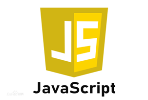

## 1. 历史与发展

* 1995 年，网景（Netscape）公司推出了 LiveScript，后改名为 JavaScript，简称 JS

* 1996 年，IE 中也开始出现了 JScript

* 1997 年，制定了 JS 的标准规范<span style="color: rgb(216,57,49); background-color: inherit"> ECMAScript</span>

* <span style="color: rgb(36,91,219); background-color: inherit">ECMAScript 这个规范一直在发展，每一年都会出新的标准规范，目前是</span>**<span style="color: rgb(216,57,49); background-color: inherit"> ES6</span>**

* 2009 年，JS 开始向后端发展，出现了 Node.js

## 2. JS 作用

* 用于给页面添加动态交互效果

* 注意：JS 与 Java 是两种完全不同的编程语言

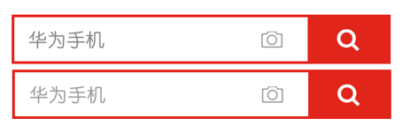

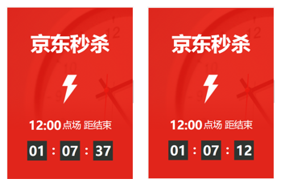


## 3. JS 语言特点

* 动态类型：JS 是一种弱类型语言，不需要指定变量类型，变量的类型在运行时会根据值自动推断&#x20;

* 解释性：JS 是一种解释型语言，不需要编译就可以直接在浏览器中运行

* 基于对象：JS 是一种基于对象的语言，它不仅可以创建对象，也能使用现有的对象

* 包含的内容有：变量、数据类型、运算符、流程控制语句、方法、对象......

## 4. 页面中引入 JS 代码的三种方式：

1. **内联（行内）写法：**

   * 位置：写在对应的 HTML 元素上

   * 作用：可以给元素添加 JS 事件代码，触发事件执行对应效果

   * 事件：指系统提供的一系列状态

     * <span style="color: rgb(36,91,219); background-color: inherit">onclick </span>点击事件，点击此元素时才会触发

     * <span style="color: rgb(36,91,219); background-color: inherit">alert（</span>666<span style="color: rgb(36,91,219); background-color: inherit">）</span> 弹出警告框&#x20;

```javascript
<button onclick="alert('请先登录!')">点击即玩</button>
```

* **内部写法：**

  * 位置：在页面任意位置添加 script 标签，在 script 标签中添加 JS 代码

  * 建议写在 body 结束标签之前！

```javascript
<script>
    //将内容输出到浏览器控制台
    console.log("Hello World!");
    console.log(d1);
</script>
```

* **外部写法：**

  * 位置：写在单独的 js 文件中，在 head 标签中添加 script 标签引入外部的 js 文件

  * 注意：若此 script 标签用于引入外部的 JS 文件，则标签中不能写 JS 代码，不会执行

```javascript
<script src="01.js">
    console.log("Hello World!666");//不会执行！
</script>
```

## 5. 变量与常量

* JS 语言是弱类型语言，声明变量不需要指定类型

* 在 JS 中，使&#x7528;**<span style="color: rgb(216,57,49); background-color: inherit"> var </span>**&#x6216;**<span style="color: rgb(216,57,49); background-color: inherit"> let </span>**&#x58F0;明变量

  * var 声明的变量，全局作用域，var声明的变量还可以重复声明

  * let 声明的变量，作用域类似Java 语言中的局部变量, 块级作用域【推荐使用】

  * 可以使用 **<span style="color: rgb(216,57,49); background-color: inherit">typeof 变量名</span>** 去查看对应的类型

* 在 JS 中,使用 **<span style="color: rgb(216,57,49); background-color: inherit">const </span>**&#x58F0;明常量,常量的值不允许被修改!

```html
<!DOCTYPE html>
<html lang="en">
<head>
    <meta charset="UTF-8">
    <title>变量与常量</title>
</head>
<body>
    <script>
        //JS是一门弱类型语言,不需要指定变量的数据类型
        //1.使用var关键字声明变量
        var a = 10;//number 整数+小数
        var b = 3.14;//number
        var c = '你好!';//string 单引+双引
        var d = "你好呀!";//string
        var e = true;//boolean true+false
        console.log(a,b,c,d,e);
        //typeof 查看变量的数据类型 根据值去推断数据类型
        console.log(typeof a,typeof b,typeof c,typeof d,typeof e);

        a = 3.14;
        console.log(a,typeof a);//可以修改值
        a = false;
        console.log(a,typeof a);//可以修改类型
        var a = '哈哈哈我又来了';
        console.log(a,typeof a);//可以重复声明

        let x = 1;
        console.log(x,typeof x);
        x= 6.6;
        console.log(x,typeof x);
        //let x = false;
        //console.log(x,typeof x);//let声明的变量不可以重复声明,报错:变量已被声明

        const y = 1;
        console.log(y,typeof y);
        //y = 343;//常量的值不允许被修改

    </script>
</body>
</html>
```

## 6. JS 常用数据类型

**原始数据类型**

* **<span style="color: rgb(36,91,219); background-color: inherit">字符串（string）</span>**：没有字符的概念，使用单引号或双引号包裹均可

* **<span style="color: rgb(36,91,219); background-color: inherit">数字（number）</span>**：包含整数与小数类型

* **<span style="color: rgb(36,91,219); background-color: inherit">布尔（boolean）</span>**：值只有 true 与 false

* **<span style="color: rgb(36,91,219); background-color: inherit">未定义（undefined）</span>**：Java 声明变量必须声明类型，但 JS 是弱类型语言，若声明变量未赋值就不清楚数据类型

* **<span style="color: rgb(36,91,219); background-color: inherit">空(null)：</span>**&#x7ED3;合后面的引用类型使用

**引用类型**

* 对象（Object）

* 数组（Array）

* 函数（Function）

```javascript
<!DOCTYPE html>
<html lang="en">
<head>
    <meta charset="UTF-8">
    <title>JS数据类型</title>
</head>
<body>
<script>
    //JS数据类型
    //原始类型 string number boolean undefined null
    var a = 1;
    var b = 6.6;
    console.log(a,typeof a);
    console.log(b,typeof b);
    var c = '下午';
    var d = "好多个字";
    console.log(c,typeof c);
    console.log(d,typeof d);
    var e = true;
    var f = false;
    console.log(e,typeof e);
    console.log(f,typeof f);

    //声明了变量,但未赋值,会得到undefined,未定义型
    var g;
    console.log(g,typeof g);//undefined 'undefined'

    //引用类型 Object Number Boolean Function Array...
    //1)定义JS对象
    let obj = {
        //属性名:属性值 多对值之间使用逗号隔开
        name:'张三',
        age:18
    };
    console.log(obj,typeof obj);//{name: '张三', age: 18} 'object'
    console.log(obj.name);//'张三'
    console.log(obj.age);//18

    obj.age = 19;//age属性存在,赋值是修改对象该属性的值
    console.log(obj.age);//19
    /* 给对象动态新增一个属性like */
    obj.like = '吃冰棍';//like属性不存在,赋值是给对象新增一个属性
    console.log(obj);
    console.log(obj.like);

    /*访问对象不存在的属性会得到undefined*/
    //如果该属性没有赋值,还是undefined
    console.log(obj.play);//undefined

    //JS数组
    let arr = ['李逵','鲁班','后羿',1,6.6,true];
    console.log(arr,typeof arr);
    console.log(arr[0]);
    console.log(arr[5]);
    console.log(arr[99]);/*访问数组不存在的下标,结果还是undefined*/
</script>
</body>
</html>
```

## 7. 运算符

### 7.1 **算术运算符：+ - \* / %**

* 除法会自动根据结果转换为整数或小数

  * Java:&#x20;

  ```java
  int x = 5; int y = 2; 
  int z = x/y 
  z=2
  ```

  * JS:&#x20;

  ```java
  let x = 5; let y = 2; 
  let z = x/y; 
  z=2.5 自动变为小数
  若x变为6：z=3 自动变为整数
  ```

### 7.2 **关系运算符：> < >= <= ！= <span style="color: rgb(216,57,49); background-color: inherit">==</span>和<span style="color: rgb(216,57,49); background-color: inherit">===</span>**

* \==：松散比较运算符：只比较等号左右两边&#x7684;**<span style="color: rgb(216,57,49); background-color: inherit">值</span>**，如："666"==666 结果为 true

* \===：严格比较运算符：先比&#x8F83;**<span style="color: rgb(216,57,49); background-color: inherit">类型</span>**，类型相同后再比&#x8F83;**<span style="color: rgb(216,57,49); background-color: inherit">值</span>**，如："666"===666 结果为 false

### 7.3 **逻辑运算符：<span style="color: rgb(216,57,49); background-color: inherit">&amp;&amp;</span>、<span style="color: rgb(216,57,49); background-color: inherit">||</span>、<span style="color: rgb(216,57,49); background-color: inherit">！</span>**

### 7.4 **赋值运算符：=  +=  -=  \*=  /=  %=**

### 7.5 **三目运算符：条件？值 1：值 2**

```html
<!DOCTYPE html>
<html lang="en">
<head>
    <meta charset="UTF-8">
    <title>JS运算符</title>
</head>
<body>
<script>
    //如果比较运算符左右两边有数字,会转为数字再进行比较
    console.log(3>10);
    console.log('3'>10);
    console.log(3>'10');
    //如果比较运算符左右两边都是字符串,会比较它们的编码值
    console.log('3'>'10');//51>49=>true
    /* '3'.charCodeAt()查看字符的编码值 */
    console.log('3'.charCodeAt());//51
    console.log('10'.charCodeAt());//49
    //console.log('超'>'博');

    //除法会按照实际结果显示结果
    console.log(6/2);//3
    console.log(3/2);//1.5

    let a = 1;
    let b = true;
    //松散比较运算符,只比较值,Number(true)=1
    console.log(a == b);//true
    //严格比较运算符,先比较类型,再比较值 number ≠ boolean
    console.log(a === b);//false

    //Number() 将参数转为数字,如果得不到数字结果,就是NaN(Not a Number)
    //Boolean()
    //以下五个特殊值转为布尔都是false
    console.log(Boolean(false));
    console.log(Boolean(0));
    console.log(Boolean(''));
    console.log(Boolean(undefined));
    console.log(Boolean(null));

    //三元运算符 1
    let c = 0;
    console.log(c==0 ? 'YES' : 'NO');//'YES'
    //=是赋值符号,给c赋值为0,Boolean(0)=false,所以取3号位置的值'NO'
    console.log(c=0 ? 'YES' : 'NO');//'NO'
</script>
</body>
</html>
```

## 8. 流程控制

### 8.1 **分支语句：（与 Java 一致）**

* **<span style="color: rgb(36,91,219); background-color: inherit">if 单分支结构</span>**

* **<span style="color: rgb(36,91,219); background-color: inherit">if-else 双分支结构</span>**

* **<span style="color: rgb(36,91,219); background-color: inherit">if-else-if 嵌套分支</span>**

### 8.2 **switch-case 选择分支**

```html
<!DOCTYPE html>
<html lang="en">
<head>
    <meta charset="UTF-8">
    <title>05JS流程控制</title>
</head>
<body>
<script>
    //1.顺序结构
    console.log(1);
    console.log(2);
    console.log(3);
    console.log(4);
    //2.分支结构
    let username = '露娜';
    if(!username){
        alert('请输入用户名!');
    }else{
        alert('欢迎'+username+'回来!')
    }
    //3.选择分支
    let gender = 777;
    switch (gender){
        case 1:
            console.log('先生');
            break;
        case 0:
            console.log('女士');
            break;
        default:
            console.log('保密');
    }
</script>
</body>
</html>
```

### 8.3 **for 循环语句**

```html
<!DOCTYPE html>
<html lang="en">
<head>
    <meta charset="UTF-8">
    <title>流程控制</title>
</head>
<body>
  <script>
//4.循环结构
let names = ['张三','李四','王五','赵六','钱七'];
for(var i = 0;i< names.length ; i++){
    console.log(names[i]);
}
//如果是用var声明的循环变量i,此处可以打印,看作全局变量
//如果是用let声明的循环变量i,此处无法使用,看作局部变量
//console.log(i);

//增强for循环
//names是当前需要遍历的集合/数组
//let n 表示本轮循环到的元素
for(let n of names){
    console.log(n);
}
  </script>
</body>
</html>
```

帮大家回忆下Java的写法：

```java
import java.util.ArrayList;

public class TestDemo {
    public static void main(String[] args) {
        ArrayList<Person> persons = new ArrayList<>();
        Person p1 = new Person("张三",3);
        Person p2 = new Person("李四",4);
        Person p3 = new Person("王五",5);
        persons.add(p1);
        persons.add(p2);
        persons.add(p3);
        //增强for循环
        for(Person p : persons){
            p.eat(p.name,p.age);
        }
    }
}
class Person {
    String name;
    int age;
    void eat(String name,int age){
        System.out.println(name+"练了"+age+"年Java");
    }
    public Person(String name, int age) {
        this.name = name;
        this.age = age;
    }
}
```

所以后面的JS循环结构也可以写成这样：

```html
<script>
var person1 ={
    name: "张三",
    say: function(name){
        console.log(name+'你好');
    }
};
var person2 ={
    name: "李四",
    say: function(name){
        console.log(name+'你好');
    }
};
var person3 ={
    name: "王五",
    say: function(name){
        console.log(name+'你好');
    }
};
var persons = [person1,person2,person3];
for(let p of persons){
    console.log(p.name)
    p.say(p.name);
}
</script>
```

## 9. 方法

**Java 语言的方法和 JavaScript 的方法对比**

* Java: **<span style="color: rgb(36,91,219); background-color: inherit">public</span>** 返回值类型 **<span style="color: rgb(100,37,208); background-color: inherit">方法名</span> <span style="color: rgb(222,120,2); background-color: inherit">（参数列表）</span>{方法体}**

* JavaScript: **<span style="color: rgb(36,91,219); background-color: inherit">function</span>** **<span style="color: rgb(100,37,208); background-color: inherit">方法名</span> <span style="color: rgb(222,120,2); background-color: inherit">（参数列表）</span>{方法体}**

**四种定义方法的方式：**

* **<span style="color: rgb(36,91,219); background-color: inherit">function </span>**&#x65B9;法&#x540D;**<span style="color: rgb(36,91,219); background-color: inherit">（</span>**&#x53C2;数列&#x8868;**<span style="color: rgb(36,91,219); background-color: inherit">）{</span>**&#x65B9;法&#x4F53;**<span style="color: rgb(36,91,219); background-color: inherit">}</span>**

* **<span style="color: rgb(36,91,219); background-color: inherit">let </span>**&#x65B9;法&#x540D;**<span style="color: rgb(36,91,219); background-color: inherit"> = function（</span>**&#x53C2;数列&#x8868;**<span style="color: rgb(36,91,219); background-color: inherit">）{</span>**&#x65B9;法&#x4F53;**<span style="color: rgb(36,91,219); background-color: inherit">}</span>**

* **<span style="color: rgb(36,91,219); background-color: inherit">const </span>**&#x65B9;法&#x540D;**<span style="color: rgb(36,91,219); background-color: inherit"> = (</span>**&#x53C2;数列&#x8868;**<span style="color: rgb(36,91,219); background-color: inherit">)=&gt;{</span>**&#x65B9;法&#x4F53;**<span style="color: rgb(36,91,219); background-color: inherit">}</span>**

* **<span style="color: rgb(36,91,219); background-color: inherit">let </span>**&#x65B9;法&#x540D;**<span style="color: rgb(36,91,219); background-color: inherit"> = new Function（</span>**"参数 1"，"参数 2"，... ,**<span style="color: rgb(36,91,219); background-color: inherit">&quot;</span>**&#x5B57;符串方法&#x4F53;**<span style="color: rgb(36,91,219); background-color: inherit">&quot;);</span>**

```html
<!DOCTYPE html>
<html lang="en">
<head>
    <meta charset="UTF-8">
    <title>06函数</title>
</head>
<body>
<script>
    //1.JS通过function关键字来定义函数
    function f1(){
        console.log('今天星期五~');
    }
    f1();//调用函数
    f1();
    f1();
    function f2(n){//函数形参不需要写类型,指定一个形参名即可
        console.log('今天星期五~'+n);
    }
    f2(333);
    f2(334);
    f2(335);

    function f3(a,b){
        console.log(a+b);
    }
    f3(1,2);
    //形参个数>实参个数,未被赋值的形参值为undefined
    f3(1);//1+undefined=NaN(Not a Number)
    //形参个数<实参个数,多余的实参会被忽略
    f3(2,2,3);//2+2=4

    //arguments用来保存调用函数时传入的实参,可以看到实参的个数和值
    function f4(){
        console.log(arguments);
    }
    f4(50);//Arguments[50, ...]
    f4(50,60);//Arguments(2)[50,60, ...]
    f4(50,60,70);//Arguments(3)[50,60,70, ...]

    //使用return关键字返回方法的结果
    function f5(a,b){
        return a+b;
    }
    console.log(f5(1,2));//直接打印return的结果
    let res = f5(2,2);//将打印结果保存在res变量里并打印
    console.log(res);

    //第二种声明方式
    let f6 = function(){
        console.log('第二种')
    }
    f6();
    console.log(typeof f6);//function
    console.log(f6);//ƒ (){console.log('第二种')}

    //第三种:箭头函数
    const f7 = (n)=>{
        console.log('第三种箭头函数'+n);
    }
    f7(666);

    //第四种
    //new Function(参数1,参数2,...,方法体)
    //最后一个参数是字符串类型的方法体
    let f8 = new Function('name','age',"console.log('方法体'+name);return age;");
    console.log(f8('小明',18));
</script>


</body>
</html>
```

# DAY05笔记 BOM\&DOM

## 1.  JavaScript 组成

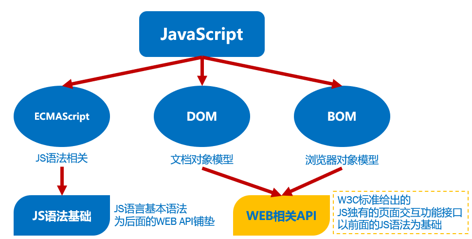

> DOM 与 BOM 的关系：
>
> <span style="color: rgb(143,149,158); background-color: inherit">DOM 的核心对象document 是 BOM中window对象的子对象</span>

## 2. DOM 操作

**<span style="color: rgb(36,91,219); background-color: inherit">DOM</span>**（**<span style="color: rgb(36,91,219); background-color: inherit">D</span>**&#x6F;cument **<span style="color: rgb(36,91,219); background-color: inherit">O</span>**&#x62;ject **<span style="color: rgb(36,91,219); background-color: inherit">M</span>**&#x6F;del）文档对象模型， 包含 W3C 规定的页面相关接口

DOM 把页面规划成节点层级构成的文档，当浏览器加载一个 WEB 页面时，就会创建这个页面的模型，称为 DOM 树。

下面是一个 DOM 树结构示例：

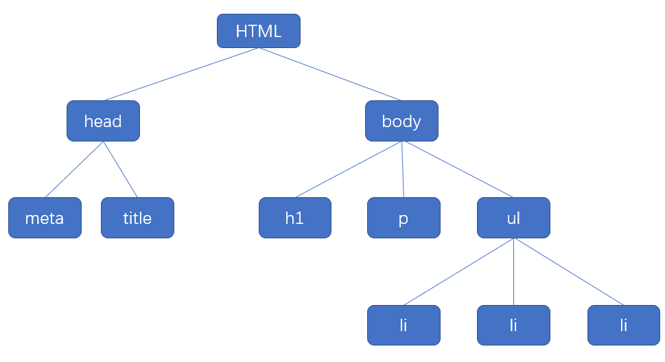

### 2.1 常用API

这些接口可以操作网页的结构、内容与样式：

**<span style="color: rgb(36, 91, 219); background-color: rgb(255, 255, 255)">创建元素对象</span>**

* let d = document.**<span style="color: rgb(36,91,219); background-color: inherit">createElement</span>**("div");

**<span style="color: rgb(36,91,219); background-color: inherit">将新元素到某个元素对象里</span>**

* 元素对象.**<span style="color: rgb(36,91,219); background-color: inherit">append</span>**（新元素）；

**<span style="color: rgb(36, 91, 219); background-color: rgb(255, 255, 255)">修改元素的属性值</span>**

* imgE.**<span style="color: rgb(36,91,219); background-color: inherit">src</span>** = "money.jpg";

**<span style="color: rgb(36, 91, 219); background-color: rgb(255, 255, 255)">通过 id 获取页面中的元素对象</span>**

* let 元素对象 = document.**<span style="color: rgb(36,91,219); background-color: inherit">getElementById</span>**('d2');

* h5 中也可以直接使用 id 值代表元素 console.log（id 值）；

**<span style="color: rgb(36, 91, 219); background-color: rgb(255, 255, 255)">通过选择器获取页面中的元素对象</span>**

* let 元素对象 = document.**<span style="color: rgb(36,91,219); background-color: inherit">querySelector</span>**（"选择器"）；

**<span style="color: rgb(36, 91, 219); background-color: rgb(255, 255, 255)">获取和修改控件的值</span>**

* 元素对象.**<span style="color: rgb(36,91,219); background-color: inherit">value</span>** 获取

* 元素对象.value="xxx" 修改

**<span style="color: rgb(36, 91, 219); background-color: rgb(255, 255, 255)">获取和修改元素的文本内容</span> 例：\<div>文本内容\</div>**

* 元素对象.**<span style="color: rgb(36,91,219); background-color: inherit">innerHTML</span>**&#x83B7;取

* 元素对象.innerHTML = “xxx” 修改

### 2.2 基础练习

```html
<!DOCTYPE html>
<html lang="en">
<head>
    <meta charset="UTF-8">
    <title>DOM操作</title>
</head>
<body>
<!--效果:每点击一次按钮,就会在页面多一张图片-->
<!--1.给按钮绑定点击事件,每点击一次,就调用一次addMoney()-->
<button onclick="addMoney()">点我变富有</button>
<script>
    //2.创建addMoney()方法
    function addMoney() {
        //3.创建一个空的img元素 
        let img = document.createElement('img');
        //4.设置img元素的属性值 
        img.src = 'img/money.jpg';
        img.width = 200;//注意没有px单位!
        //5.获取body元素,将img元素添加到body元素中
        let body = document.querySelector('body');
        body.append(img);
    }
</script>
</body>
</html>
```

```html
<!DOCTYPE html>
<html lang="en">
<head>
    <meta charset="UTF-8">
    <title>Title</title>
</head>
<body>
    <h1>我是标题:<span class="s"></span></h1>
    <input type="text" id="i1">
    <input type="text" id="i2">
    <button onclick="f1()">按钮</button>
    <script>
        let spanE = document.querySelector('.s');
        console.log(spanE);
        spanE.innerHTML = '我是span';
        let inputE1 = document.getElementById('i1');
        console.log(inputE1);
        
       function f1(){
            let inputE2 = document.querySelector('#i2');
            console.log(inputE2);
            var x = inputE1.value;
            console.log(x,typeof x);
            console.log(parseFloat(x));
        }
    </script>
</body>
</html>
```

### 2.3 计算器练习

```html
<!DOCTYPE html>
<html lang="en">
<head>
    <meta charset="UTF-8">
    <title>计算器</title>
</head>
<body>
    <input type="text" placeholder="请输入数字1" id="i1"> <br>
    <input type="text" placeholder="请输入数字2" id="i2"> <br>
    <button onclick="calc('+')">加</button>
    <button onclick="calc('-')">减</button>
    <button onclick="calc('*')">乘</button>
    <button onclick="calc('/')">除</button>
    <h4>运算结果: <span></span> </h4>

    <script>
        function calc(o){
            //获取用户在输入框中输入的值,注意input的值存在value属性里
            let n1 = document.getElementById('i1').value;
            let n2 = document.getElementById('i2').value;
            //输入框的值是string类型,需要转为number数字类型
            n1 = parseFloat(n1);
            n2 = parseFloat(n2);
            //通过标签名选择器找到span元素
            let spanE = document.querySelector('span');
            switch (o) {
                case '+' :
                    //innerHTML设置span元素中的文本内容
                    spanE.innerHTML = n1 + n2;break;
                case '-' :
                    spanE.innerHTML = n1 - n2;break;
                case '*' :
                    spanE.innerHTML = n1 * n2;break;
                case '/' :
                    if(n2!=0){
                        spanE.innerHTML = n1 / n2;
                    }else{
                        alert('除数不能为0!');
                    }
            }
        }
    </script>
</body>
</html>
```

### 2.4 DOM事件监听

可以使&#x7528;**&#x20;addEventListener('事件类型',事件处理函数)**&#x4E3A;选中的元素添加事件监听器

**常见的事件类型:**

* click 点击事件&#x20;

* mouseover 鼠标移入事件

* window.resize 监听修改窗口大小事件

* window.scroll 监听窗口滚动条滚动事件

**window 对象是JS中的一个全局对象，它代表了当前浏览器窗口,属于浏览器环境的一部分,不需要导入或者实例化就可以使用**

```html
<!DOCTYPE html>
<html lang="en">
<head>
    <meta charset="UTF-8">
    <title>03JS事件监听</title>
</head>
<body>
    <button>按钮</button>
    <h4>震惊:专家建议空腹不要吃饭!</h4>
    Lorem*50
    <script>
        /*鼠标移入事件 mouseover */
        let h4E = document.querySelector('h4');
        h4E.addEventListener("mouseover",function (){
            console.log('标题被(悬停)了!');
        });
        /*点击事件 click */
        let buttonE = document.querySelector('button');
        //给按钮元素绑定监听事件,只要点击,就会触发function中的代码
        buttonE.addEventListener("click",function (){
            alert('按钮被点击了!');
        });
        /*window是DOM自带的对象,它是一个全局对象,代表了当前浏览器窗口
        resize监听修改窗口大小事件
        scroll监听窗口滚动条滚动事件 */
        window.addEventListener("resize",function (){
            alert('窗口被重设大小了!');
        });
        window.addEventListener("scroll",function (){
            alert('窗口的滚动条滚动了!');
        });
    </script>
</body>
</html>
```

### 2.5 猜数字案例

```html
<!DOCTYPE html>
<html lang="en">
<head>
    <meta charset="UTF-8">
    <title>04猜数字</title>
</head>
<body>
<h3>已生成一个1~100之间随机整数:</h3>
<input type="text" placeholder="请输入你猜的数字">
<button onclick="guess()">点我验证</button>
<h3>小提示: <span></span> </h3>

<script>
    //1.生成随机数 [0,100)+1=[1,101)
    let r = parseInt(Math.random()*100)+1;
    console.log('打个小抄:'+r);
    //定义变量用来保存猜的次数
    let count = 0;
    function guess(){
        let n = document.querySelector('input').value;
        if(isNaN(n)){
            alert('请输入数字!');
            return;
        }
        //获取用来显示结果的span元素
        let spanE = document.querySelector('span');
        //每猜一次,次数+1
        count++;
        if(n>r){
            spanE.innerHTML = '猜大了';
        }else if(n<r){
            spanE.innerHTML = '猜小了';
        }else{
            spanE.innerHTML = '恭喜你用了'+count+'次就猜对了!';
        }
    }
</script>

</body>
</html>
```

### 2.6 员工表格练习

```html
<!DOCTYPE html>
<html lang="en">
<head>
    <meta charset="UTF-8">
    <title>员工表格练习</title>
</head>
<body>
<input type="text" placeholder="请输入员工姓名" id="i1">
<input type="text" placeholder="请输入员工工资" id="i2">
<input type="text" placeholder="请输入员工岗位" id="i3">
<button onclick="addEmp()">添加员工</button>
<hr>
<table border="1">
    <caption>员工表</caption>
    <tr>
        <th>姓名</th>
        <th>工资</th>
        <th>岗位</th>
    </tr>
</table>

<script>
    //创建函数,点击按钮时调用
    function addEmp(){
        //获取三个输入框中输入的数据
        let uName = document.getElementById("i1").value;
        let uSalary = document.getElementById("i2").value;
        let uJob = document.getElementById("i3").value;
        //创建对应的tr与3个td元素
        let tr = document.createElement("tr");
        let nameTd = document.createElement("td");
        let salaryTd = document.createElement("td");
        let jobTd = document.createElement("td");
        //把获取到的数据填充到单元格中
        nameTd.innerHTML = uName;
        salaryTd.innerHTML = uSalary;
        jobTd.innerHTML = uJob;
        //把准备好的3个td装到tr里
        tr.append(nameTd,salaryTd,jobTd);
        //把准备好的这一行数据tr对象装入table中
        let table = document.querySelector("table");
        table.append(tr);
        //每个输入框的数据用完以后需要清空
        document.getElementById("i1").value = "";
        document.getElementById("i2").value = "";
        document.getElementById("i3").value = "";
    }
</script>

</body>
</html>
```

### 2.7 商品表格练习

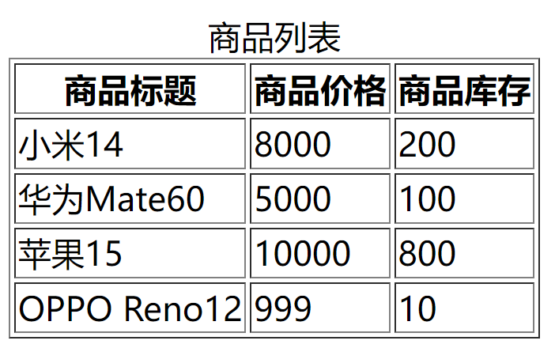

```html
<!DOCTYPE html>
<html lang="en">
<head>
    <meta charset="UTF-8">
    <title>06自定义JS对象</title>
</head>
<body>
<table border="1px">
    <caption>商品表</caption>
    <tr>
        <th>商品名称</th>
        <th>商品价格</th>
        <th>商品库存</th>
    </tr>
</table>

<script>
    //3.定义一个数组,存放多个商品对象
    let productArr = [
        {title:"小米14",price:8000,num:200},
        {title:"华为Mate60",price:5000,num:100},
        {title:"苹果16",price:10000,num:700},
        {title:"魅族",price:2000,num:600}
    ];
    console.log(productArr);
    console.log(productArr[2]);

    let tableE = document.querySelector('table');
    //遍历上方的商品数组,有几件商品,创建几行表格数据
    for(let i = 0; i<productArr.length; i++){
        let trE = document.createElement('tr');
        let titleTd = document.createElement('td');
        let priceTd = document.createElement('td');
        let numTd = document.createElement('td');
        //给创建出来的三个单元格赋值,当前遍历到的商品的对应属性值
        titleTd.innerHTML = productArr[i].title;
        priceTd.innerHTML = productArr[i].price;
        numTd.innerHTML = productArr[i].num;
        trE.append(titleTd,priceTd,numTd);
        tableE.append(trE);
    }

    //1.实例化一个自带属性与方法的对象
    let p1 = {
        name:'张三',
        age:18,
        say:function(){
            console.log('hello,我是'+this.name);
        }
    };
    console.log(p1);
    p1.say();

    //2.先定义一个空对象,再动态添加属性与方法
    let p2 = {};
    p2.name = '李四';
    p2.age = 20;
    p2.eat = function(){
        console.log(this.name+'正在吃东西...');
    }
    console.log(p2);
    p2.eat();
</script>
</body>
</html>
```

### 2.8 个人简介练习

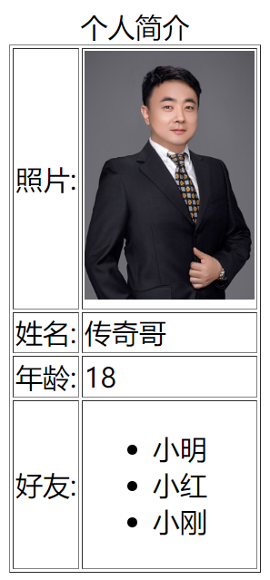

```html
<!DOCTYPE html>
<html lang="en">
<head>
    <meta charset="UTF-8">
    <title>07个人简历练习</title>
</head>
<body>
<table border="1px">
    <caption>个人简介</caption>
    <tr>
        <td>照片:</td>
        <td id="pic_td"></td>
    </tr>
    <tr>
        <td>姓名:</td>
        <td id="name_td"></td>
    </tr>
    <tr>
        <td>年龄:</td>
        <td id="age_td"></td>
    </tr>
    <tr>
        <td>好友:</td>
        <td id="friends_td"></td>
    </tr>
</table>
<script>
    let person = {
        name:'传奇哥',
        age:18,
        friends:['小明','小红','小刚'],
        imgUrl:'img/fcq.jpg'
    };
    //根据id依次获取四个单元格元素
    let picTd = document.getElementById('pic_td');
    let nameTd = document.getElementById('name_td');
    let ageTd = document.getElementById('age_td');
    let friendsTd = document.getElementById('friends_td');
    //将对象的指定属性值装入单元格中
    nameTd.innerHTML = person.name;
    ageTd.innerHTML = person.age;
    //需要创建一个图片对象
    let imgE = document.createElement('img');
    imgE.src = person.imgUrl;
    imgE.width = 100;
    //注意:需要把图片元素放入对应的单元格中,不能用innerHTML!!!
    picTd.append(imgE);
    //页面没有无序列表,需要创建
    let ulE = document.createElement('ul');
    //遍历好友数组,有几位好友,ul中就有几个li
    for(let i=0;i<person.friends.length;i++){
        //遍历几次,就生成几个li
        let liE = document.createElement('li');
        //将本轮遍历到的好友名字放入li中
        liE.innerHTML = person.friends[i];
        //将li放入ul中
        ulE.append(liE);
    }
    //将ul放入好友单元格中
    friendsTd.append(ulE);
</script>
</body>
</html>
```

## 3. BOM 操作

**<span style="color: rgb(36,91,219); background-color: inherit">BOM</span>**（**<span style="color: rgb(36,91,219); background-color: inherit">B</span>**&#x72;owser **<span style="color: rgb(36,91,219); background-color: inherit">O</span>**&#x62;ject **<span style="color: rgb(36,91,219); background-color: inherit">M</span>**&#x6F;del）浏览器对象模型，是 JavaScript 与浏览器之间进行交互的接口

BOM 提供了一组对象，这些对象代表着浏览器相关内容，并提供了访问和控制这些对象的方法

以下是一些常见的 BOM 对象：

* window&#x20;

* location&#x20;

* history&#x20;

**<span style="color: rgb(36,91,219); background-color: inherit">window 对象</span>**

window 对象是 JavaScript 中表示当前浏览器窗口的内置全局对象

它包含了浏览器窗口的所有属性和方法，可以通过该对象来访问和控制当前窗口的各种行为

* <span style="color: rgb(36,91,219); background-color: inherit">isNaN（变量）</span> 判断变量是否是 NaN

* <span style="color: rgb(36,91,219); background-color: inherit">parseInt（）</span> 将字符串或小数转成整数

* <span style="color: rgb(36,91,219); background-color: inherit">parseFloat（） </span>将字符串转成小数

* <span style="color: rgb(36,91,219); background-color: inherit">alert（&quot;xxx&quot;） </span>弹出提示框

* <span style="color: rgb(36,91,219); background-color: inherit">confirm（&quot;xxx&quot;） </span>弹出确认框

* <span style="color: rgb(36,91,219); background-color: inherit">prompt（&quot;xxx&quot;） </span>弹出输入对话框

```html
<button onclick="alert('警告框')">弹出警告框</button>
<button onclick="confirm('您确认要删除吗?')">弹出确认框</button>
<button onclick="prompt('请输入会员卡号:')">弹出提示输入框</button>
```

**<span style="color: rgb(36,91,219); background-color: inherit">location 对象</span>**

* location<span style="color: rgb(36,91,219); background-color: inherit">.href</span> 获取或修改浏览器的请求地址

* location<span style="color: rgb(36,91,219); background-color: inherit">.reload() </span> 刷新页面

* location.search 获取查询字符串参数 http://localhost:8080/v1/user?<span style="color: inherit; background-color: rgba(255,246,122,0.8)">id=219</span>

**<span style="color: rgb(36, 91, 219); background-color: rgb(255, 255, 255)">history 对象</span>**

* history<span style="color: rgb(36,91,219); background-color: inherit">.length</span> 历史页面的数量

* history<span style="color: rgb(36,91,219); background-color: inherit">.back() </span>返回上一页面 后退

* hisotry<span style="color: rgb(36,91,219); background-color: inherit">.forward() </span>前往下一页面 前进

* history<span style="color: rgb(36,91,219); background-color: inherit">.go(n)</span> 正值代表前进n个页面 负值代表后退n个页面

  * history.go(0) 表示刷新页面

  * history<span style="color: rgb(36,91,219); background-color: inherit">.go(-1) 表示回退一个页面,注意如果是第一个页面,无法回退</span>

  * history<span style="color: rgb(36,91,219); background-color: inherit">.go(2) 表示前进两个页面,注意如果是最后一个页面,无法前进</span>

## 4. VUE 和 VUE-Cli

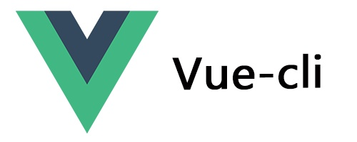

* **<span style="color: rgb(36,91,219); background-color: inherit">VUE </span>**&#x662F;一种流行的渐进式JavaScript框架，用于构建Web用户界面

* 它具有易学、轻量级、灵活性强、高效率等特点，并且可以与其他库和项目集成

* 是目前最流行的前端框架之一

* **<span style="color: rgb(100,37,208); background-color: inherit">VUE-Cli </span>**&#x79F0;为“VUE脚手架”,它是由VUE官方提供的客户端，专门为单页面应用快速搭建的脚手架

* 使用它可以轻松的创建新的应用程序，而且可以自动生成vue和webpack工程模板

### &#x20;**[ VUE安装操作手册](https://d1ibml5ydvp.feishu.cn/docx/JLIDdDzDlot9lExkCLzc5D9jnA9?from=from_copylink)&#x20;**（详细操作步骤点这里）

1. 查看npm与vue脚手架版本

2. 若npm源不正确,**使用命令配置npm源：**

**<span style="color: inherit; background-color: rgba(255,246,122,0.8)">npm config set registry </span> <span style="color: inherit; background-color: rgba(255,246,122,0.8)">https://registry.npmmirror.com</span>**

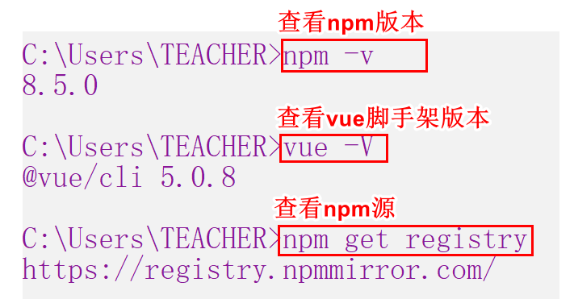

## 5. 今日作业

1. 在cmd中创建vue项目 vue-project-01

2. 在IDEA的Terminal 创建vue项目 v1

3. 确保在浏览器可以看到vue项目的界面

**操作笔记后面的不用动!后面会讲!!!**


# DAY06笔记 VUE

## 1. 前端工程分类

前端工程分为单页面架构和多页面架构

1. **<span style="color: rgb(36, 91, 219); background-color: rgb(255, 255, 255)">多页面架构（传统方案）：</span>**

指工程中存在多个\*.html 文件，每一个页面对应一个 html 文件

* **<span style="color: rgb(36, 91, 219); background-color: rgb(255, 255, 255)">单页面架构（VUE 脚手架工程）：</span>**

指工程中只有一个 html 页面文件，通过一个 html 页面中的内容改变实现多页面的效果

每个页面至少对应一个\*.vue 文件

用户的URL只对应一个页面，我们可以随时替换这个页面的内容，方便更新

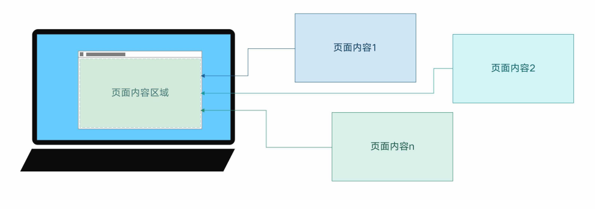

每个页面可以由多个部分组成，每个部分都可以按需替换

局部替换的做法，也反向实现了页面某些部分的"复用"

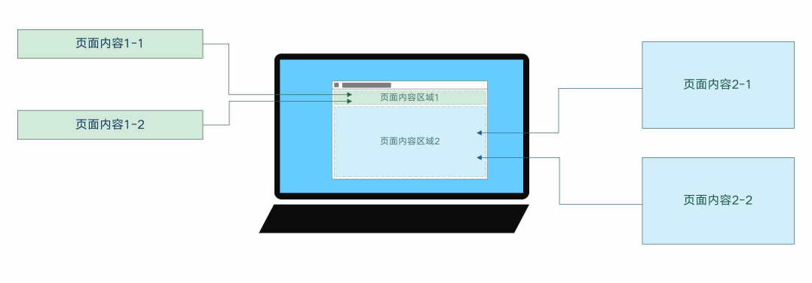

**注意：**

1. html 文件是页面全部内容，vue 文件可能是页面的一个部分，也能是页面的所有内容

2. 两种方式对用户体验没有影响，不论哪种方式在用户端是一样的

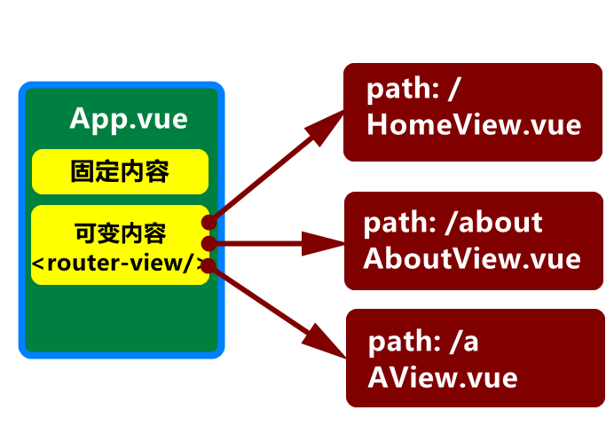

## 2. IDEA工具VUE工程初始化

1. **确保IDEA中有vue插件**

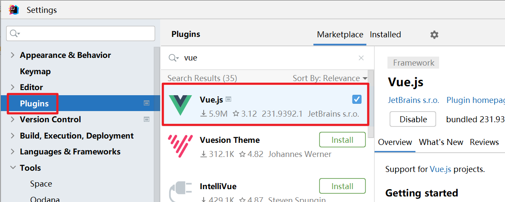

* **通过 IDEA 的 Terminal 工具，在工程的根目录下，执行<span style="color: inherit; background-color: rgba(255,246,122,0.8)"> vue create 工程名 </span>来创建工程**

* **通过<span style="color: inherit; background-color: rgba(255,246,122,0.8)"> cd 工程名 </span>指令 进入到创建的 vue 工程目录下**

* **启动工程：<span style="color: inherit; background-color: rgba(255,246,122,0.8)"> npm run serve </span>&#x20;**

* **停止工程：<span style="color: inherit; background-color: rgba(255,246,122,0.8)">Ctrl+C</span> 输入<span style="color: inherit; background-color: rgba(255,246,122,0.8)"> Y</span> 回车**

* **修改端口号：在 package.json 文件的第 6 行修改：**

```javascript
"serve": "vue-cli-service serve --port 9090",
```

## 3. VUE项目工程结构解析

项目中需要大家关注的主要内容：

1. **<span style="color: rgb(36, 91, 219); background-color: rgb(255, 255, 255)">public 文件夹</span>**：里面存放静态资源文件，如：图片/视频等

2. **<span style="color: rgb(36, 91, 219); background-color: rgb(255, 255, 255)">src/router/index.js</span>**：路由配置文件，在里面配置请求地址和 VUE 组件的映射关系

3. **<span style="color: rgb(36, 91, 219); background-color: rgb(255, 255, 255)">src/views</span>**：在里面创建对应每个页面的\*.vue 文件

4. **<span style="color: rgb(36, 91, 219); background-color: rgb(255, 255, 255)">App.vue</span>**：此组件工程启动后自动挂载到 index.html 页面的组件，可以理解为工程的入口

5. **<span style="color: rgb(36, 91, 219); background-color: rgb(255, 255, 255)">main.js</span>**：当需要引入其他框架或对进行配置时使用此文件

6. **<span style="color: rgb(36, 91, 219); background-color: rgb(255, 255, 255)">package.json</span>**：修改端口号

## 4. 新view.vue 的创建方式

1. **在 v1/src/App.vue中添加新view文件的router-link链接**

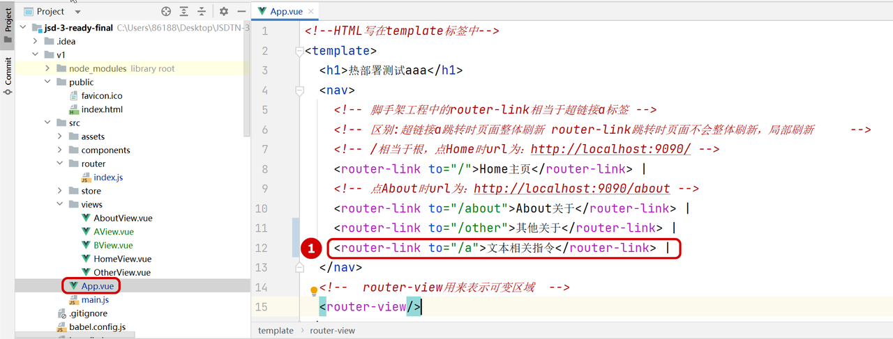

* **在v1/src/views文件夹下创建一个新的VueComponent(也就是.vue文件)**

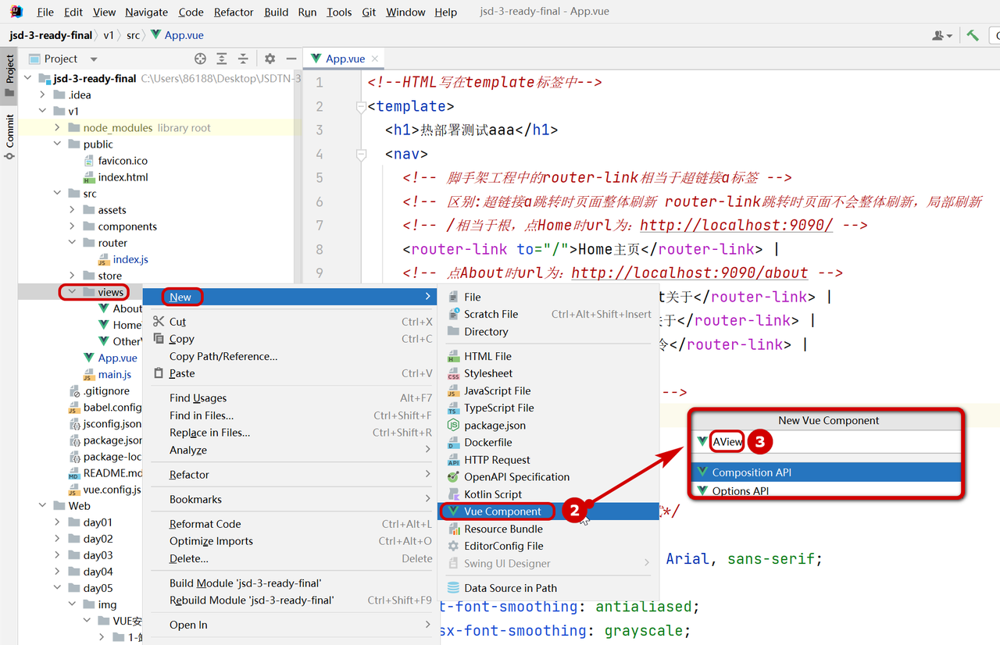

* **编写新创建好的.vue文件**

  1. **template标签中放的是HTML**

  2. **style标签中放的是CSS**

  3. **script标签中放的是JS**

**注意:vue3的script开始标签中必须要有<span style="color: rgb(36,91,219); background-color: inherit">setup</span>,否则代码不生效！**

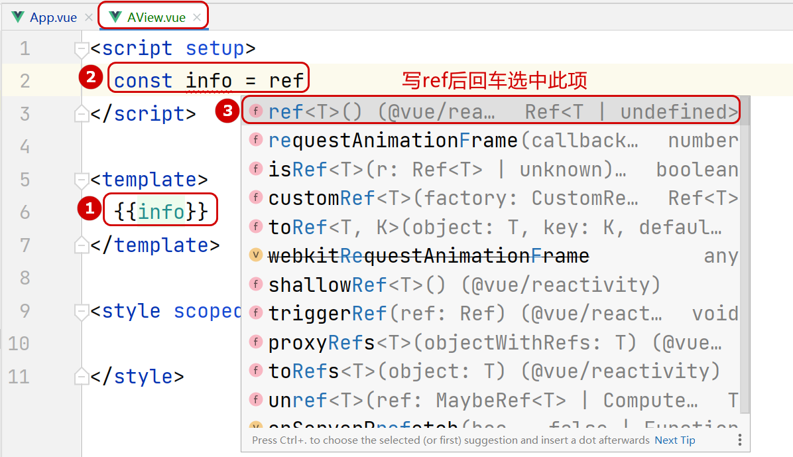

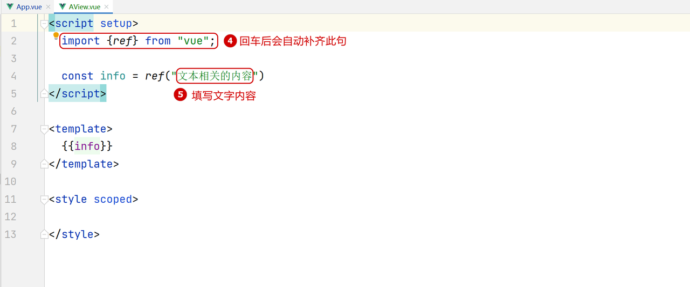

* **还需要在v1/src/router/index.js文件中配置路由跳转的路径**

  1. **path就是App.vue中router-link标签中to属性的值**

  2. **箭头函数加载的就是对应的.vue文件的路径**

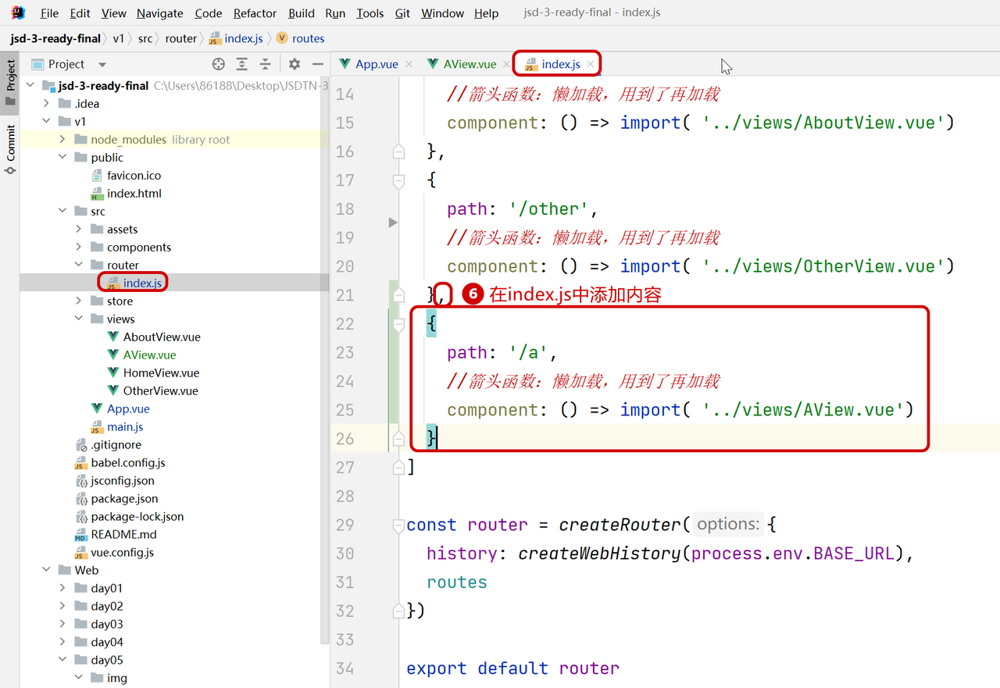

* **写完可以启动项目访问：http://localhost:9090/ 进行测试，如果看到了下图所示的内容，则表明配置成功了**

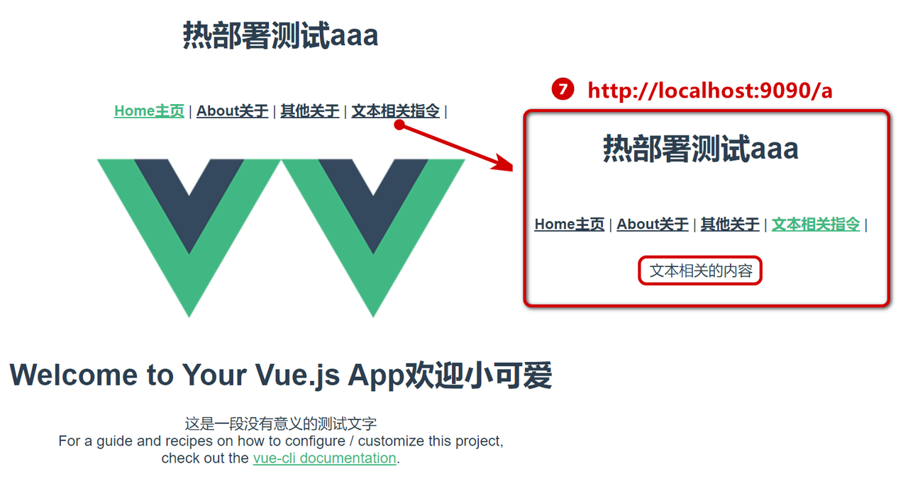

## 5. MVC 与 MVVM

**<span style="color: rgb(216,57,49); background-color: inherit">M</span> <span style="color: rgb(46,161,33); background-color: inherit">V</span> <span style="color: rgb(36,91,219); background-color: inherit">C </span>**&#x8BBE;计模式就是将实现前端业务的所有代码划分为三部分

* **<span style="color: rgb(216,57,49); background-color: inherit">M</span>**: <span style="color: rgb(216,57,49); background-color: inherit">Model</span> 模型 ， 对应数据相关代码

* **<span style="color: rgb(46,161,33); background-color: inherit">V</span>**: <span style="color: rgb(46,161,33); background-color: inherit">View </span>视图， 对应的是页面标签相关

* **<span style="color: rgb(36,91,219); background-color: inherit">C</span>**: <span style="color: rgb(36,91,219); background-color: inherit">Controller </span>控制器， 对应的是将数据显示到页面中的过程代码

**MVC 设计模式的弊端：&#x20;**&#x43;ontroller 需要频繁的进行 DOM 相关操作（遍历查找元素），比较浪费资源&#x20;

MVVM 设计模式就很好的解决了这个问题：

**<span style="color: rgb(216,57,49); background-color: inherit">M</span> <span style="color: rgb(46,161,33); background-color: inherit">V</span> <span style="color: rgb(36,91,219); background-color: inherit">VM </span>**&#x8BBE;计模式也是将实现前端业务的所有代码划分为三部分

* **<span style="color: rgb(216,57,49); background-color: inherit">M</span>**: <span style="color: rgb(216,57,49); background-color: inherit">Model</span> 模型 ， 对应数据相关代码(数据)

* **<span style="color: rgb(46,161,33); background-color: inherit">V</span>**: <span style="color: rgb(46,161,33); background-color: inherit">View</span> 视图， 对应的是页面标签相关(页面)

* **<span style="color: rgb(36,91,219); background-color: inherit">VM</span>**:<span style="color: rgb(36,91,219); background-color: inherit">ViewModel</span> 视图模型，直接将页面元素与变量进行绑定

  * 视图模型负责将页面中可能发生改变的元素和某个变量在内存中进行绑定&#x20;

  * 对变量进行监听，当变量发生改变时，会从内存中找到和变量所对应的元素， 让元素进行改动&#x20;

这样就不用像 MVC 设计模式中通过遍历查找的方式查找元素了，大大提高了执行的效率


## 6. VUE指令练习

### 6.1 文本相关指令练习 AView.vue

1. **<span style="color: rgb(36,91,219); background-color: inherit">const info =</span> <span style="color: rgb(36,91,219); background-color: rgba(255,246,122,0.8)"> ref(</span> <span style="color: rgb(36,91,219); background-color: inherit">&quot;文本相关的内容&quot;</span> <span style="color: rgb(36,91,219); background-color: rgba(255,246,122,0.8)">)</span> <span style="color: rgb(36,91,219); background-color: inherit">; </span>**&#x5B9A;义响应式变量,注意需要导入！

2. **<span style="color: rgb(36,91,219); background-color: rgba(255,246,122,0.8)">{{变量}}</span> <span style="color: rgb(36,91,219); background-color: inherit"> </span>**&#x63D2;值，让此处的文本内容与变量进行绑定

* **<span style="color: rgb(36,91,219); background-color: inherit">v-text=&quot;</span>**&#x54CD;应式变量&#x540D;**<span style="color: rgb(36,91,219); background-color: inherit">&quot;</span>**：将文本内容与变量进行绑定

* **<span style="color: rgb(36,91,219); background-color: inherit">v-html=&quot;</span>**&#x54CD;应式变量&#x540D;**<span style="color: rgb(36,91,219); background-color: inherit">&quot;</span>**：将标签内容与变量进行绑定

- **<span style="color: rgb(36,91,219); background-color: inherit">关于写法:</span>**

  1. **响应式变量的导入语句:<span style="color: rgb(36,91,219); background-color: inherit"> import {</span>*<span style="color: rgb(36,91,219); background-color: inherit">ref</span>*<span style="color: rgb(36,91,219); background-color: inherit">} from &quot;vue&quot;;</span>**

  2. **在JS代码中使用响应式变量: console.log(info<span style="color: rgb(36,91,219); background-color: inherit">.value</span>);**

  3. **箭头函数: const f = <span style="color: rgb(36,91,219); background-color: inherit">(</span>参数列表<span style="color: rgb(36,91,219); background-color: inherit">)=&gt;{</span>方法体<span style="color: rgb(36,91,219); background-color: inherit">}</span>**

```html
<template>
  <h1>我是第一个页面</h1>
  <!-- 插值指令:将页面显示的文本与响应式变量的值进行绑定
  如果修改变量的值，页面显示的文本也会随之改变-->
  <span>{{info}}</span>
  <p>{{info}}</p>
  <h1>{{info}}</h1>
  <!-- 响应式变量的值还可以拼接 -->
  {{info+'大家好呀！'}}
  <hr>
  <p v-text="info"></p> <!-- v-text渲染文本内容-->
  <p v-html="info"></p> <!-- v-html若有html元素，会按照元素效果进行渲染-->
  <button @click="f">点我</button> <!-- 点击事件@click -->
</template>

<script setup>
import {ref} from "vue";
//1.定义响应式变量,注意:必须导入！
const info = ref('我是info666');
//2.箭头函数
const f = ()=>{
  info.value = '我是<mark>info2</mark>';//在JS中使用响应式变量的值，必须.value!!!
}

</script>

<style scoped>

</style>
```

### 6.2 属性绑定练习 BView.vue

* **<span style="color: rgb(36,91,219); background-color: inherit">v-bind:属性名=&quot;变量名&quot; </span>**&#x20;

* 让HTML元素的 xxx 属性的值与变量值进行绑定

* 可以简写&#x6210;**<span style="color: rgb(36,91,219); background-color: rgba(255,246,122,0.8)"> :属性名=&quot;变量名&quot; </span>**

```html
<template>
  <h1>属性绑定练习</h1>
  <input type="text" value="kk"> <!--输入框默认值设置为kk-->
  <input type="text" value="info"> <!--输入框默认值设置为info-->
  <input type="text" v-bind:value="info"> <!--输入框value属性与响应式变量info绑定-->
  <input type="text" :value="info"> <!--属性绑定可以简写 去掉前面的v-bind-->
  <hr>
  <a href="url">超链接1</a>
  <a :href="url">超链接2</a>
</template>
<script setup>
import {ref} from "vue";

const info = ref('属性绑定999')

const url = ref('https://www.jd.com')
url.value = 'https://www.baidu.com';
</script>

<style scoped>

</style>
```

### 6.3 双向绑定练习 CView.vue

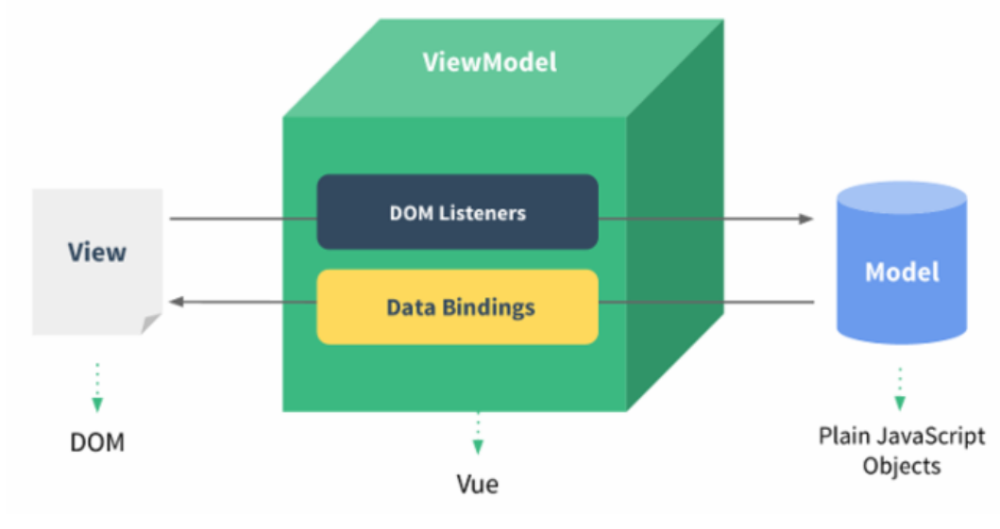

1. **<span style="color: rgb(36,91,219); background-color: rgba(255,246,122,0.8)">双向绑定</span>**：页面中的内容发生改变，变量的值也会随之改变

2. **<span style="color: rgb(36,91,219); background-color: rgba(255,246,122,0.8)">v-model=&quot;</span>**<span style="color: rgb(36,91,219); background-color: rgba(255,246,122,0.8)">变量名</span>**<span style="color: rgb(36,91,219); background-color: rgba(255,246,122,0.8)">&quot;</span>**  除了这个其他都是单向绑定

3. 当需要获取用户输入的内容时使用（输入框/单选/多选/下拉选框等）

* 之前 DOM 操作需要先获取 html 元素，再获取 html 元素的值，效率较低

* 现在使用 MVVM 的方式：当页面的值发生改变，变量保存的值也会立即随之改变，可以直接使用

* 双向绑定的数据会实时更新，但注意用户输入也会影响绑定的数据

```html
<template>
  <h1>双向绑定指令</h1>
  {{info}}
  <input type="text" :value="info">
  <hr>
  <!-- 双向绑定:将页面与下方变量info进行绑定
   1)info变量的值会显示在绑定的html元素上
   2)页面html元素发生改变,绑定的info变量的值也会随之改变-->
  <input type="text" v-model="info">
  <h3>登录页面</h3>
  <input type="text" placeholder="请输入用户名" v-model="user.username">
  <input type="password" placeholder="请输入密码" v-model="user.password">
  <br>
  性别:
  <input type="radio" name="gender" value="1" v-model="user.gender">男
  <input type="radio" name="gender" value="0" v-model="user.gender">女
  <button @click="f()">登录</button>
</template>

<script setup>
import {ref} from "vue";
const info = ref('测试数据');
const user = ref({username:'tom',password:'123',gender:"0"})
const f = ()=>{
  console.log(user.value);
  console.log(user.value.username);
  console.log(user.value.password);
  console.log(user.value.gender);
}
</script>

<style scoped>

</style>
```

### 6.4 事件绑定练习 DView.vue

* **<span style="color: rgb(36,91,219); background-color: rgba(255,246,122,0.8)">@click=&quot;f()&quot;</span>** 与 **<span style="color: rgb(36,91,219); background-color: inherit">v-on:click=&quot;</span>**&#x66;()**<span style="color: rgb(36,91,219); background-color: inherit">&quot;</span>** 都是绑定点击事件

* **<span style="color: rgb(36,91,219); background-color: inherit">@keydown.enter=&quot;</span>**&#x65;nt()**<span style="color: rgb(36,91,219); background-color: inherit">&quot;</span>** 表示绑定敲回车事件

```html
<template>
  <h1>事件绑定指令</h1>
  <!-- 下面两种写法是等价的,我们一般用第2种 -->
  <button v-on:click="f()">按钮</button>
  <button @click="f()">按钮2</button>

  <h3>敲回车事件</h3>
  <input type="text" placeholder="请搜索你喜欢的影片"
         @keydown.enter="ent()" v-model="search">
</template>

<script setup>
import {ref} from "vue";
const search = ref('');
const ent = ()=>{
  alert('您想搜索的内容是:'+search.value);
}

const f = ()=>{
  alert('点击了!');
}
</script>

<style scoped>

</style>
```

### 6.5 循环指令练习 EView.vue

* **<span style="color: rgb(36,91,219); background-color: inherit">v-for=&quot;元素 in 数组&quot;  </span>**&#x904D;历数组 遍历时会生成当前遍历到的元素

* **<span style="color: rgb(36,91,219); background-color: inherit">v-for=&quot;元素 in 数字n&quot;  </span>**&#x904D;历数组 从1到数字n，步长为1，数字n可以自定义

* **<span style="color: rgb(36,91,219); background-color: inherit">v-for=&quot;(元素,下标) in 数组&quot;  </span>**&#x7B2C;2个参数是当前遍历到的元素下标，从0开始

```html
<template>
  <h1>循环指令</h1>
  <ul>
    <!-- 循环遍历arr数组,uname就是本轮循环遍历到的元素 -->
    <li v-for="uname in arr">{{uname}}</li>
  </ul>
  <ol>
    <!-- 从1开始遍历,一直到数字5,固定每次++,结束数字5可以自定义 -->
    <li v-for="item in 5">{{item}}</li>
  </ol>
  <table border="1px">
    <caption>商品列表</caption>
    <tr>
      <th>序号</th>
      <th>商品名称</th>
      <th>商品价格</th>
      <th>商品库存</th>
      <th>操作</th>
    </tr>
    <tr v-for="(item,index) in productArr">
      <td>{{index+1}}</td>
      <td>{{item.title}}</td>
      <td>{{item.price}}</td>
      <td>{{item.num}}</td>
      <td><button @click="del(index)">删除</button></td>
    </tr>
  </table>
</template>

<script setup>
import {ref} from "vue";

const arr = ref(["张三","李四","王五","赵六","钱七"]);

const productArr = ref([
  {title:'小米手机',price:5000,num:800},
  {title:'华为手机',price:6000,num:900},
  {title:'苹果手机',price:7000,num:100},
  {title:'OPPO手机',price:8000,num:200},
]);

const del = (index)=>{
  if(confirm('您确认要删除此条数据吗?')){
    //删除数组中的元素,从当前index开始,删1个元素
    productArr.value.splice(index,1);
  }
}
</script>

<style scoped>

</style>
```

### 6.6 隐藏显示指令练习 FView.vue

**<span style="color: rgb(36,91,219); background-color: rgba(255,246,122,0.8)">v-if=&quot;变量&quot;</span>**：控制元素是否显示

* true 显示，false 不显示

* 直接在DOM中跳过该元素渲染,HTML代码中没有该元素

* 元素首次渲染需要复杂计算或初始化,v-if初次加载的速度快,推荐使用

**<span style="color: rgb(36,91,219); background-color: rgba(255,246,122,0.8)">v-else</span>：** 和最近的未关闭的 v-if 状态取反

**<span style="color: rgb(36,91,219); background-color: rgba(255,246,122,0.8)">v-show=&quot;变量&quot;</span>**：控制元素是否显示

* true 显示，false 不显示（隐藏元素）

* 通过设置CSS display:none;让元素消失

* 当元素需要频繁修改显示状态时推荐使用,不用多次新建删除元素,开销较小

```html
<template>
  <h1>隐藏显示指令</h1>
  <!-- v-if="布尔值" true元素显示 false元素消失
  false表示该元素不会被渲染到DOM中,会直接跳过这部分内容的渲染 -->
  <p v-if="true">张三</p>
  <p v-if="false">李四</p>
  <p>王五</p>
  <hr>
  <p v-if="isShow">月亮</p>
  <p v-if="isShow">星星</p>
  <!-- v-else是v-if取反 它会找离自己最近的v-if进行取反 -->
  <p v-else>太阳</p>
  <hr>
  <!-- v-if是直接在DOM中跳过该元素渲染,HTML代码中没有该元素 -->
  <p v-if="false">小绿</p>
  <!-- v-show是修改元素的CSS属性display:none;在频繁切换是否显示时才推荐,性能更好 -->
  <p v-show="false">小红</p>
</template>

<script setup>
import {ref} from "vue";

const isShow = ref(false);
</script>

<style scoped>

</style>
```

### 6.7 计算器练习 GView.vue

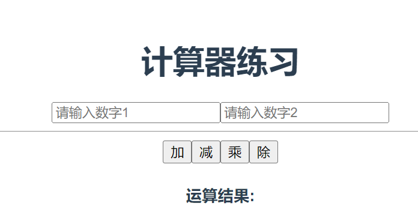

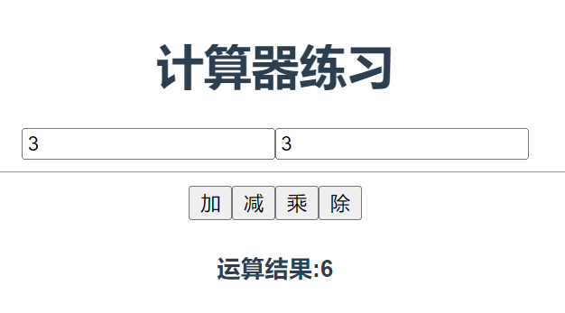

```html
<template>
  <h1>计算器练习</h1>
  <input type="text" placeholder="请输入数字1" v-model="a"/>
  <input type="text" placeholder="请输入数字2" v-model="b"/>
  <hr>
  <button @click="calc('+')">加</button>
  <button @click="calc('-')">减</button>
  <button @click="calc('*')">乘</button>
  <button @click="calc('/')">除</button>
  <h4>运算结果:{{result}}</h4>
</template>

<script setup>
import {ref} from "vue";
//定义响应式变量
const a = ref('');
const b = ref('');
const result = ref('');
//定义箭头函数
const calc = (o)=>{
  //响应式变量在JS中使用必须.value!
  //eval("5*2") 结果为10 将字符串形式的算式转为JS进行运算
  result.value = eval(a.value+o+b.value);
}
</script>

<style scoped>

</style>
```

### 6.8 猜数字练习 HView.vue

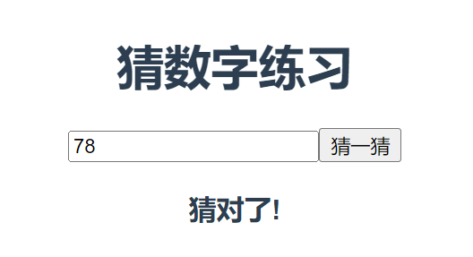

```html
<template>
  <h1>猜数字练习</h1>
  <input type="text" placeholder="请输入1~100之间的整数" v-model="num">
  <button @click="guess()">猜一猜</button>
  <h3>{{result}}</h3>
</template>

<script setup>
import { ref } from 'vue';
const num = ref('');
const result = ref('');
//生成一个随机数
let x = parseInt(Math.random()*100)+1;
console.log(x);
const guess = ()=>{
  if(num.value>x){
    result.value='猜大了';
  }else if(num.value<x){
    result.value='猜小了';
  }else{
    result.value='猜对了';
  }
}
</script>

<style scoped>

</style>
```

### 6.9 员工列表练习 IView.vue

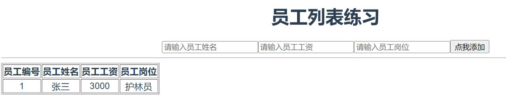

```html
<template>
  <h1>员工列表练习</h1>
  <input type="text" placeholder="请输入员工姓名" v-model="e.name">
  <input type="text" placeholder="请输入员工工资" v-model="e.salary">
  <input type="text" placeholder="请输入员工岗位" v-model="e.job">
  <button @click="add()">点我添加</button>
  <hr>
  <table border="1px">
    <tr>
      <th>员工编号</th>
      <th>员工姓名</th>
      <th>员工工资</th>
      <th>员工岗位</th>
    </tr>
    <tr v-for="(emp,i) in arr">
      <td>{{i+1}}</td>
      <td>{{emp.name}}</td>
      <td>{{emp.salary}}</td>
      <td>{{emp.job}}</td>
    </tr>
  </table>
</template>

<script setup>
import {ref} from "vue";

const e = ref({name:'',salary:'',job:''});
const arr = ref([]);
const add = ()=>{
  //如果输入框有空值,不允许新增!
  if(e.value.name.trim()=='' || e.value.salary.trim()=='' || e.value.job.trim()==''){
    alert('请输入完整信息');
    return;
  }
  //每准备好一个员工数据，就存入arr数组中
  arr.value.push(e.value);
  //新增成功后，清空所有输入框
  e.value = {name:'',salary:'',job:''};
  //e.value = {};
}

</script>

<style scoped>

</style>
```

### 6.10 个人简历练习

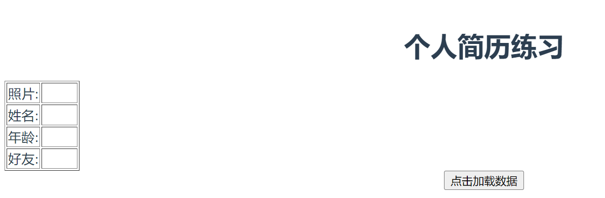

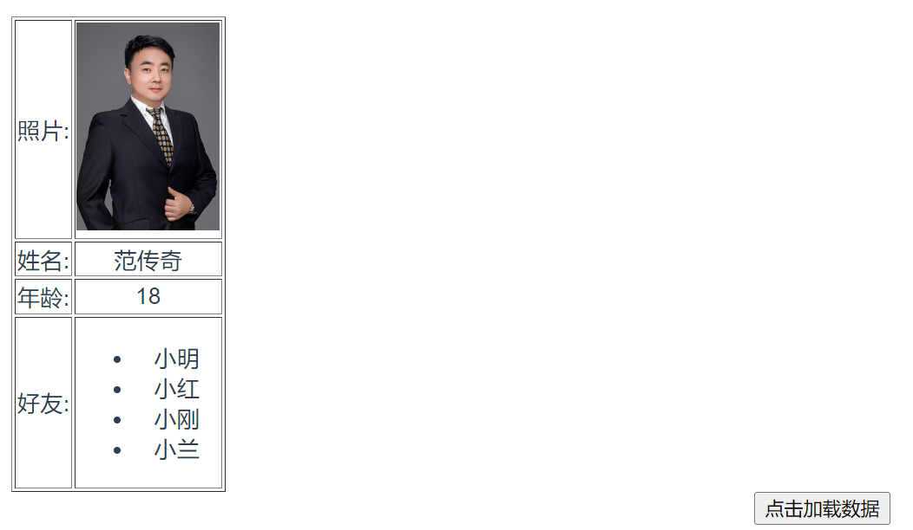

```html
<template>
  <h1>个人简历练习</h1>
  <table border="1px">
    <tr>
      <td>照片:</td>
      <td></td>
    </tr>
    <tr>
      <td>姓名:</td>
      <td>{{person.name}}</td>
    </tr>
    <tr>
      <td>年龄:</td>
      <td>{{person.age}}</td>
    </tr>
    <tr>
      <td>好友:</td>
      <td>
        <ul>
          <li v-for="fName in person.friends">{{fName}}</li>
        </ul>
      </td>
    </tr>
  </table>
  <button @click="loadData()">点击加载数据</button>
</template>

<script setup>
import {ref} from "vue";

//准备一个空对象用来保存数据
const person = ref({name:'',age:'',imgUrl:'',friends:[]});
const loadData = ()=>{
  person.value = {
    name:'传奇哥',
    age:18,
    imgUrl:'fcq.jpg',
    friends:['李四','王五','赵六']
  }
}
</script>

<style scoped>

</style>
```

## 7. VUE指令总结

1. **<span style="color: inherit; background-color: rgba(183,237,177,0.8)">{{变量}}</span>**：插值，让此处&#x7684;**<span style="color: rgb(216,57,49); background-color: inherit">文本内容</span>**&#x548C;变量进行绑定

2. **<span style="color: inherit; background-color: rgba(183,237,177,0.8)">v-text=&quot;变量&quot;</span>**：&#x8BA9;**<span style="color: rgb(216,57,49); background-color: inherit">元素的文本内容</span>**&#x548C;变量进行绑定

3. **<span style="color: inherit; background-color: rgba(183,237,177,0.8)">v-html=&quot;变量&quot;</span>**：让元素&#x7684;**<span style="color: rgb(216,57,49); background-color: inherit"> html 标签内容</span>**&#x548C;变量进行绑定

4. **<span style="color: inherit; background-color: rgba(183,237,177,0.8)">v-bind:属性名=&quot;变量&quot;</span>**：让 xxx **<span style="color: rgb(216,57,49); background-color: inherit">属性的值</span>**&#x548C;变量进行绑定，简写是把 v-bind 去掉

5. **<span style="color: inherit; background-color: rgba(183,237,177,0.8)">v-model=&quot;变量&quot;</span>**：&#x8BA9;**<span style="color: rgb(216,57,49); background-color: inherit">控件的值</span>**&#x548C;**<span style="color: rgb(216,57,49); background-color: inherit">变量</span>**&#x8FDB;行双向绑定

应用场景：当需要获取用户输入内容时使用

（当变量的值改变时，控件的值会随之改变；当控件中用户输入的值改变时，变量的值也会随之改变）

* **<span style="color: inherit; background-color: rgba(183,237,177,0.8)">v-on:事件名=&quot;方法&quot;</span>**：**<span style="color: rgb(216,57,49); background-color: inherit">事件</span>**&#x7ED1;定，简写@事件名

* **<span style="color: inherit; background-color: rgba(183,237,177,0.8)">v-for=&quot;(变量,下标) in 数组&quot;</span>**：循环遍历指令，遍历的过程中生成遍历到的当前元素

* **<span style="color: inherit; background-color: rgba(183,237,177,0.8)">v-if=&quot;变量&quot;</span>**：控制元素是否显示，true 显示，false 不显示（**<span style="color: rgb(216,57,49); background-color: inherit">直接不渲染该元素</span>**）

* **<span style="color: inherit; background-color: rgba(183,237,177,0.8)">v-else</span>** 和 v-if 的状&#x6001;**<span style="color: rgb(216,57,49); background-color: inherit">取反</span>**

* **<span style="color: inherit; background-color: rgba(183,237,177,0.8)">v-show=&quot;变量&quot;</span>**：控制元素是否显示，true 显示，false 不显示（**<span style="color: rgb(216,57,49); background-color: inherit">隐藏元素</span>**）

## 8. <span style="color: inherit; background-color: rgba(255,246,122,0.8)">Element Plus 入门</span>

**介绍：基于 Vue3，面向设计师和开发者的组件库**

**<u><span style="color: rgb(46,161,33); background-color: inherit">官网网址</span></u>**<u><span style="color: rgb(216,57,49); background-color: inherit"> </span></u> <u><span style="color: rgb(216,57,49); background-color: inherit">https://element-plus.org/zh-CN/</span></u>   &#x20;

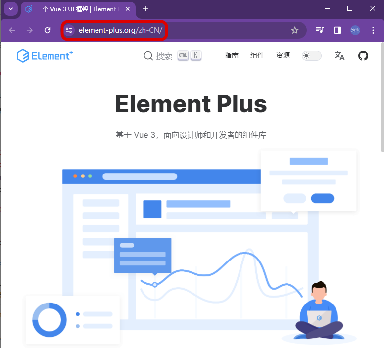

### 8.1 Element Plus安装步骤

1. **<span style="color: inherit; background-color: rgba(255,246,122,0.8)">百度直接搜索： elementplus，找到官网</span> <u><span style="color: rgb(216,57,49); background-color: rgba(255,246,122,0.8)"> https://element-plus.org/zh-CN/</span></u>**

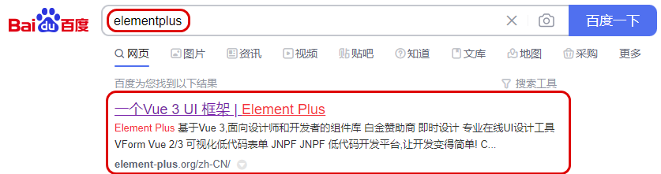

* **<span style="color: inherit; background-color: rgba(255,246,122,0.8)">点击上方的&quot;指南&quot;--&gt;&quot;安装&quot;--&gt;&quot;使用包管理器&quot;</span>**

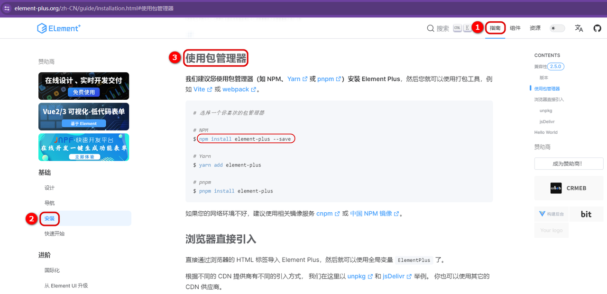

* **<span style="color: inherit; background-color: rgba(255,246,122,0.8)">打开 IDEA 终端 注意：如果有未关闭的 VUE 项目，要先终止项目</span>**

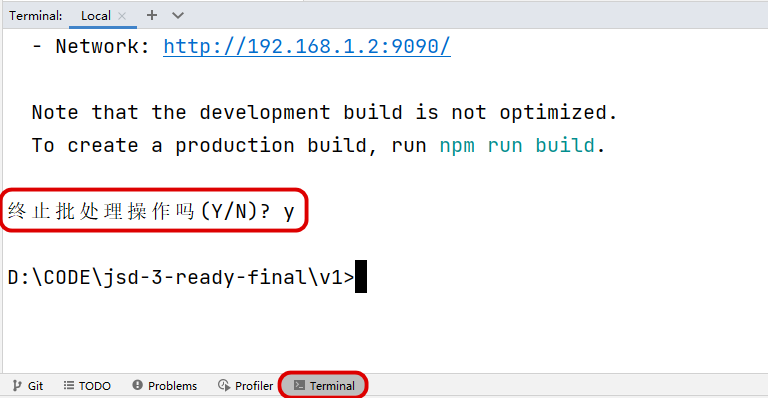

* **<span style="color: inherit; background-color: rgba(255,246,122,0.8)">复制&quot;使用包管理器&quot;中的第 1 句命令，回车执行安装，安装成功后重启项目</span>**

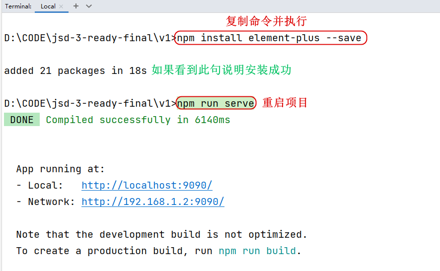

**<span style="color: inherit; background-color: rgba(255,246,122,0.8)">5.找到&quot;快速开始&quot;--&gt;并复制图示的两句代码</span>**

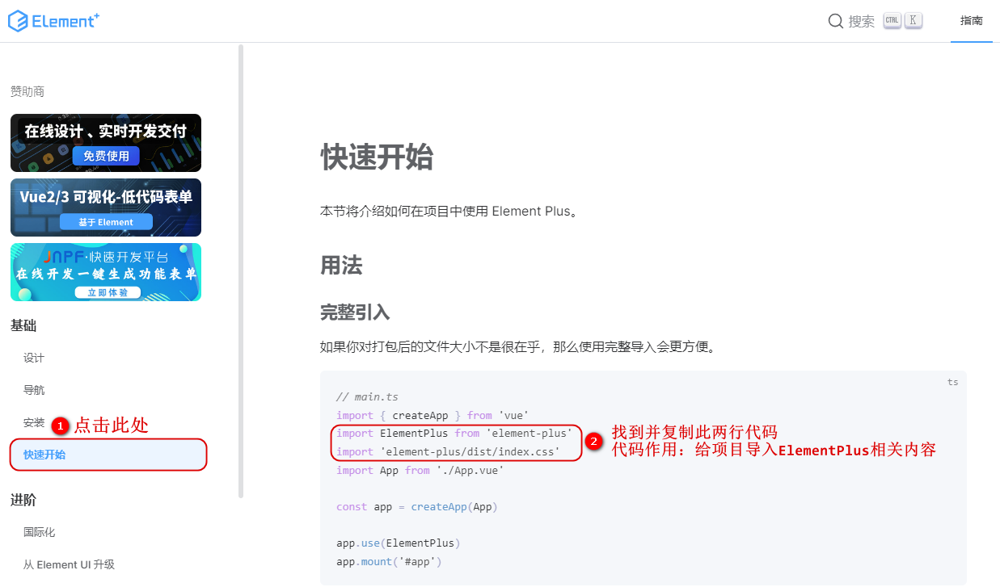

6. **<span style="color: inherit; background-color: rgba(255,246,122,0.8)">找到 VUE 项目中的 main.js 文件，粘贴刚刚复制的这两行代码，如图所示：</span>**

7. **<span style="color: inherit; background-color: rgba(255,246,122,0.8)">并且要在下面的代码中添加：</span>**

*`//.use(ElementPlus) 引入ElementPlus组件库`*`
createApp(App)`**`.use(ElementPlus)`**`.use(store).use(router).mount('#app')`

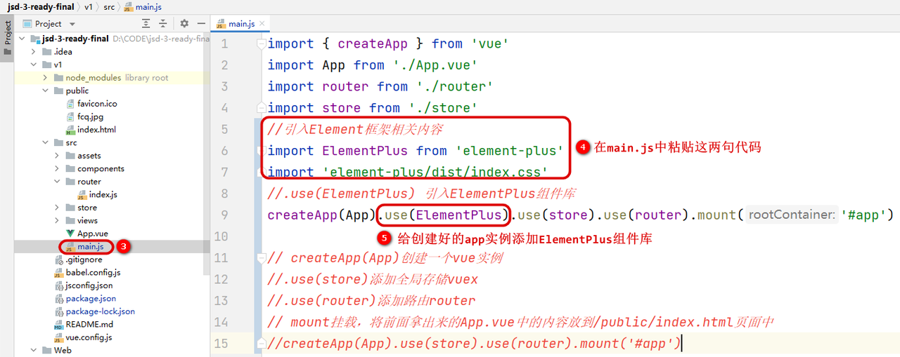

* **<span style="color: inherit; background-color: rgba(255,246,122,0.8)">在 App.vue 与 KView.vue 文件中完成如下代码：（添加 el-button 进行测试）</span>**

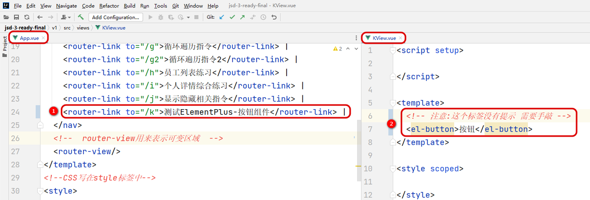

* **<span style="color: inherit; background-color: rgba(255,246,122,0.8)">测试：若页面按钮有样式效果，说明 ElementPlus 组件库安装成功</span>**

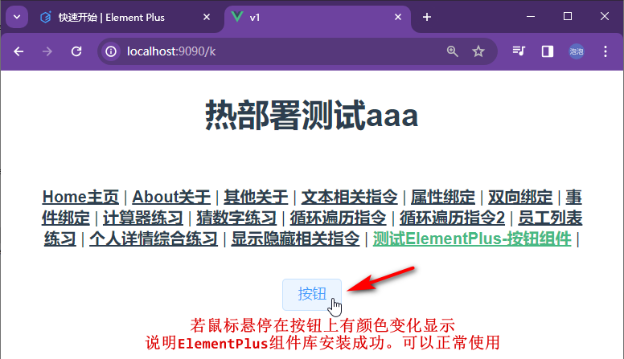

### 8.2 src/main.js 文件内容

```javascript
import { createApp } from 'vue'
import App from './App.vue'
import router from './router'
import store from './store'
import ElementPlus from 'element-plus'
import 'element-plus/dist/index.css'

createApp(App).use(ElementPlus).use(store).use(router).mount('#app')
```

### 8.3  src/App.vue 文件内容

```html
<template>
  <nav>
    <router-link to="/">Home</router-link> |
    <router-link to="/about">About</router-link> |
    <router-link to="/a">文本指令</router-link> |
    <router-link to="/b">属性绑定指令</router-link> |
    <router-link to="/c">双向绑定指令</router-link> |
    <router-link to="/d">事件绑定指令</router-link> |
    <router-link to="/e">循环指令</router-link> |
    <router-link to="/f">隐藏显示指令</router-link> |
    <br>
    <router-link to="/g">计算器练习</router-link> |
    <router-link to="/h">猜数字练习</router-link> |
    <router-link to="/i">员工列表练习</router-link> |
    <router-link to="/j">个人简历练习</router-link> |
    <br>
    <router-link to="/k">El-按钮组件</router-link> |
  </nav>
  <router-view/>
</template>

<style>
#app {
  font-family: Avenir, Helvetica, Arial, sans-serif;
  -webkit-font-smoothing: antialiased;
  -moz-osx-font-smoothing: grayscale;
  text-align: center;
  color: #2c3e50;
}

nav {
  padding: 30px;
}

nav a {
  font-weight: bold;
  color: #2c3e50;
}

nav a.router-link-exact-active {
  color: #42b983;
}
</style>
```

### 8.4 src/router/index.js 文件内容

```javascript
import { createRouter, createWebHistory } from 'vue-router'
import HomeView from '../views/HomeView.vue'

const routes = [
  {
    path: '/',
    name: 'home',
    component: HomeView
  },
  {path:'/about', component: () => import('../views/AboutView.vue')},
  {path:'/a', component: () => import('../views/AView.vue')},
  {path:'/b', component: () => import('../views/BView.vue')},
  {path:'/c', component: () => import('../views/CView.vue')},
  {path:'/d', component: () => import('../views/DView.vue')},
  {path:'/e', component: () => import('../views/EView.vue')},
  {path:'/f', component: () => import('../views/FView.vue')},
  {path:'/g', component: () => import('../views/GExec.vue')},
  {path:'/h', component: () => import('../views/HExec.vue')},
  {path:'/i', component: () => import('../views/IExec.vue')},
  {path:'/j', component: () => import('../views/JExec.vue')},
  {path:'/k', component: () => import('../views/KView.vue')},
]

const router = createRouter({
  history: createWebHistory(process.env.BASE_URL),
  routes
})

export default router
```

### 8.5  src/views/KView.vue 文件内容

```html
<template>
  <!-- 如果按钮有样式 说明element-plus组件库引入成功了 -->
  <!-- 如果写el-button有提示 说明IDEA插件element安装成功了 -->
  <!-- 参照笔记完成以上两步 注意需要重启IDEA! -->        
  <h1>El-按钮组件</h1>
  <el-button>按钮</el-button>
</template>

<script setup></script><style scoped></style>
```

### 8.6 使用小技巧

1. 可以使用导航栏中的搜索功能

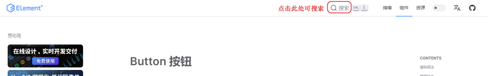

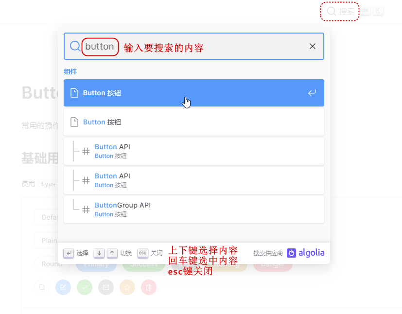

* 还可以查看对应组件的源代码，并且能够复制

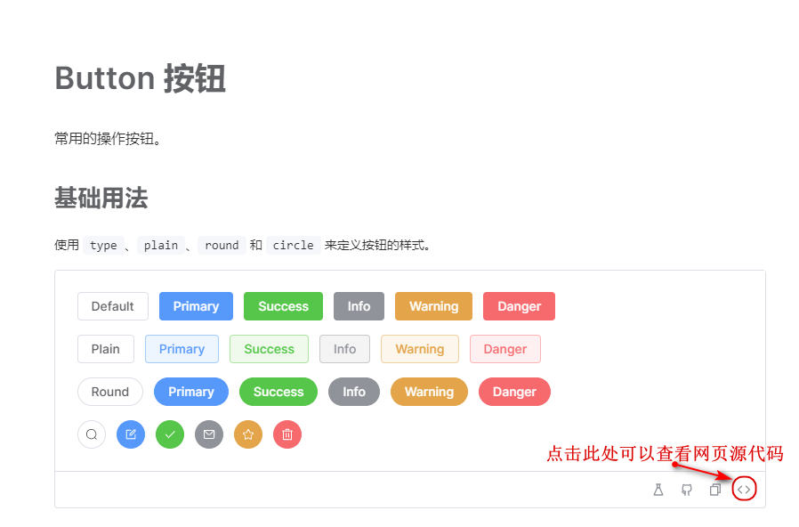

# DAY07笔记 Element-Plus 组件库

## 1. Button 按钮组件 KView.vue

https://element-plus.org/zh-CN/component/button.html

1. **<span style="color: rgb(36,91,219); background-color: inherit">type</span>** 切换按钮主题色&#x20;

   * primary蓝 success绿 info灰 warning黄 danger红

2. plain 镂空按钮&#x20;

3. round 胶囊型按钮&#x20;

4. circle 圆形按钮&#x20;

5. **<span style="color: rgb(36,91,219); background-color: inherit">disabled</span>** 禁用按钮

6. **<span style="color: rgb(36,91,219); background-color: inherit">link </span>**&#x94FE;接按钮

```html
<template>
  <h1>El-按钮组件</h1>
  <!-- 如果按钮上有样式效果,说明El组件库引入成功了 -->
  <!-- 如果<el-button有提示,说明IDEA的element插件安装成功了 -->
  <!-- 参照笔记完成以上两步,注意:需要重启IDEA! -->
  <el-button>按钮</el-button>
  <!-- type切换按钮主题色 primary蓝 danger红 info灰 success绿 warning黄-->
  <!-- plain镂空按钮 round圆角按钮 circle圆形按钮 disabled禁用按钮 -->
  <el-button type="primary">蓝按钮</el-button>
  <el-button type="danger" plain>红按钮</el-button>
  <el-button type="info" round>灰按钮</el-button>
  <el-button type="success" circle>绿按钮</el-button>
  <el-button type="warning" disabled>黄按钮</el-button>
  <hr>
  <!-- 链接按钮 -->
  <a href="https://www.baidu.com">
    <el-button link>链接按钮</el-button>
  </a>
  <a href="https://www.tmooc.cn">
    <el-button link type="primary">达内</el-button>
  </a>

  <el-button :icon="Search" circle />
  <el-button type="primary" :icon="Edit" circle />
  <el-button type="success" :icon="Check" circle />
  <el-button type="info" :icon="Message" circle />
  <el-button type="warning" :icon="Star" circle />
  <el-button type="danger" :icon="Delete" circle />
</template>

<script setup>
import {
  Check,
  Delete,
  Edit,
  Message,
  Search,
  Star,
} from '@element-plus/icons-vue'
</script>

<style scoped>

</style>
```

## 2. Icon 图标组件 LView.vue

1. **在如下网址：找到并复制图中的代码**

<span style="color: rgb(36,91,219); background-color: rgba(255,246,122,0.8)">https://element-plus.org/zh-CN/component/icon.html#</span> <span style="color: rgb(36,91,219); background-color: rgba(255,246,122,0.8)">注册所有图标</span>

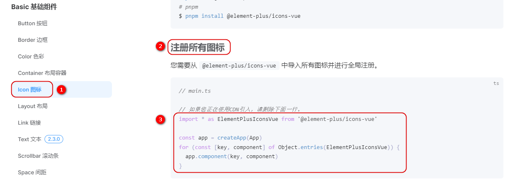

* ***在 main.js 中粘贴刚刚复制的代码（引入 EL 图标相关内容 ）***

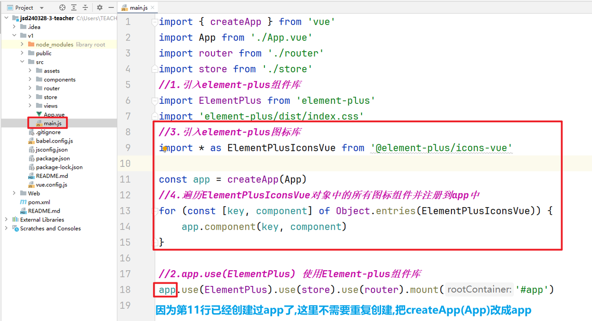

* **main.js 完整代码（这是一次性的代码，无需多次配置）**

```javascript
import { createApp } from 'vue'
import App from './App.vue'
import router from './router'
import store from './store'
//1.引入element-plus组件库
import ElementPlus from 'element-plus'
import 'element-plus/dist/index.css'
//3.引入element-plus图标库
import * as ElementPlusIconsVue from '@element-plus/icons-vue'

const app = createApp(App)
//4.遍历ElementPlusIconsVue图标库,将其中所有的图标组件[key, component]依次注册到app中
for (const [key, component] of Object.entries(ElementPlusIconsVue)) {
    app.component(key, component)
}

//2.app.use(ElementPlus) 使用Element-plus组件库
app.use(ElementPlus).use(store).use(router).mount('#app')
```

* 直接左键单击图标，就可以自动复制该图标的代码

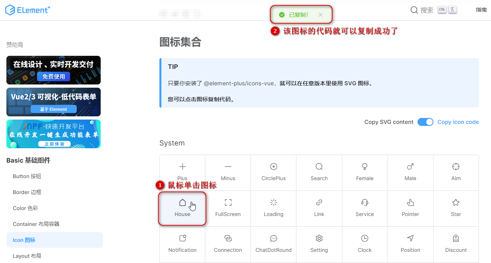

* 在 LView.vue 中测试图标的代码&#x20;

```html
<template>
  <h1>El-图标组件</h1>
  <el-icon><Message /></el-icon>
  <!-- 注意:图标库需要在main.js中引入并注册! -->
  <!-- size修改图标尺寸 color修改图标颜色 -->
  <!-- 注意:这里的图标并不是传统的.png或.jpg等图片,是SVG矢量图
   SVG可缩放矢量图形,可以直接嵌入在html中,任何分辨率下都可以清晰显示-->
  <el-icon size="50px" color="red"><Delete /></el-icon>
</template>

<script setup></script>
```

## 3. Message 消息提示组件 MView.vue

https://element-plus.org/zh-CN/component/message.html

```html
<template>
  <h1>El-消息提示组件</h1>
  <el-button @click="f(1)">成功消息</el-button>
  <el-button @click="f(2)">警告消息</el-button>
  <el-button @click="f(3)">错误消息</el-button>
  <el-button @click="f(4)">普通消息</el-button>
  <el-button @click="f(5)">可关闭的消息</el-button>
</template>

<script setup>
//注意! ElMessage需要导入!
import {ElMessage} from "element-plus";

const f = (x)=>{
  switch (x){
    case 1 : ElMessage.success('成功的提示消息');break;
    case 2 : ElMessage.warning('警告的提示消息');break;
    case 3 : ElMessage.error('错误的提示消息');break;
    case 4 : ElMessage('普通的提示消息');break;
    case 5 : ElMessage.error({message:'可关闭的提示消息',showClose:true});
  }
}
</script>

<style scoped>

</style>
```

## 4. Radio 单选组件 NView.vue

https://element-plus.org/zh-CN/component/radio.html

1. 所有单选项需要放到el-radio-group中，且需要在group上设置双向绑定用来提交值

2. el-radio 圆形单选项

3. el-radio-button 单选按钮

4. value用来设置当前单选选项的值

5. label用来设置当前单选选项显示的文本，也可以直接写在标签之间

```html
<template>
  <h1>El-单选组件</h1>
  <el-radio-group v-model="edu">
    <!-- value保存当前选项的值 label保存当前选项显示的文本   -->
    <el-radio value="初中" label="学历:初中"></el-radio>
    <el-radio value="高中" label="学历:高中"></el-radio>
    <el-radio value="本科" label="学历:本科"></el-radio>
    <el-radio value="硕士">学历:硕士</el-radio>
  </el-radio-group>
  <h4>您选中的学历是:{{edu}}</h4>
  <hr>
  <el-radio-group v-model="pr">
<!--  <el-radio-button v-for="p in arr">{{p.title}}</el-radio-button>-->
    <el-radio-button v-for="p in arr" :value="p.price" :label="p.title"></el-radio-button>
  </el-radio-group>
  <h4>您选中的价格是:{{pr}}</h4>
</template>

<script setup>
import {ref} from "vue";

const edu = ref('本科');

const pr = ref('2500');
//准备数组用来存放原始数据
const arr = ref([
  {title:'五粮液',price:500},
  {title:'茅台',price:2500},
  {title:'汾酒',price:330},
  {title:'梦之蓝',price:368}
]);
</script>

<style scoped>

</style>
```

## 5. Select 选择器组件 OView.vue

https://element-plus.org/zh-CN/component/select.html

1. 所有下拉选项需要放到el-select中，且需要设置双向绑定用来提交值

2. value用来设置当前选项的值

3. label用来设置当前选项显示的文本，也可以直接写在标签之间

```html
<template>
  <h1>El-选择器组件</h1>
  <el-select placeholder="请选择一个你喜欢的城市" style="width:50%;" v-model="city">
    <el-option label="北京" value="bj"></el-option>
    <el-option label="西湖" value="xh"></el-option>
    <el-option label="潍坊" value="wf"></el-option>
    <el-option value="cc">长春</el-option>
  </el-select>
  <h4>您选择的城市是:{{city}}</h4>
</template>

<script setup>
import {ref} from "vue";

const city = ref('xh');
</script>

<style scoped>

</style>
```

## 6.  Switch 开关组件 PView.vue

https://element-plus.org/zh-CN/component/switch.html

```html
<template>
  <h1>El-开关组件</h1>
  <el-switch v-model="value1" />
  <el-switch
      v-model="value2"
      class="ml-2"
      style="--el-switch-on-color: #13ce66; --el-switch-off-color: #ff4949"
  />
  <el-switch
      v-model="value2"
      class="ml-2"
      style="--el-switch-on-color: #0aa1ed; --el-switch-off-color: #ff4949"
  />
  是否为管理员<el-switch v-model="isAdmin"></el-switch>
  是否显示图片<el-switch v-model="isShow"></el-switch>
  <hr>
  
  <hr>
  <!-- :active-value="1"数字1表示开关打开 :inactive-value="0"数字0表示开关关闭 -->
  <el-switch v-model="num" :active-value="1" :inactive-value="0"></el-switch>
  <!-- :active-value="'1'"字符串1表示开关打开 :inactive-value="'0'"字符串0表示开关关闭 -->
  <el-switch v-model="numStr" :active-value="'1'" :inactive-value="'0'"></el-switch>
</template>

<script setup>
import { ref } from 'vue'

const num = ref(0);
const numStr = ref('1');

const value1 = ref(true)
const value2 = ref(true)
const isAdmin = ref(false);
const isShow = ref(true);
</script>

<style scoped>

</style>
```

## 7. Form 表单组件 QView.vue

https://element-plus.org/zh-CN/component/form.html

* 表单所有内容需要写在el-form中

* 每个表单项需要写在el-form-item中

* label-width="80" 控制所有表单项的宽度

* show-password 可以设置密码输入框的密码隐藏或显示

* **注意：双向绑定必须加在控件本身上!而不是加在el-form-item上!**

```html
<template>
  <h1>El-表单组件</h1>
  <h2>注册页面</h2>
  <!-- 要求:接收用户输入的数据,在控制台打印完整的user对象的信息 -->
  <el-form label-width="80" style="width: 500px;margin: 0 auto;">
    <el-form-item label="用户名">
      <el-input placeholder="请输入用户名" v-model="user.username"></el-input>
    </el-form-item>
    <el-form-item label="密码">
      <el-input placeholder="请输入密码" show-password v-model="user.password"></el-input>
    </el-form-item>
    <el-form-item label="性别">
      <el-radio-group v-model="user.gender">
        <el-radio-button label="男" value="1"></el-radio-button>
        <el-radio-button label="女" value="0"></el-radio-button>
      </el-radio-group>
    </el-form-item>
    <el-form-item label="所在地">
      <el-select v-model="user.city" placeholder="请选择你心仪的城市">
        <el-option label="成都" value="cd"></el-option>
        <el-option label="兰州" value="lz"></el-option>
        <el-option label="太原" value="ty"></el-option>
      </el-select>
    </el-form-item>
    <el-form-item label="管理员">
      <el-switch v-model="user.isAdmin"></el-switch>
    </el-form-item>
    <el-form-item>
      <el-button type="success" @click="show()">注册</el-button>
    </el-form-item>
  </el-form>
</template>

<script setup>
  import {ref} from "vue";

  const user = ref({
    username:'',
    password:'',
    gender:'',
    city:'',
    isAdmin:false
  });
  const show = ()=>{
    console.log(user.value);
  }
</script>

<style scoped>

</style>
```

## 8. Table 表格组件 RView.vue

https://element-plus.org/zh-CN/component/table.html

* :data 表格数据绑定

* prop 表格列对应的源数据属性名

* label 表格列的标题

* width 当前列的宽度

* &#x20;type=""&#x20;

  * selection可显示多选框&#x20;

  * index可显示编号,从1开始

* 如果写自定义内容,需要加到template标签中&#x20;

  * 从scope中可获取 $index 表示当前行数据的索引值,默认从0开始

  * 从scope中可获取 row 表示当前行数据

```html
<template>
  <h1>El-表格组件</h1>
  <el-table :data="tableData" style="width: 100%">
    <el-table-column prop="date" label="日期" width="180" />
    <el-table-column prop="name" label="姓名" width="180" />
    <el-table-column prop="address" label="住址" />
  </el-table>
  <hr>
  <el-table :data="arr">
    <el-table-column type="selection" width="80"></el-table-column>
    <el-table-column label="编号" type="index" width="80"></el-table-column>
    <el-table-column label="姓名" prop="name" width="180"></el-table-column>
    <el-table-column label="工资" prop="salary" width="180"></el-table-column>
    <el-table-column label="岗位" prop="job"></el-table-column>
    <el-table-column label="操作">
      <!--自定义列模板:自定义列的显示内容 -->
      <!--scope保存了当前行数据的索引$index(从0开始)与当前行的完整数据row -->
      <template #default="scope">
        <el-button type="danger" @click="del(scope.$index,scope.row)">删除</el-button>
      </template>
    </el-table-column>
  </el-table>
</template>

<script setup>
import {ref} from "vue";

const arr = ref([
  {name:'张三',salary:3000,job:'维修员'},
  {name:'李四',salary:4000,job:'销售员'},
  {name:'王五',salary:5000,job:'护林员'},
  {name:'赵六',salary:6000,job:'程序员'}
]);
const del = (i,emp)=>{
  if(confirm('您确认要删除'+emp.name+'吗?')){
    arr.value.splice(i,1);
  }
}

const tableData = [
  {
    date: '2016-05-03',
    name: 'Tom',
    address: 'No. 189, Grove St, Los Angeles',
  },
  {
    date: '2016-05-02',
    name: 'Tom',
    address: 'No. 189, Grove St, Los Angeles',
  },
  {
    date: '2016-05-04',
    name: 'Tom',
    address: 'No. 189, Grove St, Los Angeles',
  },
  {
    date: '2016-05-01',
    name: 'Tom',
    address: 'No. 189, Grove St, Los Angeles',
  },
]
</script>

<style scoped>

</style>
```

## 9. Menu 菜单组件 SView.vue

https://element-plus.org/zh-CN/component/menu.html

* mode="" 修改菜单模式 vertical默认垂直 horizontal水平

* background-color="" 背景颜色

* text-color="" 文字颜色

* active-text-color="" 激活文字颜色

* default-active="5" 设置默认激活项

* @select="handleSelect"  handleSelect = (index, indexPath) => {}&#x20;

  * index表示选中的当前这个菜单项的index值

  * indexPath表示到达当前选中的菜单项需要经过的路径

```html
<template>
  <h1>El-菜单组件</h1>
  <el-menu mode="horizontal" @select="handleSelect"
           active-text-color="red" default-active="6-2"
           text-color="purple" background-color="lightblue">
    <el-menu-item index="1">首页</el-menu-item>
    <el-menu-item index="2">直播课</el-menu-item>
    <el-menu-item index="3">脱产课</el-menu-item>
    <el-menu-item index="4">线上课</el-menu-item>
    <el-menu-item index="5">免费课</el-menu-item>
    <el-sub-menu index="6">
      <template #title>关于我们</template>
      <el-menu-item index="6-1">联系方式</el-menu-item>
      <el-menu-item index="6-2">公司地址</el-menu-item>
      <el-menu-item index="6-3">求职招聘</el-menu-item>
    </el-sub-menu>
  </el-menu>
</template>

<script setup>
//index指的是选中的当前菜单项的index值,比如选中"线上课",那么index的值就是4
//indexPath指的是如何到达当前被选中的这个菜单项,比如6,6-3可以找到"求职招聘"
const handleSelect = (index, indexPath) => {
  console.log(index, indexPath)
}
</script>

<style scoped>

</style>
```

## 10. Layout 布局组件 TView.vue

https://element-plus.org/zh-CN/component/layout.html#layout

* el-row 均匀等分24份

* el-col :span="n" 表示当列占n份

* :gutter="20" 天沟,其实指的是列与列之间的内间距

* :offset="n" 列偏移,默认值为0,默认靠左,n为几表示向右移动几列

* 布局嵌套:内层充当父元素的元素需要重新作为el-row,它的子元素瓜分它的24列

```html
<template>
  <h1>El-布局组件</h1>
  <el-row>
    <el-col :span="6">哈哈哈哈哈哈</el-col>
    <el-col :span="6">哈哈哈哈哈哈</el-col>
    <el-col :span="6">哈哈哈哈哈哈</el-col>
    <el-col :span="6">哈哈哈哈哈哈</el-col>
  </el-row>
  <h3>两张图</h3>
  <el-row>
    <el-col :span="12"></el-col>
    <el-col :span="12"></el-col>
  </el-row>
  <h3>六张图</h3>
  <el-row :gutter="20">
    <el-col :span="4"></el-col>
    <el-col :span="4"></el-col>
    <el-col :span="4"></el-col>
    <el-col :span="4"></el-col>
    <el-col :span="4"></el-col>
    <el-col :span="4"></el-col>
  </el-row>
  <h3>列偏移</h3>
  <!-- :offset 列偏移,默认值为0,默认靠左,写几表示向右移动几列 -->
  <el-row>
    <el-col :offset="4" :span="20"></el-col>
  </el-row>
  <el-row>
    <!-- 居中:图片12列,还剩12列,向右移动了6列,左右各6列,所以图片居中 -->
    <el-col :offset="6" :span="12"></el-col>
  </el-row>
  <!-- 有三张图,它们的宽度比为 1:2:3 -->
  <el-row>
    <el-col :span="4"></el-col>
    <el-col :span="8"></el-col>
    <el-col :span="12"></el-col>
  </el-row>
  <!-- 有8列,内容为1 2 ... 8,均分一行 -->
  <el-row :gutter="10">
   <el-col :span="3" v-for="item in 8">{{ item }}</el-col>
  </el-row>

</template>

<script setup>

</script>

<style scoped>

</style>
```

## 11. Container 容器组件 UView.vue

https://element-plus.org/zh-CN/component/container.html

目前我们能接触到的最复杂的页面布局如下图所示：

后面写页面的时候也是找到对应的布局，复制代码去修改即可

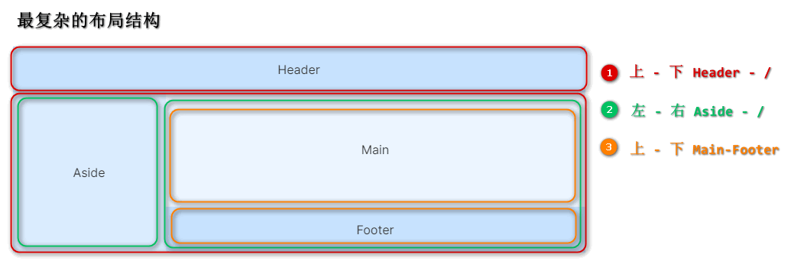

```html
<!--El-容器组件-->
<template>
  <div>
    <el-container>
      <!-- 侧边栏  -->
      <el-aside width="200px">
        <el-menu>
          <el-menu-item index="1">用户管理</el-menu-item>
          <el-menu-item index="2">车辆管理</el-menu-item>
          <el-menu-item index="3">围栏管理</el-menu-item>
        </el-menu>
      </el-aside>
      <!-- 右侧主体内容 -->
      <el-container>
        <el-header>
          <h1 style="background-color: #0aa1ed;color:#fff;">智慧车辆运营系统-IVOS</h1>
        </el-header>
        <el-main>
          <el-table :data="arr">
            <el-table-column type="index" label="编号" align="center" width="80"></el-table-column>
            <el-table-column prop="brand" label="品牌" align="center"></el-table-column>
            <el-table-column prop="model" label="型号" align="center"></el-table-column>
            <el-table-column prop="license" label="车牌号" align="center"></el-table-column>
            <el-table-column prop="color" label="颜色" align="center"></el-table-column>
            <el-table-column prop="km" label="里程数" align="center"></el-table-column>
          </el-table>
        </el-main>
      </el-container>
    </el-container>
  </div>
</template>

<script setup>
import {ref} from "vue";

const arr = ref([
    {brand: "奔驰", model: "C级", license: "京A88888", color: "白色", km: 10000},
    {brand: "奔驰", model: "C级", license: "京A88888", color: "白色", km: 10000},
    {brand: "奔驰", model: "C级", license: "京A88888", color: "白色", km: 10000},
    {brand: "奔驰", model: "C级", license: "京A88888", color: "白色", km: 10000},
    {brand: "奔驰", model: "C级", license: "京A88888", color: "白色", km: 10000},
    {brand: "奔驰", model: "C级", license: "京A88888", color: "白色", km: 10000},
]);
</script>

<style scoped>
</style>
```

## 12. Carousel 轮播图组件 VView.vue

https://element-plus.org/zh-CN/component/carousel.html

* 所有轮播图项 el-carousel-item 必须放到轮播图 el-carousel 标签中

* trigger="" 默认值hover悬停切换轮播项,也可设置成click点击切换

* type="card" 可以修改轮播图以卡片形式切换

```html
<template>
  <h1>El-走马灯组件</h1>
  <el-carousel style="width: 380px;">
    <el-carousel-item></el-carousel-item>
    <el-carousel-item></el-carousel-item>
    <el-carousel-item></el-carousel-item>
    <el-carousel-item></el-carousel-item>
  </el-carousel>

  <!-- trigger="click" 鼠标点击下方指示灯时触发切换,默认悬停切换 -->
  <el-carousel style="width: 380px;" trigger="click">
    <el-carousel-item></el-carousel-item>
    <el-carousel-item></el-carousel-item>
    <el-carousel-item></el-carousel-item>
    <el-carousel-item></el-carousel-item>
  </el-carousel>

  <!-- type="card" 轮播图使用卡片样式 -->
  <el-carousel style="width: 900px;" type="card">
    <el-carousel-item></el-carousel-item>
    <el-carousel-item></el-carousel-item>
    <el-carousel-item></el-carousel-item>
    <el-carousel-item></el-carousel-item>
  </el-carousel>
</template>

<script setup>

</script>

<style scoped>

</style>
```

## 13. Card 卡片组件 WView.vue

https://element-plus.org/zh-CN/component/card.html

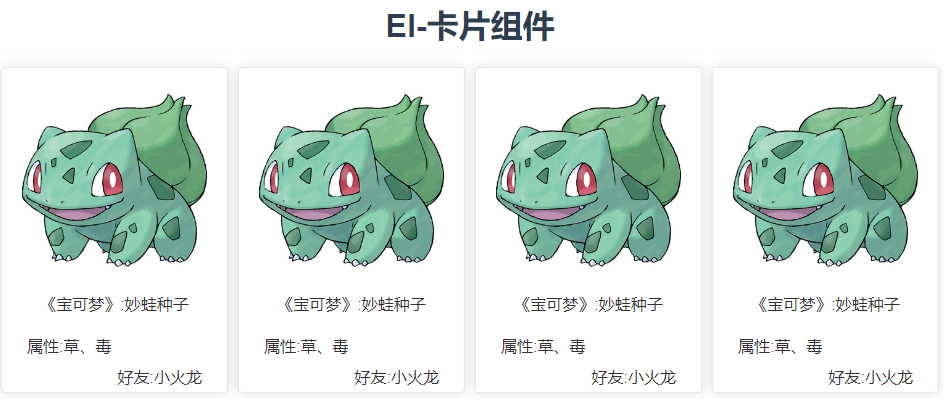

```html
<template>
  <h1>El-卡片组件</h1>
  <el-row :gutter="10">
    <el-col :span="6" v-for="item in 4">
      <el-card>
        
        <p>《宝可梦》:妙蛙种子</p>
        <div style="margin-bottom: 40px;">
          <span style="float: left;">属性:草、毒</span>
          <span style="float: right;">好友:小火龙</span>
        </div>
      </el-card>
    </el-col>
  </el-row>
</template>

<script setup>

</script>

<style scoped>

</style>
```

## 14. DateTimePicker 日期时间选择器 XView.vue

https://element-plus.org/zh-CN/component/datetime-picker.html

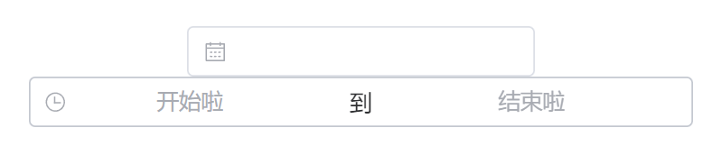

**type属性 定义选择器的类型**

* date 日期选择器

* datetimerange 日期时间范围选择器

  * range-separator="到" 范围选择器中的分隔符

  * start-placeholder="开始啦" 开始日期输入框的提示占位符

  * end-placeholder="结束啦" 结束日期输入框的提示占位符

**&#x20;format属性  定义日期时间的<span style="color: rgb(36,91,219); background-color: inherit">显示值</span>的格式**

* YYYY-MM-DD 年月日

* YYYY-MM-DD HH:mm:ss 年月日 时分秒

**value-format属性  定义日期时间<span style="color: rgb(36,91,219); background-color: inherit">提交值</span>的格式**

* YYYY-MM-DD 年月日

* YYYY-MM-DD HH:mm:ss 年月日 时分秒

**@change="" 事件 监听日期选择,一旦变化立即触发**

```html
<template>
  <h1>El-日期时间选择器组件</h1>
  <el-date-picker
      type="date"
      v-model="rq"
      format="YYYY-MM-DD"
      value-format="YYYY-MM-DD"
      @change="console.log(rq)"
  ></el-date-picker>
  <br>
  <el-date-picker
      type="datetimerange"
      range-separator="到"
      start-placeholder="开始啦"
      end-placeholder="结束啦"
      v-model="times"
      format="YYYY-MM-DD HH:mm:ss"
      value-format="YYYY-MM-DD HH:mm:ss"
      @change="console.log(times)"
  ></el-date-picker>
</template>

<script setup>
import {ref} from "vue";

const rq = ref('');
//因为要保存开始时间与结束时间,所以要使用数组
const times = ref([]);
</script>

<style scoped>

</style>
```

## 15. 员工列表练习 YView.vue

```html
<template>
  <h1>员工列表综合练习</h1>
  <el-form style="width: 600px;margin: 0 auto;">
    <el-form-item label="姓名">
      <el-input v-model="emp.name" placeholder="请输入姓名"></el-input>
    </el-form-item>
    <el-form-item label="工资">
      <el-input v-model="emp.salary" placeholder="请输入工资"></el-input>
    </el-form-item>
    <el-form-item label="岗位">
      <el-input v-model="emp.job" placeholder="请输入岗位"></el-input>
    </el-form-item>
    <el-form-item>
      <el-button type="success" @click="add()">点我提交</el-button>
    </el-form-item>
  </el-form>
  <el-table :data="arr" style="width: 600px;margin: 0 auto;">
    <el-table-column type="index" label="编号" width="80"></el-table-column>
    <el-table-column prop="name" label="姓名"></el-table-column>
    <el-table-column prop="salary" label="工资"></el-table-column>
    <el-table-column prop="job" label="岗位"></el-table-column>
    <el-table-column label="操作">
      <template #default="scope">
        <el-button type="danger" @click="del(scope.$index,scope.row)">删除</el-button>
      </template>
    </el-table-column>
  </el-table>
</template>

<script setup>
import {ref} from "vue";

const emp = ref({name:'',salary:'',job:''});
//定义数组用来保存员工数据
const arr = ref([]);
const add = () => {
  arr.value.push(emp.value);
}
const del = (index,emp)=>{
  if(confirm('确认要删除'+emp.name+'吗?')){
    arr.value.splice(index,1);
  }
}
</script>

<style scoped>

</style>
```

## 16. 页面综合练习 ZView.vue

```html
<template>
  <div class="common-layout">
    <el-container>
      <el-header>
        <!--3.编写顶部导航栏-->
        <el-menu mode="horizontal"
           background-color="#0aa1ed" text-color="#fff"
           active-text-color="#ff0" default-active="3">
          <el-menu-item index="1">精彩活动</el-menu-item>
          <el-menu-item index="2">精品女装</el-menu-item>
          <el-menu-item index="3">品牌男装</el-menu-item>
          <el-menu-item index="4">母婴产品</el-menu-item>
          <el-menu-item index="5">数码科技</el-menu-item>
        </el-menu>
      </el-header>
      <el-main>
        <!-- 4.编写主体轮播图 -->
        <el-carousel style="height: 240px;">
          <el-carousel-item v-for="url in bannerArr">
            
          </el-carousel-item>
<!--          <el-carousel-item></el-carousel-item>-->
<!--          <el-carousel-item></el-carousel-item>-->
<!--          <el-carousel-item></el-carousel-item>-->
<!--          <el-carousel-item></el-carousel-item>-->
<!--          <el-carousel-item></el-carousel-item>-->
        </el-carousel>
        <!-- 5.商品列表 -->
        <el-row :gutter="10">
         <el-col :span="6" v-for="p in productArr" style="margin: 10px 0;">
           <el-card style="padding-bottom:20px;">
             
             <p>{{p.title}}</p>
             <div>
               <span style="float:left;color:red;">¥{{p.price}} <s>{{p.oldPrice}}</s> </span>
               <span style="float:right;">销量:{{p.saleCount}}</span>
             </div>
           </el-card>
         </el-col>
        </el-row>
      </el-main>
      <el-footer
      style="background-color:#282c30;color:#666;height:200px;padding-top:40px;">
        <p>Copyright © 北京达内金桥科技有限公司版权所有 京ICP备12003709号-3 京公网安备 11010802029572号</p>
        <p>涵盖20余门课程体系，致力于打造权威的IT职业教育学习平台</p>
        <p>达内在线WWW.TMOOC.CN 专注于IT职业技能培训</p>
      </el-footer>
    </el-container>
  </div>
</template>


<script setup>
import {ref} from "vue";
//1.准备轮播图数组
const bannerArr = ref(["/imgs/banner3.jpg", "/imgs/banner4.jpg", "/imgs/banner5.jpg"]);
//2.准备商品对象数组
const productArr = ref([
  {title: "森马牛仔裤女宽松慢跑裤运动风2022春季新款", price: 233, oldPrice: 598, url: "/imgs/a.jpg", saleCount: 2342},
  {title: "茵曼马甲连衣裙两件套春季新款娃娃领色织格长袖背心裙套装", price: 233, oldPrice: 598, url: "/imgs/b.jpg", saleCount: 2342},
  {title: "雪中飞墨绿色短袖t恤女夏2022新款纯棉半袖打底体恤夏季", price: 233, oldPrice: 598, url: "/imgs/c.jpg", saleCount: 2342},
  {title: "【佟丽娅同款】鸭鸭明星同款羽绒服2021年冬季新款时尚", price: 233, oldPrice: 598, url: "/imgs/d.jpg", saleCount: 2342},
  {title: "BEASTER小恶魔鬼脸明星同款夹克毛绒保暖加厚字母印花", price: 233, oldPrice: 598, url: "/imgs/e.jpg", saleCount: 2342},
  {title: "香影毛呢外套女中长款2021年冬季新款气质韩版娃娃领", price: 233, oldPrice: 598, url: "/imgs/f.jpg", saleCount: 2342},
  {title: "SEMIR森马商场同款打底针织毛衣纯色高领新品显瘦", price: 233, oldPrice: 598, url: "/imgs/g.jpg", saleCount: 2342},
  {title: "美特斯邦威女MTEE 贺岁系列中长款风衣736598", price: 233, oldPrice: 598, url: "/imgs/h.jpg", saleCount: 2342},
  {title: "imone2021秋款黑色小西装外套女韩版学生宽松学", price: 233, oldPrice: 598, url: "/imgs/i.jpg", saleCount: 2342},
  {title: "BEASTER 小恶魔明星同款保暖长袖街头潮流连帽卫", price: 233, oldPrice: 598, url: "/imgs/j.jpg", saleCount: 2342},
  {title: "憨厚皇后100%绵羊皮2021秋海宁真皮皮衣女长款修", price: 233, oldPrice: 598, url: "/imgs/k.jpg", saleCount: 2342},
  {title: "美特斯邦威高腰牛仔裤女宽松小脚新款春秋彩色", price: 233, oldPrice: 598, url: "/imgs/l.jpg", saleCount: 2342}]);
</script>

<style scoped>
p {
  /* 强制文本不允许换行 */
  white-space: nowrap;
  /* 溢出隐藏 */
  overflow: hidden;
  /* 超出去的文本替换成省略号 */
  text-overflow: ellipsis;
}
</style>
```

## 17. 优化:

### 17.1 解决日期控件默认英文显示问题(汉化)

### 17.2 解决表格拖拽页面大小报错BUG

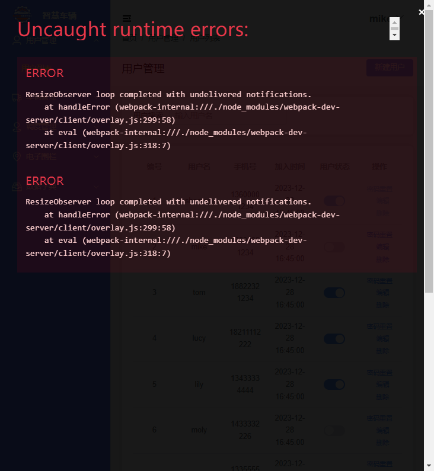

```javascript
import { createApp } from 'vue'
import App from './App.vue'
import router from './router'
import store from './store'
//1.引入element-plus组件库
import ElementPlus from 'element-plus'
import 'element-plus/dist/index.css'
//3.引入element-plus图标库
import * as ElementPlusIconsVue from '@element-plus/icons-vue'
//5.1修改elementPlus默认中文
import zhCn from 'element-plus/dist/locale/zh-cn.mjs'

const app = createApp(App)
//4.遍历ElementPlusIconsVue对象中的所有图标组件并注册到app中
for (const [key, component] of Object.entries(ElementPlusIconsVue)) {
    app.component(key, component)
}

//2. app.use(ElementPlus) 使用Element-plus组件库
//5.2 app.use(ElementPlus,{ locale: zhCn })将El本地化为中文
app.use(ElementPlus,{ locale: zhCn }).use(store).use(router).mount('#app')

//6.解决ResizeObserver Error
const debounce = (fn, delay) => {
    let timer = null;
    return function () {
        let context = this;
        let args = arguments;
        clearTimeout(timer);
        timer = setTimeout(function () {
            fn.apply(context, args);
        }, delay);
    }
}
const _ResizeObserver = window.ResizeObserver;
window.ResizeObserver = class ResizeObserver extends _ResizeObserver {
    constructor(callback) {
        callback = debounce(callback, 16);
        super(callback);
    }
}
```


# 操作步骤

## 1. 创建本阶段根项目

以下为创建步骤，因开发工具的不同，步骤仅做参考，项目类型与目录结构一致即可

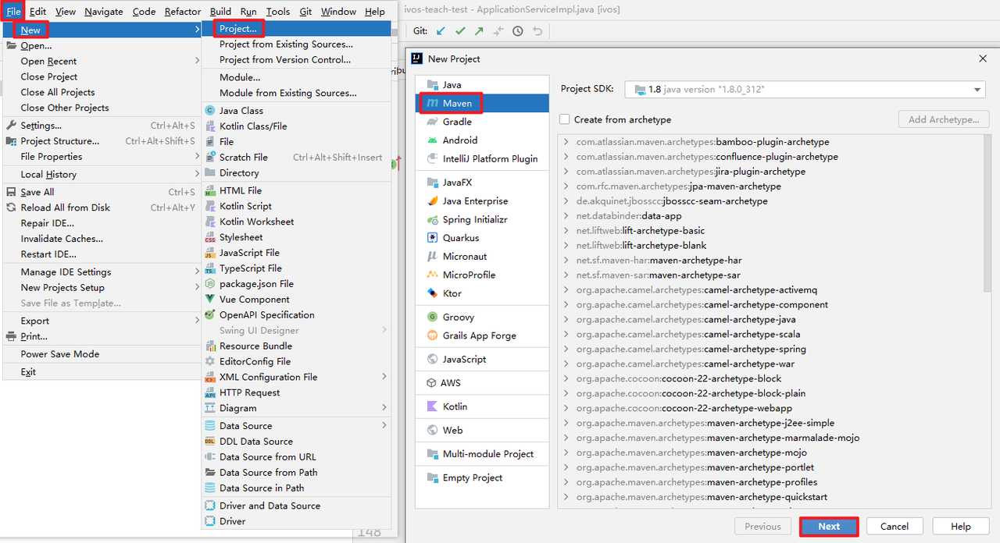

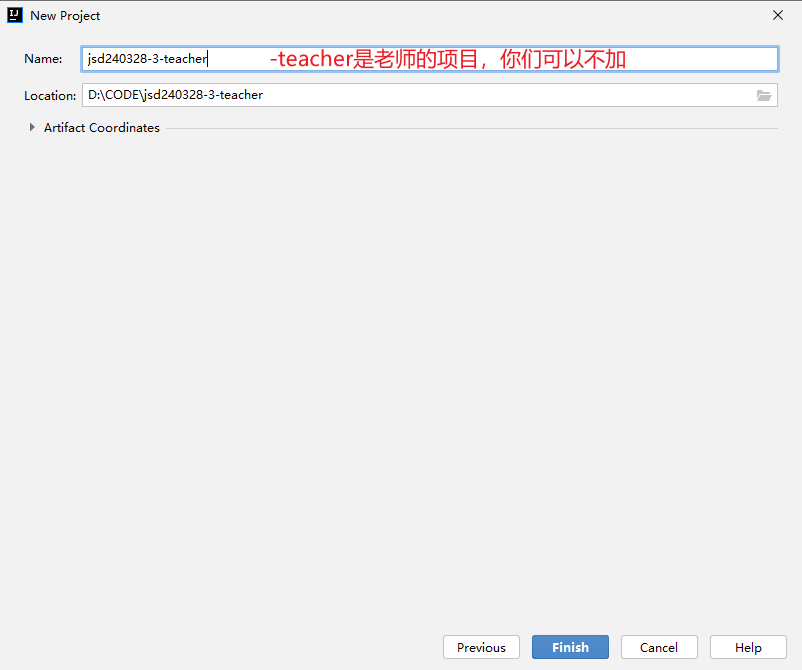

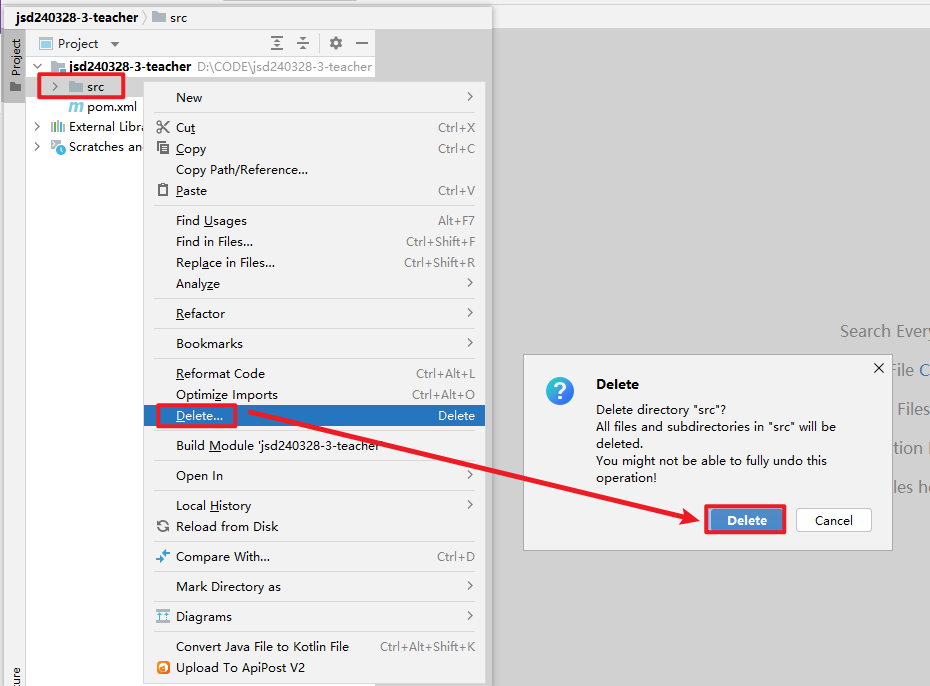

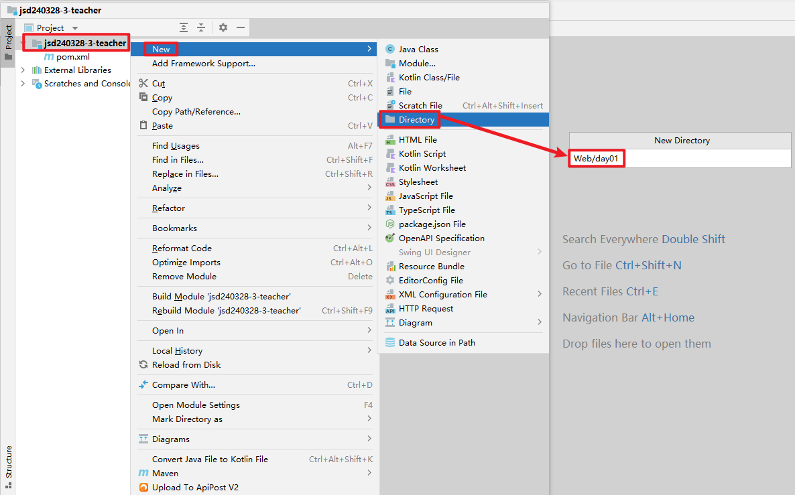

## 2. IDEA 常用快捷键

| **快捷键**      | **效果**    |
| ------------ | --------- |
| Ctrl+D       | 复制当前行     |
| Ctrl+Y       | 删除当前行     |
| Ctrl+Z       | 撤销        |
| Ctrl+Shift+Z | 反撤销       |
| Ctrl+Alt+L   | 代码格式化     |
| Shift+Enter  | 切换到下一行    |
| Ctrl+?       | 添加单行注释    |
| Ctrl+Shift+? | 添加多行注释    |
| Alt+Insert   | 新建文件      |
| Alt+Shift+向下 | 向下移动当前行代码 |
| Alt+Shift+向上 | 向上移动当前行代码 |

如果快捷键冲突了怎么办？

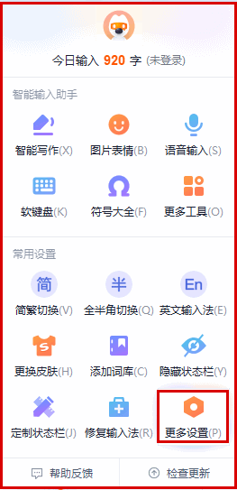

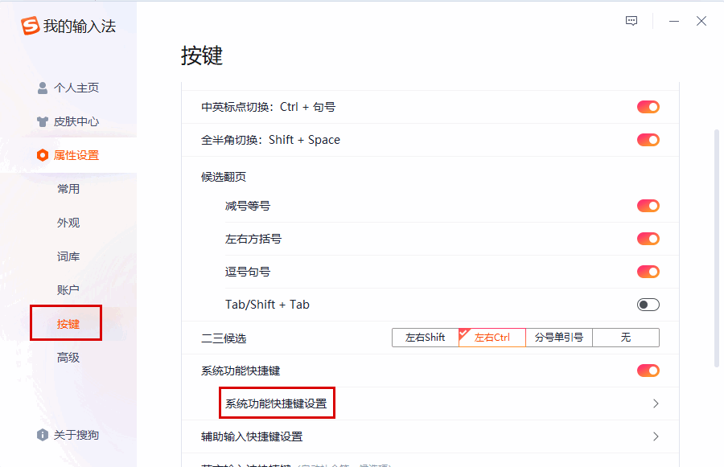

## 3. 设置IDEA字号

我们可以设置随Ctrl+鼠标滚轮调整字号大小

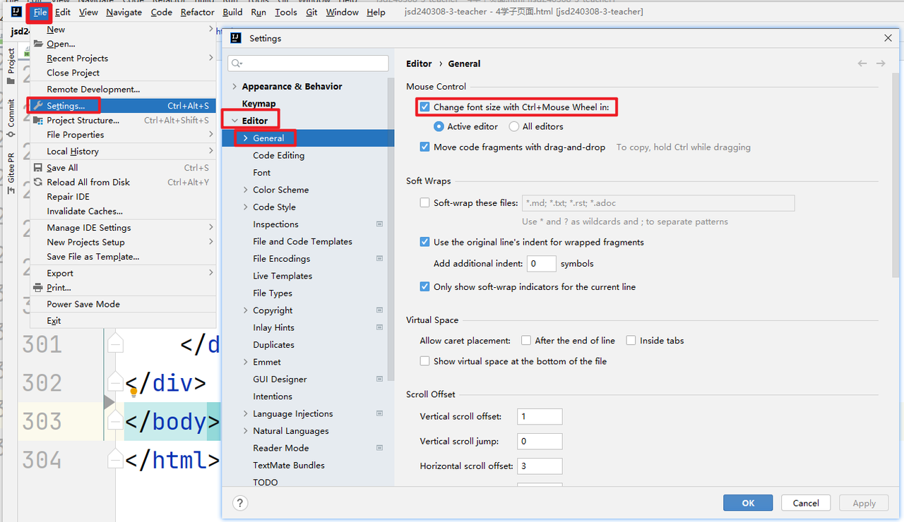

## 4. 设置分栏编辑

鼠标右键文件名标签卡,选择"Split Right",就可以把当前页面分成两个窗口显示

这样我们就可以对照着HTML编写CSS,比较方便

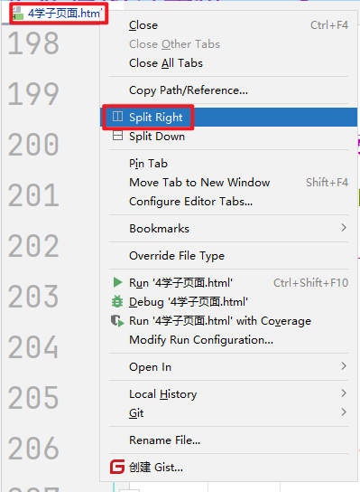

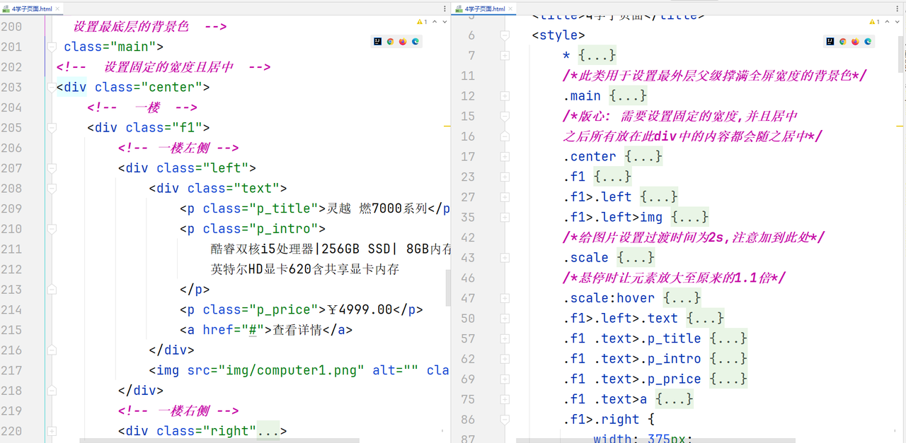

## 5. 修改不同语言的注释颜色

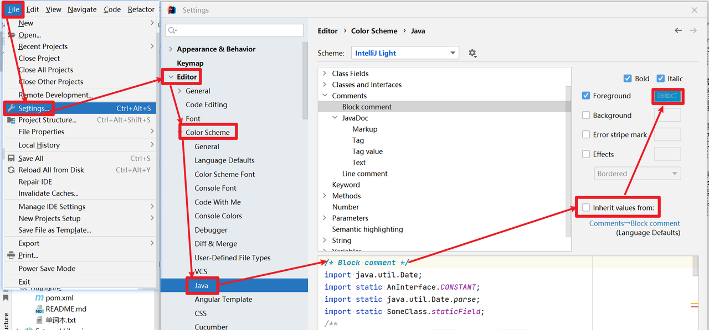

## 6. 浏览器控制台使用小技巧

* 选择 console 控制台可以直接键入代码

* 写完一行代码回车，表示执行上面这行代码

* 也可以 **Shit+回车** 换行，写完全部 JS 代码后再执行

* 还可以在其他地方写好再粘贴到控制台执行

* 若控制台不允许粘贴，可以键入 allow pasting 即可粘贴

* 按向上键可以回显上一行敲过的代码

