**创新是深思熟虑的模仿**

[**&#x20;JSD2404-基础知识模块**](https://d1ibml5ydvp.feishu.cn/docx/EXSbd0XUBo3b57xuYuIcCwVMnhh?from=from_copylink)

[**&#x20;Java就业指导课1**](https://d1ibml5ydvp.feishu.cn/docx/OvXhdIIItoP5gvx7SJNchnvHnDc)

**[ 智慧车辆运营系统总结文档](https://d1ibml5ydvp.feishu.cn/docx/TCZYdkuHroy1gex3Vunc7hsOnJf?from=from_copylink)(最后一点是拓展作业)**

**[ 拓展知识点](https://d1ibml5ydvp.feishu.cn/docx/T5lsdYD9moJ2jexgHWFccGQunGh?from=from_copylink)(分页+字典项+Redis项目集成+SpringSecurity)**

[ JSD全阶段模拟面试题](https://yscp0bp3g6.feishu.cn/docx/ErK8dp8Cxo8pIOxIiH1cU2DLnzb)

[ Git入门手册](https://d1ibml5ydvp.feishu.cn/docx/Aq7Sd0ZXnoy8ssxgnT1cZ7lvni0?from=from_copylink)

[AxureShop产品原型网](https://www.axureshop.com/)

# 0 项目峰会

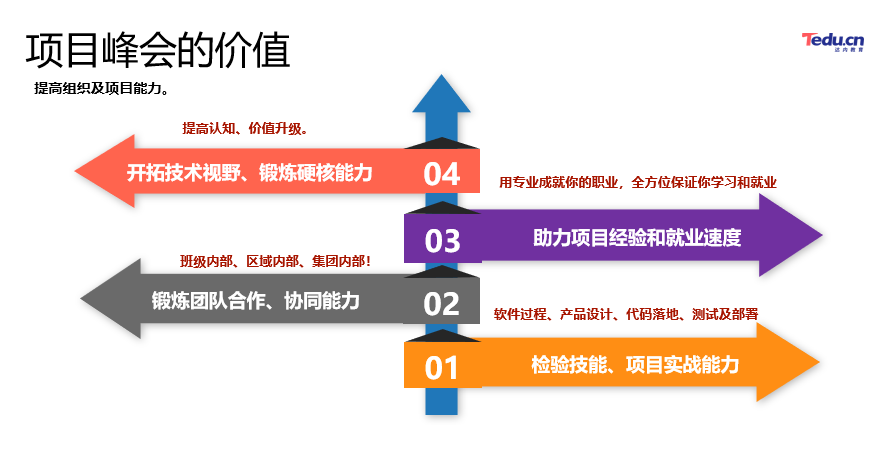

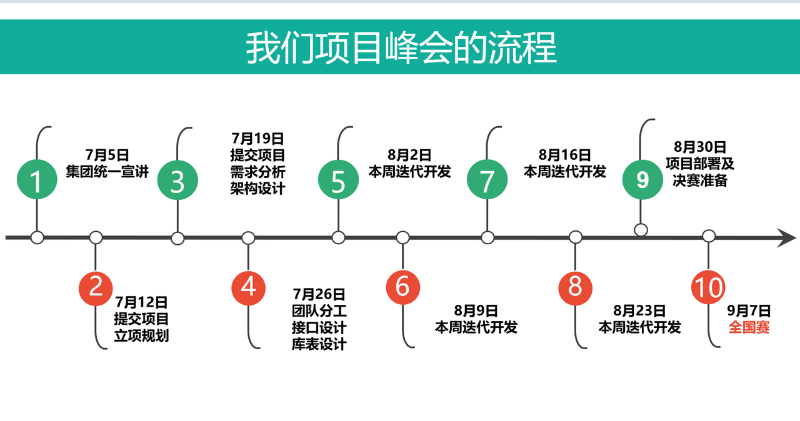

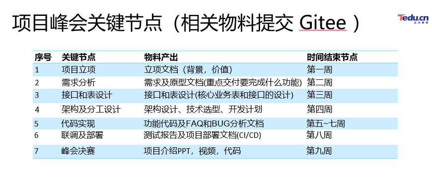

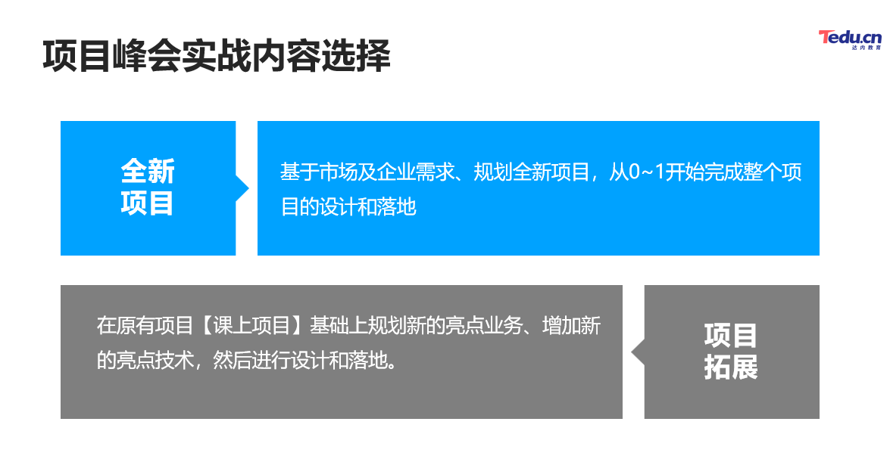

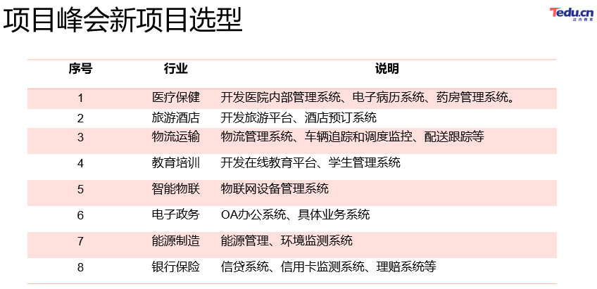

**https://www.axureshop.com/**

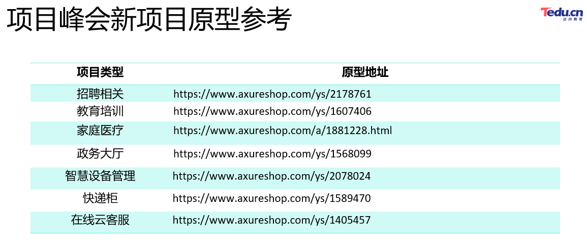

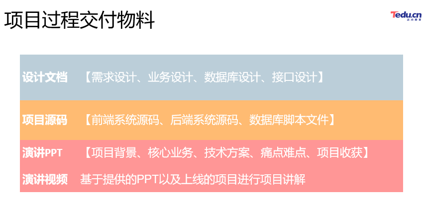

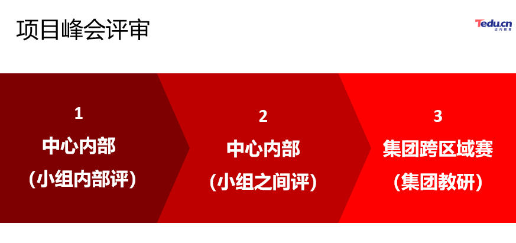

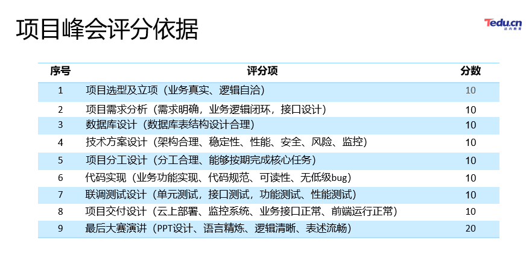

# 1. 搭建前端工程 ivos-web

## 1.1 **执行命令  vue create ivos-web  创建VUE项目** **[ VUE安装操作手册](https://d1ibml5ydvp.feishu.cn/docx/JLIDdDzDlot9lExkCLzc5D9jnA9?from=from_copylink)&#x20;**

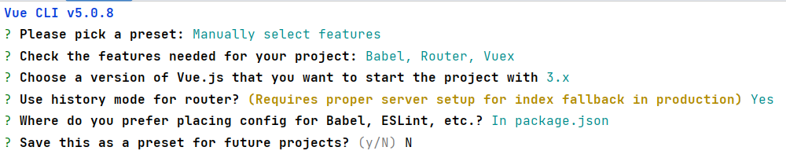

## 1.2 **在创建好的 ivos-web 目录下执行如下命令：**

**cd ivos-web 进入前端项目目录下**

**npm install element-plus  安装Element-Plus组件库**

## 1.3 配置项目

### 1.3.1 将v1项&#x76EE;**&#x20;main.js 内容全部复制到 ivos-web 工程中**

### 1.3.2 **在 package.json 中改端口号**

## 1.4 处理 ivos-web 项目结构

### 1.4.1 修改App.vue

### 1.4.2 文件异动

* 删除views文件夹下的AboutView.vue文件

* 在views文件夹下创建5个文件夹，依次是：

  * **user 用户模块**

  * **vehicle 车辆模块**

  * **dictionary 字典模块**

  * **geofence 围栏模块**

  * **schedule 调度模块**

### 1.4.3 创建前端文件

1. 按照图示结构创建如下文件:

2. 在每个文件的\<template>标签中都加一个&lt;h1&gt;XXX页&lt;/h1&gt;具体标题参照下方右侧文件与标题的对应关系

3. 确认每个文件的\<script>上都有setup

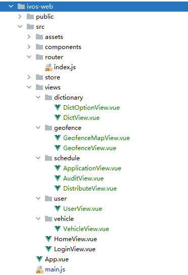

* **数据字典**

  * 字典项管理页 DictOptionView.vue

  * 字典管理页 DictView.vue

* **电子围栏**

  * 围栏地图页 GeofenceMapView.vue

  * 围栏管理页 GeofenceView.vue

* **调度管理**

  * 用车申请页 ApplicationView.vue

  * 申请审批页 AuditView.vue

  * 车辆分配页 DistributeView.vue

* **用户管理**

  * 用户列表页 UserView.vue

* **车辆管理**

  * 车辆列表页 VehicleView.vue

* HomeView.vue

* **登录页 LoginView.vue&#x20;**

### 1.4.4 修改router/index文件

* 由于上面的文件都有一部分共有顶部条和侧边栏

* 所以共有部分写在HomeView中,HomeView是父级,其他文件是子级 children:[{},{},{}]

* redirect:&#39;/user&#39; 表示默认重定向到用户列表页中

## 1.5 编辑HomeView.vue

## 1.6 编辑前端项目public文件夹下的index.html

注意:由于优先级的问题

* 需要给CSS加 !important

* 还需要以行内写法去掉body元素自带的外间距

## 1.7 启动项目并测试

1. http://localhost:9090/login

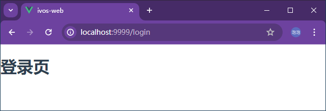

* http://localhost:9090 会默认重定向到 http://localhost:9090/user

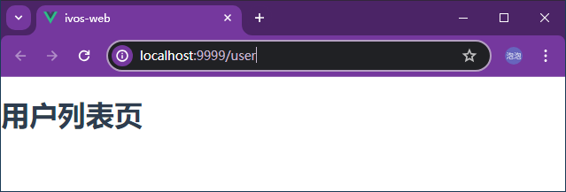

* http://localhost:9090/vehicle

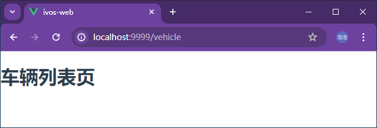

* http://localhost:9090/geofence

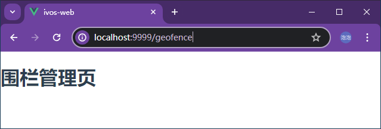

* http://localhost:9090/geofencemap

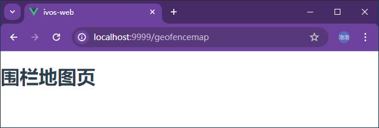

* http://localhost:9090/application

* http://localhost:9090/audit

* http://localhost:9090/distribute

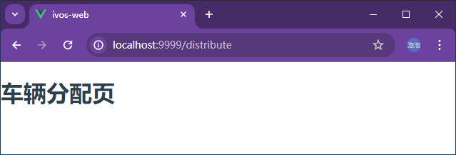

* http://localhost:9090/dict

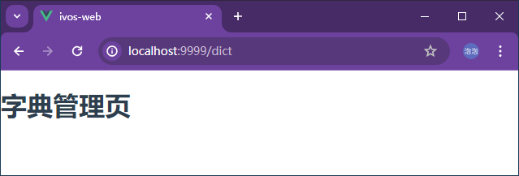

* http://localhost:9090/dictoption

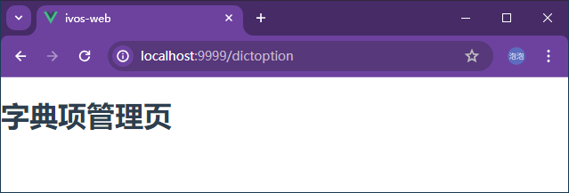

# 2. 搭建后端工程 ivos

## 2.1 创建Module

1. **在当前最外层根目录下，右键，选择 "New"-->"Module"--"Spring Initializer"-->选择"设置"->将初始化服务器地址设置为https://start.aliyun.com国内阿里云**

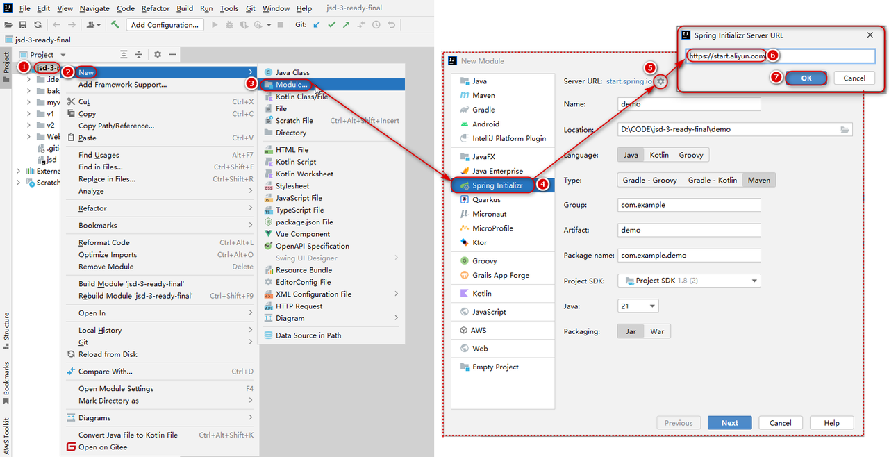

* **按照下图所示的内容创建 "ivos" 项目**

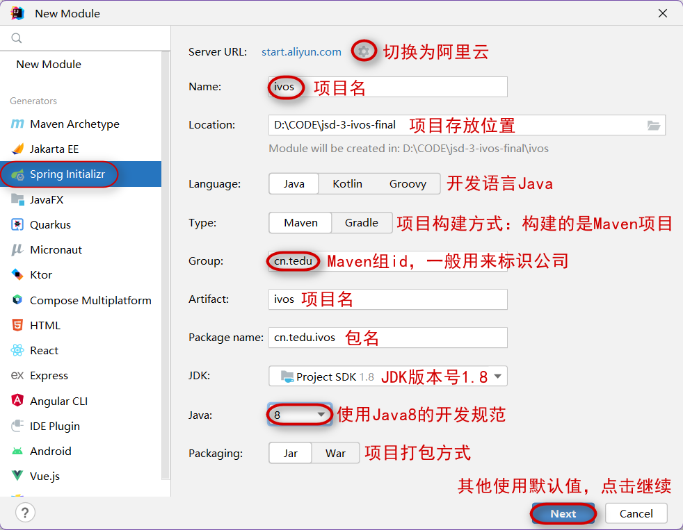

* **选择SpringBoot版本，以及添加需要的依赖**

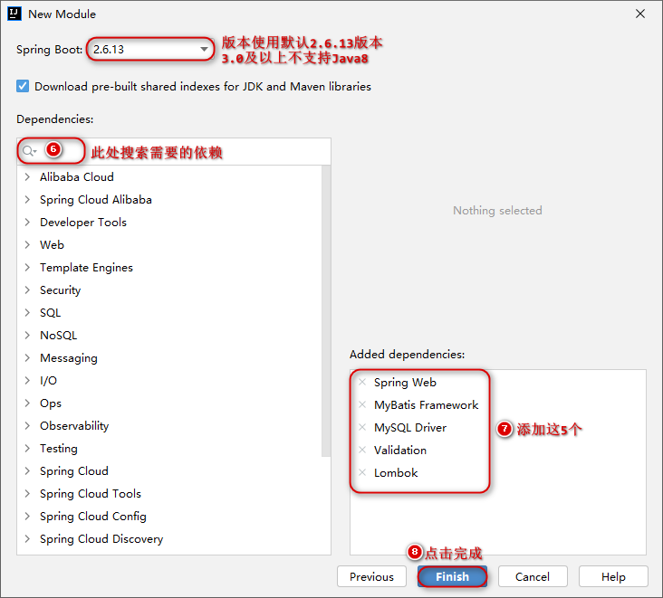

## 2.2 配置项目

### 2.2.1 pom.xml

**在 pom.xml 中复制之前阶段项目的 Knife4j 依赖，添加后刷新Maven**

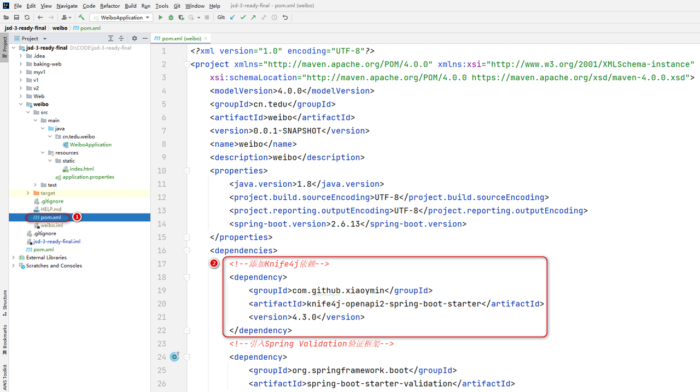

 **完整的 pom.xml 配置信息 **

**注意：添加完依赖后需要刷新Maven!**

**如果启动类没有运行按钮，可以右键 ivos 的pom.xml选择“添加为一个Maven项目”即可**

### 2.2.2 **application.properties**

将如下内容复制到 ivos 的 **src/main/resources/application.properties中，注意下面标黄的部分！**

## 2.3 项目结构搭建

### 2.3.1 **删除cn.tedu.ivos 包下的demos文件夹**

**位置：src/main/java/cn/tedu/ivos/demos/web**

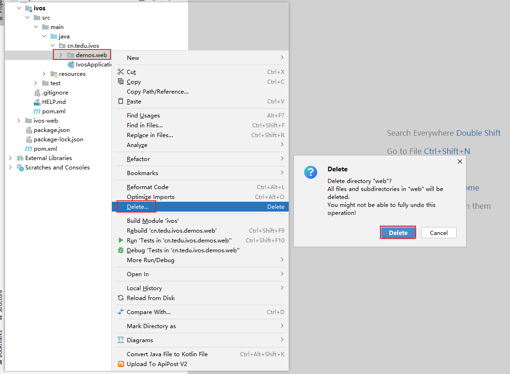

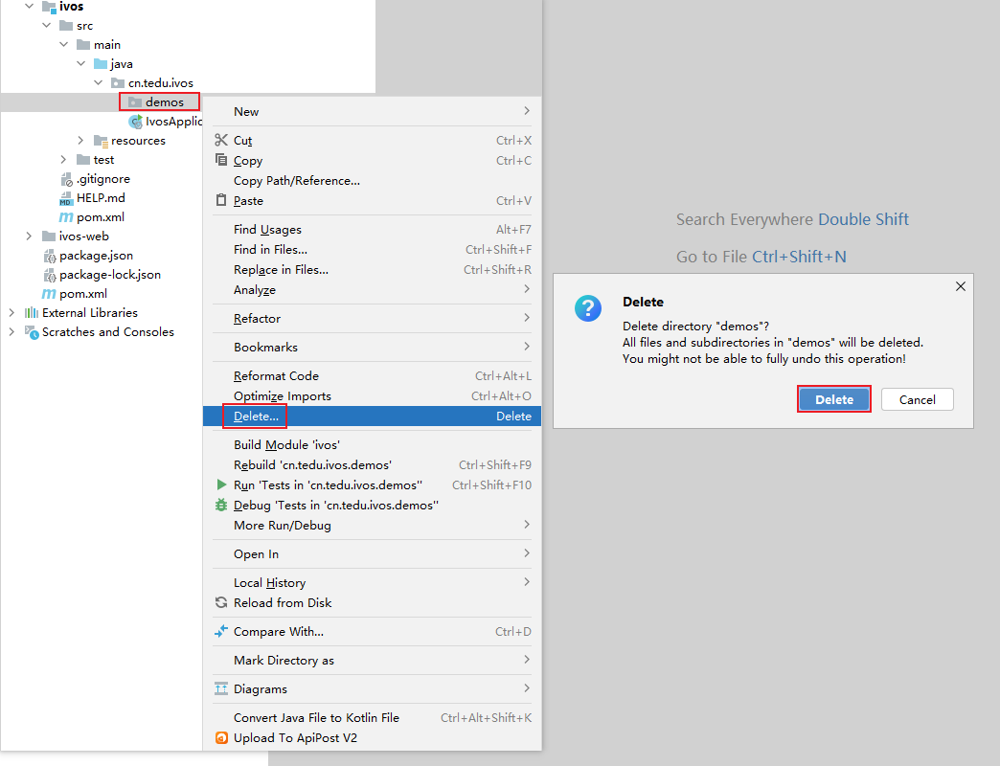

### 2.3.2 包结构构建

1. **在 cn.tedu.ivos 包下创建base基础工具包**

2. **在 cn.tedu.ivos.base 包下创建 config、response、exception 这3个包**

3. **按照图示进行构建：**

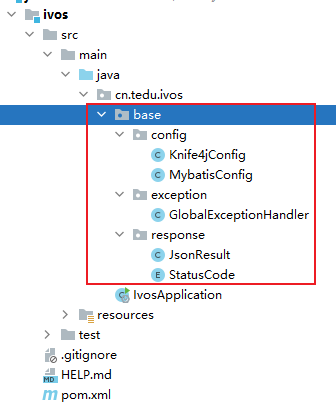

##### 1. 在config包下创建Knife4jConfig

##### 2.3.2.2 在config包下创建MybatisConfig

##### 2.3.2.3 在response包下创建StatusCode

##### 2.3.2.4 在response包下创建JsonResult

##### 2.3.2.5 在exception包下创建GlobalExceptionHandler

要求：此处后端项目可以成功启动

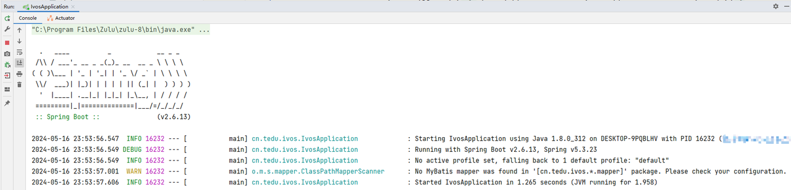

# 3. 前后端交互-用户登录

## 3.1 建库建表(用户表 user)

| 序号 | 字段名          | 字段类型        | 字段释义       | 示例数据                  |
| -- | ------------ | ----------- | ---------- | --------------------- |
| 1  | id           | bigint      | 用户id       | 1                     |
| 2  | username     | varchar(20) | 用户名        | 张三                    |
| 3  | password     | varchar(20) | 密码         | D6uK5eZt              |
| 4  | email        | varchar(50) | 邮箱         | lucy@163.com          |
| 5  | phone        | varchar(20) | 手机号        | 18811112222           |
| 6  | age          | int         | 年龄         | 18                    |
| 7  | gender       | varchar(10) | 性别 女0 男1   | 0                     |
| 8  | create\_time | datetime    | 创建时间       | 2024-01-01 00:00:00   |
| 9  | update\_time | datetime    | 更新时间       | 2024-01-01 00:00:00   |
| 10 | status       | varchar(10) | 状态 启用1 禁用0 | value:'1',label:'启用'  |
| 11 | level        | varchar(10) | 员工职级       | value:'10',label:'职员' |
| 12 | parent\_id   | bigint      | 上级领导id     | 1                     |

## 3.2 登录前端

### 3.2.1 配置确认

1. **确认views文件夹下有LoginView.vue文件**

2. **确认router/index.js中的路由文件**

### 3.2.2 前端代码

#### 1. **LoginView登录页面HTML**

#### 3.2.2.2 登录页面JS

**测试结果**

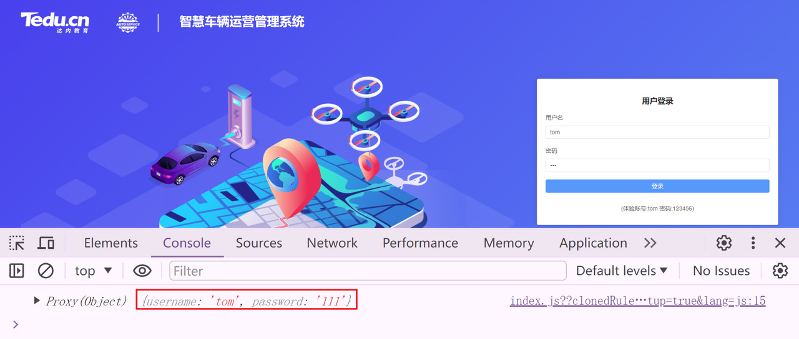

## 3.3 安装 axios

**注册需要向后端服务器发送请求，这里需要用到一个第三方工具axios**

**停止当前正在运行的项目，输入命令： npm install axios ,安装 axios ,安装完成后，重新启动项目**

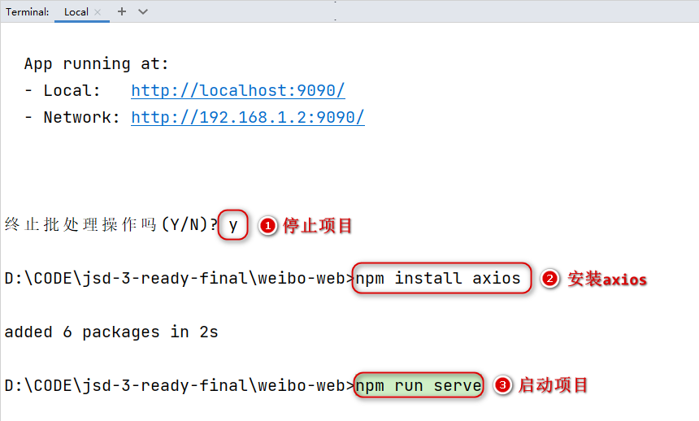

**利用axios给后端发请求**

## 3.4 登录后端

#### 1. 结构准备

1. **在 cn.tedu.ivos下创建 user 包 存放用户模块所有的代码**

2. **在 ivos.user 包下依次创建下图所示的包与文件**

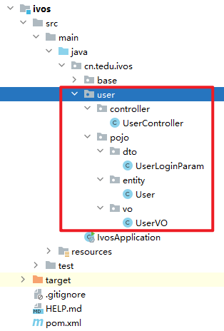

#### 3.4.2 User

#### 3.4.3 UserLoginParam

#### 3.4.4 UserVO

#### 3.4.5 UserController

1. **继续在user包下创建 controller 包，继续创建 UserController 类，然后开始编辑：**

2. **写完代码需要重启后端项目**

3. **在登录页面输入用户信息，点击登录按钮，发现报错：**

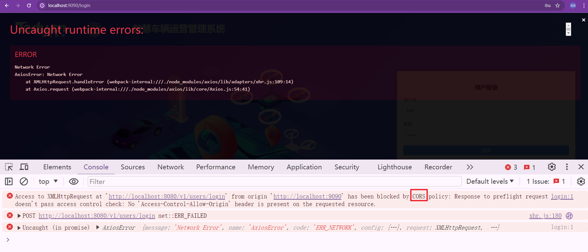

报错原因：请求被CORS策略拦截了

## 3.5 跨域问题

* **CORS (**&#x43;ross-Origin Resource Sharing **跨域资源共享)：当请求来自不同的主机地址、不同的端口号、服务器不一致时，都被认为是跨域请求**

  * 如: http://localhost:9090  -->  http://localhost:8080/v1/users/login

  * 之前的微博项目没有出现跨域问题是因为前后端在一起，是一个项目，使用同一个端口号，但现在我们前后端分离，是两个项目，使用两个端口号

* 我们目前使用&#x7684;** S S M** 结构，其中&#x7684;** SpringMVC **&#x6846;架默认禁止跨域请求，即禁止来自于其它网站的请求，只能自己内部资源的互相请求，避免来自外部的风险

  * 比如正在浏览百度时，从后台给你的银行网站发请求，这些请求银行肯定是禁止的，即使是从其它地方给银行发请求，也必须满足银行指定的条件和授权才可以，为了安全

* 我们的请求来自前端工程，前端工程的端口号是9090，给后端工程8080发送请求，那这次请求就被认为是一次跨域请求

**解决办法：**

1. **在 config 包下新建一个 WebConfig 类**

2. **编写自己的请求策略代码，写完以后重启后端工程**

3. **在浏览器注册页面填写表单测试信息，点击提交**

4. **可以在控制台看到成功状态码与对应消息**

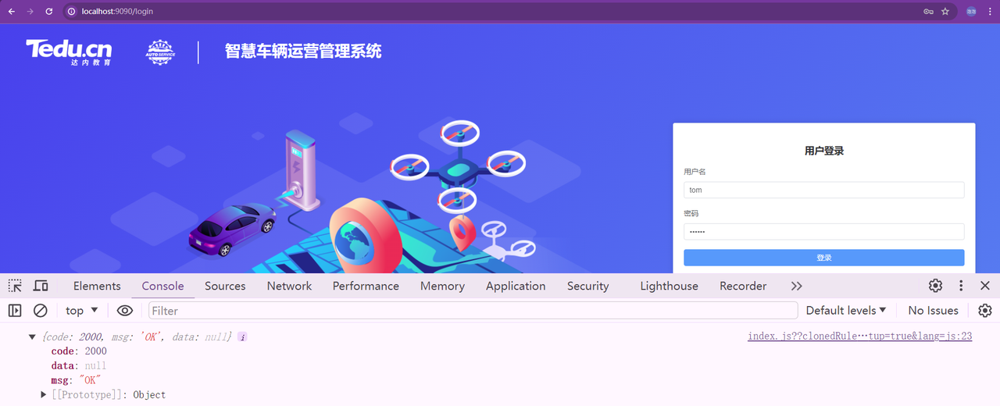

* **在IDEA后端控制台也可以看到打印出来的用户信息**

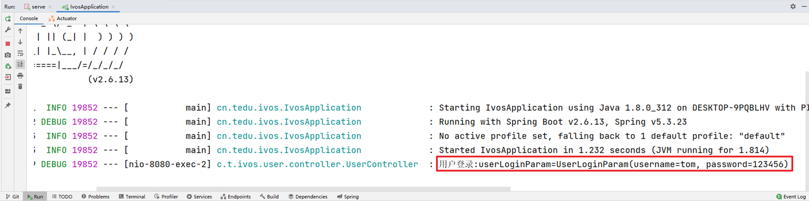

## 3.6 两层架构与三层架构

### 3.6.1 后端两层架构

* **控制层 Controller&#x20;**: 负责接受请求和响应请求，同时把业务相关的代码也写在了里面 【服务员兼大厨:既要点餐送餐，又要做饭】

* **数据访问层 Mapper** : 负责处理和数据库相关的操作

**弊端：**&#x7531;于把业务代码也写在了控制层，如果业务比较复杂，会导致Controller比较臃肿，而且不利于业务的复用，可能某些业务在不同的控制层都会用到

### 3.6.2 后端三层架构

* **控制层 Controller&#x20;**: 负责接受请求和响应请求 【饭店服务员--点餐送餐】

* **业务层 Service ：**&#x53EA;负责业务相关代码 【厨师--负责做饭】

* **数据访问层 Mapper** : 负责处理和数据库相关的操作

### 3.6.3 后端三层架构的好处

1. 分工明确，Controller 和 Mapper 都有自己明确的职责，这两部分不需要关心具体的业务流程

2. Service 业务层的代码应该与框架无关，不管控制层与数据访问层使用什么框架，处理数据的业务流程与规则是不变的，如登录注册的流程一般都是固定的

&#x20;    现在Controller控制层使用了SpringMVC,Mapper数据访问层使用了Mybatis，不管将来更换了什么新框架，业务层的代码是不需要改变的

3. 将实现某个业务的代码封装了起来，增加了代码的复用性

## 3.7 登录业务完成

### 3.7.1 **在 cn.tedu.ivos.user 下创建 service 包**

### 3.7.2 **在 service 包下创建 UserSevice 接口**

这个是用户业务相关接口文件,可以在里面定义 login 抽象方法

### 3.7.3 **创建 service.impl 包，放业务接口实现类**

### 3.7.4 **在 impl 包下创建  UserServiceImpl 实现类**

实现 UserService 业务接口中的抽象方法，注意：业务实现类需要添加 @Service 注解

*主业务的异常情况需要通过抛异常的方式来处理,业务层是不能直接返回结果的，所以我们需要自定义一个业务层异常类*

### 3.7.5 **在 exception 包下创建 ServiceException 类**

### 3.7.6 **在全局异常处理器 GlobalExceptionHandler 中添加ServiceException相关的方法**

### 3.7.7 在user包下创建mapper包,并在mapper包下创建接口UserMapper

### 3.7.8 在 ivos/src/main/resources下创建mappers包,并创建UserMapper.xml

### 3.7.9 **用三层架构的方式，完成UserController**

### 3.7.10 **效果：**

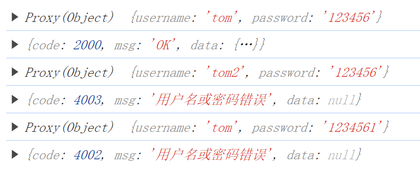

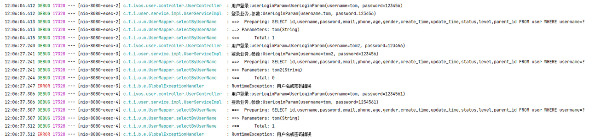

### 3.7.11 **在LoginView.vue 中处理下前端页面的结果显示**

* **response.data拿到的是后端响应的结果JsonResult**

* **response.data. data拿到的是JsonResult中的数据userVO**

### 3.7.12 **梳理完整流程图**

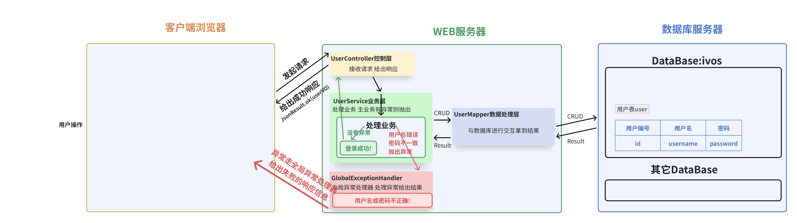

### 3.7.13 登录功能测试

* 用户名与密码正确，提示 "登录成功！" 并跳转至用户管理页

* 用户名或密码错误，提示 "用户名或密码错误"！并清空输入框

## 3.8 引入LocalStorage

### 3.8.1 基本介绍

**localStorage:&#x20;**

**可以看作是一个容器，是前端进行数据持久化的方式之一**,它&#x4EE5;**字符串键值对的形式**&#x5C06;数据持久保存在磁盘中，即使浏览器或PC关闭，数据也还在，可存可取，起到数据共享的作用

**存储数据写法：**

* **localStorage .setItem(&#39; user &#39;,JSON.stringify(user));**

* **localStorage.user=值;**

* **JSON.stringify(user)**&#x53EF;以将JS对象user转为JSON格式的字符串

**获取数据写法：**

* **localStorage. getItem (&#39; user &#39;);**

* **localStorage . user  **

* **通过存时的键名来取值，取出来是字符串格式**

* **可以JSON.parse(localStorage.user)转回JS对象**

注意：以打点的方式存取值并不是推荐的写法，个别浏览器可能会不生效，若不生效，就使用get set的方式

**清空数据：**

* **localStorage .clear()**

> 之前大家使用session保存数据比较麻烦，因为session只能存半个小时，而且工程重启后session数据就没了，我们这里使用localStorage在前端就可以直接拿到数据，测试会更方便一些
>
> 但这两种方案都不是最终的解决方案，我们后面会讲解更高级的解决方案

> **session与cookie的区别**
>
> 作用范围不同：cookie保存在客户端，session保存在服务端
>
> 有效期不同：cookie可设置保存时长，session一般失效时间较短，客户端关闭或者session超时都会失效
>
> 隐私策略不同：cookie存储在客户端，比较容易遭到不法获取。session存储在服务端，比cookie安全
>
> 存储大小不同：单个cookie保存的数据不能超过4k，session可存储数据远大于cookie

> **HTML5的webStorage提供了两种API，localStorage（本地存储）和sessionStorage（会话存储）**
>
> 生命周期：
>
> * localStorage:localStorage的生命周期是永久的，关闭页面或浏览器之后localStorage中的数据也不会消失。除非主动删除数据，否则数据永远不会消失
>
> * sessionStorage：sessionStorage的生命周期是在当前会话下有效。在同源窗口中始终存在，只要这个浏览器窗口没有关闭，即使刷新页面或者进入同源的另一个页面，数据依然存在。但在关闭浏览器后会被销毁。
>
> 存储位置：存储大小都是5MB，位置都保存在客户端，不与服务器进行交互通信
>
> 应用场景
>
> * localStorage：常用于长期登录(判断用户是否已登录),适合长期存储在本地的数据
>
> * sessionStorage：敏感账号一次性登录，sessionStorage存储的数据更偏向业务一些

### 3.8.2 LoginView 前端登录页面

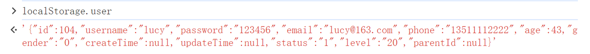

登录成功后,可以从localStorage中获取后端返回的当前登录的用户数据

## 3.9 编辑HomeView完成页面共有部分

### 3.9.1 HomeView页面基础结构

### 3.9.2 左侧菜单栏的顶部条与菜单项

### 3.9.3 右侧顶部条 折叠图标+显示登录用户名

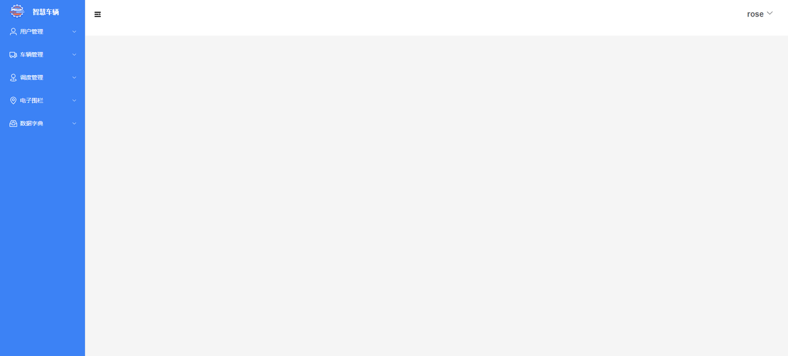

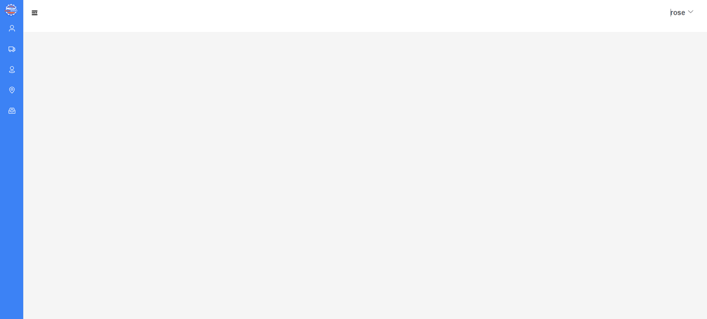

### 3.9.4 配置全局方法getUser

在前端工程main.js中配置全局方法,获取当前登录的用户信息

### 3.9.5 面包屑导航、右侧可变主体

## 3.10 前后端交互流程

1. **前端工程需要利用axios给后端发请求**

   1. 前端工程需要npm install axios且使用时需要导入

   2. 会遇到跨域问题CORS=>配置自己的放行策略WebConfig

   3. **.then( (response)=&gt;{回调函数,处理接收到的后端响应数据} )**

   4. **response.data 是后端响应的JsonResult**

   5. **response.data .data 是JsonResult的data属性值**

2. **如果前端传过来的是对象参数**

   1. 后端需要准备DTO层对象接收参数

   2. Controller层方法上需要加@RequestBody

3. **控制层与业务层需要使用@Slf4j的log.debug打印日志**

4. **控制层**

   1. 负责接收请求+给前端响应

   2. 具体的业务逻辑交给业务层完成

5. **业务层**

   1. 只负责完成业务逻辑

   2. 接口定义待实现的功能

   3. 实现类完成具体代码=> @Service + implements接口

   4. 业务层如果正常执行,执行完毕会将结果返回给controller

   5. 业务层如果有问题

      1. 需要抛出异常,不能直接给前端响应结果

      2. 如果抛出了异常,走全局异常处理器,由它来直接给前端响应结果

6. **数据层**

   1. XXXMapper接口上加@Repository

   2. XXXMapper接口的方法名是XXXMapper.xml中SQL的id值

7. **根据业务进行拆分**

   1. base 基础工具包: config response exception...

   2. user 用户模块: 用户相关的内容都在此包下 controller service mapper pojo

   3. vehicle 车辆模块: 车辆相关的内容都在此包下 controller service mapper pojo

8. **前端localStorage 以字符串键值对的方式维护数据**

   1. JSON.parse(localStorage.user)=>将字符串user转回JS对象

   2. JSON.stringify(response.data.data)=>将userVO对象转为JSON字符串

   3. 在前端的main.js中配置了全局方法,方便在各个页面获取已登录的用户数据

   4. 页面的获取方式: const user = ref(**getUser()**)

# 4. 员工模块

## 4.1 新增员工

### 4.1.1 前端部分Userview

#### 4.1.1.1 新增弹窗html部分

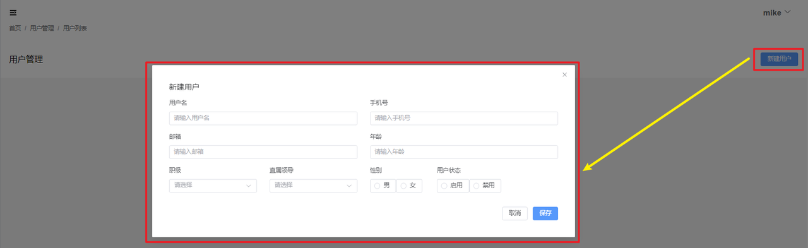

#### 4.1.1.2 新增弹窗绑定与js部分

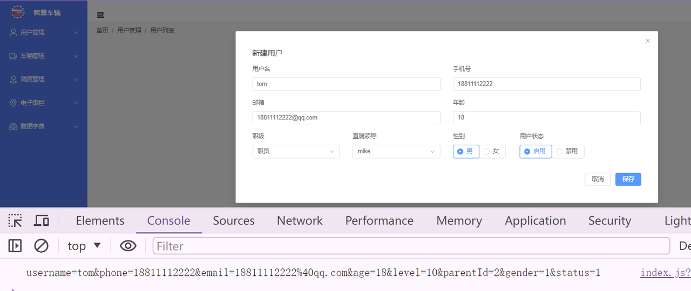

#### 4.1.1.3 配置main.js全局根路径

**修改之前的登录请求url**

#### 4.1.1.4 编辑UserView

#### 4.1.1.5 新增UserSaveParam

#### 4.1.1.6 编辑UserController

**效果：**

在前端弹窗输入数据，点击"保存"按钮，后端控制台可看到对应的日志信息

用户保存:userSaveParam=UserSaveParam(id=**null**, username=tom, email=tom@qq.com, phone=18811112222, age=16, gender=0, status=0, level=10, parentId=1)

#### 4.1.1.7 编辑UserService

#### 4.1.1.8 编辑UserServiceImpl

#### 4.1.1.9 编辑UserMapper

#### 4.1.1.10 UserMapper.xml

测试效果:除更新时间以外，其它数据均可成功插入user表中，用户的默认密码为123456

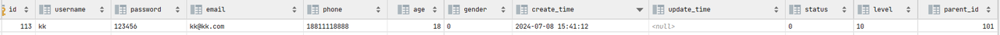

## 4.2 处理弹窗关闭问题

编辑UserView.vue 其它页面也是类似的处理方式

效果:&#x20;

* 点击"取消按钮"、"×"、弹窗外部都执行自定义的弹窗关闭方法handleClose

* 确认关闭后,清空在表单上填的表单数据

## 4.3 引入qs框架

**qs(Query String)查询字符串框架**

**作用：将JS对象转为查询字符串格式**

* **标黄的部分就是查询字符串格式 http://localhost:8080/login?username=tom&amp;password=1 23456 **

* **写法：qs.stringify(user.value);**

* **结果：username=tom&amp;password=123456**

**安装步骤：**&#x505C;止现在运行的前端项目，执行命令：** npm install qs ** 即可，安装完毕重新启动前端项目

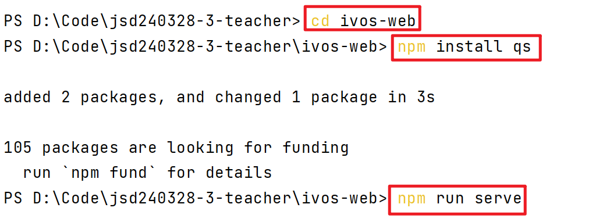

**为什么要引入qs框架？**

* 前端给后端发请求时，会携带一个JS对象user,后端为了拿到JS对象中的数据，必须在方法形参前添&#x52A0;**@RequestBody注解**

* 这会导致Controller中有的方法有这个注解(因为前端请求里是JS对象),有的方法没有这个注解，很混乱

* 如果我们想统一不添加@RequestBody注解，就需要保证前端请求中的实参不是JS对象的格式

* 这时就需要**使用 qs 框架把 JS 对象转为查询字符串格式**了

## 4.4 员工列表

### 4.4.1 前端部分

#### 4.4.1.1 搜索卡片与用户表格

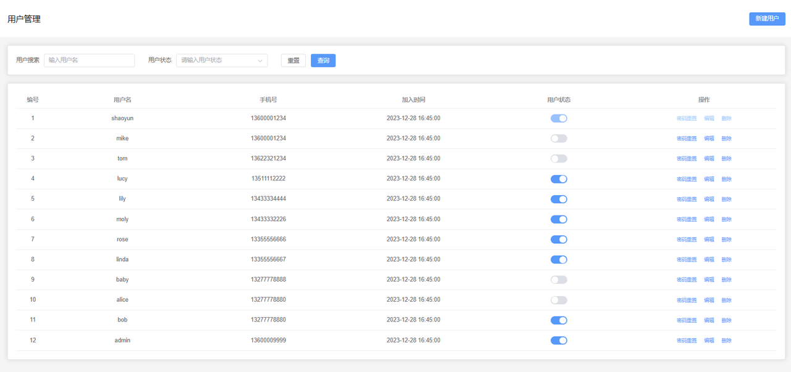

### 4.4.2 后端部分

#### 4.4.2.1 创建UserQuery

#### 4.4.2.2 UserController

#### 4.4.2.3 UserService

#### 4.4.2.4 UserMapper

#### 4.4.2.5 UserMapper.xml

### 4.4.3 测试效果

用户表格成功显示所有用户数据，并且可以根据用户名模糊查询或用户状态加载新的用户表格数据

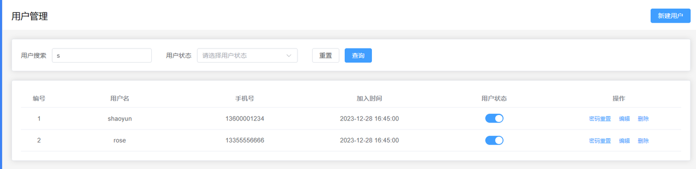

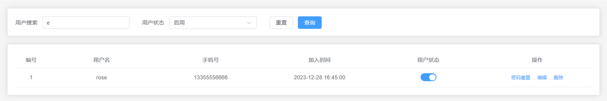

## 4.5 直属领导数据加载

### 4.5.1 前端部分

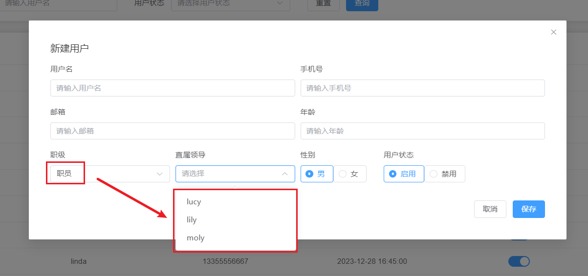

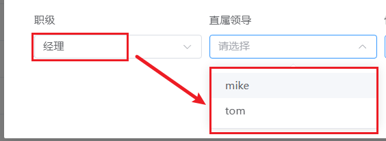

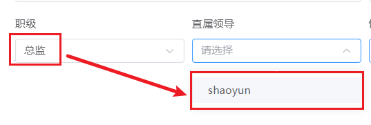

## 4.6 密码重置

### 4.6.1 前端部分

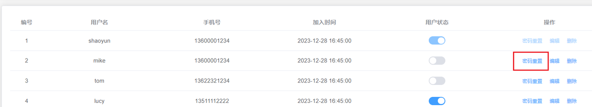

### 4.6.2 后端部分

#### 1. UserController

#### 4.6.2.2 UserService

#### 4.6.2.3 UserMapper

#### 4.6.2.4 UserMapper.xml

#### 4.6.2.5 测试效果

点击密码重置可将当前登录用户的密码重置为root

## 4.7 编辑员工


### 4.7.1 测试效果

弹窗标题修改为"*编辑员工*",且当前行员工数据可正常回显在弹窗上,员工信息能正常修改,且员工表格随之更新


## 4.8 修改员工状态

### 4.8.1 后端部分

#### 4.8.1.1 UserController

#### 4.8.1.2 UserService

#### 4.8.1.3 UserMapper

### 4.8.2 测试效果

点击switch开关组件可切换用户的禁用启用状态

## 4.9 员工删除

### 4.9.1 前端部分

### 4.9.2 后端部分

#### 4.9.2.1 UserController

#### 4.9.2.2 UserService

#### 4.9.2.3 UserMapper

#### 4.9.2.4 UserMapper.xml

### 4.9.3 测试效果

点击用户表格操作列的删除按钮，可删除当前行数据，并重新加载用户数据列表页面

# 5. 车辆模块

## 5.1 创建车辆表(vehicle)

| 序号 | 字段名                    | 字段类型         | 字段释义               | 示例数据                                                                                           |
| -- | ---------------------- | ------------ | ------------------ | ---------------------------------------------------------------------------------------------- |
| 1  | id                     | bigint       | 车辆id               | 1                                                                                              |
| 2  | brand                  | varchar(30)  | 车辆品牌               | 宝马                                                                                             |
| 3  | license                | varchar(20)  | 车牌号                | 京A88888                                                                                        |
| 4  | model                  | varchar(100) | 车辆型号               | 宝马X5                                                                                           |
| 5  | code                   | varchar(100) | 车辆识别码              | 12457885214                                                                                    |
| 6  | displacement           | varchar(20)  | 车辆排量               | 2.5L                                                                                           |
| 7  | status                 | varchar(10)  | 车辆状态：空闲1 占用2       | 空闲                                                                                             |
| 8  | type                   | varchar(50)  | 车辆类型               | value:'10',label:'轿车'                                                                          |
| 9  | color                  | varchar(10)  | 车辆颜色               | value:'10',label:'白'                                                                           |
| 10 | kilometers             | varchar(10)  | 里程数                | 2000                                                                                           |
| 11 | reg\_time              | datetime     | 上牌时间               | 2022-12-19 19:00:00                                                                            |
| 12 | buy\_time              | datetime     | 购买时间               | 2022-10-19 16:00:00                                                                            |
| 13 | price                  | varchar(10)  | 购买价格               | 350000                                                                                         |
| 14 | battery\_type          | varchar(50)  | 电池类型               | value:'60',label:'三元锂' |
| 15 | create\_time           | datetime     | 创建时间               | 2023-12-26 08:15:32                                                                            |
| 16 | update\_time           | datetime     | 更新时间               | 2023-12-26 08:15:32                                                                            |
| 17 | geofence\_bind\_status | varchar(10)  | 电子围栏绑定状态 已绑定1 未绑定0 | 1                                                                                              |
| 18 | geofence\_id           | bigint       | 电子围栏id             | 4                                                                                              |

## 5.2 前端页面整体html


### 5.2.1 按照下图创建对应文件


### 5.2.2 创建Vehicle

### 5.2.3 创建VehicleVO

## 5.3 车辆列表

### 5.3.1 前端部分


### 5.3.2 后端部分

#### 5.3.2.1 创建VehicleQuery

#### 5.3.2.2 创建VehicleController

#### 5.3.2.3 创建VehicleService

#### 5.3.2.4 创建VehicleServiceImpl

#### 5.3.2.5 创建VehicleMapper

#### 5.3.2.6 创建VehicleMapper.xml

### 5.3.3 测试效果

车辆表格成功显示用户数据，并且可以根据查询卡片条件加载新的车辆表格数据


### 5.3.4 车辆类型、车辆状态、电池类型转换为文字显示

**车辆类型**

* 轿车 10

* 货车 20

* 客车 30

* 挂车 40

**车辆状态**

* 空闲 1

* 占用 2

* 维修 3 (可扩展)

**电池类型**

* 铅酸蓄电池 10

* 镍氢电池 20

* 钠硫电池 30

* 二次锂电池 40

* 空气电池 50

* 三元锂电池 60

* 碱性燃料电池 70


## 5.4 车辆新增

### 5.4.1 前端部分

### 5.4.2 后端部分

#### 5.4.2.1 创建VehicleSaveParam

#### 5.4.2.2 VehicleController

#### 5.4.2.3 VehicleService

#### 5.4.2.4 VehicleServiceImpl

#### 5.4.2.5 VehicleMapper

#### 5.4.2.6 VehicleMapper.xml

### 5.4.3 测试效果

**新增车辆数据成功存入数据库中**

**注意：新增车车辆的更新时间、电子围栏绑定状态、绑定的电子围栏编号是null**

> **@DateTimeFormat(pattern="yyyy-MM-dd")**
>
> **什么作用？怎么使用？有什么区别?**
>
> 这两个注解也分别服务于不同的目的：
>
> @JsonFormat：属于Jackson库，用于在序列化和反序列化JSON时控制日期和时间的格式。它定义了日期在JSON中如何被编码和解码。例如：
>
> 在这里，buyTime字段会以JSON格式按照"yyyy-MM-dd"的格式，使用东八区时区"GMT+8"。
>
> @DateTimeFormat： 主要用于HTTP请求和响应的日期时间格式化。它在处理HTTP参数或者响应体时，确保日期和时间按照指定的格式解析或输出。例如：
>
> 区别：
>
> 作用范围：@JsonFormat主要用于JSON序列化/反序列化，而@DateTimeFormat主要针对HTTP上下文中的日期时间格式。
>
> 依赖库：@JsonFormat依赖于Jackson，@DateTimeFormat是Spring的一部分。
>
> 时区处理：@JsonFormat可以指定时区，而@DateTimeFormat通常不直接处理时区，而是依赖于Spring MVC的全局配置或者方法级别的配置来处理时区转换。

### 5.4.4 前端优化

## 5.5 车辆编辑

点击表格操作列的"编辑"按钮,显示"编辑车辆"弹窗,回显本车辆的所有信息,弹窗中的所有字段均可以改值


## 5.6 删除车辆

### 5.6.1 前端部分

### 5.6.2 后端部分

#### 5.6.2.1 VehicleController

#### 5.6.2.2 VehicleService

#### 5.6.2.3 VehicleServiceImpl

#### 5.6.2.4 VehicleMapper

#### 5.6.2.5 VehicleMapper.xml

### 5.6.3 测试效果

点击删除操作，可成功将车辆信息删除

## 5.7 优化

# 6. 电子围栏模块

## 6.1 建库建表(电子围栏表geofence)

<table><colgroup><col width="50"><col width="160"><col width="94"><col width="244"><col width="395"></colgroup>
<thead>
<tr>
<th>序号</th>
<th>字段名</th>
<th>字段类型</th>
<th>字段释义</th>
<th>示例数据</th>
</tr>
</thead>
<tbody>
<tr>
<td>1</td>
<td>id</td>
<td>bigint</td>
<td>电子围栏id</td>
<td>1</td>
</tr>
<tr>
<td>2</td>
<td>name</td>
<td>varchar(50)</td>
<td>电子围栏名称</td>
<td>化工品运输围栏</td>
</tr>
<tr>
<td>3</td>
<td>status</td>
<td>varchar(10)</td>
<td>电子围栏状态 启用1 禁用0</td>
<td>value:'1',label:'启用'</td>
</tr>
<tr>
<td>4</td>
<td>position</td>
<td>text</td>
<td>电子围栏坐标点<blockquote>

radius 半径

latitude 圆心纬度(横)

longitude 圆心经度(竖)

rectangle 长方形

recPoints 顶点

</blockquote></td>
<td>{"type":"rectangle","recPoints":"116.37883388478262-39.91607152946697,116.38896677093518-39.91607152946697,116.38896677093518-39.91186556472842,116.37883388478262-39.91186556472842"} {"type":"circle","latitude":"39.91059265566227","radius":"491","longitude":"116.43445696196046"}</td>
</tr>
<tr>
<td>5</td>
<td>create_time</td>
<td>datetime</td>
<td>创建时间</td>
<td>2024-12-26 08:15:38</td>
</tr>
<tr>
<td>6</td>
<td>update_time</td>
<td>datetime</td>
<td>更新时间</td>
<td>2024-12-26 08:15:38</td>
</tr>
</tbody>
</table>

## 6.2 电子围栏页GeofenceView.vue 整体html


## 6.3 后端部分

### 6.3.1 按照下图创建对应文件


### 6.3.2 创建Geofence

### 6.3.3 创建GeofenceQuery

### 6.3.4 创建GeofenceVO

## 6.4 围栏列表


### 6.4.1 前端部分 GeofenceView

### 6.4.2 后端部分

#### 1. GeofenceController

#### 6.4.2.2 GeofenceService

#### 6.4.2.3 GeofenceServiceImpl

#### 6.4.2.4 GeofenceMapper

#### 6.4.2.5 GeofenceMapper.xml

### 6.4.3 测试效果

可以在页面中看到电子围栏数据列表


还可以根据搜索条件进行查询


## 6.5 显示已绑定车辆


### 修改GeofenceView

## 6.6 移除已绑定车辆


### 6.6.1 前端部分 GeofenceView

### 6.6.2 后端部分

#### 6.6.2.1 VehicleController

#### 6.6.2.2 VehicleService

#### 6.6.2.3 VehicleServiceImpl

#### 6.6.2.4 VehicleMapper

#### 6.6.2.5 VehicleMapper.xml

### 6.6.3 测试效果

可以在“已绑定车辆”弹窗中移除车辆,有成功消息提示,但移除后已绑定车辆列表没有刷新

## 6.7 添加绑定车辆


### 6.7.1 前端部分 GeofenceView

### 6.7.2 后端部分

#### 6.7.2.1 VehicleController

#### 6.7.2.2 VehicleService

#### 6.7.2.3 VehicleServiceImpl

#### 6.7.2.4 VehicleMapper

### 6.7.3 测试效果

可以给围栏绑定车辆

### 6.7.4 优化前端 GeofenceView

但有个问题：关闭可绑定车辆列表后，已绑定车辆表中没有显示我们刚刚添加的车辆信息


需要关闭所有弹窗再次打开才出现


这样很不方便，我们需要在内层关闭弹窗时加载已绑定的车辆

## 6.8 绘制围栏

### 6.8.1 前端部分 GeofenceView

点击新建围栏，跳转至电子围栏地图页

### 6.8.2 GeofenceMapView

**我们需要在电子围栏地图页实现：**

* **地图绘制**

* **地图绘制控件添加**

* **获取圆形围栏数据**

* **获取矩形围栏数据**

[** 百度地图围栏绘制**](https://d1ibml5ydvp.feishu.cn/docx/ZxHPdoJuAoeHTpxoQDUc8C9gnZe?from=from_copylink)


## 6.9 新增围栏(围栏名称,围栏数据)


### 6.9.1 新增围栏弹窗

### 6.9.2 创建GeofenceParam

### 6.9.3 GeofenceController

### 6.9.4 GeofenceService

### 6.9.5 GeofenceMapper

### 6.9.6 GeofenceMapper.xml

## 6.10 修改围栏状态


**修改 GeofenceView**

更新的后端新增已经写过了,就不用再写了

## 6.11 删除围栏


### 6.11.1 前端部分 GeofenceView

### 6.11.2 后端部分

#### 6.11.2.1 GeofenceController

#### 6.11.2.2 GeofenceService

#### 6.11.2.3 GeofenceMapper

#### 6.11.2.4 GeofenceMapper.xml

### 6.11.3 测试效果

可以成功删除围栏，且表格数据随之变化，注意：若围栏上有车辆，需要移除所有已绑车辆再删除！

# 7. 字典模块

## 7.1 创建字典表(dict)

| 序号 | 字段名          | 字段类型        | 字段释义 | 示例数据                |
| -- | ------------ | ----------- | ---- | ------------------- |
| 1  | id           | bigint      | 自增ID | 1                   |
| 2  | name         | varchar(64) | 字典名称 | 电池类型                |
| 3  | code         | varchar(64) | 字典编码 | batbatteryType      |
| 4  | remark       | text        | 备注信息 | 车辆的电池类型             |
| 5  | create\_time | datetime    | 创建时间 | 2022-12-15 08:15:38 |
| 6  | update\_time | datetime    | 更新时间 | 2022-12-15 08:15:38 |

## 7.2 前端页面整体html


## 7.3 创建后端项目结构与POJO层


### 7.3.1 Dict

### 7.3.2 DictQuery

### 7.3.3 DictVO

## 7.4 字典列表


### 7.4.1 DictView.vue

### 7.4.2 DictController

### 7.4.3 DictService

### 7.4.4 DictServiceImpl

### 7.4.5 DictMapper

### 7.4.6 DictMapper.xml

## 7.5 新增字典


### 7.5.1 DictView.vue

### 7.5.2 DictController

### 7.5.3 DictService

### 7.5.4 DictServiceImpl

### 7.5.5 DictMapper

### 7.5.6 DictMapper.xml

## 7.6 编辑字典


### 7.6.1 DictView.vue

## 7.7 删除字典


### 7.7.1 DictView.vue

### 7.7.2 DictController

### 7.7.3 DictService

### 7.7.4 DictServiceImpl

### 7.7.5 DictMapper

### 7.7.6 DictMapper.xml

### 7.7.7 DictView.vue

# 8. 字典项模块

## 8.1 创建字典项表(dict\_option)

| 序号 | 字段名          | 字段类型        | 字段释义  | 示例数据                |
| -- | ------------ | ----------- | ----- | ------------------- |
| 1  | id           | bigint      | 字典项id | 1                   |
| 2  | dict\_id     | bigint      | 字典id  | 1                   |
| 3  | label        | varchar(64) | 字典项名称 | 三元锂电池               |
| 4  | value        | varchar(64) | 字典项值  | 1                   |
| 5  | sort         | int(11)     | 字典项排序 | 1                   |
| 6  | remark       | text        | 备注信息  | 电池类型为三元锂电池          |
| 7  | create\_time | datetime    | 创建时间  | 2022-12-15 08:15:38 |
| 8  | update\_time | datetime    | 更新时间  | 2022-12-15 08:15:38 |

## 8.2 前端页面整体html


### 8.2.1 DictOptionView.vue

### 8.2.2 DictView.vue

## 8.3 字典项后端结构搭建


### 8.3.1 DictOption

### 8.3.2 DictOptioinQuery

### 8.3.3 DictOptionVO

## 8.4 字典项查询


### 8.4.1 DictOptionView.vue

### 8.4.2 DictOptionController

### 8.4.3 DictOptionService

### 8.4.4 DictOptionServiceImpl

### 8.4.5 DictOptionMapper

### 8.4.6 DictOptionMapper.xml

## 8.5 字典项新增


### 8.5.1 DictOptionView.vue

### 8.5.2 DictOptionController

### 8.5.3 DictOptionService

### 8.5.4 DictOptionServiceImpl

### 8.5.5 DictOptionMapper

### 8.5.6 DictOptionMapper.xml

## 8.6 字典项编辑

### 8.6.1 DictOptionView.vue

## 8.7 字典项删除


### 8.7.1 DictOptionView.vue

### 8.7.2 DictOptionController

### 8.7.3 DictOptionService

### 8.7.4 DictOptionServiceImpl

### 8.7.5 DictOptionMapper

### 8.7.6 DictOptionMapper.xml

## 8.8 完善：字典删除

删除字典时，需要将该字典下的字典项也删除

### 8.8.1 DictView.vue

### 8.8.2 DictServiceImpl

### 8.8.3 DictOptionMapper

### 8.8.4 DictOptionMapper.xml

## 8.9 应用：字典项

### 8.9.1 什么是字典？为什么要使用字典？

* **代码优雅规范 易读性强**

数据字典和我们之前用的枚举类似,枚举类型在Java中用于表示一组固定的、有限的常量值，例如一周的七天或者颜色的名称等,枚举可以避免我们在写代码时少出现"硬编码",比如魔法代码10,谁也不清楚10到底代表什么意思

* **数据源与视图分离**

字典表相当于我们把这些枚举存在数据库中,在前端新增数据选择一些下拉选项的时候我们就可以使用字典表,而且数据字典因为是存在于数据库中的,所以可以随时增加修改,无需改动代码,如果不用字典表我们在前端的一个数组中写了七种颜色,客户如果说要加一种颜色,我们是不是就需要改动代码,然后重新打包发版,耗时耗力,而字典表则可以在系统内直接新增一条,无需改动代码,那为什么要用字典呢?比如我们在前端多处进行:formatter格式转换,怎么能保证自己每回转换的数据就写对呢?

* **保证数据源的一致性**

所以我们要使用字典,把字典以及字典项存到数据库里,用的时候从数据库查,这样就保证数据的一致性了

### 8.9.2 DictOptionController

### 8.9.3 DictOptionService

### 8.9.4 DictOptionServiceImpl

### 8.9.5 DictMapper

### 8.9.6 DictMapper.xml

效果：测试后端接口，可以通过字典code查到对应的字典项，若code不存在，则会抛出5004业务层异常


因为我们的页面中多处需要使用字典,所以我们可以在全局创建一个获取字典项的方法

### 8.9.7 main.js

### 8.9.8 VehicleView.vue

**在数据库设计和软件开发中，使用字典表有多个优点，包括：**

* 数据标准化：字典表确保了数据的一致性，避免了同一信息在不同地方以多种方式表示，降低了数据冗余和不一致性。

* 数据完整性：通过引用字典表中的值，可以强制实施参照完整性，确保输入的数据是有效和合法的。

* 易维护性：如果需要更改某个值的含义，只需在字典表中修改一次，而不是遍历整个数据库查找并替换。

* 提高查询性能：查询字典表通常比查询大型文本字段更快，尤其是当这些字段被索引时。

* 增强可读性：通过使用有意义的代码，可以使数据更易于人类理解和解释。

* 灵活性：字典表允许添加新的分类或选项，而无需更改应用程序的代码。

* 业务规则：字典表可以关联业务逻辑，例如，某些状态可能触发特定的流程或操作。

**为什么字典项的值不设置1,2,3...而是10,20,30**

* 可拓展性高,比如在业务状态中添加11 12 13等中间状态,既保证字典顺序不变,也可以保证状态递增

* 与自增主键和sort等其他int类型区分开,不易混淆

**为什么字典项表中需要有sort字段？我们为什么要给字典项排序？**

数据展示的一致性,保证所有页面的数据顺序一致,避免选项顺序每次都不固定,给用户的使用增加负担

# 9. 用车申请模块

## 9.1 用车申请表 application

| 序号 | 字段名               | 字段类型         | 字段释义                                                  | 示例数据                   |
| -- | ----------------- | ------------ | ----------------------------------------------------- | ---------------------- |
| 1  | id                | bigint       | 用车申请表id                                               | 1                      |
| 2  | user\_id          | bigint       | 申请人Id                                                 | 1                      |
| 3  | username          | varchar(10)  | 申请人姓名                                                 | tom                    |
| 4  | start\_time       | datetime     | 开始时间                                                  | 2023-04-01 23:38:16    |
| 5  | end\_time         | datetime     | 结束时间                                                  | 2023-04-20 23:38:16    |
| 6  | img\_url          | varchar(100) | 驾照图片                                                  | /2022/04/22/sqsq.jpg   |
| 7  | departure\_addr   | varchar(100) | 出发地                                                   | 上海                     |
| 8  | destination\_addr | varchar(100) | 目的地                                                   | 嘉兴                     |
| 9  | reason            | varchar(100) | 用车原因                                                  | 出差                     |
| 10 | remark            | varchar(100) | 其它备注信息                                                | 急用                     |
| 11 | status            | varchar(10)  | 申请表状态 申请表状态 已发起10 撤销20 审核中30 驳回40 已通过50 分配用车60 工单结束70 | value:'10',label:'已发起' |
| 12 | vehicle\_id       | bigint       | 分配的车辆信息                                               | 1                      |
| 13 | reject\_reason    | varchar(100) | 驳回原因                                                  | 没有空余车辆                 |
| 14 | create\_time      | datetime     | 申请创建时间                                                | 2023-04-01             |
| 15 | update\_time      | datetime     | 申请结束时间                                                | 2023-04-20             |

> 使用用户tom登录有测试数据

## 9.2 用车申请ApplicationView.vue 整体html


## 9.3 创建申请单与审批单的状态枚举值

状态枚举类存可以把审批流程中的状态值封装起来，更加规范。这样我们在处理审批状态时会更加清晰、安全，避免了使用字符串常量可能导致的错误。同时，通过Lombok的@Getter和@AllArgsConstructor注解，可以方便地获取每个状态的编码和信息，提高了代码的可读性和维护性。


### 9.3.1 ApplicationStatusEnum

### 9.3.2 AuditStatusEnum

## 9.4 后端部分

### 9.4.1 按照下图创建对应文件


### 9.4.2 创建Application

## 9.5 申请用车-显示用车人与审批人


### 9.5.1 前端 ApplicationView

### 9.5.2 后端部分

#### 9.5.2.1 UserController

#### 9.5.2.2 UserService

#### 9.5.2.3 UserMapper

#### 9.5.2.4 UserMapper.xml

### 9.5.3 测试效果

点击申请用车按钮，在"创建申请单"弹窗中"用车人"为当前登录用户名,且能正确显示出审批人姓名


## 9.6 申请用车-新增申请数据入库

### 9.6.1 前端部分

### 9.6.2 后端部分

#### 9.6.2.1 创建ApplicationSaveParam

#### 9.6.2.2 ApplicationController

#### 9.6.2.3 ApplicationService

#### 业务分析：

**用户发起用车申请,是需要两个领导来审批的,所以我们需要在保存申请单的同时，为两个领导各自新增一条自己的审批单(audit)数据,所以这里需要在添加一下audit表的相关代码**

**请先确保：**

1. ivos数据库中有审批表

2. 审批页AuditView前端HTML页面搭建完成

3. 审批模块Audit后端结构(Controller-Service-Mapper-Pojo)搭建完成

因为新增审批单数据是纯后端操作，不是由前端发过来的，所以我们只需要做业务层这一层的操作即可：

#### 9.6.2.4 AuditService

#### 9.6.2.5 AuditServiceImpl

#### 9.6.2.6 AuditMapper

#### 9.6.2.7 AuditMapper.xml

#### 9.6.2.8 ApplicationService

#### 9.6.2.9 **ApplicationServiceImpl**

#### 9.6.2.10 ApplicationMapper

#### 9.6.2.11 ApplicationMapper.xml

#### 9.6.2.12 测试效果

1. **申请表: 除车辆id、驳回原因、更新时间外,其他字段均有值**


* **审批表: 除更新时间外,其他字段均有值**


## 9.7 显示申请列表


### 9.7.1 前端部分

### 9.7.2 后端部分

#### 9.7.2.1 创建ApplicationQuery

#### 9.7.2.2 确认ApplicationVO

#### 9.7.2.3 确认AuditVO

#### 9.7.2.4 ApplicationController

#### 9.7.2.5 ApplicationService

#### 9.7.2.6 ApplicationServiceImpl

#### 9.7.2.7 ApplicationMapper.java

#### 9.7.2.8 ApplicationMapper.xml

### 9.7.3 测试效果

申请表格成功显示除了"审批人"以外的申请数据，并且可以根据查询卡片条件加载新的申请数据


### 9.7.4 补充申请单表格中的审批人数据

#### 9.7.4.1 ApplicationServiceImpl

#### 9.7.4.2 AuditService

#### 9.7.4.3 AuditServiceImpl

#### 9.7.4.4 AuditMapper

#### 9.7.4.5 AuditMapper.xml


### 9.7.5 前端优化

1. 申请单状态可以转换为对应的文字显示


* 搜索卡片中的"申请单状态"选项可以交给数组维护,方便后续扩展


## 9.8 撤销申请


### 9.8.1 前端部分

### 9.8.2 后端代码

#### 9.8.2.1 ApplicationController

#### 9.8.2.2 ApplicationService

#### 9.8.2.3 ApplicationServiceImpl

#### 9.8.2.4 ApplicationMapper

#### 9.8.2.5 ApplicationMapper.xml

#### 9.8.2.6 AuditMapper

#### 9.8.2.7 AuditMapper.xml

# 10. 审批模块

## 10.1 审批表(audit)

| 序号 | 字段名                 | 字段类型        | 字段释义                           | 示例数据                          |
| -- | ------------------- | ----------- | ------------------------------ | ----------------------------- |
| 1  | id                  | bigint      | 审核表id                          | 13                            |
| 2  | application\_id     | bigint      | 申请单id                          | 4                             |
| 3  | audit\_user\_id     | bigint      | 审核人id                          | 2                             |
| 4  | audit\_status  | varchar(10) | 审核状态 待我审核10 待他人审核20 已审核30 驳回40 | value:'10',label:'待我审核'  |
| 5  | audit\_sort         | int(10)     | 审核次序                           | 1                             |
| 6  | create\_time        | datetime    | 审批创建时间                         | 2023-04-01                    |
| 7  | update\_time        | datetime    | 审批结束时间                         | 2023-04-20                    |

## 10.2 审批页AuditView.vue 整体html


## 10.3 后端部分

### 10.3.1 按照下图创建对应文件


### 10.3.2 创建Audit

### 10.3.3 创建AuditVO

## 10.4 显示审批单列表


### 10.4.1 前端部分

### 10.4.2 后端代码

#### 10.4.2.1 新建AuditQuery

AuditVO前面已经创建过了,此处不用重复创建

#### 10.4.2.2 AuditController

#### 10.4.2.3 AuditService

#### 10.4.2.4 AuditServiceImpl

#### 10.4.2.5 AuditMapper

#### 10.4.2.6 AuditMapper.xml

#### 10.4.2.7 AuditServiceImpl

#### 10.4.2.8 测试效果:

登录tom的账号,可以在不同的审批状态下看到不同的审批数据和操作


## 10.5 显示审批弹窗数据

点击"审批"弹窗显示当前审批单对应申请单内容,以及用户的操作按钮"驳回","通过"

因为这次的弹窗不需要修改申请单内容,只做数据展示,所以引入一个新的el组件"el-descriptions" [数据描述列表](https://element-plus.org/zh-CN/component/descriptions.html#descriptions-%E6%8F%8F%E8%BF%B0%E5%88%97%E8%A1%A8)


老师提供的初始数据中的图片地址不对(大家自己电脑上没有老师的图)

可以新发一个用车申请,把application表中101号申请单中的图片路径

替换为新发的这个申请单中的图片路径,这样本地有图片,图片也是可以正常显示出来的


## 10.6 审批通过处理

### 10.6.1 前端部分

### 10.6.2 后端代码

#### 10.6.2.1 AuditSaveParam

#### 10.6.2.2 AuditController

#### 10.6.2.3 AuditService

#### 10.6.2.4 AuditServiceImpl

#### 10.6.2.5 AuditMapper

#### 10.6.2.6 AuditMapper.xml

#### 10.6.2.7 继续完成AuditServiceImpl

## 10.7 审批驳回处理


### 10.7.1 前端部分

### 10.7.2 后端代码

#### 10.7.2.1 AuditServiceImpl

#### 10.7.2.2 AuditMapper

#### 10.7.2.3 AuditMapper.xml

#### 10.7.2.4 ApplicationMapper.xml

## 10.8 查看驳回原因


# 11. 车辆调度模块

**因为车辆调度模块是基于之前写好的代码进行处理，所以无需创建新的数据库表，也无需创建新的后端文件**

## 1. 前端页面整体html (DistributeView.vue)


## 11.2 显示申请单列表(待分配/已分配)


#### 11.2.1 DistributeView.vue

查出来的数据没有申请时间(创建时间),需要更新下

#### 11.2.2 ApplicationVO

#### 11.2.3 测试效果


还要根据申请人姓名也就是用户名模糊查询,需要在ApplicationQuery中加username字段,且SQL也需要更改

#### 11.2.4 ApplicationQuery

#### 11.2.5 ApplicationMapper.xml

## 11.3 围栏列表弹窗


### 11.3.1 前端部分

此时点击"分配用车"按钮可显示对应的围栏列表弹窗，但车辆总数和可用车辆需要在后端处理后返回


### 11.3.2 后端代码GeofenceServiceImpl

这样就可以显示车辆总数与可用车辆数了

但注意：需去围栏管理那里给围栏绑定车辆，不然查出来都是0


## 11.4 展示围栏车辆数据


## 11.5 分配用车


### 11.5.1 前端部分

### 11.5.2 后端代码

#### 11.5.2.1 ApplicationController

#### 11.5.2.2 ApplicationService

#### 11.5.2.3 ApplicationServiceImpl

#### 11.5.2.4 ApplicationMapper.xml

## 11.6 还车


### 11.6.1 前端部分

### 11.6.2 后端代码

#### 11.6.2.1 ApplicationController

#### 11.6.2.2 ApplicationService

#### 11.6.2.3 ApplicationServiceImpl

#### 11.6.2.4 Application.xml 加上车辆id

# 使用技巧

## 1. 使用 IDEA 自带的Database 工具

1. **如果是第1次使用，需要下载相关的驱动文件，如图所示：**


* **注意：只有第一次使用的时候需要下载，我们可以使用 TestConnection测试是否连接成功**

&#x20;    **后续只需要输入用户名密码连接即可**


* **连接后新建一个执行窗口**


* 选中要执行的SQL,点击执行按钮,查看SQL执行的效果


* **也可以详细查看表格中的数据**


## 11.2 完整的SQL

## 11.3 IDEA修改文件编码


# 拓展点

## 1. 图片处理

### 11.1.1 图片上传

#### 11.1.1.1 **在Element-Plus官网的 "Form表单组件" --> "Upload上传"中找到下图的代码进行复制**

https://element-plus.org/zh-CN/component/upload.html


#### 11.1.1.2 **按照如下标注修改复制过来的代码**

#### 11.1.1.3 将下方代码复制到ApplicationView中

#### 11.1.1.4 修改application.properties

#### 11.1.1.5 新建图片上传UploadController

在cn.tedu.ivos.base包下创建file文件包，在file包下创建UploadController图片上传控制器

#### 11.1.1.6 测试效果:

在"申请列表"页多了一个图片上传组件,选择图片上传后,在对应的磁盘日期目录下有以UUID重命名的图片文件


### 11.1.2 图片删除

#### 11.1.2.1 修改ApplicationView页面

#### 11.1.2.2 修改图片上传UploadController

#### 11.1.2.3 **测试效果：**

在页面点+号添加一张图，d:files对应文件夹下出现了图

立即点击图片上的删除图标，发现文件夹里的图也随之删除，并出现EL删除成功的提示消息

### 11.1.3 图片回显

#### 11.1.3.1 处理静态资源文件夹

**static文件夹是项目默认存放静态资源的文件夹，可以在浏览器直接通过根目录访问资源**

1. **从之前的v1项目复制2024.png到 ivos 项目的static文件夹中**


* **在浏览器访问，注意端口号是8080，发现报404**


* **原因是添加资源后，需要 Rebuild Module &#39;ivos&#39; **


* **刷新页面，就可以在浏览器看到图片了**


**继续思考：**

**用户上传的图片并不在static文件夹里，而是在磁盘的 D:\files\2024\06\18 文件夹**

**我们随便指定的这个files文件夹，用户是不可能访问到的，用户只能访问到static文件夹里的资源**

**那怎么让用户能访问到呢?&#x20;**

**我们可以设置D:\files文件夹为静态资源文件夹，这样用户就能访问到了**

**注意:设置完需要Rebuild Module &#39;ivos&#39; &#x20;**

#### 11.1.3.2 修改application.properties&#x20;

**修改完毕我们就可以访问到这两个静态资源文件夹下的图片了，如果不可以，可以重启下ivos项目**


#### 11.1.3.3 编辑ApplicationView

**效果:**

上传一张图片,点击预览放大镜按钮,可以在页面显示后端返回的图片路径,图片也可以显示在页面上

以上都是测试的代码，先写到这里,后续使用用车申请完整的html


## 11.2 申请&审批流程-泳道图

https://www.processon.com/


# 业务模块与接口

> 共计7个模块，31个接口

## 1. 用户模块

### 11.1.1 **员工登录**

* 接口地址： */v1/user/login*

* 请求方式： POST

* 请求参数：

  * username (String) - 用户名

  * password (String) - 密码

* 响应：  返回一个包含用户信息的JsonResult对象。

### 11.1.2 **查询员工列表**

* 接口地址： /v1/user/select

* 请求方式： GET

* 请求参数： (可选)

  * username (String) - 用户名

  * status (Integer) - 用户状态

  * level (Integer) - 用户职级

  * id(Long) - 用户id

* 响应： 返回一个包含用户列表的JsonResult对象。

### 11.1.3 **新增/更新员工**

* 接口地址： /v1/user/save

* 请求方式： POST

* 请求参数： UserSaveParam 对象，包含以下字段：

  * username (String) - 用户名

  * password (String) - 密码

  * email (String) - 邮箱

  * phone (String) - 手机号

  * age (Integer) - 年龄

  * gender (Integer) - 性别

  * status (Integer) - 用户状态

  * level (Integer) - 用户职级

  * parentId (Long) - 父用户ID

  * id (Long) - 如果存在，表示更新用户，否则为新增用户

* 响应： 返回一个data为空的JsonResult对象，表示操作成功。

### 11.1.4 **修改员工状态**

* 接口地址： /v1/user/update/status/{userId}/{status}

* 请求方式： POST

* 路径参数：

  * userId (Long) - 用户ID

  * status (String) - 用户状态

* 响应： 返回data为空的JsonResult对象，表示操作成功。

### 11.1.5 **重置员工密码**

* 接口地址： /v1/user/update/password/{userId}

* 请求方式： POST

* 路径参数：

  * userId (Long) - 用户ID

* 响应： 返回一个空的JsonResult对象，表示密码重置成功。

### 11.1.6 **删除员工**

* 接口地址： /v1/user/delete/{userId}

* 请求方式： POST

* 路径参数：

  * userId (Long) - 用户ID

* 响应： 返回一个空的JsonResult对象，表示用户删除成功。

### 11.1.7 **查询上级审批人列表**

* 接口地址： /v1/user/select/audit/{parentId}

* 请求方式： GET

* 请求参数：

  * parentId (Integer) - 当前登录人的上级id

* 响应： 返回一个包含用户列表的JsonResult对象。

## 11.2 车辆模块

### 11.2.1 **车辆添加 **

* 接口地址： /v1/vehicle/save&#x20;

* 请求方式： POST&#x20;

* 请求参数：vehicleSaveParam (VehicleSaveParam) - 包含新车辆信息的DTO对象，包含字段：

  * id (Long) - 车辆编码

  * brand (String) - 品牌名称

  * license (String) - 车辆牌照

  * model (String) - 车型名称

  * code (String) - 车辆识别代码（VIN）

  * displacement (String) - 排量

  * status (Integer) - 车辆状态（如：1-空闲, 2-使用）

  * type (String) - 车辆类型（如：轿车、SUV等）

  * color (String) - 车身颜色

  * kilometers (Double) - 行驶总公里数

  * regTime (Date) - 注册日期，格式为"yyyy-MM-dd"

  * buyTime (Date) - 购买日期，格式为"yyyy-MM-dd"

  * price (String) - 购车金额

  * batteryType (String) - 电池类型（针对电动车，可选）

  * createTime (Date) - 创建记录的日期时间，格式为"yyyy-MM-dd"

  * updateTime (Date) - 最后更新记录的日期时间，格式为"yyyy-MM-dd"

  * geofenceBindStatus (Integer) - 地理围栏状态，用于监控车辆是否在规定区域

  * geofenceId (Long) - 关联的地理围栏ID，如适用

* 响应： 返回一个表示操作结果的JsonResult对象，通常在成功时返回状态码200。

### 11.2.2 **车辆查询 **

* 接口地址： /v1/vehicle/select&#x20;

* 请求方式： POST&#x20;

* 请求参数：vehicleQuery (VehicleQuery) - 包含查询条件的DTO对象，包含字段：

  * id（Long）- 车辆id

  * brand（String）- 车辆品牌

  * license（String）- 车牌号

  * geofenceBindStatus (String) - 电子围栏绑定状态&#x20;

  * geofenceId (Long) - 绑定电子围栏id

* 响应： 返回一个包含查询结果列表的JsonResult对象，列表元素为VehicleVO对象。

### 11.2.3 **车辆删除 **

* 接口地址： /v1/vehicle/delete/{id}

* 请求方式： POST&#x20;

* 路径参数：

  * id (Long) - 待删除车辆的ID

* 响应： 返回一个表示操作结果的JsonResult对象。

### 11.2.4 **绑定车辆到地理围栏**

* 接口地址： /v1/vehicle/bind/{geofenceId}/{vehicleId}

* 请求方式： POST

* 路径参数：

  * geofenceId (Long) - 地理围栏ID。

  * vehicleId (Long) - 车辆ID。

* 响应： 成功时返回一个表示操作成功的JsonResult对象。

### 11.2.5 **解绑车辆与地理围栏关系**

* 接口地址： /v1/vehicle/unbind/{vehicleId}

* 请求方式： POST

* 路径参数：

  * vehicleId(Long) - 车辆ID。

* 响应： 成功时返回一个表示操作成功的JsonResult对象。

## 11.3 电子围栏模块

### 11.3.1 **查询地理围栏信息**

* 接口地址：/v1/geofence/select

* 请求方式：GET&#x20;

* 请求参数：GeofenceQuery (查询参数对象) ，包含字段：

  * id (Long) - 地理围栏ID

  * name (String) - 地理围栏名称

  * status (String) - 地理围栏状态

* 响应：返回一个包含地理围栏信息列表的JsonResult对象。

### 11.3.2 **添加地理围栏**

* 接口地址：/v1/geofence/save

* 请求方式：POST&#x20;

* 请求参数：GeofenceSaveParam (新增参数对象),包含字段：

  * id (Long) - 地理围栏ID

  * name (String) - 地理围栏名称

  * status (String) - 地理围栏状态

  * position (String) - 地理围栏坐标点

* 响应：成功时返回一个表示操作成功的JsonResult对象，无具体数据返回。

### 11.3.3 删除**地理围栏**

* 接口地址：/v1/geofence/delete/{id}

* 请求方式：POST&#x20;

* 路径参数：

  * id (Long) - 地理围栏ID

* 响应：成功时返回一个表示操作成功的JsonResult对象，无具体数据返回。

## 11.4 用车申请模块

### 11.4.1 **申请单列表查询 **

* 接口地址： /v1/application/select

* 请求方式： GET&#x20;

* 请求参数：applicationQuery (ApplicationQuery) - 查询参数对象，包含字段：

  * username (String) - 申请人

  * status (String) - 审批状态

  * departureAddr (String) - 出发地

  * destinationAddr (String) - 目的地

* 响应： 返回一个包含List\<ApplicationVO>的JsonResult对象

### 11.4.2 **申请单生成 **

* 接口地址： /v1/application/save

* 请求方式： POST&#x20;

* 请求参数：ApplicationSaveParam (ApplicationSaveParam) - 保存参数对象，包含字段：

  * id (Long) - 申请单id

  * vehicleId (Long) - 车辆id

  * userId (Long) - 申请人id

  * username (String) - 申请人

  * status (String) - 审批状态

  * startTime (Date) -用车开始时间，格式为"yyyy-MM-dd HH:mm:ss"

  * endTime (Date) -用车结束时间，格式为"yyyy-MM-dd HH:mm:ss"

  * imgUrl (String) - 驾照图片

  * reason (String) - 申请原因

  * departureAddr (String) - 出发点

  * destinationAddr (String) - 目的地

  * remark (String) - 备注

  * auditUserIdList (List\<Long>) - 审批人id集合

* 响应： 返回一个空的JsonResult对象，表示申请单成功生成。

### 11.4.3 **分配车辆 **

* 接口地址：/v1/application/distribute/{applicationId}/{vehicleId}

* 请求方式： POST&#x20;

* 路径参数：

  * applicationId (Long) - 申请单ID

  * vehicleId (Long) - 车辆ID

* 响应： 返回一个空的JsonResult对象，表示车辆分配成功。

### 11.4.4 **归还车辆 **

* 接口地址：/v1/application/back/{applicationId}/{vehicleId}&#x20;

* 请求方式： POST&#x20;

* 路径参数：

  * applicationId (Long) - 申请单ID

  * vehicleId (Long) - 车辆ID

* 响应： 返回一个空的JsonResult对象，表示车辆归还成功。

### 11.4.5 撤销**申请**&#x20;

* 接口地址： /v1/application/cancel/{id}&#x20;

* 请求方式： POST&#x20;

* 路径参数：

  * id (Long) - 申请单ID

* 响应： 返回一个空的JsonResult对象，表示申请已成功取消。

## 11.5 审批模块

### 11.5.1 **审核查询 **

* 接口地址： /v1/audit/select&#x20;

* 请求方式： GET&#x20;

* 请求参数： auditQuery (AuditQuery) - 查询对象,包含字段：

  * id（Long）- 审批id

  * auditUserId（Long）- 审批人id

  * applicationId（Long）- 调度单id

  * auditStatus（String）- 审批状态

  * auditSort（String）- 审批次序

  * username（String）- 申请人姓名

* 响应： 返回一个包含AuditVO对象列表的JsonResult。

### 11.5.2 **审核更新 (审批通过,驳回)**

* 接口地址：/v1/audit/update

* 请求方式： POST&#x20;

* 请求参数： auditSaveParam- 审核保存对象,包含字段：

  * id（Long）- 审批id

  * auditUserId（Long）- 审批人id

  * applicationId（Long）- 调度单id

  * auditStatus（String）- 审批状态

  * auditSort（String）- 审批次序

  * rejectReason（String）- 驳回原因

* 响应： 如果更新成功，返回一个空的JsonResult.ok()对象，表示操作成功。

## 11.6 字典模块

### 11.6.1 **查询字典数据**

* 接口地址：/v1/dict/select

* 请求方式：GET

* 请求参数：dictQuery (DictQuery) -查询DTO对象，包含字段：

  * id（Long）- 字典id

  * name（String）- 字典名称

  * code（String）- 字典编码

* 响应：返回一个包含DictVO对象列表的JsonResult对象。

### 11.6.2 **保存（新增+更新）字典数据**

* 接口地址：/v1/dict/save

* 请求方式：POST

* 请求参数：dictSaveParam (DictSaveParam) - 保存DTO对象，包含字段：

  * id（Long）- 字典id

  * name（String）- 字典名称

  * code（String）- 字典编码

  * remark（String）- 备注信息

响应：成功执行后返回一个成功的JsonResult对象，表示操作完成无具体数据返回。

### 11.6.3 **删除字典数据**

* 接口地址：/v1/dict/delete/{id}

* 请求方式：POST

* 请求参数：

  * id (Long) - 路径参数，需要删除的字典记录的ID。

* 响应：成功执行后返回一个成功的JsonResult对象，表示字典项已成功删除。

## 11.7 字典项模块

### 11.7.1 **获取字典选项列表 **

* 接口地址： /v1/dictoption/select

* 请求方式： POST&#x20;

* 请求参数：dictOptionQuery (DictOptionQuery) - 包含查询条件的对象，包含字段：

  * id（Long）- 字典项id

  * dictId（Long）- 字典id

  * label（String）- 字典项名称

  * value（String）- 字典项值

* 响应： 返回一个包含DictOptionVO对象列表的JsonResult。

### 11.7.2 **保存字典选项 **

* 接口地址： /v1/dictoption/save&#x20;

* 请求方式： POST&#x20;

* 请求参数：dictOptionSaveParam (DictOptionSaveParam) - 新字典项数据的对象，包含字段：

  * id（Long）- 字典项id

  * dictId（Long）- 字典id

  * label（String）- 字典项名称

  * value（String）- 字典项值

  * sort（String）- 字典项排序

  * remark（String）- 备注信息

* 响应： 返回一个表示操作成功的JsonResult。

### 11.7.3 **删除字典选项 **

* 接口地址： /v1/dictoption/delete/{id}&#x20;

* 请求方式： DELETE&#x20;

* 请求参数：

  * id (Long) - 字典项的id

* 响应： 返回一个表示操作成功的JsonResult。

### 11.7.4 **根据代码获取字典选项列表 **

* 接口地址： /v1/dictoption/select/{code}&#x20;

* 请求方式： GET&#x20;

* 请求参数：

  * code (String) - 字典选项的编码

* 响应： 返回一个包含字典code对应的字典项列表

# JSD第三阶段知识点汇总

## 前端

### 1. HTML5

> 注释 文本标签 路径 分区元素 图片 视频 超链接 表格 表单 列表

### 11.7.2 CSS3

> 引入方式 选择器 优先级 常用值 色值 显示模式 背景处理 字体处理 盒子模型 流与文档流 浮动 定位 元素溢出 动画变换 版心 阴影

### 11.7.3 JavaScript ECMA6

> 引入方式 变量常量 数据类型 运算符 流程控制 方法 DOM与BOM操作

### 11.7.4 VUE3

> MVC与MVVM VUE与VUE-Cli VUE项目构建与结构解析 VUE指令

### 11.7.5 ElmentPlus组件库

> Layout Container Menu Card Table Button Icon Message Upload Dialog Form(Input Radio Select Switch) Breadcrumb DateTimePicker Description Dropdown Pagination Tag

### 11.7.6 前后端交互

> axios CORS qs

### 11.7.7 前端数据存储

> localStorage

### 11.7.8 前端全局资源配置

> 登录后获取用户信息、配置根路径、element-Plus中文处理、加载字典数据、解决ResizeObserverError

### 11.7.9 使用BmapGL

> 百度地图图形绘制库 BaiduMapGraphicsLibrary)绘制电子围栏地图绘制
>
> 百度地图bmap-draw鼠标绘制库绘制圆形、矩形电子围栏，并对围栏进行管理

## 后端

### 1. 构建SpringBoot项目

### 11.7.2 框架：Spring+SpringMVC+Mybatis

### 11.7.3 项目架构：Controller Service Mapper

### 11.7.4 数据库：MySQL

### 11.7.5 Knife4j生成接口文档

### 11.7.6 Spring Validation数据校验

### 11.7.7 业务层抛出业务层异常，走全局异常处理

### 11.7.8 新的代码规范

### 11.7.9 **项目整体结构根据业务进行拆分：**

> **调整后：**
>
> cn.tedu.ivos.**user.controller.**&#x55;serController
>
> cn.tedu.ivos.**vehicle.service.**&#x56;ehicleService
>
> cn.tedu.ivos.**dictoption.mapper.**&#x44;ictOptionMapper
>
> cn.tedu.ivos.**base.config.**&#x4D;ybatisConfig

### 11.7.10 **接口命名方式类似 RESTful 风格**

> 修改指定用户密码 POST&#x20;
>
> http://localhost:8080/v1/user/update/password/{userId}
>
> 修改指定用户状态 POST&#x20;
>
> http://localhost:8080/v1/user/update/status/{userId}/{status}

#### 11.7.10.1 **Controller层接口的入参**

> 简单类型(非封装类型)&#x20;
>
> POST http://localhost:8080/v1/user/update/password/{userId}
>
> 封装类型(舍弃xxxDTO)
>
> 写操作
>
> UserLoginParam、UserSaveParam
>
> 读操作
>
> UserQuery

#### 11.7.10.2 **Controller层接口的出参**

> 使用JsonResult
>
> **状态码StatusCode 枚举**
>
> * **2XXX 正常**
>
> &#x20;   SUCCESS(2000, &quot;OK&quot;),
>
>     LOGIN_SUCCESS(2001, &quot;登录成功&quot;),
>
>     OPERATION_SUCCESS(2002, &quot;操作成功&quot;),
>
> * **4XXX 客户端异常**
>
> &#x20;   NOT_LOGIN(4000, &quot;未登录&quot;),
>
>     PASSWORD_ERROR(4002, &quot;用户名或密码错误&quot;),
>
>     USERNAME_ERROR(4003, &quot;用户名或密码错误&quot;),
>
> * **5XXX 服务器异常** 
>
> &#x20;   OPERATION_FAILED(5001, &quot;操作失败&quot;),
>
>     VALIDATE_ERROR(5002, &quot;请求参数错误&quot;),
>
>     USERNAME_ALREADY_EXISTS(5003, &quot;用户名被占用&quot;),
>
>     DATA_UNEXISTS(5004, &quot;请求数据不存在&quot;);

#### 11.7.10.3 **业务数据**

> 普通VO UserVO

