数据库

## 数据库基本概念

### 数据库DataBase

#### 定义:

保存数据的仓库就称为数据库

#### 例如

编写一个用户管理系统，可以让用户在我们编写的系统上进行注册等操作，此时就涉及到了保存用户数据的操作，目前我们的做法可以将一个用户信息以一个User对象形式表示，然后利用IO知识中的文件流与对象流将对象序列化都写入XXX.obj文件中保存。当有大量的obj文件后，可以使用一个专门的目录"users"来保存所有的obj文件，用来归纳所有的用户数据。同理，其他数据也可以放在对应的目录中，这些目录都可以称为数据库。

以目录和文件形式保存数据，如何维护?

**半编码半手动，编码很难做到通用，灵活，效率高。手动则效率低。随之带来的就是维护成本的增加。**


### 数据库管理系统DBMS

#### 定义

这是一套可以独立运行，用于维护磁盘上的数据的一套软件。

#### 特点

维护性高，灵活度高，效率高，可扩展性强

#### 常见的DBMS

- MariaDB
- MySQL
- Oracle
- SQLServer
- DB2


#### 数据库在JAVA项目中所处的角色

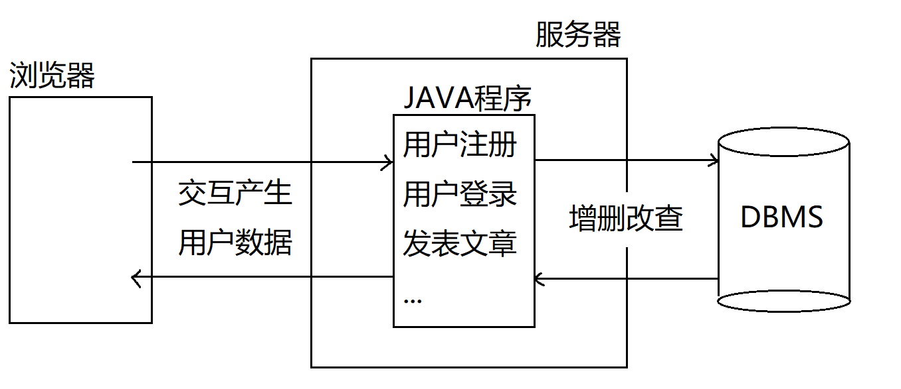


### 数据库管理系统中的常用概念

#### 库

库是表的集合，将来不同的项目应当创建不同的库，来保存项目中所有需要涉及到的数据

#### 表

是一句具有相同属性数据的集合,一张表是二维的，分为**行**和**列**

- 列:数据应具有的属性信息
- 行:具有这组属性的一条具体数据
- 以面向对象的思想:
  - 表:对标java中的类
  - 列:对标类中的属性
  - 行:对标具体的实例

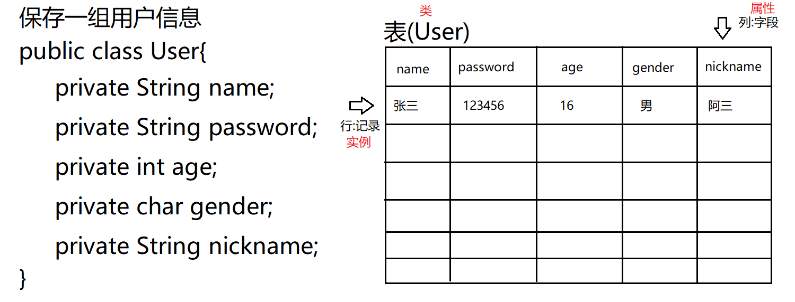


#### 库与表的关系

不同的项目可以有不同的库， 每个库中又可以保存不同的表。DBMS可以同时管理多个库和库中的表。

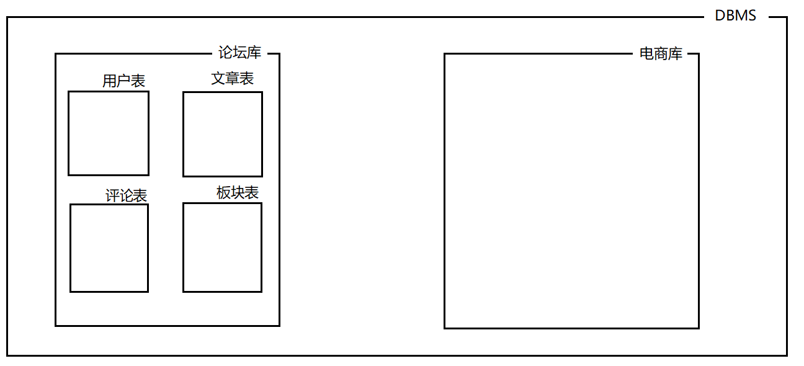


### 如何操作数据库

#### 数据库的角色

DBMS安装以后是一个独立可运行的软件，并且是以**服务端**形式在操作系统中运行的，我们如若操作数据库则是以**客户端**身份与DBMS进行链接，连接后进行通讯完成对数据的操作。


#### 数据库客户端

- 命令行工具(数据库自带)
- 图形化界面(数据库自带)
- **JDBC：java数据库链接，也是我们将来最常用的方式**
- 集成开发环境(比如IDEA)，也算是图形化界面，底层也是利用JDBC操作


#### 如何操作数据库

我们是以客户端形式与服务端建立链接，向数据库发送指令，让数据库进行相关的操作

这里和数据库对话时发送的指令称为**SQL**

**SQL的全程:Structured Query Language -- 结构化查询语言**

#### 优点

SQL语句有标准，**执行标准是SQL92标准**，基本的数据库操作都有规定的语法，不同的DBMS都支持该标准，因此我们发送SQL语句给任何DBMS都可以进行相应的操作。

SQL语句是DBMS界的普通话

#### 缺点

SQL92标准并非将所有数据库操作都规定了语法，这导致没有在该标准中的操作不同的数据库厂商定义了自己的类似SQL的语法，这部分操作称为"方言"


#### 学习重点:学会SQL语句，对数据库进行操作


## SQL语言-Structured Query Language

### SQL语言的特点

- SQL语言不区分大小写，要养成良好的书写习惯:
  - 关键字全大写
  - 非关键字全小写
  - 例如:**SELECT** username,password,nickname,age **FROM** user
- SQL语句的字符串使用单引号表示字面量，并且区分大小写
  - SELECT username,password FROM user WHERE username=**'jack'**
  - SELECT username,password FROM user WHERE username=**'JACK'**
  - 上述jack和JACK是完全不同的字符串，内容区分大小写


### SQL分类

- DDL:数据定义语言，用于进行数据库对象的相关操作。常见的数据库对象:库，表，索引，视图，序列等
- DML:数据操作语言，对表中数据进行操作的语言。设计的操作:增(INSERT)，删(DELETE)，改(UPDATE)
- DQL:数据查询语言，对表中数据进行检索的语言(相对较难，语法众多，学习重点)。
- TCL:事务控制语言，设计的操作:COMMIT,ROLLBACK
- DCL:数据控制语言，对数据库维护操作，例如权限管理等。是DBA需要重点学习的内容。


## DDL语言-数据定义语言

对数据库对象进行操作的语言，涉及的关键字:**CREATE,ALTER,DROP**

### 对数据库进行操作

#### 新建一个数据库

#### 语法

```sql
CREATE ·DATABASE 数据库名 [CHARSET=字符集]
```

#### 例如

创建一个名为mydb的数据库

```SQL
CREATE DATABASE mydb;
```

注:每条SQL语句结尾的";"并非必须的。


#### 查看已经创建的数据库

```sql
# 查看已经创建的库
SHOW DATABASES;
# 创建名为mydb的数据库
#书写习惯：数据库中关键字用大写，表名、字段名用小写
CREATE DATABASE mydb;
```


#### 创建数据库时指定字符集

```sql
创建数据库mydb1,指定字符集为UTF-8
CREATE DATABASE mydb1 CHARSET=UTF8

创建数据库mydb2,指定字符集为GBK
CREATE DATABASE mydb2 CHARSET=GBK
```


#### 查看创建某个数据库时的信息

##### 语法

```sql
SHOW CREATE DATABASE 数据库名
```

##### 例如

```sql
SHOW CREATE DATABASE mydb
```


### 删除数据库

#### 语法

```sql
DROP DATABASE 数据库名
```

#### 例如

```sql
DROP DATABASE mydb;
```

**注意：删除数据库是不可逆操作**


### 切换数据库

在DBMS下会存在多个不同的数据库，只有切换到对应的数据库上，那么后期学习的所有操作才是针对该数据库进行的，比如创建表才是在切换的数据库上进行。

#### 语法

```sql
USE 数据库名
```

#### 例如

```sql
切换到mydb1库
USE mydb1;
SELECT * FROM student

切换到mydb2库
USE mydb2;
```


### 练习

#### 题干

```sql
1. 创建 db1和db2 数据库 字符集分别为utf8和gbk
2. 查询所有数据库检查是否创建成功
3. 检查两个数据库的字符集是否正确(查看创建时的SQL)
4. 先使用db2 再使用 db1
5. 删除两个数据库
```

#### 答案

```SQL
1. 创建 db1和db2 数据库 字符集分别为utf8和gbk
   CREATE DATABASE db1 CHARSET=UTF8
   CREATE DATABASE db2 CHARSET=GBK
2. 查询所有数据库检查是否创建成功
   SHOW DATABASES   
3. 检查两个数据库的字符集是否正确(查看创建时的SQL)
   SHOW CREATE DATABASE db1
   SHOW CREATE DATABASE db2
4. 先使用db2 再使用 db1
   USE db2
   USE db1
5. 删除两个数据库
   DROP DATABASE db1
   DROP DATABASE db2
```


### 

### 创建一张表

#### 语法

```sql
CREATE TABLE 表名(
                   字段1名 类型[(长度)] [DEFAULT 默认值] [约束],
                   字段2名 类型[(长度)] [DEFAULT 默认值] [约束],
  ...
                   字段n名 类型[(长度)] [DEFAULT 默认值] [约束]
  )
```

#### 例如

```
准备一个数据库mydb并使用它，基于该库学习表的创建(创建出来的表都保存在mydb库中)
CREATE DATABASE mydb;
USE mydb;

创建一张表:user
表中字段:用户名，密码，昵称，年龄

CREATE TABLE user(
	id INT,
	username VARCHAR(32),			VHARCHAR在数据库中是字符串类型
	password VARCHAR(32),           圆括号用来指定长度，单位是字符
	nickname VARCHAR(32),
	age INT(3)                      INT为整数类型，长度是数字的位数
)


```

#### 查看库中所有的表

```sql
SHOW TABLES
```


#### 查看创建表时的信息

##### 语法

```sql
SHOW CREATE TABLE 表名
```

##### 例如

```sql
SHOW CREATE TABLE user
```


#### 查看表结构

##### 语法

```sql
DESC 表名
```

##### 例如

```sql
查看user表的结构
DESC user
```


### 修改表名

#### 语法

```
RENAME TABLE 原表名 TO 新表名
```

#### 例如

```sql
user表重命名为userinfo
RENAME TABLE user TO userinfo
```


### 删除表

#### 语法

```sql
DROP TABLE 表名
```

#### 例如

```sql
将userinfo表删除
DROP TABLE userinfo
```


### 练习

#### 题干

```sql
1.创建数据库mydb3 字符集gbk 并使用
2.创建t_hero英雄表, 有名字和年龄字段
3.修改表名为hero
4.查看表hero的信息
5.查询表hero结构
6.删除表hero
7.删除数据库mydb3

```

#### 答案

```sql
1.创建数据库mydb3 字符集gbk 并使用
  CREATE DATABASE mydb3 CHARSET=GBK
  USE mydb3
2.创建t_hero英雄表, 有名字和年龄字段
  CREATE TABLE t_hero(
     name VARCHAR(32),
     AGE INT(3) 
  )
3.修改表名为hero
  RENAME TABLE t_hero TO hero
4.查看表hero的信息
  SHOW CREATE TABLE hero
5.查询表hero结构
  DESC hero
6.删除表hero
  DROP TABLE hero
7.删除数据库mydb3
  DROP DATABASE mydb3

```


### 修改表结构

#### 准备一张表

```sql
CREATE TABLE hero(
	name VARCHAR(32),
	age INT
)
```


#### 添加一个字段

##### 语法

```sql
ALTER TABLE 表名 ADD 字段名 类型[(长度)][DEFAULT 默认值][约束]
```

##### 例如

```sql
ALTER TABLE hero ADD gender VARCHAR(10)
DESC hero;
```

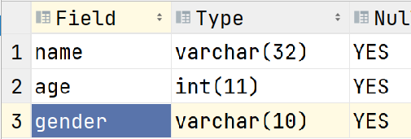


#### 在表最开始插入字段

##### 语法

```sql
ALTER TABLE 表名 ADD 字段名 类型[(长度)][DEFAULT 默认值][约束] FIRST
```

##### 例如

```sql
向hero表中最开始添加id字段
ALTER TABLE hero ADD id INT FIRST
```

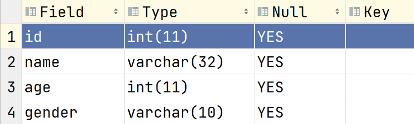


#### 在表中插入新字段

##### 语法

```
将指定字段添加到表中指定字段之后
ALTER TABLE 表名 ADD 字段名 类型[(长度)][DEFAULT 默认值][约束] AFTER 表中某字段
```

##### 例如

```
在hero表中name字段之后添加pwd字段
ALTER TABLE hero ADD pwd VARCHAR(32) AFTER name
```

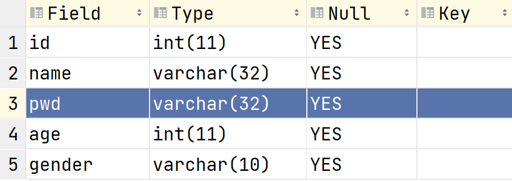


#### 删除表中字段

##### 语法

```sql
ALTER TABLE 表名 DROP 字段名
```

##### 例如

```sql
将hero表中的pwd字段删除
ALTER TABLE hero DROP pwd
```

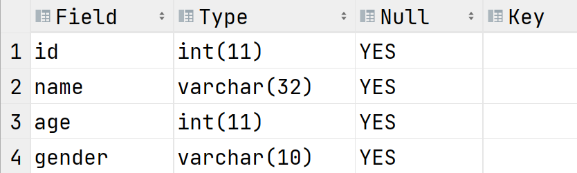

##### 

#### 修改表中现有字段

##### 语法

```sql
ALTER TABLE 表名 CHANGE 原字段名 新字段名 类型[(长度)][DEFAULT 默认值][约束]
```

##### 例如

```sql
将hero表中的age字段长度改为3
ALTER TABLE hero CHANGE age age INT(3)
```

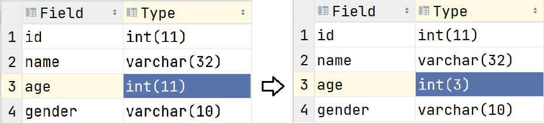


```sql
将hero表中的age字段类型改为字符串，长度改为20
ALTER TABLE hero CHANGE age age VARCHAR(20)
```

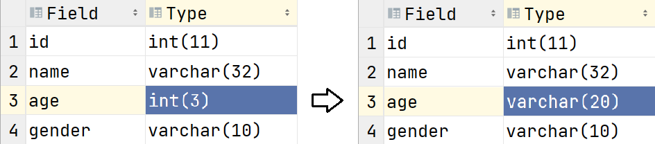


```
将hero表中的gender字段改名为nickname,类型为字符串，长度30.且该字段内容不允许为空
ALTER TABLE hero CHANGE gender nickname VARCHAR(30) NOT NULL
```

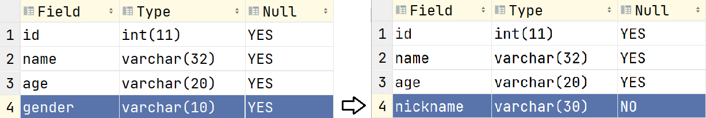


#### 修改表结构的注意事项

- 修改表结构最好是在表中没有记录的情况下进行
- 如果表中存在数据
  - 尽量不要修改字段类型，因为可能由于表中记录对应字段的值不符合新修改的类型导致修改失败
  - 字段长度尽可能不要缩短
  - 为字段添加约束时，表中记录该字段的值不能有违反约束的情况


### 综合练习

#### 题干

```
1.创建数据库mydb4 字符集utf8并使用
2.创建teacher表 有名字(name)字段
3.添加表字段: 最后添加age 最前面添加id(int型) , age前面添加salary工资(int型)
4.删除age字段
5.修改表名为t
6.删除表t
7.删除数据库mydb4

```

#### 答案

```sql
1.创建数据库mydb4 字符集utf8并使用
  CREATE DATABASE mydb4 CHARSET=UTF8
  USE mydb4
2.创建teacher表 有名字(name)字段
  CREATE TABLE teacher(
  	name VARCHAR(32)
  )
3.添加表字段: 最后添加age 最前面添加id(int型) , age前面添加salary工资(int型)
  ALTER TABLE teacher ADD age INT；
  ALTER TABLE teacher ADD id INT FIRST;
  ALTER TABLE teacher ADD salary INT AFTER name;
4.删除age字段
  ALTER TABLE teacher DROP age
5.修改表名为t
  RENAME TABLE teacher TO t
6.删除表t
  DROP TABLE t
7.删除数据库mydb4
  DROP DATABASE mydb4

```


## DML语言-数据操作语言

### 定义

对表中记录进行操作的语言，涉及的操作:

- INSERT:向表中插入记录的操作
- UPDATE:修改表中记录的操作
- DELETE:删除表中记录的操作

### 准备工作

```sql
应用mydb库
USE mydb;

创建一张表person
CREATE TABLE person(
	name VARCHAR(30),
    age INT(3)
)

```


### INSERT语句

INSERT语句用于向表中插入记录

#### 语法

```sql
INSERT INTO 表名 [(字段1,字段2,...)] VALUES(值1,值2,....)
```

#### 例如

```sql
INSERT INTO person (name,age) VALUES ('张三',22);
INSERT INTO person (age,name) VALUES (33,'李四');

以下是错误示范
INSERT INTO person (name,age) VALUES (35,'王五');		指定的字段与给定值顺序不一致
INSERT INTO person (name,age) VALUES ('王五');		没有足够的值
```

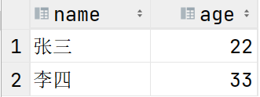

#### 注意事项

- 数据库中字符出字面量要使用单引号括起来
- INSERT语句中VALUES子句执行的值的顺序，个数，类型要与前面指定的字段一致
- 指定的字段顺序，个数可以与表不一致

#### 补充

查看表中记录的SQL语句,这属于DQL语言，后面会详细说明

```sql
SELECT * FROM 表名
SELECT * FROM person
```


#### 插入默认值

INSERT语句中没有指明的字段，记录中该字段插入默认值。

**如果创建表shi字段没有明确指定默认值时，默认值均为NULL**

##### 例如

```sql

```

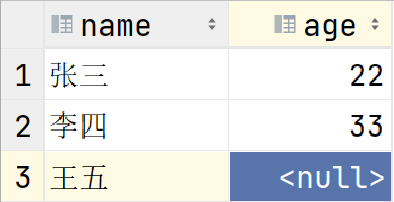


#### 默认值的设定

设定默认值属于DDL语句的范畴，可以在创建表和修改表时进行

- 在创建表示为字段明确的指定默认值

  ```sql
  CREATE TABLE person(
  	name VARCHAR(30) DEFAULT '无名氏',
  	age INT(3) DEFAULT 22
  )
  ```

- 修改表时为字段补充默认值

  ```sql
  ALTER TABLE person CHANGE name name VARCHAR(30) DEFAULT '无名氏'
  ```

  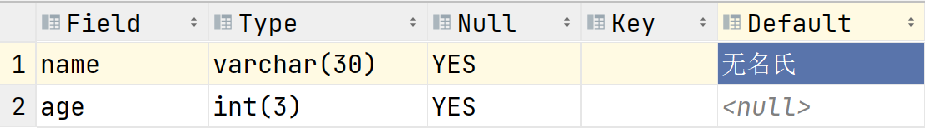


#### 插入默认值

```sql
INSERT INTO person (age) VALUES(33);
此时name字段插入默认值'无名氏'
```

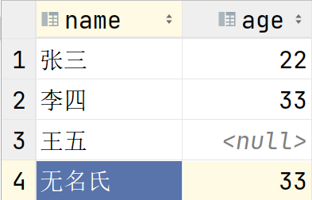


### 全列插入

INSERT子句中不指定任何字段时，为全列插入。**此时VALUES子句指定的值的顺序，个数，类型要与表结构中字段完全一致**

#### 语法

```sql
INSERT INTO 表名 VALUES（值1,值2,...）
```

#### 例如

```sql
INSERT INTO person VALUES('赵六',33);

以下是错误示范:
INSERT INTO person VALUES(33,'赵六');		//值的顺序与表结构不同
INSERT INTO person VALUES('赵六');		//没有足够的值
```

**注:开发中不建议这样的写法**


#### 插入NULL值和默认值

- 可以在VALUES子句中显示的使用关键字NULL向字段插入NULL值

- 可以在VALUES子句中显示的使用关键字DEFAULT向字段插入默认值

  ```
  向name字段插入默认值
  INSERT INTO person VALUES(DEFAULT,22)
  
  向name字段插入NULL值
  INSERT INTO person VALUES(NULL,33)
  ```


#### 批量插入

可以在VALUE子句中同时指定最组值，同时插入多条记录

##### 语法

```
INSERT INTO 表名 [(字段1,字段2,...)] VALUES (值1,值2,值3...),(第二组值),(第三组值),...
```

##### 例如

```sql
INSERT INTO person(name,age) 
VALUES ('阿猫',22),('阿狗',33),('阿三',44)
```


### UPDATE语句

UPDATE语句用于修改表中记录

#### 语法

```sql
UPDATE 表名
SET 字段1=新值1,字段2=新值2,...
[WHERE 过滤条件]			添加过滤条件可以做到仅将表中满足该条件的记录进行修改
```

#### 例如

```sql
将person表中每条记录的age字段值改为40
UPDATE person
SET age=40
```

**注意：UPDATE语句不添加WHERE子句时，表示表中每条记录都要修改!这样的操作在实际开发中很少发生**


#### WHERE子句在UPDATE语句中的作用

通常UPDATE语句中要添加WHERE子句，用于指定过滤条件，将满足条件的记录进行修改

##### 例如

```plsql

```

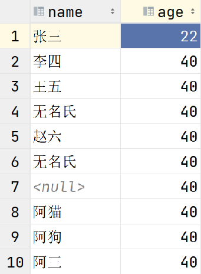


```sql

```

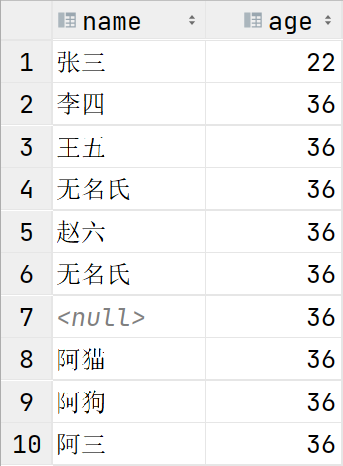


#### WHERE子句的基础条件

WHERE子句会在后面DQL语言中详细说明会

**WHERE中常用的基础条件:=,>,>=,<,<=,<>(不等于"<>",而"!="不是所有数据库都支持)**

##### 例如

```sql
将年龄大于30岁的人，改为年龄29
UPDATE person
SET age=29
WHERE age>30
```


#### 修改多个字段

```sql
将李四的名字改为"李老四"，年龄改为66
UPDATE person
SET name='李老四',age=66
WHERE name='李四'
```


### DELETE语句

DELETE语句用于删除表中记录

#### 语法

```sql
DELETE FROM 表名
[WHERE 过滤条件]
```

**注意:DELETE语句通常都要添加WHERE子句，否则为清空表操作**

#### 例如

```sql
删除'李老四'
DELETE FROM person
WHERE name='李老四'

删除年龄在25岁以下的人
DELETE FROM person
WHERE age<25
```


#### 清空表

```sql
DELETE FROM person
```

### 总结

- INSERT语句，向表中插入记录
  - INSERT后面指定的字段名可以与表结构不一致，但是要求VALUES子句中指定的值个数，顺序，类型必须与指定的字段一致
  - INSERT语句可以忽略某些字段，此时被忽略的字段会插入默认值
  - INSERT语句可以显示的插入默认值，此时VALUES子句中对应字段的值使用关键字**DEFAULT**
  - INSERT语句可以显示的插入NULL值，此时VALUES子句中对应字段的值使用关键字**NULL**
  - INSERT语句可以不指定任何字段，此时为全列插入，要求VALUES子句中指定的值的顺序，个数，类型必须与表表结构完全一致
- UPDATE语句，用来修改表中的记录
  - 通常UPDATE语句不会忽略WHERE子句，因为修改表中记录是修改满足WHERE子句要求的记录。
  - 如果忽略了WHERE子句则是表中所有记录进行修改
- DELETE语句，用来删除表中的记录
  - 通常DELETE语句不应当忽略WHERE子句，否则为清空表操作


### 综合练习

#### 题干

```sql
1.创建数据库day2db 字符集utf8并使用
2.创建t_hero表, 有name字段
3.修改表名为hero
4.最后面添加价格字段money(整数类型，长度6), 最前面添加id字段(整数类型), name后面添加 age字
段(整数类型，长度3)
5.表中添加以下数据: 1,李白,50,6888 2,赵云,30,13888 3,刘备,25,6888
6.修改刘备年龄为52岁
7.修改年龄小于等于50岁的价格为5000
8.删除价格为5000的信息
9.删除表, 删除数据库
```

#### 答案

```sql
1.创建数据库day2db 字符集utf8并使用
  CREATE DATABASE day2db CHARSET=UTF8
  USE day2db
2.创建t_hero表, 有name字段
  CREATE TABLE t_hero(
  	name VARCHAR(32)
  )
3.修改表名为hero
  RENAME TABLE t_hero TO hero
4.最后面添加价格字段money(整数类型，长度6), 最前面添加id字段(整数类型), name后面添加 age字段(整数类  型，长度3)
  ALTER TABLE hero ADD money INT(6);
  ALTER TABLE hero ADD id INT FIRST;
  ALTER TABLE hero ADD age INT(3) AFTER name;
5.表中添加以下数据: 1,李白,50,6888 2,赵云,30,13888 3,刘备,25,6888
  INSERT INTO hero (id,name,age,money)
  VALUES(1,'李白',50,6888),(2,'赵云',30,13888),(3,'刘备',25,6888)
6.修改刘备年龄为52岁
  UPDATE hero
  SET age=52
  WHERE name='刘备'
7.修改年龄小于等于50岁的价格为5000
  UPDATE hero
  SET money=5000
  WHERE age<=50
8.删除价格为5000的信息
  DELETE FROM hero
  WHERE money=5000
9.删除表, 删除数据库
  DROP TABLE hero;
  DROP DATABASE day2db
```


## 数据类型

在数据库中每一张表的每一个字段都要指定数据类型以确保可以正确的保存对应的数据

**注意:数据类型本身是方言，不同的数据库类型名称不完全一样**


### 数字类型

#### 整数类型

##### INT类型

INT类型占用4个字节，保存的数字+-21亿。

- INT(n):n表示数字的位数，如果不指定则默认长度为11位

##### BIGINT类型

BIGINT类型占用8个字节。


#### 浮点数类型

##### DOUBLE类型

DOUBLE类型用于保存小数

- DOUBLE(M,N):M和N都是一个整数，M用于表示数字的总位数，N表示其中小数的位数。M包含N

  DOUBLE(7,4):一共有7位数字，其中4位是小数。最大值:999.9999

#### 例如

```sql
CREATE TABLE person1(
	age INT(3),					age字段只能存放整数，最大值999
	salary DOUBLE(7,2)			salary字段可以保存小数，最大值99999.99
)
```

- 插入小数

  ```sql
  INSERT INTO person1(age,salary) VALUES(22,99999.99);
  
  超过范围会报错
  INSERT INTO person1(age,salary) VALUES(22,9999999);
  ```

  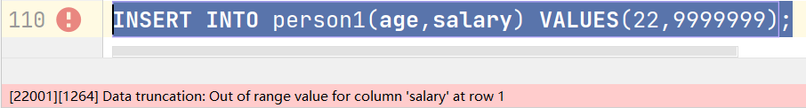

- 插入小数时，如果精度超多了最大范围，会四舍五入

  ```sql
  INSERT INTO person1(age,salary) VALUES(33,12345.678);
                                                    ^
                                             这里会进行四舍五入
  ```

  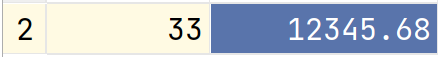

- 插入小数时如果四舍五入后超过最大范围会报错

  ```sql
  INSERT INTO person1(age,salary) VALUES(33,99999.997);
  ```

  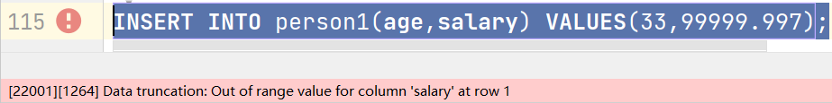


### 字符类型

#### 定长字符串

##### CHAR类型

CHAR类型是定长字符串类型，无论实际保存的字符是多少，该字段一定要占用字段指定长度的字符量，不足部分补充空格。

- CHAR(n):n是一个数字，**单位是字符，最大长度255**
- CHAR在磁盘开辟的空间是固定的，存入数据不足指定长度时补充空格来达到长度
- 优点:磁盘空间占用长度是固定的，因此查询效率高
- 缺点:磁盘空间有所浪费
- 在数据量不大，并且通常保存固定字符个数的数据时使用。例如性别

#### 

#### 变长字符串

##### VARCHAR类型

VARCHAR类型是变长字符串，磁盘占用量由实际保存的数据决定(用多少占多少)

- VARCHAR(n):n是一个数字，**单位是字符，最大长度65535**
- VARCHAR保存数据时，实际存入的数据时多少则磁盘空间占用多少
- 优点:磁盘空间没有浪费
- 缺点:查询性能差


##### TEXT类型

TEXT,MEDIUMTEXT,LONGTEXT

TEXT最大值也是65535，如果超过可以选择MEDIUMTEXT,LONGTEXT

TEXT不是在表的行中直接保存数据，而是单独开辟了一段空间保存数据，查询性能弱。

如果存放超过65535个字符数据时，可以选取(实际应用较少)

利用GPT来了解TEXT类型


### 日期类型

##### 日期类型的种类

- **DATE：可以保存年，月，日**
- **TIME：可以保存时，分，秒**
- **DATETIME：可以保存年月日时分秒**
- **TIMESTAMP：时间戳，保存UTC时间，可以精确到毫秒**


#### 例如

- 准备一张表

  ```sql
  CREATE TABLE userinfo(
  	id INT,						id为整数类型，没有指定长度，默认长度为11
      name VARCHAR(30),			name为变长字符串类型，长度为30个字符
      gender CHAR(1),				gender为定长字符串，长度为1个字符
      birth DATETIME,				birth为日期类型，可以保存年月日时分秒
      salary DOUBLE(7,2)			salary为浮点数类型，可以保存5位整数和2位小数
  )
  ```

- 插入日期类型时，DATETIME类型字段为例:可以以字符串形式插入，该字符串格式'yyyy-MM-dd hh:mm:ss'。其中大写M表示月，小写m表示分。都是数字。

  ```sql
  INSERT INTO userinfo
  (id,name,gender,birth,salary)
  VALUES
  (1,'张三','男','1992-08-02 20:55:33',5000.19)
  ```

  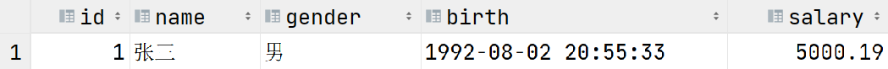

- DATETIME类型插入数据时，可以忽略时分秒，忽略后默认值为0

  ```sql
  INSERT INTO userinfo
  (id,name,gender,birth,salary)
  VALUES
  (2,'李四','女','1997-03-15',8000)
  ```

  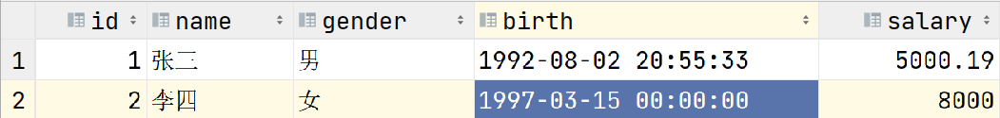

- DATATIME累哦行插入数据时，不可以忽略年月日

  ```sql
  INSERT INTO userinfo
  (id,name,gender,birth,salary)
  VALUES
  (3,'王五','男','20:12:16')
  ```

  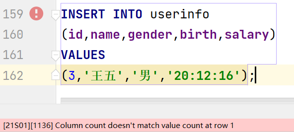


## 约束条件

我们可以为表施加特定的约束条件，那么只有满足该约束条件的操作才可以进行，否则会被数据库拒绝

### 约束的种类

- 主键约束
- 非空约束
- 唯一性约束
- 检查约束
- 外键约束(实际开发中几乎不用)


### 主键约束

什么是主键:主键字段的值用来唯一表示该表中的一条记录。

可以作为主键的值要求:非空且唯一

- **非空**:在表中每条记录都要有该值
- **唯一**:表中每条记录该字段的值不可以重复
- 符合上述两条要求的值就可以作为主键使用

**主键约束就要求该字段必须是非空且唯一的，否则不允许进行操作**

#### PRIMARY KEY

- 当表中某个字段被施加主键约束后，该字段插入值或更新值时都要求不能为空且必须唯一，否则数据库拒绝操作
- 一张表中只能有一个字段为主键约束
- **通常主键字段的字段名为"ID"**

#### 例如

```
CREATE TABLE user1(
	id INT PRIMARY KEY,
	name VARCHAR(30),
	age INT(3)
);

INSERT INTO user1(id,name,age) 
VALUES(1,'张三',22),(2,'李四',33)
```

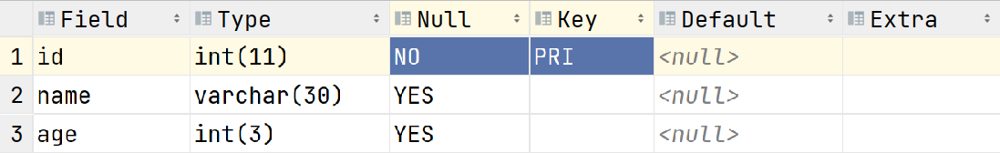


- 主键字段不可以插入重复的值

  ```sql
  INSERT INTO user1(id,name,age) VALUES(1,'王五',44)
  ```

  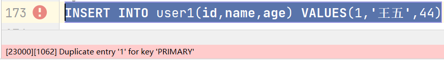

- 主键字段不可以插入NULL值

  ```sql
  INSERT INTO user1(id,name,age) VALUES(NULL,'王五',44)
  ```

  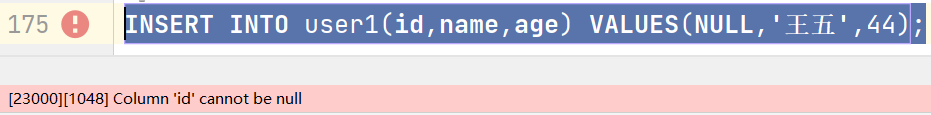

- 插入记录时不可以忽略主键字段，除非主键字段有默认的生成方式(比如自增)

  ```sql
  INSERT INTO user1(name,age) VALUES('王五',44)
  ```

  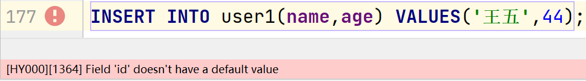

- 更新数据时，不可以将重复的值更新到主键字段上

  ```sql
  将李四的id改为1
  UPDATE user1
  SET id=1
  WHERE name='李四'
  ```

  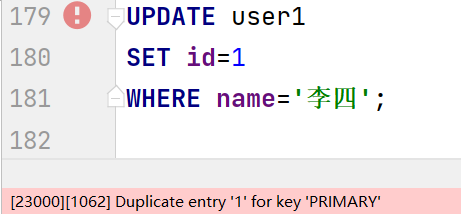

- 不可以将NULL值更新到主键字段上

  ```sql
  UPDATE user1
  SET id=NULL
  WHERE name='李四'
  ```

  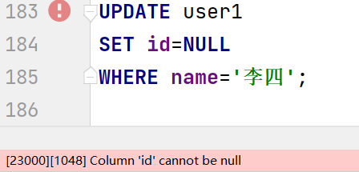

- **主键字段的值不会进行更新，通常插入数据时应有系统生成**


#### 自增

通常具有主键约束的字段都会为其添加自增，自增是数据库为字段生成值的一种机制。

##### AUTO_INCREMENT

AUTO_INCREMENT是一个关键字，当字段添加后具有自增特性。

##### 例如

- 创建时为字段添加自增

  ```SQL
  CREATE TABLE user2(
  	id INT PRIMARY KEY AUTO_INCREMENT,
      name VARCHAR(30),
      age INT(3)
  );
  ```

  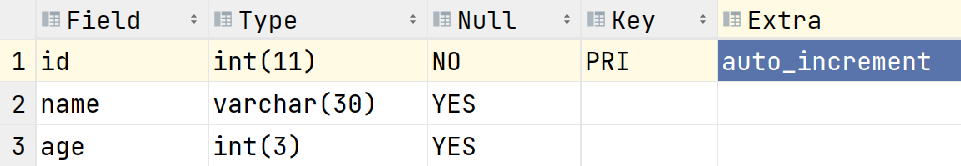

- 修改表时，也可以为字段添加自增

  ```SQL
  ALTER TABLE user1 CHANGE id id INT PRIMARY KEY AUTO_INCREMENT;
  ```

  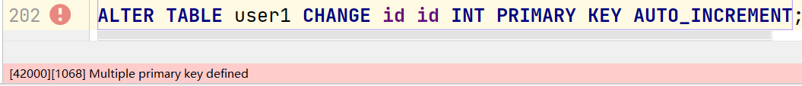

  **如果该字段已经具有主键约束，可以仅添加自增**

  ```SQL
  ALTER TABLE user1 CHANGE id id INT AUTO_INCREMENT;
  ```

- 主键具有自增后，那么插入数据时可以忽略主键字段

  ```
  INSERT INTO user2(name,age) VALUES('张三',22);
  INSERT INTO user2(name,age) VALUES('李四',33);
  ```

  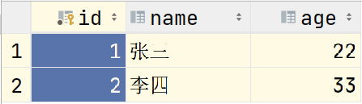

- 插入时可以显示的插入NULL，此时还是会使用自增，并非将NULL值插入

  ```SQL
  INSERT INTO user2(id,name,age) VALUES(NULL,'王五',36)
  ```

  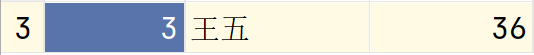

  **虽然可以这样写，但是不推荐这样的写法， 会出现语义不明确的问题**


### 非空约束

NOT NULL为非空约束，当字段施加非空约束后，字段的值任何时候都不允许为NULL。

- 插入数据时不可以将NULL值插入到该字段上
- 更新数据时也不可以将NULL值更新
- 一张表中可以有多个字段添加非空约束

#### 例如

- 创建表时为字段指定非空约束

  ```sql
  CREATE TABLE user3(
  	id INT PRIMARY KEY AUTO_INCREMENT,
  	name VARCHAR(30) NOT NULL,
  	age INT(3)
  )
  ```

  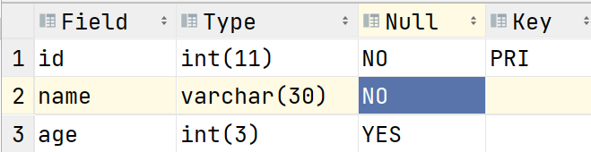

- 修改表时为字段添加非空约束

  ```sql
  修改user2表时为name字段添加非空约束
  ALTER TABLE user2 CHANGE name name VARCHAR(30) NOT NULL
  ```

- 向具有非空约束字段插入数据时，不可以将NULL值插入

  ```
  INSERT INTO user3(name,age) VALUES(NULL,22);
  ```

  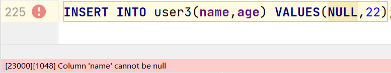

- 插入数据时也不可以忽略具有非空约束的字段

  ```sql
  INSERT INTO user3(age) VALUES(22);
  ```

- 不能将NULL值更新到具有非空约束的字段上

  ```sql
  INSERT INTO user3(name,age) VALUES('张三',22);
  
  UPDATE user3
  SET name=NULL			不可以将NULL值更新到name字段上
  WHERE name='张三'
  ```


### 唯一性约束

UNIQUE唯一性约束，该约束要求对应字段在整张表中的值是不可以重复的。一张表可以有多个字段添加唯一性约束。

#### 例如

- 创建一张表，为字段添加唯一性约束

  ```sql
  CREATE TABLE user4(
  	id INT PRIMARY KEY AUTO_INCREMENT,
      name VARCHAR(30) UNIQUE,				为name字段添加唯一性约束
      age INT(3)
  );
  ```

  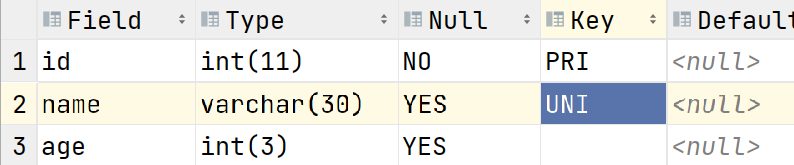

- 修改表时可以为字段添加唯一性约束

  **注意:如果该字段具有非空约束，那么若仅指定唯一性约束时，会将非空约束取消**

  ```sql
  ALTER TABLE user3 CHANGE name name VARCHAR(30) UNIQUE
  上述SQL执行后,user3表中name字段原本的非空约束会被取消
  ```

  如果需要保留非空约束，需要一并指定

  ```sql
  ALTER TABLE user3 CHANGE name name VARCHAR(30) NOT NULL UNIQUE;
  ```

- 插入数据时不能将重复的值插入到具有唯一性约束的字段上

  ```sql
  INSERT INTO user4(name,age) VALUES('张三',22);		可以成功插入
  
  INSERT INTO user4(name,age) VALUES('张三',44);		失败，name字段值违反唯一性约束
  ```

  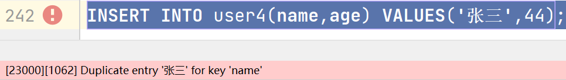

- NULL值可以插入到具有唯一性约束的字段上，并且多条记录都可以是NULL

  ```sql
  INSERT INTO user4(name,age) VALUES(NULL,33);
  INSERT INTO user4(name,age) VALUES(NULL,44);
  ```

  **NULL是不存在，因此不具有可比性，所以不存在重复的意思**

- 更新数据也不能将重复的值更新到具有唯一性约束的字段上，NULL除外

  ```sql
  INSERT INTO user4(name,age) VALUES('李四',33);
  
  UPDATE user4
  SET name='张三'					已经存在name为张三的记录，因此修改失败
  WHERE name='李四'		
  
  UPDATE user4
  SET name=NULL					 可以将NULL值更新
  WHERE name='李四'
  ```


### 检查约束

CHECK约束，该约束允许我们自定义约束条件，此时仅允许满足该条件的操作进行

#### 例如

- 创建一张表时为字段添加CHECK约束

  ```sql
  CREATE TABLE user5(
  	id INT PRIMARY KEY AUTO_INCREMENT,
  	name VARCHAR(30),
  	age INT(3) CHECK(age>0 AND age<120)
  )
  约束要求age字段的值必须在0到120之间
  ```

- 插入数据时，值不能违背CHECK约束要求

  ```sql
  INSERT INTO user5(name,age) VALUES('张三',22);			成功
  		
  INSERT INTO user5(name,age) VALUES('李四',160);			失败
  
  ```

  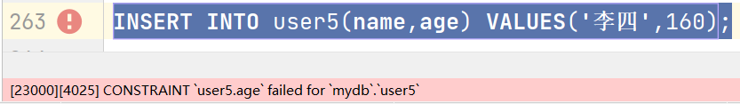

- 更新数据时也不能违背CHECK约束要求

  ```sql
  UPDATE user5
  SET age=0
  WHERE id=1
  ```

  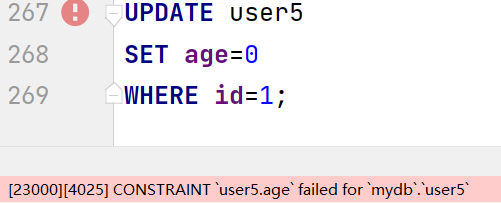


### 外键约束

外键约束实际开发中几乎不用


## 导入SQL脚本文件

- 鼠标右键选择tedu.sql文件,并进行配置

  

- 在弹出的配置窗口中点击"+"来设置数据库源,目的是在哪个数据库中执行这个tedu.sql脚本

  

- 选择我们配置的数据源后点击OK完成配置

  

- 再次鼠标右键选择tedu.sql文件选择运行这个文件

  

- 在弹出框中点击run按钮并等待执行完毕即可

  


## DQL语言-数据查询语言

DQL语言使用检索表中记录的语言

### 语法

```sql
											执行顺序
SELECT 					子句					6
FROM 					子句					1					
JOIN... ON ...			子句					2
WHERE 					子句					3
GROUP BY 				子句					4	
HAVING 					子句					5
ORDER BY 				子句					7
LIMIT 					子句					8
```


### 基础查询

#### 语法

```sql
SELECT 字段1,字段2,... FROM 表1,表2,...			检索表中每条记录中指定字段的内容

SELECT * FROM 表1,表2,...					       检索表中每条记录所有字段的内容
```

- SELECT 子句用于指明检索表中那些字段
- FROM 子句用于指明数据来自哪些表

#### 例如

```sql
USE tedu;				切换到tedu库，上面导入的tedu.sql文件后生成的库

查看所有老师信息
SELECT * FROM teacher
```

**注意:实际开发中，当我们检索表中记录时，应当避免使用"SELECT * FROM 表"，原因是，当我们使用"*"时数据库首先要查询内部的数据字典了解表中的字段情况后才可以进行查询工作，这个查询如果频繁进行则会降低查询效率。将来我们在java中书写SQL语句，因此就算是全字段查询，也应当将所有字段列出来**

- 检索表中指定字段的值

  ```sql
  查看所有老师的名字，工资，性别，职称
  SELECT name,salary,gender,title
  FROM teacher
  ```

  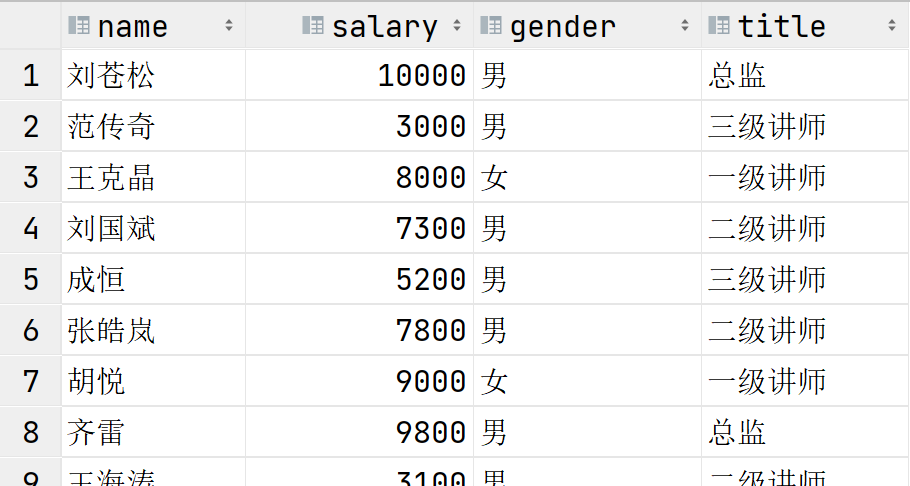

- 查看所有学生的名字，年龄，性别，生日

  ```sql
  SELECT name,age,gender,birth
  FROM student
  ```


### WHERE子句

WHERE子句用于添加过滤条件，在DQL语句中仅将满足过滤条件的记录查询出来

#### 例如

- 查看职称为"一级讲师"的老师的名字，职称，工资，年龄

  ```sql
  1:数据来自哪张表?		明确FROM子句:teacher表
  2:查询那些信息?		 明确SELECT子句:name,title,salary,age
  3:查询条件是什么?      明确WHERE子句:该记录title值为'一级讲师'   title='一级讲师'
  
  SELECT name,title,salary,age
  FROM teacher
  WHERE title='一级讲师'
  
  
  ```

  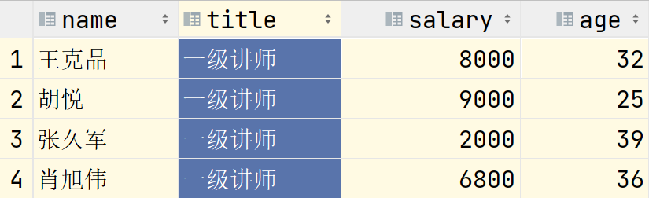

- 查看除了"刘苍松"以外的所有老师的名字，工资，奖金，职位

  ```sql
  SELECT name,salary,comm,title
  FROM teacher
  WHERE name<>'刘苍松'
  ```

- 查看职位是"大队长"的学生的名字,年龄,性别?

  ```sql
  SELECT name,age,gender
  FROM student
  WHERE job='大队长'
  ```

- 查看年龄在30岁以上(含)的老师的名字,职称,工资,奖金

  ```sql
  SELECT name,title,salary,comm
  FROM teacher
  WHERE age>=30
  ```

- 查看2层以上(含)都有那些班？列出班级名字，所在楼层

  ```sql
  SELECT name,floor
  FROM class
  WHERE floor>=2
  ```


#### 连接多个条件

- AND:"与"，都为真时才为真
- OR:"或",都为假时才为假

##### 例如

- 查看7岁的"大队长"都有谁?列出这些学生的名字,年龄,性别和职位

  ```sql
  SELECT name,age,gender,job
  FROM student
  WHERE job='大队长' AND age=7
  ```

- 查看班级编号小于6的所有中队长都有谁?列明名字，年龄，性别，班级编号(class_id)，职位

  ```sql
  SELECT name,age,gender,class_id,job
  FROM student
  WHERE class_id<6 AND job='中队长'
  ```

- 查看所有一级讲师和三级讲师的名字，职称，工资？

  ```sql
  SELECT name,title,salary
  FROM teacher
  WHERE title='一级讲师' OR title='三级讲师'
  ```

- 查看所有大队长，中队长和小队长的名字，性别，年龄和职位?

  ```sql
  SELECT name,gender,age,job
  FROM student
  WHERE job='大队长' OR job='中队长' OR job='小队长'
  ```


##### AND的优先级是高于OR的

若要提高OR的优先级，需要使用"()"括起来

- 查看班级编号在6(含)以下的所有大队长和中队长的名字，年龄，性别，班级编号和职位

  ```sql
  SELECT name,age,gender,class_id,job
  FROM student
  WHERE class_id<=6 AND job='大队长' OR job='中队长'
  条件:  班级编号小于等于6的所有大队长  或  所有中队长(中队长没有班级编号要求)
  
  下面为正确写法
  SELECT name,age,gender,class_id,job
  FROM student
  WHERE class_id<=6 AND (job='大队长' OR job='中队长')
  
  ```


#### IN(列表)

IN(列表)表示字段的值在列表中。等于列表的其中之一。

##### 例如

- 查看所有大队长，中队长和小队长的名字，性别，年龄和职位?

  ```sql
  SELECT name,gender,age,job
  FROM student
  WHERE job='大队长' OR job='中队长' OR job='小队长'
  
  等价于
  
  SELECT name,gender,age,job
  FROM student
  WHERE job IN ('大队长','中队长','小队长')
  ```

- 查看所有一级讲师，二级讲师，三级讲师的名字，职称，工资和性别

  ```sql
  SELECT name,title,salary,gender
  FROM teacher
  WHERE title IN ('一级讲师','二级讲师','三级讲师')
  ```


#### NOT IN(列表)

NOT IN(列表)表示字段值不在列表中。不能等于列表中任何一项

##### 例如

- 查看除一级讲师和二级讲师之外的所有老师的名字，职称，工资

  ```sql
  SELECT name,title,salary
  FROM teacher
  WHERE title<>'一级讲师' AND title<>'二级讲师'
  
  等价于
  
  SELECT name,title,salary
  FROM teacher
  WHERE title NOT IN('一级讲师','二级讲师')
  ```

- 查看除大队长，中队长，小队长的其他学生的名字，职位，性别，年龄

  ```sql
  SELECT name,job,gender,age
  FROM student
  WHERE job NOT IN('大队长','中队长','小队长')
  ```


#### BETWEEN...AND...

BETWEEN n AND m用于判断字段值在两者区间，逻辑:>=n AND <=m。n是下限，m是上限。

##### 例如

- 查看工资在2000到5000之间的老师的名字,性别,年龄,工资

  ```sql
  SELECT name,gender,age,salary
  FROM teacher
  WHERE salary>=2000 AND salary<=5000
  
  等价于
  
  SELECT name,gender,age,salary
  FROM teacher
  WHERE salary BETWEEN 2000 AND 5000
  
  ```

- 查看年龄在7到10岁的学生的名字，性别，年龄

  ```sql
  SELECT name,gender,age
  FROM student
  WHERE age BETWEEN 7 AND 10
  ```

- 查看年龄在20到35之间的男老师都有谁?列出名字，性别，年龄，职称

  ```sql
  SELECT name,gender,age,title
  FROM teacher
  WHERE age BETWEEN 20 AND 35 
  AND gender='男'
  ```

- 查看所有在3-5层的班级都有哪些?列出班级名称和所在楼层

  ```sql
  SELECT name,floor
  FROM class
  WHERE floor BETWEEN 3 AND 5
  ```


##### NOT BETWEEN... AND ... 用于判断不在区间范围内

- 查看年龄在7到10岁以外的学生的名字，性别，年龄

  ```sql
  SELECT name,gender,age
  FROM student
  WHERE age NOT BETWEEN 7 AND 10
  ```


#### DISTINCT

去除重复行

DISTINCT用在SELECT子句中，并且需要紧跟在SELECT关键字之后

可以将结果集中指定字段重复的记录去除

##### 例如

- 查看老师都有哪些职称?

  ```sql
  SELECT DISTINCT title
  FROM teacher
  
  将结果集中title字段值重复的记录去除重复行
  ```

- 查看学生都有哪些职位?

  ```sql
  SELECT DISTINCT job
  FROM student
  ```


##### 多字段去重

DISTINCT后面可以指定多个字段，去重规则:这几个字段值的组合重复的去除重复行

例如

- 查看各年龄段的学生都有哪些职位

  ```sql
  SELECT DISTINCT age,job		记录中age与job字段值相同的记录去除重复行
  FROM student			   
  上述SQL中原本可以查询出多个7岁的大队长，但是结果集中仅列出一行
  ```


#### 综合练习

##### 题干

```sql
1.查看负责课程编号(subject_id)为1的男老师都有谁?
2.查看工资高于5000的女老师都有谁?
3.查看工资高于5000的男老师或所有女老师的工资？
4.查看所有9岁学生的学习委员和语文课代表都是谁?
5.查看工资在6000到10000之间的老师以及具体工资?
6.查看工资在4000到8000以外的老师及具体工资?
7.查看老师负责的课程编号都有什么?
8.查看所有女老师的职称都是什么?
9.查看7-10岁的男同学的职位都有哪些?
10.查看一级讲师和二级讲师的奖金(comm)是多少?
11.查看除老板和总监的其他老师的工资和奖金是多少?
12.查看'3年级2班'和'5年级3班'在那层楼?
```

##### 答案

```sql
1.查看负责课程编号(subject_id)为1的男老师都有谁?
  SELECT name,gender,salary
  FROM teacher
  WHERE subject_id=1 AND gender='男'
  
2.查看工资高于5000的女老师都有谁?
  SELECT name,gender,salary
  FROM teacher
  WHERE salary>5000 AND gender='女'

3.查看工资高于5000的男老师或所有女老师的工资？
  SELECT name,gender,salary
  FROM teacher
  WHERE salary>5000 AND gender='男'
  OR gender='女'
  
4.查看所有9岁学生的学习委员和语文课代表都是谁?
  SELECT name,age,job
  FROM student
  WHERE age=9 AND job IN('学习委员','语文课代表')
  
5.查看工资在6000到10000之间的老师以及具体工资?
  SELECT name,salary
  FROM teacher
  WHERE salary BETWEEN 6000 AND 10000
  
6.查看工资在4000到8000以外的老师及具体工资?
  SELECT name,salary
  FROM teacher
  WHERE salary NOT BETWEEN 4000 AND 8000
  
7.查看老师负责的课程编号都有什么?
  SELECT DISTINCT subject_id
  FROM teacher
  
8.查看所有女老师的职称都是什么?
  SELECT DISTINCT title
  FROM teacher
  WHERE gender='女'
  
9.查看7-10岁的男同学的职位都有哪些?
  SELECT DISTINCT job
  FROM student
  WHERE age BETWEEN 7 AND 10
  AND gender='男'
  
10.查看一级讲师和二级讲师的奖金(comm)是多少?
  SELECT name,comm
  FROM teacher
  WHERE title IN('一级讲师','二级讲师')

11.查看除老板和总监的其他老师的工资和奖金是多少?
  SELECT name,title,salary,comm
  FROM teacher
  WHERE title NOT IN('老板','总监')

12.查看'3年级2班'和'5年级3班'在那层楼?
  SELECT name,floor
  FROM class
  WHERE name IN('3年级2班','5年级3班')
```


#### LIKE模糊查询

LIKE可以进行模糊查询，有两个通配符

- _:下划线表示一个字符
- %:表示任意个字符(0-多个)

##### 例如

```sql
LIKE '%X%'					表示字符串中含有字符X(X之前和之后可以有任意个字符)
LIKE '_X%'					表示字符串中第二个字符是X
LIKE 'X%'					表示字符串以X开始
LIKE '%X'					表示字符串以X结束
LIKE '%X_Y'					表示字符串倒数第三个字符是X以及最后一个字符是Y
LIKE '__X%'					表示字符串第三个字符是X
LIKE 'X%Y'					表示字符串以X开始并且以Y结尾
```

- 查看名字中含有'晶'的老师都有谁?

  ```
  SELECT name,gender,salary
  FROM teacher
  WHERE name LIKE '%晶%'
  ```

- 查看姓张的学生都有谁?

  ```sql
  SELECT name,age,gender
  FROM student
  WHERE name LIKE '张%'
  ```

- 查看三个字名字中第二个字是'平'的学生都有谁

  ```sql
  SELECT name,age,gender
  FROM student
  WHERE name LIKE '_平_'
  ```

- 查看最后一个字是'晶'的老师都有谁?

  ```sql
  SELECT name,age,gender
  FROM teacher
  WHERE name LIKE '%晶'
  ```


##### 练习

题干

```sql
1.查询名字姓"李"的学生姓名
2.查询名字中包含"江"的学生姓名
3.查询名字以"郭"结尾的学生姓名
4.查询9-12岁里是"课代表"的学生信息
5.查询名字第二个字是"苗"的学生信息
6.查询姓"邱"的课代表都是谁?
7.查看哪些学生是课代表?列出他的名字和职位
8.查看所有的2班都在哪层?
```

答案

```sql
1.查询名字姓"李"的学生姓名
  SELECT name,gender,age
  FROM student
  WHERE name LIKE '李%'
  
2.查询名字中包含"江"的学生姓名
  SELECT name,age,gender
  FROM student
  WHERE name LIKE '%讲%'
  
3.查询名字以"郭"结尾的学生姓名
  SELECT name,age,gender
  FROM student
  WHERE name LIKE '%郭'
   
4.查询9-12岁里是"课代表"的学生信息
  SELECT name,age,job
  FROM student
  WHERE age BETWEEN 9 AND 12
  AND job LIKE '%课代表'
 
5.查询名字第二个字是"苗"的学生信息
  SELECT name,age,gender
  FROM student
  WHERE name LIKE '_苗%'
  
6.查询姓"邱"的课代表都是谁?
  SELECT name,job,age
  FROM student
  WHERE name LIKE '邱%'
  AND job LIKE '%课代表'
 
7.查看哪些学生是课代表?列出他的名字和职位
  SELECT name,job
  FROM student
  WHERE job LIKE '%课代表'
  
8.查看所有的2班都在哪层?
  SELECT name,floor
  FROM class
  WHERE name LIKE '%2班'
```


#### NULL值判断

在数据库中，所有字段默认值都是NULL。NULL表示不存在，空的。

NULL不能算作一个值，应该是一种状态。

判断NULL时

- **IS NULL:判断一个字段的值是否为NULL**
- **IS NOT NULL:判断一个字段的值是否非空**
- **不可以用=或<>来判断NULL。**

##### 例如

- 哪些老师没有奖金（奖金为null）

  ```sql
  SELECT name,salary,comm
  FROM teacher
  WHERE comm=null
  上述SQL查询不出任何记录，因为没有任何一个值可以和NULL作等值比较
  
  
  SELECT name,salary,comm
  FROM teacher
  WHERE comm IS NULL
  
  ```

- 哪些老师奖金不为空

  ```sql
  SELECT name,salary,comm
  FROM teacher
  WHERE comm IS NOT NULL
  
  ```


### ORDER BY子句

ORDER BY子句可以将结果集按照指定的字段值升序或降序排序

- **ORDER BY 字段(可以多字段) ASC:按照指定字段值升序将结果集排序**
- **ORDER BY 字段 DESC:按照指定字段降序排序结果集**
- 不指定排序方式时，默认为升序
- 如果按照多字段排序，规则
  - 首先将结果集按照第一个字段的排序方式对结果集排序
  - 当第一个字段值存在重复的记录时，再将这几条记录按照第二个字段值的排序方式排序
  - 优先级:ORDER BY后第一个字段为最优先，以此类推

#### 例如

- 查看老师的工资,工资从多到少

  ```sql
  SELECT name,salary
  FROM teacher
  ORDER BY salary DESC
  ```

- 查看老师的奖金排名

  ```sql
  SELECT name,salary,comm
  FROM teacher
  ORDER BY comm DESC
  ```

- 查看学生的生日,按照从远到近

  ```sql
  SELECT name,birth
  FROM student
  ORDER BY birth
  
  日期比较大小的规则:远小近大。  距离现在越近的日期越大
  ```

- 查看7-10岁的学生信息,学生按照年龄从大到小排序(同年龄的看生日)

  ```sql
  SELECT name,age,birth
  FROM student
  WHERE age BETWEEN 7 AND 10
  ORDER BY birth
  ```

- 查看老师的工资和奖金，首先按照奖金的升序，再按照工资的降序

  ```sql
  SELECT name,salary,comm
  FROM teacher
  ORDER BY comm ASC,salary DESC 
                ^^^
                ASC可以不写
      
      
  SELECT name,salary,comm
  FROM teacher
  ORDER BY comm,salary DESC 
  注:NULL在MariaDB中被视作最小值
  ```

  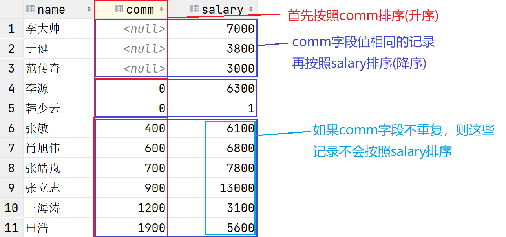


### 分页查询

分页查询就是将一条DQL语句的查询结果集分段查询出来。

#### 使用场景

当一条DQL语句查询的结果集记录数过多时，就应当使用分页查询。

例如:淘宝

当我们所有一件商品，实际可能查询出上万条记录，但是淘宝仅将前面的30-50条记录传给我们，然后通过我们点击下一页再去查看后30-50条记录。这种现象就是分页查询。

优点:占用资源少，减少了网络传输的数据量，提高了传输效率。


#### 方言

分页查询是方言，在SQL92标准中没有涉及到分页的语法定义，因此不同的数据库SQL写法完全不同。

**MySQL和MariaDB中的分页是使用LIMIT子句实现的**

#### 

#### 语法

```sql
SELECT ...
  FROM ...
  WHERE ...
  ORDER BY ...
  LIMIT M,N 		M和N是两个整数
```

- M:表示跳过结果集中多少条记录
- N:表示从M位置开始查询出多少条记录

- 分页中常见的参数
  - 当前的页数
  - 每页显示多少条记录
- 分页公式
  - M:跳过结果集中条目数，计算方式:(当前页数-1)*每页显示的条目数
  - N:每页显示多少条

#### 例如

- 查看老师工资的前5名?

  ```sql
  按照老师工资的降序查询数据。分页查询，一页显示5条，显示第一页
  1:首先按照工资降序查询老师信息
  2:分页查询
    M:(1-1)*5	   (页数-1)*N
    N:5
  SELECT name,salary
  FROM teacher
  ORDER BY salary DESC
  LIMIT 0,5       
  ```

- 查看老师奖金信息，按照降序排序后，每页显示3条，显示第5页?

  ```sql
  M：(5-1)*3   M:12
  N：3         N:3
  
  SELECT name,comm
  FROM teacher
  ORDER BY comm DESC
  LIMIT 12,3
  ```


### 在DQL语句中可以使用函数或表达式

#### 在SELECT子句中使用表达式

##### 例如

- 查看老师的工资和年薪分别是多少?

  ```sql
  SELECT name,salary,salary*12
  FROM teacher
  ```

#### 在SELECT子句中使用函数

数据库中都内置了很多函数，但是不同的数据库函数不完全一样。

##### IFNULL函数

定义

```sql
IFNULL(arg1,arg2)
```

作用

- 如果arg1的值不为NULL，函数返回arg1的值

- 若arg1的值为NULL，则返回返回arg2的值

- 该函数的作用:将一个NULL替换为一个非NULL值

- 每部逻辑

  ```java
  用java代码理解逻辑
  IFNULL(arg1,arg2){
      if(arg1!=null){
          return arg1;
      }else{
          return arg2
      }
  }
  ```


例如

- 查看每个老师的工资，奖金，工资+奖金分别是多少?

  ```sql
  SELECT name,salary,comm,salary+comm
  FROM teacher
  在数据库中，任何数据和NULL运算，结果都是NULL
  ```

  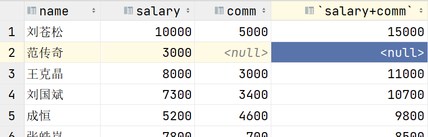


  ```sql
  可以先将NULL替换为一个非NULL值在进行计算
  SELECT name,salary,comm,salary+IFNULL(comm,0)
  FROM teacher
  ```

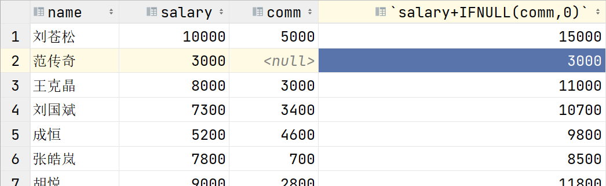

- 查看每个老师的奖金，以及全年奖金?

  ```sql
  SELECT name,comm,IFNULL(comm*12,0)
  FROM teacher
  或
  SELECT name,comm,IFNULL(comm,0)*12
  FROM teacher
  ```

#### 在WHERE子句中使用表达式

##### 例如

- 查看哪些老师的年薪高于60000,并按照工资从高到低

  ```sql
  SELECT name,salary,salary*12
  FROM teacher
  WHERE salary*12>60000
  ORDER BY salary DESC
  ```


#### 在WHERE子句中使用函数

##### 例如

- 查看哪些老师的奖金少于3000?

  ```sql
  SELECT name,comm
  FROM teacher
  WHERE comm<3000
  
  NULL不仅不能作等值判断，>,>=,<,<=都不能进行判断，都得不到正确结果
  
  SELECT name,comm
  FROM teacher
  WHERE IFNULL(comm,0)<3000		先将NULL换成0，再进行判断
  
  ```


### 别名

在SQL语句中可以为字段，表等取别名

- 在SELECT子句中我们通常会为函数或表达式取别名，使得在结果集中对于该字段的描述更清晰直观
- 在FROM子句中为表取别名，后期关联查询中可以更简化的指明表


#### 语法

- 字段 [AS] 别名
- 字段 [AS] '别名'
- 字段 [AS] "别名"

#### 例如

- 查看老师的工资和年薪

  ```sql
  SELECT name,salary,salary*12
  FROM teacher
  ```

  结果集中直接用函数或表达式作为字段名，不直观

  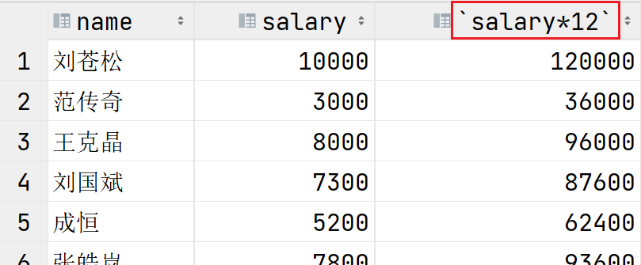


  ```sql
  SELECT name,salary,salary*12 annusal
  FROM teacher
  ```

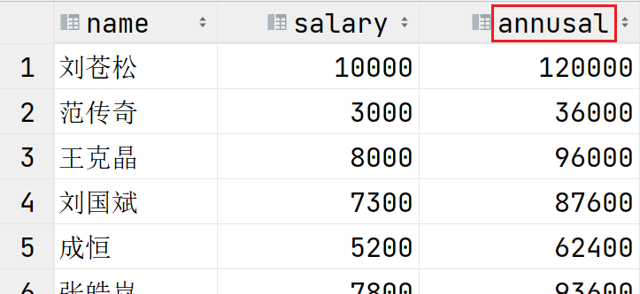

- 字段名 AS 别名

  ```
  SELECT name,salary,salary*12 AS annusal
  FROM teacher
  ```

- 别名可以用引号

  ```sql
  SELECT name,salary,salary*12 AS 'annusal'
  FROM teacher
  
  SELECT name,salary,salary*12 AS "annusal"
  FROM teacher
  
  SELECT name,salary,salary*12 'annusal'
  FROM teacher
  
  SELECT name,salary,salary*12 "annusal"
  FROM teacher
  ```

- 当别名中含有空格，应当添加引号

  ```sql
  SELECT name,salary,salary*12 annu sal
  FROM teacher
  ```

  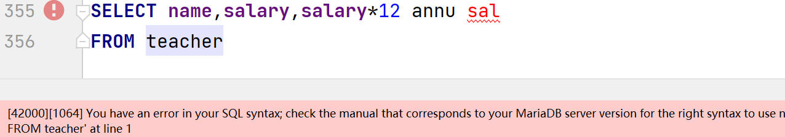

  ```sql
  SELECT name,salary,salary*12 'annu sal'
  FROM teacher
  ```

- 当别名中含有SQL关键字时,也应当添加引号

  ```sql
  SELECT name,salary,salary*12 'from'
  FROM teacher
  ```


### 综合练习

#### 题干

```sql
1.查询所有10岁学生的生日,按生日对应的年纪从大到小.
2.查询8岁同学中名字含有"苗"的学生信息
3.查询负责课程编号1和2号且工资高于6000的老师信息
4.查询10岁以上的语文课代表和数学课代表
5.查询不教课程编号1的老师信息,按照工资降序排序
6.查询没有奖金的老师信息
7.查询所有老师的奖金，并按照奖金降序排序
8.查看工资高于8000的老师负责的课程编号都有那些?
9.查看全校年龄最小学生的第6-10名
```

#### 答案

```sql
1.查询所有10岁学生的生日,按生日对应的年纪从大到小.
  SELECT name,birth,age
  FROM student
  WHERE age=10
  ORDER BY birth
  
2.查询8岁同学中名字含有"苗"的学生信息
  SELECT name,age
  FROM student
  WHERE age=8 
  AND name LIKE '%苗%'

3.查询负责课程编号1和2号且工资高于6000的老师信息
  SELECT name,subject_id,salary
  FROM teacher
  WHERE subject_id IN (1,2)
  AND salary>6000
  
4.查询10岁以上的语文课代表和数学课代表
  SELECT name,age,job
  FROM student
  WHERE age>10
  AND job IN ('语文课代表','数学课代表')
 
5.查询不教课程编号1的老师信息,按照工资降序排序
  SELECT name,subject_id,salary
  FROM teacher
  WHERE subject_id<>1
  ORDER BY salary DESC
  
6.查询没有奖金的老师信息
  SELECT name,comm
  FROM teacher
  WHERE comm IS NULL
  
  0也属于没有奖金
  SELECT name,comm
  FROM teacher
  WHERE IFNULL(comm,0)=0

7.查询所有老师的奖金，并按照奖金降序排序
  SELECT name,comm
  FROM teacher
  ORDER BY comm DESC
 
8.查看工资高于8000的老师负责的课程编号都有那些?
  SELECT DISTINCT subject_id
  FROM teacher
  WHERE salary>8000

9.查看全校年龄最小学生的第6-10名
  SELECT name,birth,age
  FROM student
  ORDER BY birth DESC
  LIMIT 5,5
  
```

上述练习第9题遇到的问题:

以下是按照生日降序排序后的前几条数据

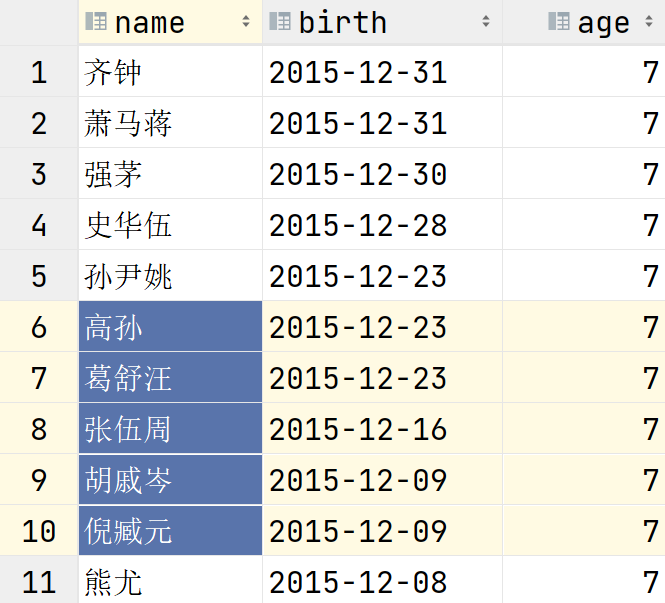

按照分页查询6-10条记录时，得到的数据，和不添加分页时排序出的6-10条不一致

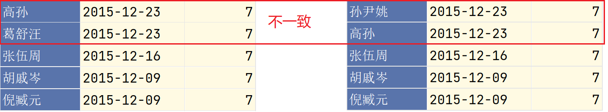

**原因**

MySQL官方文档上做出了解释

```
If multiple rows have identical values in the ORDER BY columns, the server is
free to return those rows in any order, and may do so differently depending on
the overall execution plan. In other words, the sort order of those rows is
nondeterministic with respect to the nonordered columns.
One factor that affects the execution plan is LIMIT, so an ORDER BY query with
and without LIMIT may return rows in different orders.
翻译:
如果多行在 ORDER BY 列中具有相同的值，则服务器可以自由地以任意顺序返回这些行，并且可能会根据整
体执行计划以不同的方式返回这些行。换句话说，这些行的排序顺序对于无序列是不确定的。
影响执行计划的一个因素是 LIMIT，因此带有和不带 LIMIT 的 ORDER BY 查询可能会返回不同顺序的

```

**解决办法**

查询时，无论带不带LIMIT若想保证具有相同值的字段排序结果集顺序一致时，需要再添加一个排序字段，保证该字段的值没有重复的即可，通常可以让ID参与排序，因为ID字段值一定不同

```sql
SELECT name,birth
FROM student
ORDER BY birth DESC,id
LIMIT 5,5

```


### 聚合函数

聚会函数又称为多行函数，分组函数。

**作用:将多条记录按照指定的字段进行统计并得出一个结果**

#### 聚合函数分类

- MIN：统计指定字段的最小值
- MAX：统计指定字段的最大值
- AVG：统计指定字段的平均值
- SUM：统计指定字段值的总和
- COUNT：**不是对字段值的统计，是对记录数的统计。**


#### 注意事项

- 聚合函数忽略NULL值，尤其在AVG,COUNT上比较明显
- MIN,MAX,AVG,SUM是对值的统计，COUNT是对记录数的统计

#### 例如

- 查看老师的平均工资是多少?

  ```
  1：先将参与统计的记录查询出来(编写相应SQL)
  2：在该SQL上添加聚合函数进行统计
  
  1:统计数据-所以老师的工资
  SELECT salary
  FROM teacher
  
  2:在该SQL基础上添加聚合函数
  SELECT AVG(salary)
  FROM teacher
  ```

- 查看老师的最高工资,最低工资,平均工资和工资总和都是多少?

  ```sql
  1：查询出参与统计的数据
  SELECT salary,salary,salary,salary
  FROM teacher
  
  2:分别为字段添加聚合函数
  SELECT MAX(salary),MIN(salary),AVG(salary),SUM(salary)
  FROM teacher
  ```

- 查看负责课程编号1的老师的平均工资是多少?

  ```sql
  1:列出待统计的数据-课程编号1的老师工资
  SELECT salary
  FROM teacher
  WHERE subject_id=1
  
  2:添加聚合函数
  SELECT AVG(salary)
  FROM teacher
  WHERE subject_id=1
  
  ```

- 查看一共多少位老师

  ```sql
  1:列出所有老师
  SELECT name FROM teacher
  
  2:添加聚合函数
  SELECT COUNT(name) FROM teacher		当统计记录数时，指定字段值不应有NULL值
  
  SELECT COUNT(comm) FROM teacher     不为NULL的comm字段值共17条记录
  由于聚合函数忽略NULL值，因此不建议使用可能包含NULL的字段进行COUNT统计。
  
  
  SELECT 1 FROM teacher	       查询teacher表所有记录，每条记录列出'1'
  SELECT COUNT(1) FROM teacher   统计该字段值共多少行记录('1'一定不为NULL)
  
  
  SELECT COUNT(*) FROM teacher   DBMS(数据库管理系统)几乎都对COUNT(*)作了优化，推荐写法
  
  
  
  ```


#### 练习

##### 题干

```sql
1.查看所有老师的平均奖金和奖金总和是多少?
2.查看负责课程编号2的老师共多少人?
3.查看班级编号(class_id)为1的学生有多少人?
4.查看全校学生生日最大的是哪天?
5.查看11岁的课代表总共多少人?
6.姓张的学生有多少人?
7.工资高于5000的老师中最低工资是多少?
8.4层有几个班?
9.老师中"总监"的平均工资是多少?
```

##### 答案

```sql
1.查看所有老师的平均奖金和奖金总和是多少?
  -列出所有老师的奖金(将NULL替换为0)
  SELECT IFNULL(comm,0) FROM teacher
  -添加聚合函数
  SELECT AVG(IFNULL(comm,0)),SUM(comm)
  FROM teacher
  
2.查看负责课程编号2的老师共多少人?
  SELECT COUNT(*)
  FROM teacher
  WHERE subject_id=2
  
3.查看班级编号(class_id)为1的学生有多少人?
  SELECT COUNT(*)
  FROM student
  WHERE class_id=1
  
4.查看全校学生生日最大的是哪天?
  SELECT MIN(birth)
  FROM student
  
5.查看11岁的课代表总共多少人?
  SELECT COUNT(*)
  FROM student
  WHERE age=11 
  AND job LIKE '%课代表'
  
6.姓张的学生有多少人?
  SELECT COUNT(*)
  FROM student
  WHERE name LIKE '张%'

7.工资高于5000的老师中最低工资是多少?
  SELECT MIN(salary)
  FROM teacher
  WHERE salary>5000

8.4层有几个班?
  SELECT COUNT(*)
  FROM class
  WHERE floor=4

9.老师中"总监"的平均工资是多少?
  SELECT AVG(salary)
  FROM teacher
  WHERE title='总监'
```


### GROUP BY子句

GROUP BY子句用于对结果集按照指定字段值相同的记录分组。配合聚合函数可以做到组内统计。

- GROUP BY子句一定是配合聚合函数的，如果SELECT子句没有聚合函数，不会使用GROUP BY

- 在SELECT子句中凡是不在聚合函数中的字段都应当出现在GROUP BY子句中
- GOURP BY子句可以按照多字段分组，哪些字段值都相同的记录被看作一组


#### 按照单字段分组

##### 例如

- 查看每种职位的老师平均工资是多少?

  ```sql
  SELECT AVG(salary),title    title不在聚合函数中，但是在GROUP BY中因此可以出现在SELECT子句中
  FROM teacher
  GROUP BY title		        结果集中title字段值相同的记录会被划分为一组
  ```

  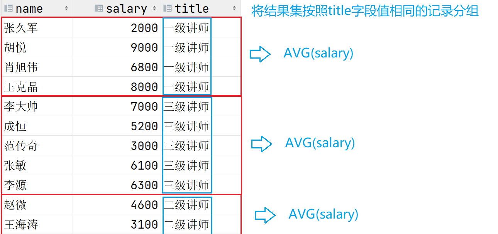

- 查看每个班级各多少人?

  ```sql
  SELECT COUNT(*),class_id
  FROM student
  GROUP BY class_id				class_id值一样的学生是一个班的
  ```

- 查看学生每种职位各多少人,以及最大生日和最小生日?

  ```sql
  SELECT COUNT(*) '人数',
         MIN(birth) '最大生日',
         MAX(birth) '最小生日',
         job
  FROM student
  GROUP BY job
  ```


#### 按照多字段分组

GROUP BY子句后指定多个字段，结果集中这些字段值都相同的记录会被划分为一组

##### 例如

- 查看同班级同性别的学生分别多少人?

  ```sql
  SELECT COUNT(*),class_id,gender
  FROM student
  GROUP BY class_id,gender			同班级同性别的记录被划分为一组
  ```

- 查看每个班每种职位各多少人?

  ```sql
  SELECT COUNT(*),class_id,job
  FROM student
  GROUP BY class_id,job
  
  ```


#### 将结果集按照聚合函数的统计结果排序

##### 例如

- 查看每个科目老师的平均工资排名?

  ```sql
  SELECT AVG(salary),subject_id
  FROM teacher
  GROUP BY subject_id
  ORDER BY AVG(salary) DESC
  
  通常会将聚合函数添加别名，ORDER BY子句中按照别名排序即可(好的书写习惯)
  SELECT AVG(salary) avg_sal,subject_id
  FROM teacher
  GROUP BY subject_id
  ORDER BY AVG(salary) DESC
  
  ```


### HAVING子句

HAVING子句是紧跟在GROUP BY子句之后的，**用于添加条件过滤分组的**

#### 问题

- 查看每个科目老师的平均工资?但是仅查看平局工资高于6000的那些.

  ```sql
  SELECT AVG(salary),subject_id
  FROM teacher
  WHERE AVG(salary)>6000
  GROUP BY subject_id
  ```

  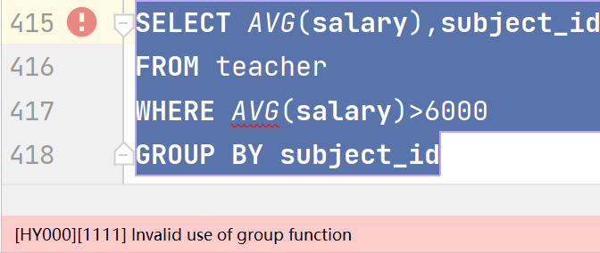

#### 错误

聚合函数不能出现在WHERE子句中的

#### 原因

过滤时机不对:

- WHERE的过滤时机:在**检索表中记录时**，逐行扫描数据，将满足WHERE条件的记录**生成结果集**
- 聚合函数作为过滤条件，前提
  - 聚合函数是对结果集进行统计的，因此前提是要现有结果集
  - 而WHER是产生结果集时过滤的，因此它是在聚合函数使用前发挥作用的

#### 解决办法

使用HAVING子句

#### 例如

- 查看每个科目老师的平均工资?但是仅查看平局工资高于6000的那些.

  ```sql
  								执行顺序
  SELECT AVG(salary),subject_id	  5		最终在保留的分组中统计结果
  FROM teacher                      1		确定数据来自哪张表
  [WHERE] 				          2		确定结果集中的记录
  GROUP BY subject_id               3		确定结果集的分组				可以分为6组
  HAVING AVG(salary)>6000           4		确定分组的取舍					 仅有2组满足要求
  ```

- 查看每个科目老师的平均工资，前提是该科目老师最高工资要超过9000

  ```sql
  								执行顺序
  SELECT AVG(salary),subject_id		4		2个分组中统计结果
  FROM teacher						1		确定数据来自哪张表
  GROUP BY subject_id					2		确定分组(可以分为6组)
  HAVING MAX(salary)>9000				3		确定保留哪些分组(保留2个)
  ```


#### HAVING与WHERE的区别

- 过滤时机不同，WHERE先过滤，HAVING后过滤
- WHERE用于确定结果集的记录
- HAVING用于确定保留哪些分组
- WHERE不可以使用聚合函数作为过滤条件，HAVING可以


### 综合练习

#### 题干

```sql
1:查看科目老师的工资总和是多少?前提是该科老师的平均奖金要高于4000.
2:查看各科目男老师的平均工资是多少?前提是该科目老师最低工资高于4000.
3:查看班级编号小于6的每个班各多少人?
4:查看3层一共多少个班?
5:查看工资低于8000的老师的平均工资是多少?
6:查看班级人数超过60人的班级中年纪最大的同学生日是多少?
7:查看教课程编号1的老师的平均年龄是多少?
8:查看同一科目平均年龄超过35岁的老师中最小年龄是多少?
9:查看同职称人数超过4人的老师的平均工资是多少?
```

#### 答案

```sql
1:查看科目老师的工资总和是多少?前提是该科老师的平均奖金要高于4000.
  SELECT SUM(salary),subject_id
  FROM teacher
  GROUP BY subject_id
  HAVING AVG(comm)>4000
  
2:查看各科目男老师的平均工资是多少?前提是该科目老师最低工资高于4000.
  SELECT AVG(salary),subject_id
  FROM teacher
  WHERE gender='男'
  GROUP BY subject_id
  HAVING MIN(salary)>4000
  
3:查看班级编号小于6的每个班各多少人?
  SELECT COUNT(*),class_id
  FROM student
  WHERE class_id<6
  GROUP BY class_id
  
4:查看3层一共多少个班?
  SELECT COUNT(*)
  FROM class
  WHERE floor=3
  
5:查看工资低于8000的老师的平均工资是多少?
  SELECT AVG(salary)
  FROM teacher
  WHERE salary<8000

6:查看班级人数超过60人的班级中年纪最大的同学生日是多少?
  SELECT MIN(birth) max_age,class_id
  FROM student
  GROUP BY class_id
  HAVING COUNT(*)>60
  
7:查看教课程编号1的老师的平均年龄是多少?
  SELECT AVG(age)
  FROM teacher
  WHERE subject_id=1
  
8:查看同一科目平均年龄超过35岁的老师中最小年龄是多少?
  SELECT MIN(age) min_age,subject_id
  FROM teacher
  GROUP BY subject_id
  HAVING AVG(age)>35
  
9:查看同职称人数超过4人的老师的平均工资是多少?
  SELECT AVG(salary),title
  FROM teacher
  GROUP BY title
  HAVING COUNT(*)>4
  
```


### 子查询(SubQuery)

#### 概念

嵌套在其他SQL语句中的一条DQL语句，这条DQL语句就称为子查询

#### 应用查询

- 在DQL语句中使用
  - 在SELECT子句中使用子查询，将该查询结果当作一个字段列在外层查询的结果集中
  - 在FROM子句中使用，将该查询结果集当作一张表使用(视图)
- 在DML语句中使用
  - 在增删改中，基于该查询结果集对表中数据进行操作
- 在DDL语句中使用
  - 将该查询结果集当作一张表创建出来
  - 将查询结果集当作视图进行创建


#### 子查询的分类

- 单行单列子查询:查询结果集就是一个值，常用在DML,DQL中

- 多行单列子查询:查询结果集有多个值，常用在DML,DQL中

- 多列子查询:多列子查询(无论单行多行)通常是当作一张表使用。在DQL，DDL中应用


#### 在DQL中使用子查询

##### 单行单列子查询

例如

- 查看比范传奇工资高的老师都有谁?

  ```sql
  1:未知条件-范传奇的工资是多少?
  SELECT salary FROM teacher WHERE name='范传奇'  ===>查询结果:3000
  
  2:查看谁的工资高于3000即可
  SELECT salary,name FROM teacher WHERE salary>3000
  
  用java的编码思想
  int sal = SELECT salary FROM teacher WHERE name='范传奇';  sal=3000;
  SELECT salary,name FROM teacher WHERE salary>sal
  
  如果写成一句:
  SELECT salary,name 
  FROM teacher 
  WHERE salary>SELECT salary FROM teacher WHERE name='范传奇'
               ^^^^^^^^^^^^^^^^^^^^^^^^^^^^^^^^^^^^^^^^^^^^^
               将该查询语句的结果当作外层查询语句的一个过滤条件
               那这个查询语句就是嵌套在其他查询语句中的，它就是子查询
               
  SQL语言语法要求，子查询被嵌套时应当使用"()"括起来:
  SELECT salary,name 
  FROM teacher 
  WHERE salary>(SELECT salary FROM teacher WHERE name='范传奇')
  
  ```

- 查看哪些老师的工资是高于平均工资的?

  ```sql
  1:未知条件:平均工资是多少
  SELECT AVG(salary) FROM teacher
  
  2:查看高于平均工资的
  SELECT name,salary
  FROM teacher
  WHERE salary>(SELECT AVG(salary) FROM teacher)
  ```

- 查看和'李费水'在同一个班的学生都有谁?

  ```sql
  1:查看李费水的班级编号是多少
  SELECT class_id FROM student WHERE name='李费水'
  
  2:进行查询
  SELECT name,class_id
  FROM student
  WHERE class_id=(SELECT class_id FROM student WHERE name='李费水')
  ```

- 查看和'3年级2班'在同一层的班级都有哪些?列出班级编号，名字，楼层

  ```sql
  SELECT id,name,floor
  FROM class
  WHERE floor=(SELECT floor FROM class WHERE name='3年级2班')
  ```

- 查看3年级2班的学生都有谁?

  ```sql
  学生表有一个字段是class_id记录了每个学生所在班级的id。而这个id就是class表中对应班级的id值。
  1:查询'3年级2班'的id是多少?
    SELECT id FROM class WHERE name='3年级2班'
  
  2:哪个学生的class_id与'3年级2班'的id一致
    SELECT name,class_id
    FROM student
    WHERE class_id=(SELECT id FROM class WHERE name='3年级2班')
  ```

- 查看教语文的老师都有谁?

  ```sql
  1:语文科目的id是多少?
  SELECT id FROM subejct WHERE name='语文'
  
  2:查看哪个老师的subject_id与'语文'的id一致
  SELECT name,subject_id
  FROM teacher
  WHERE subject_id=(SELECT id FROM subejct WHERE name='语文')
  ```

- 查看工资最高的老师的工资和奖金是多少?

  ```sql
  1：最高工资是多少?
  SELECT MAX(salary) FROM teacher
  
  2：谁的工资与上述DQL一致
  SELECT name,salary,comm
  FROM teacher
  WHERE salary=(SELECT MAX(salary) FROM teacher)
  ```

##### 多行单列子查询

多行单列子查询可以同时查询出多个值

- 如果进行等值判断时，要配合**IN,NOT IN**使用
- 如果进行关系运算(>,>=,<,<=)
  - \>ANY(列表):大于列表其中一个值即可(>最小的)
  - <ANY(列表):小于列表其中一个即可(<最大的)
  - \>ALL(列表):大于列表中所有值(>最大的)
  - <ALL(列表):小于列表中所有值(<最小的)

例如

- 查看与"祝雷"和"李费水"在同一个班的学生都有谁?

  ```sql
  1:未知条件-祝雷，李费水的班级编号分别是多少?
  SELECT class_id FROM student WHERE name IN('祝雷','李费水')
  
  2:查询谁的班级编号与其中之一一致
  SELECT name,class_id
  FROM student
  WHERE class_id IN(SELECT class_id 
                    FROM student 
                    WHERE name IN('祝雷','李费水'))
  ```

  **多行单列子查询不能使用"="判断,会出现错误**

  

- 查看不与'范传奇'和'王克晶'教同一课的老师都有谁?

  ```
  SELECT name,subject_id
  FROM teacher
  WHERE subject_id NOT IN(SELECT subject_id
                          FROM teacher
                          WHERE name IN ('王克晶','范传奇'))
  ```

- 查看比教科目2和科目4老师工资都高的老师都有谁?

  ```sql
  1:未知条件-这两个科目的老师工资是多少?
  SELECT salary FROM teacher WHERE subject_id IN(2,4)
  
  2:查看高于他们所有
  SELECT salary,name
  FROM teacher
  WHERE salary>ALL(SELECT salary FROM teacher WHERE subject_id IN(2,4))
  
  
  另一种思路
  SELECT MAX(salary) FROM teacher WHERE subject_id IN(2,4)
  
  SELECT name,salary
  FROM teacher
  WHERE salary>(SELECT MAX(salary) 
                FROM teacher 
                WHERE subject_id IN(2,4))
  
  ```


#### 在DML语句中使用子查询

在增删改操作中使用子查询

##### 例如

- 给与'范传奇'负责同一科目的所有老师工资涨500

  ```sql
  UPDATE teacher
  SET salary=salary+500
  WHERE subject_id=(SELECT subject_id 
                    FROM teacher 
                    WHERE name='范传奇')
                    
  数据还原一下
  UPDATE teacher
  SET salary=salary-500
  WHERE subject_id=(SELECT subject_id 
                    FROM teacher 
                    WHERE name='范传奇')
  ```

- 将王克晶的工资改为与范传奇一样

  ```sql
  UPDATE teacher
  SET salary=(SELECT salary FROM teacher WHERE name='范传奇')
  WHERE name='王克晶'
  
  还原数据
  UPDATE teacher
  SET salary=8000
  WHERE name='王克晶'
  ```

- 将与范传奇教同一科目的老师删除

  ```sql
  不执行，理解即可
  DELETE FROM teacher
  WHERE subjct_id=(SELECT subject_id FROM teacher WHERE name='范传奇')
  ```

#### 在DDL语句中使用子查询

在DDL中可以将一个查询结果集当作一张表

##### 例如

- 创建一张表,该表中记录了每个科目老师的工资情况,要求展示:最高,最低,总和和平均工资以及该科目 id

  ```sql
  CREATE TABLE salary_info_table(
  	subject_id INT,
      max_salary INT,
      min_salary INT,
      sum_salary INT,
      avg_salary INT
  )
  INSERT ...
  INSERT ...
  INSERT ...
  
  
  
  正确做法:
  1:先将该表的数据查询出来
  SELECT subject_id,
         MIN(salary) min_salary,
         MAX(salary) max_salary,
         SUM(salary) sum_salary,
         AVG(salary) avg_salary
  FROM teacher
  GROUP BY subject_id
  
  2:希望将上述DQL语句的查询结果集当作一张表创建出来
  CREATE TABLE salary_info_table
  AS
  SELECT subject_id,
         MIN(salary) min_salary,
         MAX(salary) max_salary,
         SUM(salary) sum_salary,
         AVG(salary) avg_salary
  FROM teacher
  GROUP BY subject_id
  ```

- 可以将结果集当作视图创建

  什么是视图(VIEW),也是数据库对象之一，和表的区别是表是实际在物理磁盘上保存数据的数据库对象，而视图仅仅对应一条SQL语句，使用时先通过视图将结果集查询出来，再基于它进行其他操作。

  视图一般也称为"伪表"

  ```
  CREATE VIEW v_salary_info
  AS
  SELECT subject_id,
         MIN(salary) min_salary,
         MAX(salary) max_salary,
         SUM(salary) sum_salary,
         AVG(salary) avg_salary
  FROM teacher
  GROUP BY subject_id
  
  SELECT * FROM v_salary_info
  等同于
  SELECT * FROM (SELECT subject_id,
         		   		MIN(salary) min_salary,
         		   		MAX(salary) max_salary,
                 		SUM(salary) sum_salary,
                 		AVG(salary) avg_salary
                 FROM teacher
                 GROUP BY subject_id)
  
  ```

- 视图使用场景

  - 重复使用子查询:在多个DQL语句中都要使用相同的子查询作为表使用时，可以以视图重用子查询

  - 为了隐藏敏感数据:比如老师表记录了工资信息，程序员需要在项目中查询老师信息，但是不需要看到老师的敏感数据，此时DBA则会创建一个不含有敏感信息的老师信息视图提供给程序员使用。并不分配程序员查看老师表的权限。

    ```sql
    CREATE VIEW v_teacher_info
    AS
    SELECT id,name,title,gender,age,subject_id
    FROM teacher;
    
    
    SELECT * FROM v_teacher_info;
    
    
    ```


### 关联查询(重点)

#### 定义

联合多张表查询数据，意味着查询的结果集中字段来自多张表。

例如:查看每个学生的名字，所在的班级的名字，以及该班班主任是谁?

- 张三，1年级1班，范传奇(只是举例，数据并非真实表中关联)
  - 张三为什么是1年级1班，不是其他班级？student表的数据如何与class表的数据对应上?
  - 1年级1班的班主任是范传奇，为什么不是王克晶?class表中的数据如何再与teacher表的数据对应上?

#### 关联关系

**表与表中的数据会产生对应的关系，这样的关系被称为关联关系**

#### 关联关系的分类

两张表就可以产生对应的关联关系

- 一对一关系:A表的1条记录只能对应B表的1条记录
- 一对多关系:A表的1条记录可以对应B表的多条记录
  - 一个班级可以对应多个学生
  - class表的一条记录可以对应student表的多条记录(3年级2班可以对应查询出student表若干记录)
- 多对多关系:A表与B表双向都是一对多时就是多对多关系

#### 连接条件

连接条件用于关联两张表中数据的对应关系

好比:在子查询案例中，查询3年级2班的学生都有谁

- 找到3年级2班的记录id是多少，再查看student表中class_id等于3年级2班的id的学生信息
  - 相当于条件:student.class_id=class.id	这个就是class表与student表数据之间的连接条件

注意事项

- 在关联查询中通常两张表之间要指定连接条件，否则会产生笛卡尔积，这通常是一个无意义的结果集，开销大，除非必要通常要避免
- 连接条件的数量:N张表关联查询至少要有N-1个连接条件
  - 比如2张表关联查询至少要有1个连接条件

#### 语法

```

```


#### 例如

- 查看每个老师的名字和其所教科目的名字

  ```sql
  SELECT teacher.name,teacher.salary,teacher.age,subject.name
  FROM teacher,subject
  WHERE teacher.subject_id=subject.id
  当多张表都存在相同名字的字段时，要表名字段所属的表
  
  由于表名通常较长，写起来过于累赘，因此可以为表取别名，字段所属表时可以使用表别名
  SELECT t.name,t.salary,t.age,su.name
  FROM teacher t,subject su
  WHERE t.subject_id=su.id
  ```

  

- 在关联查询中不指定连接条件，会产生笛卡尔积

  ```sql
  SELECT t.name,t.salary,t.age,su.name
  FROM teacher t,subject su
  ```

  

  **笛卡尔积通常没有意义，要避免**

  - A表的一条记录与B表每条记录连线时，由于没有连接条件，因此会分别摘取字段构成一条结果记录
  - 笛卡尔积的查询结果记录数为两张表记录数的乘积

- 查看班级的名称和对应的班主任(老师)是谁?

  ```sql
  1:数据来自哪些表?
    班级名称->class表
    班主任名字(老师名字)->teacher表
    确定FROM子句:FROM class c,teacher t
    
  2:表明确后，确定连接条件。2张表关联查询时要求1个连接条件
    class表的记录中的teacher_id要与teacher表的id相同的记录对应。
    明确了连接条件:c.teacher_id=t.id
  
  SELECT c.name,c.teacher_id,t.name,t.id
  FROM class c,teacher t
  WHERE c.teacher_id=t.id
  
  ```

- 查看每个学生的名字，年龄，以及其所在的班级名称和所在楼层

  ```sql
  1:数据来自哪些表?
    学生信息来自student表
    班级信息来自class表
    FROM student s,class c
  
  2:2张表中记录如何对应,连接条件是什么?
    每个学生的class_id要与class表中id一致的记录对应
    s.class_id=c.id
    
    SELECT s.name,s.age,c.name,c.floor
    FROM student s,class c
    WHERE s.class_id=c.id
  
  ```

- 查看每个学生来自哪座城市的名字，列出学生的名字，性别，年龄和所在城市的名字

  ```sql
  1:数据来自哪些表?
    student s表,location l表
  2:连接条件
    s.location_id=l.id
    
  SELECT s.name,s.gender,s.age,l.name
  FROM student s,location l
  WHERE s.location_id=l.id
  ```


#### 主外键关联

通常在两张表时，如果两张表中的记录存在关联关系时，那么就会在这两张表中分别定义主键与外键。

- 什么是主键:
  - 主键通常是表中的第一个字段，名字一般为"id"
  - 主键的特点:非空且唯一，可以使用主键约束进行定义
  - 主键值用来标识表中每一条记录
- 什么是外键
  - 外键是用来记录另一张表主键字段值的一个字段
  - **设计有外键字段值的表在关联关系中处于关联关系一对多中"多"的一方**
- 例如:Class表与Student表
  - Student表中有一个字段名为:class_id，该字段记录了Class表中某条记录id的值
  - Class表的id字段就是Class表的主键字段(PK)
  - Student表的class_id就是外键(FK)对应的就是Class表主键字段id
  - 因此Studnet表与Class表就存在关联关系，在一对多关系中，Class表是"一"，Student表是"多"
- 在关联查询中，连接条件通常是主键与外键的等值连接。A表的主键字段值=B表的外键字段值


#### 连接条件要与过滤条件同时满足

##### 例如

- 王克晶是哪个班的班主任?列出:班级名称，楼层，老师名称，工资

  ```sql
  1:数据来自哪些表?
    teacter t,class c
  2:连接条件?
    c.teacher_id=t.id
  3:过滤条件?
    老师的名字叫王克晶
    t.name='王克晶'
    
   SELECT c.name,c.floor,t.name,t.salary 
   FROM teacher t,class c
   WHERE t.id=c.teacher_id					连接条件
   AND t.name='王克晶'						  过滤条件
                                      要同时满足，否则会出现笛卡尔积
  ```

- 查看来自南京的学生都有谁?要列出城市名字，学生名字，年龄，性别

  ```sql
  SELECT l.name,s.name,s.age,s.gender
  FROM student s,location l
  WHERE s.location_id=l.id
  AND l.name='南京'
  ```

- 查看三年级的班级班主任都是谁?要列出班级名称，所在楼层，班主任名字和工资

  ```sql
  SELECT c.name,c.floor,t.name,t.salary
  FROM class c,teacher t
  WHERE c.teacher_id=t.id
  AND c.name LIKE '3年级%'
  ```

- 查看5年级的中队长都有谁?要列出学生名字，年龄，性别，职位和所在班级的名字以及楼层

  ```sql
  SELECT s.name,s.age,s.gender,s.job,c.name,c.floor
  FROM student s,class c
  WHERE s.class_id=c.id
  AND c.name LIKE '5年级%' AND s.job='中队长'
  
  ```


#### N张表关联

N张表关联至少要有N-1个连接条件

##### 例如

- 查看"范传奇"所带班级的学生都有谁?要列出:学生名字，年龄，班级名称，老师名字

  ```sql
  SELECT s.name,s.age,c.name,t.name
  FROM student s,class c,teacher t
  WHERE s.class_id=c.id AND c.teacher_id=t.id
  AND t.name='范传奇'
  
  ```

  

- 查看1年级1班的同学的名字和来自的城市

  ```sql
  SELECT s.name,l.name,c.name
  FROM student s,class c,location l
  WHERE s.class_id=c.id AND s.location_id=l.id
  AND c.name='1年级1班'
  ```


#### 综合练习

##### 题干

```sql
1.查看来自北京的学生都是谁?
2.教"英语"的老师都是谁?
3.刘苍松所带班级的学生都有谁?
4.教语文的老师所带的班级有哪些?
5.王克晶所带的班级学生都来自哪些城市(去重)?
6.3年级的几个班主任都教哪些课程?
7.工资高于10000的老师所带班里的大队长都是谁?
8."李费水"的班主任教哪门课?
9.所在4楼的班里的大队长和中队长以及班主任都是谁?
10.全校最小的同学的班主任是谁?
11.教"语文"的老师所带班级的学生都来自哪些城市?列出科目，老师名字，班级名字，学生名字，所在城市
12.全校最小的学生来自哪个城市，所在哪个班以及班主任是谁?
13.工资最高的老师所带班里来自"北京"的学生都有谁?
```

##### 答案

```sql
1.查看来自北京的学生都是谁?
  SELECT s.name,l.name
  FROM student s,location
  WHERE s.location_id=l.id
  AND l.name='北京'
  
2.教"英语"的老师都是谁?
  SELECT t.name,su.name
  FROM teacher t,subject su
  WHERE t.subject_id=su.id
  AND su.name='英语'
  
3.刘苍松所带班级的学生都有谁?
  SELECT s.name,c.name,t.name
  FROM student s,class c,teacher t
  WHERE s.class_id=c.id
  AND c.teacher_id=t.id
  AND t.name='刘苍松'
  
4.教语文的老师所带的班级有哪些?
  SELECT c.name,t.name,su.name
  FROM class c,teacher t,subject su
  WHERE c.teacher_id=t.id
  AND t.subejct_id=su.id
  AND su.name='语文'

5.王克晶所带的班级学生都来自哪些城市(去重)?
  SELECT DISTINCT l.name
  FROM student s,class c,teacher t,location l
  WHERE s.class_id=c.id
  AND s.location_id=l.id
  AND c.teacher_id=t.id
  AND t.name='王克晶'
  
6.3年级的几个班主任都教哪些课程?
  SELECT c.name,t.name,su.name
  FROM class c,teacher t,subject su
  WHERE c.teacher_id=t.id
  AND t.subject_id=su.id
  AND c.name LIKE '3年级%'
  
7.工资高于10000的老师所带班里的大队长都是谁?
  SELECT s.name,s.job,c.name,t.name
  FROM student s,class c,teacher t
  WHERE s.class_id=c.id
  AND c.teacher_id=t.id
  AND t.salary>10000
  AND s.job='大队长'
	
8."李费水"的班主任教哪门课?
  SELECT s.name,c.name,t.name,su.name
  FROM student s,class c,teacher t,subject su
  WHERE s.class_id=c.id
  AND c.teacher_id=t.id
  AND t.subject_id=su.id
  AND s.name='李费水'
  
9.所在4楼的班里的大队长和中队长以及班主任都是谁?
  SELECT s.name,s.job,c.name,t.name
  FROM student s,class c,teacher t
  WHERE s.class_id=c.id
  AND c.teacher_id=t.id
  AND c.floor=4
  AND s.job IN('大队长','中队长')
  
  不用IN
  SELECT s.name,s.job,c.name,t.name
  FROM student s,class c,teacher t
  WHERE s.class_id=c.id
  AND c.teacher_id=t.id
  AND c.floor=4
  AND (s.job='大队长' OR s.job='中队长')
  因为OR的优先级较低，要保证连接条件与过滤条件同时满足时，OR要提高优先级
  

10.全校最小的同学的班主任是谁?
  SELECT DISTINCT t.name 
  FROM student s,class c,teacher t
  WHERE s.class_id=c.id
  AND c.teacher_id=t.id
  AND s.birth=(SELECT MAX(birth) FROM student)
  如果存在多个最小生日的学生，并且隶属同一个班级，那么会查询出多个记录，老师名字可以去重

11.教"语文"的老师所带班级的学生都来自哪些城市?列出科目，老师名字，班级名字，学生名字，所在城市
  SELECT s.name,l.name,c.name,t.name,su.name
  FROM student s,location l,class c,teacher t,subject su
  WHERE s.location_id=l.id
  AND s.class_id=c.id
  AND c.teacher_id=t.id
  AND t.subject_id=su.id
  AND su.name='语文'
  
12.全校最小的学生来自哪个城市，所在哪个班以及班主任是谁?
  SELECT s.name,l.name,c.name,t.name
  FROM student s,class c,location l,teacher t
  WHERE s.location_id=l.id
  AND s.class_id=c.id
  AND c.teacher_id=t.id
  AND s.birth=(SELECT MAX(birth) FROM student)
 
13.工资最高的老师所带班里来自"北京"的学生都有谁?
 SELECT s.name,l.name,c.name,t.name,t.salary
 FROM student s,class c,teacher t,location l
 WHERE s.class_id=c.id
 AND c.teacher_id=t.id
 AND s.location_id=l.id
 AND t.salary=(SELECT MAX(salary) FROM teacher)
 AND l.name='北京'
 
```

#### 关联查询中可以使用聚合函数

##### 例如

- 查看范传奇所带班级的学生共多少人?

  ```
  聚合函数用于统计数据
  1:查询参与统计的记录
    查看范传奇班里的学生
    
  2:数据来自哪些表
    FROM student s,class c,teacher t
  
  3:连接条件
    WHERE s.class_id=c.id AND c.teacher_id=t.id
  
  4:过滤条件
    t.name='范传奇'
    
    查看范传奇班里的学生
    SELECT s.name,...
    FROM student s,class c,teacher t
    WHERE s.class_id=c.id AND c.teacher_id=t.id
    AND t.name='范传奇'
    
    加上聚合函数
    SELECT COUNT(*)
    FROM student s,class c,teacher t
    WHERE s.class_id=c.id AND c.teacher_id=t.id
    AND t.name='范传奇'
  ```

- 查看教语文的老师平均工资是多少?

  ```
  1:查询参与统计的数据
    查询教语文的老师工资是多少
    SELECT t.salary
    FROM teacher t,subject su
    WHERE t.subject_id=su.id
    AND su.name='语文'
    
  2:添加聚合函数
    SELECT AVG(t.salary)
    FROM teacher t,subject su
    WHERE t.subject_id=su.id
    AND su.name='语文'
  ```

- 查看教每门课老师的平均工资是多少？列出平均工资和科目名称

  ```sql
  1:查询参与统计的记录
    查询所有老师的工资以及所教科目
    SELECT t.name,t.salary,su.name
    FROM teacher t,subject su
    WHERE t.subject_id=su.id
    
  2:分组，按照科目名称相同的记录分组,添加聚合函数
    SELECT AVG(t.salary),su.name
    FROM teacher t,subject su
    WHERE t.subject_id=su.id
    GROUP BY su.name
  ```

- 仅查看平均工资高于6000的那些科目的老师平均工资是多少?列出平均工资和科目名称

  ```
  上一个案例查询了所有科目老师的平均工资
  SELECT AVG(t.salary),su.name
  FROM teacher t,subject su
  WHERE t.subject_id=su.id
  GROUP BY su.name
  
  过滤分组
  SELECT AVG(t.salary),su.name
  FROM teacher t,subject su
  WHERE t.subject_id=su.id
  GROUP BY su.name
  HAVING AVG(t.salary)>6000
  ```

- 查看工资最高的老师班里的学生共多少人?

  ```sql
  1:查询参与统计的数据
    将工资最高的老师班里学生信息查询出来
    SELECT s.name,...
    FROM student s,class c,teacher t
    WHERE s.class_id=c.id
    AND c.teacher_id=t.id
    AND t.salary=(SELECT MAX(salary) FROM teacher)
    
  2:加聚合函数
    SELECT COUNT(*)
    FROM student s,class c,teacher t
    WHERE s.class_id=c.id
    AND c.teacher_id=t.id
    AND t.salary=(SELECT MAX(salary) FROM teacher)
  ```


#### 综合练习

##### 题干

```sql
1:教语文的老师所带班级各多少学生?
2:每门课的老师所带班级各多少学生?
3:来自上海的学生的班主任都有谁?
4:来自南京的学生共多少人
5:来自武汉的男同学和女同学分别多少人?
6:每个城市的学生各多少人
7:高于平均工资的老师所带的班级分别多少学生?
8:每个老师班里各多少来自郑州的学生?
```
##### 答案

```sql
1:教语文的老师所带班级各多少学生?
  SELECT COUNT(*),t.name,c.name
  FROM student s,class c,teacher t,subject su
  WHERE s.class_id=c.id
  AND c.teacher_id=t.id
  AND t.subject_id=su.id
  AND su.name='语文'
  GROUP BY t.name,c.name
  
2:每门课的老师所带班级各多少学生?
  SELECT COUNT(*),su.name,c.name
  FROM subject su,teacher t,class c,student s
  WHERE su.id=t.subject_id 
  AND t.id=c.teacher_id 
  AND c.id=s.class_id
  GROUP BY su.name,c.name;


3:来自上海的学生的班主任都有谁?
  SELECT l.name,s.name,c.name,t.name
  FROM location l,student s,class c,teacher t
  WHERE l.id=s.location_id
  AND s.class_id=c.id
  AND c.teacher_id=t.id
  AND l.name='上海'
  
4:来自南京的学生共多少人
  SELECT COUNT(*)
  FROM student s,location l
  WHERE s.location_id=l.id
  AND l.name='南京'
  
5:来自武汉的男同学和女同学分别多少人?
  SELECT COUNT(*),s.gender
  FROM student s,location l
  WHERE s.location_id=l.id
  AND l.name='武汉'
  GROUP BY s.gender
  
6:每个城市的学生各多少人
  SELECT COUNT(*),l.name
  FROM student s,location l
  WHERE s.location_id=l.id
  GROUP BY l.name
  
7:高于平均工资的老师所带的班级分别多少学生?
  SELECT COUNT(*),c.name,t.name
  FROM student s,class c,teacher t
  WHERE s.class_id=c.id
  AND c.teacher_id=t.id
  AND t.salary>(SELECT AVG(salary) FROM teacher)
  GROUP BY c.name,t.name
  
8:每个老师班里各多少来自郑州的学生?
  SELECT COUNT(*),c.name,t.name
  FROM location l,student s,class c,teacher t
  WHERE l.id=s.location_id
  AND s.class_id=c.id
  AND c.teacher_id=t.id
  AND l.name='郑州'
  GROUP BY c.name,t.name
  
  
```

### 多对多关系

#### 概念

两张表双向都是一对多就是多对多关系

#### 多对多的设计

多对多关系通常会将两张表的外键字段提取出来单独设计为一张表，而这张表用来维护两张表的多对多关系。


#### 例如

- 查看学习语文的学生都有谁?

  ```sql
  SELECT s.name,su.name,tss.score
  FROM student s,t_stu_subject_score tss,subject su
  WHERE s.id=tss.stu_id AND su.id=tss.subject_id
  AND su.name='语文'
  ```


- 查看'李费水'都学了哪门课程以及成绩?

  ```SQL
  SELECT s.name,su.name,tss.score
  FROM student s,t_stu_subject_score tss,subject su
  WHERE s.id=tss.stu_id AND su.id=tss.subject_id
  AND s.name='李费水'
  ```

#### 练习

##### 题干

```sql
1.查看1年级1班所有同学的语文成绩是多少?
2.统计1年级1班数学成绩的平均值?
3.统计6年级的英语成绩的平均值?
4.查看"刘苍松"所带班级的英语平均分?
5.查看工资最高的老师所带班级的各科成绩的平均分，最高分和最低分分别是多少?
6.查看每位大队长的5门成绩平均分是多少？
```

##### 答案

```sql
1.查看1年级1班所有同学的语文成绩是多少?
  SELECT s.name,su.name,tss.score,c.name
  FROM class c,student s,t_stu_subject_score tss,subject su
  WHERE c.id=s.class_id AND s.id=tss.stu_id AND su.id=tss.subject_id
  AND c.name='1年级1班' AND su.name='语文'
2.统计1年级1班数学成绩的平均值?
  SELECT AVG(tss.score)
  FROM class c,student s,t_stu_subject_score tss,subject su
  WHERE c.id=s.class_id AND s.id=tss.stu_id AND su.id=tss.subject_id
  AND c.name='1年级1班' AND su.name='数据'
  
3.统计6年级的英语成绩的平均值?
  SELECT AVG(tss.score)
  FROM class c,student s,t_stu_subject_score tss,subject su
  WHERE c.id=s.class_id AND s.id=tss.stu_id AND su.id=tss.subject_id
  AND c.name LIKE '6年级%' AND su.name='英语'

4.查看"刘苍松"所带班级的英语平均分?
  SELECT AVG(tss.score)
  FROM teacher t,class c,student s,t_stu_subject_score tss,subject su
  WHERE t.id=c.teacher_id AND c.id=s.class_id 
  AND s.id=tss.stu_id AND su.id=tss.subject_id
  AND t.name='刘苍松' AND su.name='英语'
  
  
5.查看工资最高的老师所带班级的各科成绩的平均分，最高分和最低分分别是多少?
  SELECT AVG(tss.score),MAX(tss.socre),MIN(tss.socre),su.name
  FROM teacher t,class c,student s,t_stu_subject_score tss,subject su
  WHERE t.id=c.teacher_id AND c.id=s.class_id 
  AND s.id=tss.stu_id AND su.id=tss.subject_id
  AND t.salary=(SELECT MAX(salary) FROM teacher)
  GROUP BY su.name
  
6.查看每位大队长的5门成绩平均分是多少？
  SELECT AVG(tss.score),s.name
  FROM student s,t_stu_subject_score tss,subject su
  WHERE s.id=tss.stu_id AND su.id=tss.subject_id
  AND s.job='大队长'
  GROUP BY s.name
```

#### 内连接

内连接是关联查询的另一种写法

##### 语法

```sql
关联查询写法:
SELECT 子句
FROM 表A,表B,表C,...
WHERE A与B的连接条件 AND B与C的连接条件 AND ...
AND 过滤条件

内连接写法:
SELECT 子句
FROM 表A
JOIN 表B ON A与B的连接条件
JOIN 表C ON 连接条件
JOIN ... ON 连接条件
WHERE 过滤条件

```

##### 例如

- 查看1年级1班的学生信息?列出学生名字,年龄,所在班级

  ```sql
  关联查询
  SELECT s.name,s.age,c.name
  FROM class c,student s
  WHERE c.id=s.class_id
  AND c.name='1年级1班'
  
  内连接
  SELECT s.name,s.age,c.name
  FROM class c
  JOIN student s ON c.id=s.class_id
  WHERE c.name='1年级1班'
  ```

- 查看教英语的老师都有谁?

  ```sql
  SELECT t.name,su.name
  FROM teacher t
  JOIN subject su ON t.subject_id=su.id
  WHERE su.name='英语';
  ```

- 查看每个班级名以及对应的班主任名字?

  ```sql
  SELECT c.name,t.name
  FROM class c
  JOIN teacher t ON c.teacher_id=t.id;
  ```

- 查看王克晶所带班级的女同学都有谁?(列出:老师名字，班级名字，学生名字，学生性别)

  ```sql
  SELECT s.name,s.gender,c.name,t.name
  FROM teacher t
  JOIN class c ON t.id=c.teacher_id
  JOIN student s ON c.id=s.class_id
  WHERE t.name='王克晶' AND s.gender='女';
  ```

- 查看刘苍松所带班里来自南京的学生的语文成绩是多少?

  ```sql
  SELECT t.name,c.name,s.name,l.name,su.name,tss.score
  FROM teacher t
  JOIN class c ON t.id=c.teacher_id
  JOIN student s ON c.id=s.class_id
  JOIN location l ON l.id=s.location_id
  JOIN t_stu_subject_score tss ON s.id=tss.stu_id
  JOIN subject su ON su.id=tss.subject_id
  WHERE t.name='刘苍松' AND l.name='南京' AND su.name='语文';
  ```
#### 外连接

外连接也是关联查询，特点:将不满足连接条件的记录也查询出来

- 左外连接:以JOIN左侧表作为驱动表，将该表记录都查询出来，不满足连接条件时，来自右侧表的中的字段补NULL
- 右外连接:以JOIN右侧表作为驱动表，将该表记录都查询出来，不满足连接条件时，来自左侧表的中的字段补NULL

##### 例如

- 查看所有班级信息和对应的班主任信息,如果该班没有班主任也要将班级信息列出来

  ```sql
  关联查询
  SELECT c.name,t.name
  FROM class c,teacher t
  WHERE c.teacher_id=t.id;
  
  内连接
  SELECT c.name,t.name
  FROM class c
  JOIN teacher t ON c.teacher_id=t.id;
  
  以上两种都不会将不满足连接条件的记录列出来
  ```

  

  使用左外连接，以JOIN左侧表作为驱动表，将该表记录满足过滤条件的记录都查询出来

  ```sql
  SELECT c.name,t.name
  FROM class c LEFT OUTER JOIN teacher t ON c.teacher_id=t.id;
  
  注:OUTER可以不写
  
  SELECT c.name,t.name
  FROM class c LEFT JOIN teacher t ON c.teacher_id=t.id;
  ```

  

- 查看所有班级信息和对应的班主任信息,如果该老师不带班,也要将老师信息列出来

  ```sql
  SELECT c.name,t.name
  FROM class c RIGHT OUTER JOIN teacher t ON c.teacher_id=t.id;
  ```

  


#### 全外连接

在ORACLE中有全外连接:FULL OUTER JOIN

但是MySQL,MariaDB没有

##### UNION并集操作

- UNION可以将多个查询结果集并在一起
- 要求：SELECT子句中指定的字段的个数，顺序，类型需要完全一致
- 不同结果集中的重复数据仅保留一次
- 将左外连接和右外连接的结果集并在一起达到全外连接的效果

##### 例如

- 查看所有班级信息和对应的班主任信息,无论是班级还是老师不满足连接条件也要展示

  ```
  SELECT c.name,t.name
  FROM class c LEFT OUTER JOIN teacher t ON c.teacher_id=t.id
  UNION
  SELECT c.name,t.name
  FROM class c RIGHT OUTER JOIN teacher t ON c.teacher_id=t.id
  ```

  

- UNION除了实现全外连接，还可以做其他操作

  - 查看姓张的和姓李的学生各多少人?

    ```sql
    SELECT COUNT(*) '人数' , '姓张' AS '姓氏' FROM student WHERE name LIKE '张%'
    UNION
    SELECT COUNT(*) '人数' , '姓李' AS '姓氏' FROM student WHERE name LIKE '李%'
    ```


#### 自连接

##### 定义

当一张表中的一条记录可以对应它自己的其他多条记录时，就是自连接

自连接时发生在同一张表中的

##### 场景

当一组具有相同属性的数据又存在上下级关系时(树状结构数据)，可以使用自连接设计。

##### 特点

**该表中存在一个外键，记录了它自己主键字段的值**

##### 应用场景

电商中的分类树，就是用自连接设计

在电商项目中，有一张表:type。记录了所有商品的类别。但是类别本身有存在上下级关系:

- 生活用品
- 家用电器
- 电脑
  - 电脑整机
    - 笔记本
      - ...
      - ...
    - 台式机
    - 游戏本
    - 一体机
    - 平板电脑
  - 电脑配件
  - 游戏设备
  - ...
- 手机
- ...


一家公司的员工组织结构，都是员工，但是员工又存在上下级关系。


##### 例如

- 查看'刘苍松'的下属都有谁?

  在teacher表中，记录了学校所有的老师，但是老师也存在上下级关系。因此在teacher表中定义了一个外键字段名为manager，用来记录该老师上级领导的id。而这个领导的id本身就是该名老师的id。


自连接在查询时，就是将一张表当作两张表看待即可，一张当作保存老师信息，一张当作保存领导信息。

  ```sql
  SELECT t.name '下属名字',m.name '领导名字'
  FROM teacher t , teacher m       			t当作保存老师的信息     m当作保存领导信息
  WHERE t.manager=m.id
  AND m.name='刘苍松'
  
  内连接写法
  SELECT t.name '下属名字',m.name '领导名字'
  FROM teacher t
  JOIN teacher m ON t.manager=m.id
  WHERE m.name='刘苍松'
  ```


- 查看3年级2班的班长是谁?(student表中team_leader记录班长的学生id)

  ```sql
  SELECT DISTINCT l.name
  FROM class c
  JOIN student s ON s.class_id=c.id
  JOIN student l ON s.team_leader=l.id
  WHERE c.name='3年级2班';
  
  SELECT s.name
  FROM class c
  JOIN student s ON s.class_id=c.id
  WHERE c.name='3年级2班'
  AND s.team_leader=s.id
  
  ```

- 学生"祝雷"的班长是谁?

  ```sql
  SELECT l.name
  FROM student s 
  JOIN student l ON s.team_leader=l.id
  WHERE s.name='祝雷'
  
  ```

- 年龄最大的学生所在班的班主任的上司是谁?

  ```sql
  SELECT s.name,c.name,t.name,m.name
  FROM student s
  JOIN class c ON s.class_id=c.id
  JOIN teacher t ON c.teacher_id=t.id
  JOIN teacher m ON t.manager=m.id
  WHERE s.birth=(SELECT MIN(birth) FROM student)
  
  ```

#### 外键约束

**关联关系中，通常两张表建立关联关系就是靠主键与外键的等值连接作为连接条件。**

##### 外键约束要求

- 外键约束要求外键字段的值必须参照主键字段的值

- 外键字段可以存放NULL
- 外键约束要求外键字段保存的值必须是主键字段中存在的值

##### 外键约束带来的问题

- 外键约束不能保存主键字段没有的值

  

- 要求主键表中不能删除外键存在值的记录

  - 当删除主键字段记录时会导致外键记录存在违反约束的情况，因此不允许删除
  - 若要删除主键字段记录，则需要先将所有外键字段对应的值改为null，这会导致大量的DML操作，影响性能

  

**结论:实际开发中，通常不适用外键约束，通过逻辑来关联即可**
